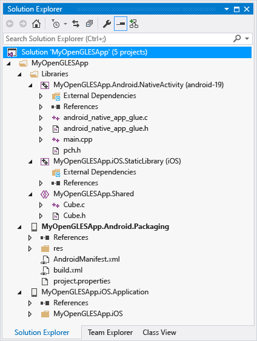
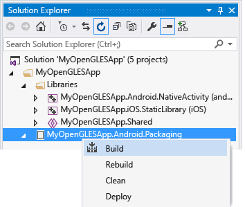
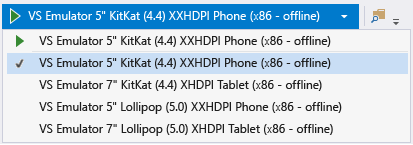

# Build an OpenGL ES Application on Android and iOS
在安装用于跨平台移动开发选项的 Visual C++ 时，可为共享通用代码的 iOS 应用和 Android 应用创建 Visual Studio 解决方案和项目。 本主题将指导你完成有关创建简单 iOS 应用和 Android 本机活动应用的解决方案模板。 应用具有共同的 C++ 代码，该代码使用 OpenGL ES 在每个平台上显示相同的动画旋转多维数据集。 OpenGL ES（OpenGL for Embedded Systems 或 GLES）是多种移动设备支持的 2D 和 3D 图形 API。  
  
 [要求](#req)   
 [创建新的 OpenGLES 应用程序项目](#Create)   
 [生成并运行 Android 应用](#BuildAndroid)   
 [生成并运行 iOS 应用](#BuildIOS)   
 [自定义应用](#Customize)  
  
##   要求  
 在可以创建用于 iOS 和 Android 的 OpenGL ES 应用之前，必须确保你已满足所有系统要求。 必须在 Visual Studio 2015 中安装用于跨平台移动开发选项的 Visual C++。 确保所需的第三方工具和 SDK 包括在安装中，且已安装适用于 Android 的 Visual Studio 仿真程序。 有关详细信息和说明，请参阅 [Install Visual C++ for Cross-Platform Mobile Development](../cross-platform/install-visual-cpp-for-cross-platform-mobile-development.md)。 若要生成和测试 iOS 应用，将需要一台 Mac 计算机，并根据安装说明进行设置安装。 有关如何为 iOS 开发进行设置的详细信息，请参阅 [Install And Configure Tools to Build using iOS](../cross-platform/install-and-configure-tools-to-build-using-ios.md)  
  
##   创建新的 OpenGLES 应用程序项目  
 在本教程中，你首先创建一个新的 OpenGL ES 应用程序项目，然后在适用于 Android 的 Visual Studio 仿真程序中生成并运行默认应用。 接下来生成适用于 iOS 的应用并在 iOS 模拟器中运行该应用。  
  
#### 创建新项目  
  
1.  打开 Visual Studio。 在菜单栏上，依次选择“文件” 、“新建” 、“项目” 。  
  
2.  在  “新建项目”对话框中，在 “模板”下，选择“Visual C++” 、 “跨平台”，然后选择  “OpenGLES 应用程序（Android、iOS）”模板。  
  
3.  为应用提供一个名称（如 `MyOpenGLESApp`），然后选择“确定”。  
  
       
  
     Visual Studio 创建新的解决方案并打开解决方案资源管理器。  
  
       
  
 新的 OpenGL ES 应用程序解决方案包括三个库项目和两个应用程序项目。 库文件夹包含一个共享代码项目和两个引用共享代码的特定于平台的项目：  
  
-   **MyOpenGLESApp.Android.NativeActivity** 包含在 Android 上作为本机活动实现应用的引用和粘附代码。 粘附代码入口点的实现位于 main.cpp，它包括 MyOpenGLESApp.Shared 中的公共共享代码。 预编译头位于 pch.h。 此本机活动应用项目编译为一个由 MyOpenGLESApp.Android.Packaging 项目选取的共享库 (.so) 文件。  
  
-   **MyOpenGLESApp.iOS.StaticLibrary** 创建一个包含 MyOpenGLESApp.Shared 中共享代码的 iOS 静态库 (.a) 文件。 它被链接到由 MyOpenGLESApp.iOS.Application 项目创建的应用。  
  
-   **MyOpenGLESApp.Shared** 包含跨平台运行的共享代码。 它使用预处理器宏进行特定于平台代码的条件编译。 共享代码由 MyOpenGLESApp.Android.NativeActivity 和 MyOpenGLESApp.iOS.StaticLibrary 中的项目引用进行提取。  
  
 该解决方案包含两个项目来生成适用于 Android 和 iOS 平台的应用：  
  
-   **MyOpenGLESApp.Android.Packaging** 创建 .apk 文件，用于 Android 设备或仿真程序上的部署。 这包括在此设置清单属性的资源和 AndroidManifest.xml 文件。 它还包括控制 Ant 生成过程的 build.xml 文件。 默认情况下，它被设置为启动项目，因此可从 Visual Studio 直接部署和运行它。  
  
-   **MyOpenGLESApp.iOS.Application** 包含资源和 Objective-C 粘附代码，以用于创建链接到 MyOpenGLESApp.iOS.StaticLibrary 中 C++ 静态库代码的 iOS 应用。 此项目创建一个生成包，该包通过 Visual Studio 和远程代理传输到你的 Mac。 当创建此项目时，Visual Studio 将发送文件和命令以在 Mac 上生成并部署应用。  
  
##   生成并运行 Android 应用  
 由模板创建的解决方案将 Android 应用设置为默认项目。  你可以生成并运行此应用以验证安装和设置。 对于初始测试，在其中一个由适用于 Android 的 Visual Studio 仿真程序安装的设备配置文件上运行该应用。 如果想要在其他目标上测试应用，可加载目标仿真程序或将设备连接到计算机。  
  
#### 若要生成并运行 Android 本机活动应用  
  
1.  如果尚未选中，则从“解决方案平台”下拉列表中选择“x86”。  
  
       
  
     使用 x86 以面向适用于 Windows 的 Android 仿真程序。 如果你正面向一种设备，则基于设备处理器选择解决方案平台。 如果未显示“解决方案平台”列表，则从“添加/删除按钮”列表中选择“解决方案平台”，然后选择你的平台。  
  
2.  在 “解决方案资源管理器”中，打开 MyOpenGLESApp.Android.Packaging 项目的快捷菜单，然后选择“生成” 。  
  
       
  
     “输出”窗口显示 Android 共享库和 Android 应用的生成过程的输出。  
  
       
  
3.  选择其中一个 VS 仿真程序 Android Phone (x86) 配置文件作为部署目标。  
  
       
  
     如果你已安装了其他仿真程序或连接了一个 Android 设备，则可在部署目标下拉列表中选择它们。 若要运行该应用，生成的解决方案平台必须与目标设备的平台匹配。  
  
4.  按下 F5 启动调试，或按下 Shift+F5 来在不进行调试的情况下启动。  
  
     Visual Studio 启动仿真程序，需要几秒钟时间来加载和部署代码。 下面是应用在适用于 Android 的 Visual Studio 仿真程序中的显示方式。  
  
       
  
     一旦你的应用启动，你可以设置断点，并使用调试器逐步调试代码，检查局部变量并监视值。  
  
5.  按下 Shift + F5 来停止调试。  
  
     仿真程序是一个继续运行的单独进程。 你可多次编辑、编译和部署代码到同一仿真程序。 应用将显示在仿真程序中的应用集合上，它可以从那里直接启动。  
  
 生成的 Android 本机活动应用和库项目将 C++ 共享代码放入包含“粘附”代码的动态库中，从而与 Android 平台连接。 这意味着大部分应用代码位于库中，并且清单、资源和生成说明位于打包项目中。 共享代码从 NativeActivity 项目中的 main.cpp 调用。 有关如何对 Android 本机活动进行编程的详细信息，请参阅 Android 开发人员 NDK [概念](https://developer.android.com/ndk/guides/concepts.html) 页。  
  
 Visual Studio 使用 Android NDK（其将 Clang 用作平台工具集）构建 Android 本机活动项目。 Visual Studio 将 NativeActivity 项目中的属性映射到用于在目标平台上进行编译、链接和调试的命令行开关和选项。 有关详细信息，打开 MyOpenGLESApp.Android.NativeActivity 项目的“属性页”  对话框。 有关命令行开关的详细信息，请参阅 [Clang 编译器用户手册](http://clang.llvm.org/docs/UsersManual.html)。  
  
##   生成并运行 iOS 应用  
 iOS 应用项目在 Visual Studio 中创建和编辑，但由于授权限制，它必须从 Mac 生成和部署。 Visual Studio 与在 Mac 上运行的远程代理进行通信，以传输项目文件并执行生成、部署和调试命令。 在生成 iOS 应用前必须设置和配置 Mac 和 Visual Studio 以进行通信。 有关详细说明，请参见 [Install And Configure Tools to Build using iOS](../cross-platform/install-and-configure-tools-to-build-using-ios.md)。 远程代理运行且 Visual Studio 与 Mac 配对后，则可以生成并运行 iOS 应用以验证安装和设置。  
  
#### 若要生成并运行 iOS 应用  
  
1.  验证远程代理是否在 Mac 上运行以及 Visual Studio 是否与远程代理配对。 若要启动远程代理，请打开终端应用窗口并输入 `vcremote`。 有关详细信息，请参阅[在 Visual Studio 中配置远程代理](../cross-platform/install-and-configure-tools-to-build-using-ios.md#ConfigureVS)。  
  
       
  
2.  如果尚未选中，则从“解决方案平台”下拉列表中选择“x86”。  
  
       
  
     使用 x86 面向 iOS 模拟器。 如果你正面向一种 iOS 设备，则基于设备处理器（通过是 ARM 处理器）选择解决方案平台。 如果未显示“解决方案平台”列表，则从“添加/删除按钮”列表中选择“解决方案平台”，然后选择你的平台。  
  
3.  在 “解决方案资源管理器”中，打开 MyOpenGLESApp.iOS.Application 项目的快捷菜单，然后选择“生成”。  
  
       
  
     “输出”窗口显示 iOS 静态库和 iOS 应用的生成过程的输出。 在 Mac 上，运行远程代理的终端窗口显示命令和文件传输活动。  
  
     在 Mac 计算机上，系统可能会提示你接受代码签名请求。 选择“允许”以继续。  
  
4.  选择工具栏上的“iOS 模拟器”  以在 Mac 上运行 iOS 模拟器中的应用。 启动模拟器可能会花费稍许时间。 你可能须将模拟器放在 Mac 上的前台中以查看其输出。  
  
       
  
     启动应用后，你可以设置断点，并使用 Visual Studio 调试器检查局部变量、查看调用堆栈并监视值。  
  
       
  
5.  按下 Shift + F5 来停止调试。  
  
     iOS 仿真程序是一个在 Mac 上继续运行的单独进程。 你可多次编辑、编译和部署代码到同一 iOS 仿真程序实例。 还可在部署模拟器后直接在其中运行代码。  
  
 生成的 iOS 应用和库项目将 C++ 代码放入仅实现共享代码的静态库。 大部分应用程序代码位于应用程序项目。 对此模板项目中共享库代码的调用发生在 GameViewController.m 文件中。 若要生成 iOS 应用，Visual Studio 将使用 Xcode 平台工具集，这要求与在 Mac 上运行的远程客户端进行通信。  
  
 Visual Studio 传输项目文件并发送命令到远程客户端以生成使用 Xcode 的应用。 远程客户端将生成状态信息返回到 Visual Studio。 如果应用已成功生成，你就可以使用 Visual Studio 发送命令来运行和调试应用。 Visual Studio 中的调试器控制在 Mac 或附加的 iOS 设备上运行的 iOS 模拟器中运行的应用。 Visual Studio 将 StaticLibrary 项目中的属性映射到用于在目标 iOS 平台上进行生成、链接和调试的命令行开关和选项。 若要了解编译器命令行选项的详细信息，请打开 MyOpenGLESApp.iOS.StaticLibrary 项目的  “属性页”对话框。  
  
##   自定义应用  
 可修改共享的 C++ 代码以添加或更改常用功能。 必须更改对 MyOpenGLESApp.Android.NativeActivity 和 MyOpenGLESApp.iOS.Application 项目中共享代码的调用以进行匹配。 可使用预处理器宏来指定公共代码中特定于平台的部分。 预处理器宏 `__ANDROID__` 在你针对 Android 进行生成时进行了预定义。 预处理器宏 `__APPLE__` 在你针对 iOS 进行生成时进行了预定义。  
  
 若要查看特定项目平台的 IntelliSense，请在编辑器窗口顶部导航栏中的上下文切换器下拉列表中选择项目。  
  
   
  
 当前项目中的 IntelliSense 问题都标有红色的波浪线。 其他项目中的问题都标有紫色波浪线。 默认情况下，Visual Studio 不支持 Java 或 Objective-C 文件的代码着色或 IntelliSense。 但是，仍可以修改源文件和更改资源来设置应用程序名称、图标和其他实现详细信息。
