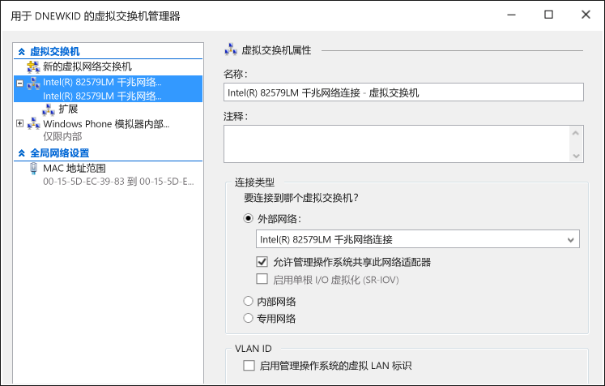

# 适用于 Android 的 Visual Studio 模拟器疑难解答
本主题包含的信息有助于解决使用适用于 Android 的 Visual Studio 仿真程序时可能会遇到的一些问题。  
  
> [!WARNING]
>  安装仿真程序时，安装程序将检查运行软件的系统必备组件。 如果系统必备不存在，该程序将发出警告，但不会要求安装这些系统必备组件。  
  
 本主题包含以下各节：  
  
-   [准备工作](#BeforeYouStart)  
  
-   [仿真程序安装失败](#NoInstall)  
  
-   [无法连接到域上或企业网络上的网络目标](#DomainNetwork)  
  
-   [当需要手动配置网络设置时无法连接到网络目标](#ManualNetworkConfig)  
  
-   [仿真程序启动缓慢，由于超时或应用部署失败而无法启动](#SlowStart)  
  
-   [仿真程序启动失败](#NoStart2)  
  
-   [Emulator fails to start (first use)](#NoStart)  
  
-   [安装仿真程序后计算机无法启动](#NoBoot)  
  
-   [Visual Studio 尝试将应用部署到仿真程序时遇到困难，或者仿真程序未在其他 IDE 中显示为调试目标。](#ADB)  
  
-   [模拟器挂起，因为其无法设置 UDP 端口](#XamarinPlayer)  
  
-   [无法将调试器附加到 Xamarin 项目](#Skylake)  
  
-   [模拟器未能运行使用 Google Play 服务的应用](#GooglePlay)  
  
-   [无法拖放文件、APK 或可闪存 zip 文件](#DragAndDrop)  
  
-   [屏幕快照的分辨率不正确](#Resolution)  
  
-   [仿真程序未能呈现 OpenGL 内容](#OpenGL)  
  
-   [仿真程序不响应多点触控笔势](#Multitouch)  
  
-   [支持资源](#Support)  
  
##   准备工作  
 开始进行故障排除前，查看以下主题可能会有用：  
  
-   [适用于 Android 的 Visual Studio 仿真程序的系统要求](../cross-platform/system-requirements-for-the-visual-studio-emulator-for-android.md)  
  
##   仿真程序安装失败  
 如果未安装 Hyper-V，则当你尝试安装仿真程序时将看到以下消息。 你的计算机必须支持并启用了 HyperV。  
  
   
  
> [!NOTE]
>  对于适用于 Android 的 Visual Studio 仿真程序和 Windows Phone 仿真程序，此消息均适用。 Windows 8.1 和 Windows 10 支持仿真程序。  
  
 如果看到此消息，请查阅 [适用于 Android 的 Visual Studio 仿真程序的系统要求](../cross-platform/system-requirements-for-the-visual-studio-emulator-for-android.md)，以查看是否可以运行仿真程序。  
  
##   无法连接到域上或企业网络上的网络目标  
 适用于 Android 的 Visual Studio 仿真程序作为具有自己的 IP 地址的单独设备出现在网络上。 它未加入 Windows 域，并且不与主计算机共享域或工作组凭据。  
  
 如果网络需要域或工作组向其授予连接基本网络和 Internet 的权限，请与 IT 管理员联系请求给予例外处理。 此例外处理使开发计算机能够充当边界计算机，并接受来自未加入域的网络设备（如仿真程序）的连接。  
  
 适用于 Android 的 Visual Studio 仿真程序还使用自有的一组 MAC 地址。 如果无法从仿真程序访问网络或 Internet 资源，请与 IT 管理员联系，确保已在网络上针对仿真程序的 MAC 地址进行了授权。  
  
#### 查看仿真程序的 MAC 地址  
  
1.  启动仿真程序。  
  
2.  在“仿真程序”工具栏上，单击 V 形图标按钮 (>>)，打开“其他工具”窗口。  
  
3.  在“其他工具”窗口中，单击“网络”选项卡。  
  
4.  在“网络”页中，找到物理地址条目。  
  
##   当需要手动配置网络设置时无法连接到网络目标  
 若要从仿真程序连接到网络目标，网络必须满足以下要求：  
  
- DHCP。 仿真程序需要 DHCP，因为它将自身配置为网络上具有自己的 IP 地址的一个单独的设备  
  
- 自动配置的 DNS 和网关设置。 无法为仿真程序手动配置 DNS 和网关设置。  
  
  如果网络要求手动配置的设置，请与 IT 管理员联系，确定如何为仿真程序启用网络连接。  
  
##  模拟器启动缓慢，由于超时或应用部署失败而无法启动  
 某些条件下，仿真程序需要几分钟才能启动，或由于超时而未能启动。 当仿真程序启动失败时，将出现以下消息：`App deployment failed. Please try again`。 以下条件可能导致此错误。  
  
-   从可启动的 VHD 运行适用于 Android 的 Visual Studio 仿真程序。 此配置不受支持。  
  
-   故障硬盘驱动器。 考虑运行 chkdsk 程序。  
  
-   需要进行碎片整理的硬盘驱动器。 考虑对驱动器进行碎片整理。  
  
-   几乎已满的硬盘驱动器。 检查驱动器上的可用空间。  
  
-   存在其他正在运行的应用程序而导致可用内存不足。 减少占用内存的应用程序数量或增加内存量。  
  
-   通常情况下会导致系统上性能不佳的任何因素。 从 Windows 体验索引中子分数最低的组件开始进行故障排除，可在“控制面板”的性能信息和工具页上找到。  
  
##   仿真程序启动失败  
 如果仿真程序之前运行正常，但现在无法运行，请完成以下任务。 如果是首次使用仿真程序，请在尝试以下步骤之前先参阅 [Emulator fails to start (first use)](#NoStart) 。  
  
-   删除仿真程序的任何其他 Hyper-V 实例。  
  
    1.  关闭 Visual Studio。  
  
    2.  打开 Hyper-V 管理器，并停止可能处于损坏状态且已运行的任何仿真程序（虚拟机）的 Hyper-V 实例。  
  
    3.  在 Hyper-V 管理器中，删除任何其他仿真程序 VM。  
  
    4.  重启计算机。  
  
-   确保至少具有 4 GB 系统内存，并且它未被其他占用大量资源的程序和进程使用（例如尝试关闭浏览器窗口的进程）。  
  
-   在 Hyper-V 管理器中，打开虚拟交换机管理器并检查确认有两个网络交换机；并且第一个是内部交换机，第二个是外部交换机。  
  
       
  
     如果安装不正确，并且使用的是 Windows 10，则可以尝试[使用 netcfg – d 命令重新安装网络设备](http://windows.microsoft.com/windows-10/fix-network-connection-issues)（第 6 节）。  
  
-   如果这些步骤未解决问题，请参阅 [Emulator fails to start (first use)](#NoStart) ，了解可能会干扰仿真程序的第三方软件的信息。  
  
##   Emulator fails to start (first use)  
 如果仿真程序未启动，执行以下任务来确定并修复该问题。  
  
- 确保满足最低硬件要求以及 BIOS 设置正确。  
  
   仿真程序和 Windows 8 HYPER-V 需要支持二级地址转换 (SLAT) 的 64 位处理器。 对 Intel 而言，实际上需要 Core i3、i5 或 i7 处理器（或众多 Xeons 中的一种）。 [此处](http://support.amd.com/en-us)可查看 AMD 芯片列表。  
  
  1. 确保计算机满足 [系统要求](../cross-platform/system-requirements-for-the-visual-studio-emulator-for-android.md)。  
  
  2. 验证确认 [SLAT 工具](https://slatstatuscheck.codeplex.com/) 报告计算机支持 SLAT。  
  
  3. 在计算机的 BIOS 设置内，确保已启用所有虚拟化技术。 具体的 BIOS 说明可能会因硬件制造商而异。 一般情况下，启用与以下内容相关的功能：  
  
     -   SLAT（二级地址转换）  
  
     -   EPT（扩展页表）(Intel)  
  
     -   NPT（嵌套页表）(AMD)  
  
     -   RVI（快速虚拟化索引）(AMD)  
  
     -   VMX（指示硬件辅助虚拟化支持的 Intel 首字母缩写词）  
  
     -   SVM（指示硬件辅助虚拟化支持的 AMD 首字母缩写词）  
  
     -   XD（执行禁用）(Intel)；必须启用  
  
     -   NX（无执行）(AMD)；必须启用。  
  
  4. 如果 BIOS 中存在以下选项，则禁用它们。  
  
     - 禁用 Intel VT d  
  
     - 禁用受信任的执行  
  
       有关详细信息，请参阅此文章：Technet：Hyper-V：如何修复启用 Hyper-V 时发生的 BIOS 错误  
  
  5. 确保至少具有 4 GB 系统内存，并且它未被其他占用大量资源的程序和进程使用。  
  
  6. 确保正在运行 Windows 8 专业版或更好版本（不支持 Windows Server 2008）。 支持 Windows Server 2012，但必须启用“桌面体验”。  
  
     可以检查事件查看器，查看是否存在任何虚拟机监控程序错误。 若要执行此操作，打开事件查看器（开始键+R，然后键入 `eventvwr`），然后选择“Windows 日志”、“系统”。 然后按事件源筛选日志，同时将源设置为 **“Hyper-V-虚拟机监控程序”**。 检查错误以帮助确定根源。  
  
     如果处理器满足最低要求而虚拟机监控程序仍失败，建议找出是否存在计算机可进行的 BIOS 升级。 如果存在升级并且选择要升级，务必在升级 BIOS 时采取制造商提出的所有预防措施（例如，确保 BIOS 固件升级不因断电中断，因为这样可能会永久损坏 BIOS）。  
  
- 确保至少具有 4 GB 系统内存，并且它未被其他占用大量资源的程序和进程使用。  
  
- 删除/禁用可能干扰虚拟网络的第三方驱动程序或软件。  
  
   某些安装在 Windows 8 下不与 Hyper-V 网络堆栈完全兼容的第三方产品（例如网络驱动程序/协议）存在一些已知的问题。  
  
   一般情况下，是否更新其软件从而与 Windows 8 和 Hyper-V 兼容取决于这些产品的开发人员。  
  
   以下产品可能需要升级以与 Windows 8 兼容：VirtualBox、Virtual PC 7、VMWare、某些 VPN 客户端、软件防火墙、某些版本的 Cisco VPN 客户端和其他虚拟化系统。 与可疑虚拟化软件的开发人员合作，鼓励他们升级软件，从而使软件与 Windows 8 和 Hyper-V 兼容。  
  
   作为一种解决方法，可以禁用可能会干扰虚拟网络（仿真程序用于与 Visual Studio 进行通信）的所有第三方驱动程序和应用程序。 这些应用程序可能包括：  
  
  - 防病毒应用程序（挂接到网络堆栈）  
  
  - 网络监视工具  
  
  - 网络日志记录工具  
  
  - 其他系统监视软件  
  
    除了卸载相关产品（及请求产品开发人员发布更新的版本）外，另一个可能的解决方法是执行以下步骤。  
  
  1. 启动网络连接管理器（在“开始”屏幕中，键入 `View Network Connections` ，然后选择此选项来查看网络连接。）  
  
  2. 对于 vEthernet（内部以太网端口 Windows Phone 仿真程序内部交换机）适配器，从上下文菜单选择 **“属性”** 。  
  
        
  
      此处显示了适配器属性。  
  
        
  
  3. 对于此适配器，应在 **“此连接使用下列项”** 下选择的项只能为：  
  
     -   Microsoft 网络客户端  
  
     -   QoS 数据包计划程序  
  
     -   Microsoft 网络的文件和打印机共享  
  
     -   Microsoft LLDP 协议驱动程序  
  
     -   链路层拓扑发现映射器 I/O 驱动程序  
  
     -   链路层拓扑发现响应程序  
  
     -   Internet 协议版本 6 (TCP/IPv6)  
  
     -   Internet 协议版本 4 (TCP/IPv4)  
  
  4. 取消选择任何其他项。  
  
     使用这一方法的缺点是，只要新的第三方产品安装不受支持的驱动程序，或只要安装仿真程序时，都需重复这些步骤。  
  
     卸载第三方产品后，可能需要还原 Windows Phone 仿真程序内部交换机。 若要完成该操作：  
  
  - 打开 Hyper V 并转入虚拟交换机管理器。 创建名为“Windows Phone 仿真程序内部交换机”的虚拟交换机，并将其连接类型设置为 **“内部网络”**。  
  
       
  
    现在启动仿真程序。 它应正常工作。  
  
##   安装仿真程序后计算机无法启动  
 当以下条件为真时，会出现此问题：  
  
- 计算机具有 Gigabyte 主板。  
  
- 主板上启用了 USB3。  
  
  若要解决此问题，则在主板的 BIOS 设置中禁用 USB3，然后重新启动计算机。 然后，检查 Gigabyte 是否已为主板的 BIOS 发布了更新。  
  
  有关详细信息，请参阅以下知识库文章： [在 Gigabyte 系统上安装 Hyper-V 角色后启动失败](https://support.microsoft.com/en-us/kb/2693144)。  
  
##   Visual Studio 尝试将应用部署到仿真程序时遇到困难，或者仿真程序未在其他 IDE 中显示为调试目标。  
 如果仿真程序正在运行，但它似乎没有连接到 ADB（Android 调试桥）或未显示在使用 ADB 的 Android 工具中（如 Android Studio 或 Eclipse），则可能需要调整仿真程序查找 ADB 的位置。 仿真程序使用注册表项来标识 Android SDK 的基位置，并查找该目录下的 \platform-tools\adb.exe 文件。 若要修改仿真程序使用的 Android SDK 路径：  
  
- 从“开始”按钮上下文菜单中选择 **“运行”** ，在对话框中键入 `regedit` ，并选择 **“确定”**，由此打开注册表编辑器。  
  
- 在左侧的文件夹树中，导航到 HKEY_LOCAL_MACHINE\SOFTWARE\Wow6432Node\Android SDK Tools。  
  
- 修改 **“路径”** 注册表变量，以匹配指向 Android SDK 的路径。  
  
  重新启动仿真程序，现在应能够看到仿真程序已连接到 ADB 和关联的 Android 工具。  
  
##   由于它无法设置 UDP 端口，仿真程序挂起。  
 由于与 Xamarin 播放器不兼容，你可能会遇到此问题。 如果仿真程序显示为挂起，或者如果出现此错误消息 - “仿真程序无法连接到设备操作系统: 无法设置 UDP 端口。  某些功能可能已禁用”，则这表示你可能遇到了此问题。 请执行下列步骤：  
  
1.  卸载 Xamarin 播放器。  
  
2.  验证已删除虚拟盒（Xamarin 播放机在虚拟盒之上运行）。  
  
3.  转到设备管理器，选择显示隐藏设备的选项，然后删除除物理网卡之外的所有内容。  
  
4.  删除任何非物理网络适配器之后，你可以尝试卸载/重新安装 Hyper-V。  
  
##  无法将调试器附加到 Xamarin 项目  
 如果使用 Intel Skylake 处理器运行 Windows 10，则 Xamarin 应用可能无法在模拟器中运行，或者可能不会向其附加 Visual Studio 调试器。 该问题由 Hyper-V 和 Skylake 处理器造成。 请执行以下步骤进行解决。  
  
1.  打开 Hyper-V 管理器，选择当前使用的模拟器配置文件的 VM。  
  
2.  选择“删除已保存状态”（右下方）。  
  
3.  选择“设置...”  
  
4.  展开处理器节点并选择“兼容性”。  
  
5.  启用“迁移到具有不同处理器版本的物理计算机”。  
  
6.  在“操作”下重启该服务，然后重试。  
  
##  模拟器未能运行使用 Google Play 服务的应用  
 仿真程序未随 Google Play 服务的库一同提供。 但是，仿真程序不支持可闪存 zip 文件的拖放安装。  
  
##   无法拖放文件、APK 或可闪存 zip 文件  
 当将文件拖放到屏幕上时，仿真程序使用 ADB.exe 帮助进行文件传输。 如果在尝试拖放文件时遇到错误，这可能指示仿真程序未连接到 ADB.exe。 若要解决，请执行 [Visual Studio 尝试将应用部署到仿真程序时遇到困难，或者仿真程序未在其他 IDE 中显示为调试目标。](#ADB)可查看 AMD 芯片列表。  
  
##   屏幕快照的分辨率不正确  
 如果使用 **“其他工具”** 窗口中的“屏幕快照”选项卡来进行屏幕快照，而生成的图像的大小并非预期大小，则在选择 **“捕获”** 前可能需要调整屏幕的缩放级别。 仿真程序以主机计算机显示器上屏幕的分辨率进行屏幕快照。  
  
##   仿真程序未能呈现 OpenGL 内容  
 仿真程序使用主计算机的 GPU 呈现 OpenGL 内容，并使用 ANGLE 项目将这些调用和 DirectX 进行相互转换。 如果应用程序正确地呈现在设备上，但未正确呈现在仿真器上，则该设备很可能正在缓解不正确的 OpenGL 调用（例如，使用不匹配的着色器变量）。  
  
##   仿真程序不响应多点触控笔势  
 某些情况下，仿真程序将启动，并且不会通过来自支持触摸的显示器的直接交互或使用仿真程序工具栏上的多点触控工具来响应多点触控。 如果是这种情况，则选择仿真程序工具栏上的 **“旋转”** 按钮，并尝试再次使用多点触控。 如果问题仍然存在，请继续阅读 [仿真程序未能呈现 OpenGL 内容](#OpenGL) 问题。  
  
##   支持资源  
 如果你的主机计算机满足系统要求，但你遇到本疑难解答指南中未涉及的问题：  
  
-   使用 [Android 仿真程序](http://stackoverflow.com/questions/tagged/android-emulator) 和 Visual Studio 标记询问有关 StackOverflow 的问题。  
  
-   在 Visual Studio 或在仿真程序管理器中使用“发送笑脸”工具来报告问题。