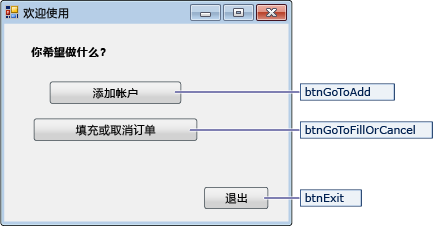

# <a name="create-a-simple-data-application-by-using-adonet"></a>使用 ADO.NET 创建简单的数据应用程序

当你创建操作数据库中的数据的应用程序时，就执行了如定义连接字符串、插入数据以及运行存储过程等基本任务。 通过按照本主题，你将了解如何与数据库从简单 Windows 窗体"forms over data"应用程序中使用视觉对象进行交互C#或 Visual Basic 和 ADO.NET。  所有.NET 数据技术，包括数据集，LINQ to SQL 和实体框架 — 最终执行非常类似于本文中所示的步骤。

本文演示了一种快速的方式获取数据，这个数据库的简单方法。 如果你的应用程序需要修改重要的方法中的数据并更新数据库，则应考虑使用实体框架和使用数据绑定，以自动同步到基础数据中的更改的用户界面控件。

> [!IMPORTANT]
> 要使代码保持简单，请不要包括生产就绪的异常处理。

## <a name="prerequisites"></a>系统必备

要创建应用程序，你将需要：

-   Visual Studio。

-   SQL Server Express LocalDB。 如果你没有 SQL Server Express LocalDB，您可以从中进行安装[SQL Server Express 下载页](https://www.microsoft.com/sql-server/sql-server-editions-express)。

本主题假定你熟悉 Visual Studio IDE 的基本功能和可以创建 Windows 窗体应用程序，将添加到项目中，将按钮和窗体上的其他控件的窗体设置控件和代码简单事件的属性。 如果您不熟悉这些任务，我们建议你先完成[开始使用 VisualC#和 Visual Basic](../ide/getting-started-with-visual-csharp-and-visual-basic.md)主题之前在开始本演练。

## <a name="set-up-the-sample-database"></a>设置示例数据库

通过执行以下步骤创建示例数据库：

1. 在 Visual Studio 中打开**服务器资源管理器**窗口。

2. 右键单击**数据连接**，然后选择**创建新的 SQL Server 数据库**。

3. 在中**服务器名称**文字框中，输入 **(localdb) \mssqllocaldb**。

4. 在中**新的数据库名称**文字框中，输入**Sales**，然后选择**确定**。

     空**销售**创建数据库并将其添加到服务器资源管理器中的数据连接节点。

5. 右键单击**销售**数据连接，然后选择**新查询**。

     查询编辑器窗口随即打开。

6. 复制[销售 Transact SQL 脚本](https://github.com/MicrosoftDocs/visualstudio-docs/raw/master/docs/data-tools/samples/sales.sql)到剪贴板。

7. 将 T-SQL 脚本粘贴到查询编辑器，然后选择**Execute**按钮。

     后不久，查询完成运行并创建数据库对象。 数据库包含两个表：客户和订单。 这些表最初不包含数据，但在运行，您将创建的应用程序时，您可以添加数据。 数据库还包含四个简单的存储的过程。

## <a name="create-the-forms-and-add-controls"></a>创建窗体并添加控件

1. 创建 Windows 窗体应用程序项目，然后将其命名为“SimpleDataApp”。

    Visual Studio 将创建项目以及若干个文件，其中包括名为“Form1”的空 Windows 窗体。

2. 添加两个 Windows 窗体到项目中，以使其具有三个窗体，然后给予它们下列名称：

   -   **导航**

   -   **NewCustomer**

   -   **FillOrCancel**

3. 对于每个窗体，添加文本框、按钮和其他控件，如下图所示。 对于每个控件，设置表中描述的属性。

   > [!NOTE]
   > 分组框和标签控件可提高清晰度，但不在代码中使用。

   **Navigation 窗体**

   

|Navigation 窗体的控件|属性|
| - |----------------|
|Button|Name = btnGoToAdd|
|Button|Name = btnGoToFillOrCancel|
|Button|Name = btnExit|

 **NewCustomer 窗体**

 

|NewCustomer 窗体的控件|属性|
| - |----------------|
|文本框|Name = txtCustomerName|
|文本框|Name = txtCustomerID<br /><br /> Readonly = True|
|Button|Name = btnCreateAccount|
|NumericUpdown|DecimalPlaces = 0<br /><br /> Maximum = 5000<br /><br /> Name = numOrderAmount|
|DateTimePicker|Format = Short<br /><br /> Name = dtpOrderDate|
|Button|Name = btnPlaceOrder|
|Button|Name = btnAddAnotherAccount|
|Button|Name = btnAddFinish|

 **FillOrCancel 窗体**

 

|FillOrCancel 窗体的控件|属性|
| - |----------------|
|文本框|Name = txtOrderID|
|Button|Name = btnFindByOrderID|
|DateTimePicker|Format = Short<br /><br /> Name = dtpFillDate|
|DataGridView|Name = dgvCustomerOrders<br /><br /> Readonly = True<br /><br /> RowHeadersVisible = False|
|Button|Name = btnCancelOrder|
|Button|Name = btnFillOrder|
|Button|Name = btnFinishUpdates|

## <a name="store-the-connection-string"></a>存储连接字符串
 当应用程序尝试打开数据库的连接时，应用程序必须能够访问连接字符串。 若要避免在每个窗体上手动输入该字符串，存储中的字符串*App.config*文件在项目中，并创建任意窗体应用程序中调用方法将返回字符串的方法。

 可以通过右键单击在上找到的连接字符串**销售**中的数据连接**服务器资源管理器**，然后选择**属性**。 找到**ConnectionString**属性，然后使用**Ctrl**+**一个**， **Ctrl**+**C**选择并将字符串复制到剪贴板。

1.  如果您使用的C#，请在**解决方案资源管理器**，展开**属性**节点，在项目下，和然后打开**Settings.settings**文件。
    如果在使用 Visual Basic**解决方案资源管理器**，单击**显示所有文件**，展开**我的项目**节点，然后再打开**Settings.settings**文件。

2.  在中**名称**列中，输入`connString`。

3.  在中**类型**列表中，选择 **（连接字符串）**。

4.  在中**作用域**列表中，选择**应用程序**。

5.  在中**值**列中，输入连接字符串 （而无需任何外部引号），然后保存所做的更改。

> [!NOTE]
> 在实际的应用程序，您应在连接字符串，安全地存储中所述[连接字符串和配置文件](/dotnet/framework/data/adonet/connection-strings-and-configuration-files)。

##  <a name="write-the-code-for-the-forms"></a>编写窗体代码

本部分包含每个窗体的功能的简要的概述。 它还提供单击窗体上的按钮时定义的基本逻辑的代码。

### <a name="navigation-form"></a>Navigation 窗体

运行应用程序时，Navigation 窗体将打开。 按“添加帐户”按钮可以打开 NewCustomer 窗体。 按“填写或取消订单”按钮可以打开 FillOrCancel 窗体。 按“退出”按钮可以关闭应用程序。

#### <a name="make-the-navigation-form-the-startup-form"></a>使 Navigation 窗体成为启动窗体

如果使用 C#，则在“解决方案资源管理器”中，打开 Program.cs，然后将 `Application.Run` 行更改为 `Application.Run(new Navigation());`

如果在使用 Visual Basic**解决方案资源管理器**，打开**属性**窗口中，选择**应用程序**选项卡，然后选择**SimpleDataApp.Navigation**中**启动窗体**列表。

#### <a name="create-auto-generated-event-handlers"></a>创建自动生成的事件处理程序

双击要创建空事件处理程序方法的导航窗体上的三个按钮。 双击按钮还将添加自动生成的代码在设计器代码文件中，单击按钮来引发事件。

#### <a name="add-code-for-the-navigation-form-logic"></a>添加导航窗体逻辑的代码

Navigation 窗体的代码页，在完成三个按钮方法体 click 事件处理程序中的以下代码所示。

[!code-csharp[Navigation#1](../data-tools/codesnippet/CSharp/SimpleDataApp/Navigation.cs#1)]
[!code-vb[Navigation#1](../data-tools/codesnippet/VisualBasic/SimpleDataApp/Navigation.vb#1)]

### <a name="newcustomer-form"></a>NewCustomer 窗体

当输入客户名称，然后选择**创建帐户**按钮，NewCustomer 窗体创建一个客户帐户，和 SQL Server 将返回一个 IDENTITY 值作为新的客户 id。 然后，您可以将新帐户的顺序放通过指定数量和订单日期并选择**下订单**按钮。

#### <a name="create-auto-generated-event-handlers"></a>创建自动生成的事件处理程序

创建一个空的 Click 事件处理程序 NewCustomer 窗体通过双击每个四个按钮上的每个按钮。 双击按钮还将添加自动生成的代码在设计器代码文件中，单击按钮来引发事件。

#### <a name="add-code-for-the-newcustomer-form-logic"></a>为 NewCustomer 窗体逻辑添加代码

若要完成的 NewCustomer 窗体逻辑，请执行以下步骤。

1. 自带`System.Data.SqlClient`纳入作用域的命名空间，以便无需完全限定其成员的名称。

     ```csharp
     using System.Data.SqlClient;
     ```
     ```vb
     Imports System.Data.SqlClient
     ```

2. 将一些变量和帮助器方法添加到类，如以下代码所示。

     [!code-csharp[NewCustomer#1](../data-tools/codesnippet/CSharp/SimpleDataApp/NewCustomer.cs#1)]
     [!code-vb[NewCustomer#1](../data-tools/codesnippet/VisualBasic/SimpleDataApp/NewCustomer.vb#1)]

3. 完整的四个按钮方法体 click 事件处理程序，如下面的代码中所示。

     [!code-csharp[NewCustomer#2](../data-tools/codesnippet/CSharp/SimpleDataApp/NewCustomer.cs#2)]
     [!code-vb[NewCustomer#2](../data-tools/codesnippet/VisualBasic/SimpleDataApp/NewCustomer.vb#2)]

### <a name="fillorcancel-form"></a>FillOrCancel 窗体

FillOrCancel 窗体将运行查询时要返回订单输入订单 ID，然后单击**查找订单**按钮。 返回的行在只读数据网格中显示。 如果您选择，可以将标记为已取消 (X) 的顺序**取消订单**按钮，也可以将订单标记为已填写 (F) 如果您选择**填写订单**按钮。 如果选择**查找订单**按钮再次，此时将显示已更新的行。

#### <a name="create-auto-generated-event-handlers"></a>创建自动生成的事件处理程序

创建空通过双击按钮单击事件处理程序 FillOrCancel 窗体上的四个按钮。 双击按钮还将添加自动生成的代码在设计器代码文件中，单击按钮来引发事件。

#### <a name="add-code-for-the-fillorcancel-form-logic"></a>为 FillOrCancel 窗体逻辑添加代码

若要完成 FillOrCancel 窗体逻辑，请执行以下步骤。

1. 将以下两个命名空间引入作用域，因此无需完全限定的名称及其成员。

     ```csharp
     using System.Data.SqlClient;
     using System.Text.RegularExpressions;
     ```
     ```vb
     Imports System.Data.SqlClient
     Imports System.Text.RegularExpressions
     ```

2. 将变量和帮助器方法添加到类，如下面的代码中所示。

     [!code-csharp[FillOrCancel#1](../data-tools/codesnippet/CSharp/SimpleDataApp/FillOrCancel.cs#1)]
     [!code-vb[FillOrCancel#1](../data-tools/codesnippet/VisualBasic/SimpleDataApp/FillOrCancel.vb#1)]

3. 完整的四个按钮方法体 click 事件处理程序，如下面的代码中所示。

     [!code-csharp[FillOrCancel#2](../data-tools/codesnippet/CSharp/SimpleDataApp/FillOrCancel.cs#2)]
     [!code-vb[FillOrCancel#2](../data-tools/codesnippet/VisualBasic/SimpleDataApp/FillOrCancel.vb#2)]

## <a name="test-your-application"></a>测试应用程序

在对每个 Click 事件处理程序进行编码且完成编码后，请按 F5 键以生成并测试应用程序。

## <a name="see-also"></a>请参阅

- [适用于 NET 的 Visual Studio Data Tools](../data-tools/visual-studio-data-tools-for-dotnet.md)
