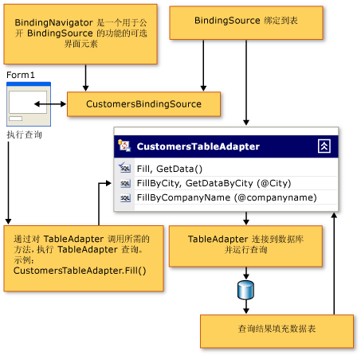

# 通过使用 Tableadapter 填充数据集
TableAdapter 组件填充具有基于一个或多个查询或你指定的存储的过程的数据库中的数据的数据集。 Tableadapter 还可以执行添加、 更新和删除要保留对数据集所做的更改的数据库上。 你可以发出到任何特定的表不相关的全局命令。  
  
> [!NOTE]
>  由 Visual Studio 设计器生成 Tableadapter。 如果要以编程方式创建数据集，然后使用 DataAdapter，这是.NET Framework 类。  
  
 TableAdapter 操作有关的详细信息，你可以直接跳到以下主题之一：  
  
|主题|描述|  
|-----------|-----------------|  
|[创建和配置 Tableadapter](../data-tools/create-and-configure-tableadapters.md)|如何使用设计器来创建和配置 Tableadapter|  
|[创建参数化 TableAdapter 查询](../data-tools/create-parameterized-tableadapter-queries.md)|如何使用户能够提供对 TableAdapter 过程或查询的参数|  
|[使用 TableAdapter 直接访问数据库](../data-tools/directly-access-the-database-with-a-tableadapter.md)|如何使用 Tableadapter 的 Dbdirect 方法|  
|[在填充数据集时关闭约束](../data-tools/turn-off-constraints-while-filling-a-dataset.md)|如何更新数据时使用外键约束|  
|[如何扩展 TableAdapter 的功能](../data-tools/fill-datasets-by-using-tableadapters.md)|如何将自定义代码添加到 Tableadapter|  
|[将 XML 数据读入到数据集中](../data-tools/read-xml-data-into-a-dataset.md)|如何使用 XML|  
  
  
  
## TableAdapter 概述  
 Tableadapter 是连接到数据库、 运行的查询或存储的过程，并使用返回的数据填充其 DataTable 的设计器生成组件。 Tableadapter 还从回数据库应用程序发送更新的数据。 你可以运行，只要它们返回到 TableAdapter 与之关联的表的架构数据符合 TableAdapter 上所需的所有查询。 下图显示 Tableadapter 如何与数据库和内存中的其他对象进行交互：  
  
   
  
 虽然 Tableadapter 的设计也考虑了**数据集设计器**，不会作为嵌套类的生成的 TableAdapter 类<xref:System.Data.DataSet>。 它们位于单独的命名空间中特定于每个数据集。 例如，如果你有一个名为`NorthwindDataSet`，与关联的 Tableadapter<xref:System.Data.DataTable>中`NorthwindDataSet`都会出现在`NorthwindDataSetTableAdapters`命名空间。 若要以编程方式访问特定的 TableAdapter，您必须声明 TableAdapter 的新实例。 例如:  
  
 [!code-csharp[VbRaddataTableAdapters#7](../data-tools/codesnippet/CSharp/fill-datasets-by-using-tableadapters_1.cs)]
 [!code-vb[VbRaddataTableAdapters#7](../data-tools/codesnippet/VisualBasic/fill-datasets-by-using-tableadapters_1.vb)]  
  
## 关联的 DataTable 架构  
 使用初始查询或存储的过程定义的架构的 TableAdapter 的关联来创建 TableAdapter 时<xref:System.Data.DataTable>。 运行此初始查询或通过调用 TableAdapter 的存储过程`Fill`方法 (其中填充 TableAdapter 的关联<xref:System.Data.DataTable>)。 对 TableAdapter 的主查询进行任何更改都会反映在关联的数据的表的架构。 例如，将一列从主查询还列从表中移除关联的数据。 如果任何其他查询的 TableAdapter 上使用返回不在主查询的列的 SQL 语句，设计器会尝试将同步主查询和其他查询之间的列更改。 
  
## TableAdapter 更新命令  
 TableAdapter 的更新功能均依赖于 TableAdapter 向导中的主查询中提供了多少信息。 例如，配置为提取来自多个表 （联接） 的值、 标量值、 视图或聚合函数的结果的 Tableadapter 由不初始创建能够将更新发送回基础数据库中。 但是，你可以配置的 INSERT、 UPDATE 和 DELETE 命令中手动**属性**窗口。  
  
## TableAdapter 查询  
   
  
 Tableadapter 可以包含多个查询以填充其关联的数据的表。 你可以定义任意多个查询的 TableAdapter 根据你的应用程序的需要，只要每个查询会返回与它关联的数据的表相同的架构一致的数据。 此功能使 TableAdapter 加载基于不同条件的不同结果。  
  
 例如，如果你的应用程序包含具有客户名称的表，你可以创建使用以特定的字母开头的每个客户名称和另一个填充表都位于相同的状态的所有客户用填充表的查询。 若要填充`Customers`表与处于给定状态的客户，你可以创建`FillByState`采用一个参数作为状态的值，如下所示的查询： `SELECT * FROM Customers WHERE State = @State`。 通过调用运行查询`FillByState`方法并传入的参数值如下： `CustomerTableAdapter.FillByState("WA")`。  
  
 除将返回相同的架构 TableAdapter 的数据表的数据的查询添加，你可以添加返回标量 （单个） 值的查询。 例如，查询将返回的客户计数 (`SELECT Count(*) From Customers`) 对有效`CustomersTableAdapter,`即使返回的数据的不符合此表的架构。  
  
## ClearBeforeFill 属性  
 默认情况下，每次运行查询以填充 TableAdapter 的数据表，清除现有数据，并且仅查询的结果加载到表。 设置 TableAdapter 的`ClearBeforeFill`属性`false`如果你想要添加或从查询返回到数据表中的现有数据将数据合并。 无论是否清除数据，都需要显式将更新发送回数据库，如果你想要将它们持久保存。 因此请务必先运行另一个填充表的查询之前将任何更改保存到表中的数据。 有关详细信息，请参阅[使用 TableAdapter 更新数据](../data-tools/update-data-by-using-a-tableadapter.md)。  
  
## TableAdapter 继承  
 Tableadapter 扩展通过将封装一个已配置的标准数据适配器的功能<xref:System.Data.Common.DataAdapter>类。 默认情况下，从继承 TableAdapter<xref:System.ComponentModel.Component>类并不能强制转换为<xref:System.Data.Common.DataAdapter>类。 强制转换到 TableAdapter<xref:System.Data.Common.DataAdapter>类中的结果<xref:System.InvalidCastException>错误。 若要更改 TableAdapter 的基本类，您可以指定派生自类<xref:System.ComponentModel.Component>中**基类**属性中的 tableadapter**数据集设计器**。  
  
## TableAdapter 方法和属性  
 TableAdapter 类不是属于[!INCLUDE[dnprdnshort](../code-quality/includes/dnprdnshort_md.md)]。 这意味着你不能查找其文档中或**对象浏览器**。 在设计时，当你使用前面所述的向导之一则创建它。 在创建时分配给 TableAdapter 的名称取决于你正在使用的表的名称。 例如，当创建基于的数据库中表 TableAdapter `Orders`，名为 TableAdapter `OrdersTableAdapter`。 可以使用更改的类名的 TableAdapter**名称**中的属性**数据集设计器**。  
  
 以下是常用的方法和的 Tableadapter 的属性：  
  
|成员|描述|  
|------------|-----------------|  
|`TableAdapter.Fill`|将填充 TableAdapter 的关联的数据使用 TableAdapter 的 SELECT 命令的结果的表。|  
|`TableAdapter.Update`|将更改发送回数据库，并返回一个整数，表示更新受影响的行数。 有关详细信息，请参阅[使用 TableAdapter 更新数据](../data-tools/update-data-by-using-a-tableadapter.md)。|  
|`TableAdapter.GetData`|返回一个新<xref:System.Data.DataTable>用数据填充。|  
|`TableAdapter.Insert`|在数据表中创建一个新行。 有关详细信息，请参阅[将新记录插入数据库](../data-tools/insert-new-records-into-a-database.md)。|  
|`TableAdapter.ClearBeforeFill`|确定数据表之前调用之一将被清空`Fill`方法。|  
  
## TableAdapter 更新方法  
 Tableadapter 使用数据命令来读取和写入数据库中。 TableAdapter 的初始`Fill`（主） 查询用于作为基础创建表的架构关联的数据，以及`InsertCommand`， `UpdateCommand`，和`DeleteCommand`与关联的命令`TableAdapter.Update`方法。 调用 TableAdapter 的`Update`方法运行时 TableAdapter 最初创建的语句配置，不是一种与已添加的其他查询**TableAdapter 查询配置向导**.  
  
 当你使用 TableAdapter 时，它将有效地执行你通常要执行的命令相同的操作。 例如，当调用适配器的`Fill`方法，该适配器数据在运行命令其`SelectCommand`属性，并使用数据读取器 (例如， <xref:System.Data.SqlClient.SqlDataReader>) 加载的结果集到数据表。 同样，当调用适配器的`Update`方法，它将运行相应的命令 (在`UpdateCommand`， `InsertCommand`，和`DeleteCommand`属性) 为每个更改数据表中的记录。  
  
> [!NOTE]
>  如果没有足够的信息，在主查询中， `InsertCommand`， `UpdateCommand`，和`DeleteCommand`生成 TableAdapter 时，默认情况下会创建命令。 如果 TableAdapter 的主查询不只是单个表的 SELECT 语句，则可能设计器将无法生成`InsertCommand`， `UpdateCommand`，和`DeleteCommand`。 如果不会生成这些命令，在运行时，可能会收到错误`TableAdapter.Update`方法。  
  
## TableAdapter GenerateDbDirectMethods  
 除了`InsertCommand`， `UpdateCommand`，和`DeleteCommand`，Tableadapter 创建的可以直接对数据库运行的方法。 这些方法 (`TableAdapter.Insert`， `TableAdapter.Update`，和`TableAdapter.Delete`) 可以调用直接操作数据库中的数据。 这意味着你可以从而不是调用代码中调用这些单个方法`TableAdapter.Update`来处理插入、 更新和删除操作处于挂起状态关联的数据的表。  
  
 如果你不想要创建这些直接的方法，设置 TableAdapter 的**GenerateDbDirectMethods**属性`false`(在**属性**窗口)。 添加到 TableAdapter 的其他查询都是独立查询 — 它们不生成这些方法。  
  
## 可以为 null 的类型的 TableAdapter 支持  
 Tableadapter 支持可以为 null 的类型`Nullable(Of T)`和`T?`。 若要深入了解 Visual Basic 中可以为 null 的类型，请参阅[可以为 null 的值类型](/dotnet/visual-basic/programming-guide/language-features/data-types/nullable-value-types)。 有关在 C# 中的可空类型的详细信息，请参阅[使用可以为 Null 类型](/dotnet/csharp/programming-guide/nullable-types/using-nullable-types)。  
  
  
  
## TableAdapterManager 引用  
 默认情况下，`TableAdapterManager`创建包含相关的表的数据集时，将生成类。 若要阻止生成类，将更改的值`Hierarchical Update`为 false 的数据集的属性。 当拖动到设计图面上的 Windows 窗体或在 WPF 页的关系的表时，Visual Studio 将声明类的成员变量。 如果你不使用数据绑定时，你必须手动将该变量的声明。  
  
 `TableAdapterManager`类不是属于[!INCLUDE[dnprdnshort](../code-quality/includes/dnprdnshort_md.md)]。 因此，你不能查找其文档中。 在设计时数据集创建过程的一部分创建。  
  
 以下是常用的方法和属性`TableAdapterManager`类：  
  
|成员|描述|  
|------------|-----------------|  
|`UpdateAll` 方法|将保存数据的所有表中的所有数据。|  
|`BackUpDataSetBeforeUpdate` 属性|确定是否在执行前创建数据集的备份副本`TableAdapterManager.UpdateAll`方法。布尔值。|  
|*tableName* `TableAdapter`属性|表示`TableAdapter`。 生成`TableAdapterManager`包含每个属性`TableAdapter`它所管理。 例如，具有 Customers 和 Orders 表的数据集生成与`TableAdapterManager`包含`CustomersTableAdapter`和`OrdersTableAdapter`属性。|  
|`UpdateOrder` 属性|控制单个 insert、 update 和 delete 命令的顺序。 将此属性设置为中的值之一`TableAdapterManager.UpdateOrderOption`枚举。   默认情况下，`UpdateOrder`设置为**InsertUpdateDelete**。 这意味着，它将插入，然后更新，然后删除数据集中的所有表执行。|

## 安全性  
当你使用的 CommandType 属性设置为与数据命令<xref:System.Data.CommandType.Text>请仔细检查传递到你的数据库之前从客户端发送的信息。 恶意用户可能会尝试发送 （插入） 修改过的或其他 SQL 语句，以获得未经授权的访问或破坏该数据库。 将内容传输到数据库的用户输入之前，始终验证的信息有效。 一种最佳做法是始终使用参数化的查询或存储的过程在可能的情况。  
  
## 请参阅
[数据集工具](../data-tools/dataset-tools-in-visual-studio.md)