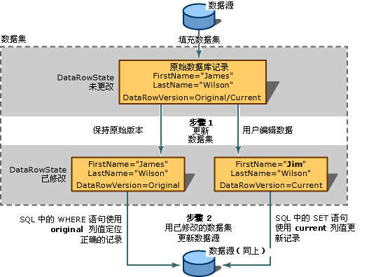

# <a name="save-data-back-to-the-database"></a>将数据保存回数据库
数据集是内存中副本的数据。 如果修改此数据，最好将这些更改保存回数据库。 执行了此三种方式之一的操作：  
  
-   通过调用 TableAdapter 的更新方法之一  
  
-   通过调用 TableAdapter 的 DBDirect 方法之一  
  
-   数据集包含与其他表中数据集相关的表时，Visual Studio 为你生成通过在 TableAdapterManager 上调用 UpdateAll 方法  
  
当你的数据将数据集表绑定到 Windows 窗体或 XAML 页面上的控件时，数据绑定体系结构为您完成所有工作。  
  
如果你熟悉 Tableadapter，你可以直接跳转到以下主题之一：  
  
|主题|描述|  
|-----------|-----------------|  
|[将新记录插入数据库](../data-tools/insert-new-records-into-a-database.md)|如何执行更新和插入使用 Tableadapter 或命令的对象|  
|[使用 TableAdapter 更新数据](../data-tools/update-data-by-using-a-tableadapter.md)|如何执行与 Tableadapter 的更新|  
|[分层更新](../data-tools/hierarchical-update.md)|如何从具有两个或多个相关表的数据集执行更新|  
|[处理并发异常](../data-tools/handle-a-concurrency-exception.md)|如何在两个用户试图同时更改数据库中的相同数据时处理异常|  
|[如何： 使用事务保存数据](../data-tools/save-data-by-using-a-transaction.md)|如何将数据保存在事务使用 System.Transactions 命名空间和 TransactionScope 对象中|  
|[演练：在事务中保存数据](../data-tools/save-data-in-a-transaction.md)|创建 Windows 窗体应用程序来演示保存到数据库在事务内的数据的演练|  
|[将数据保存到数据库（多个表）](../data-tools/save-data-to-a-database-multiple-tables.md)|如何编辑记录并将更改保存回数据库的多个表中|  
|[将数据从对象保存到数据库](../data-tools/save-data-from-an-object-to-a-database.md)|如何将数据从数据集中到数据库不是按使用 TableAdapter DbDirect 方法的对象传递|  
|[用 TableAdapter DBDirect 方法保存数据](../data-tools/save-data-with-the-tableadapter-dbdirect-methods.md)|如何使用 TableAdapter 直接向数据库发送 SQL 查询|  
|[将数据集另存为 XML](../data-tools/save-a-dataset-as-xml.md)|如何将数据集保存到 XML 文档|  
  
## <a name="two-stage-updates"></a>两阶段更新  
 更新数据源是一个两步过程。 第一步是使用新记录、 已更改的记录或已删除的记录更新数据集。 如果你的应用程序永远不会将这些更改发送回数据源，你已完成更新。  
  
 如果执行操作将更改发送回数据库，则需要第二个步骤。 如果你未使用数据绑定控件，然后你必须手动调用 Update 方法的同一个 TableAdapter （或数据适配器），用于填充数据集。 但是，若要将数据从一个数据源移到另一个，或更新多个数据源，还可以使用不同的适配器，例如。 如果你不使用数据绑定，并将保存为相关表的更改，你必须手动实例化自动生成 TableAdapterManager 类的变量，然后调用其 UdpateAll 方法。  
  
   
两阶段更新过程，并在成功的更新中 DataRowVersion 的角色  
  
 数据集包含的表，其中包含行的集合的集合。 如果你想要以后更新基础数据源，你必须添加或删除行时的 DataTable.DataRowCollection 属性上使用方法。 这些方法执行更新数据源具有需要更改跟踪。 如果你调用 RemoveAt 集合行属性，请删除不会将传送回数据库。  
  
## <a name="merge-datasets"></a>合并数据集  
 您可以更新的数据集的内容*合并*它与另一个数据集。 这涉及到将复制的内容*源*到调用数据集的数据集 (称为*目标*数据集)。 在合并数据集时，源数据集中的新记录将会添加到目标数据集。 此外，源数据集中的额外列添加到目标数据集。 合并数据集可拥有一个本地的数据集和第二个数据集获得另一个应用程序时的不同而不同。 此外，从 XML web 服务，如组件获取第二个数据集时或当你需要集成来自多个数据集数据时对它也是有用。  
  
 当合并数据集，您可以传递布尔参数 (`preserveChanges`)，告知<xref:System.Data.DataSet.Merge%2A>方法是保留在目标数据集中的现有进行修改。 由于数据集维护记录的多个版本，务必要记住合并多个版本记录。 下表显示如何合并中两个数据集的记录：  
  
|DataRowVersion|目标数据集|源数据集|  
|--------------------|--------------------|--------------------|  
|原始|James wilson 制作|James C.wilson 制作|  
|当前|Jim wilson 制作|James C.wilson 制作|  
  
 调用<xref:System.Data.DataSet.Merge%2A>方法与上表`preserveChanges=false targetDataset.Merge(sourceDataset)`结果如下：  
  
|DataRowVersion|目标数据集|源数据集|  
|--------------------|--------------------|--------------------|  
|原始|James C.wilson 制作|James C.wilson 制作|  
|当前|James C.wilson 制作|James C.wilson 制作|  
  
 调用<xref:System.Data.DataSet.Merge%2A>方法替换`preserveChanges = true targetDataset.Merge(sourceDataset, true)`结果如下：  
  
|DataRowVersion|目标数据集|源数据集|  
|--------------------|--------------------|--------------------|  
|原始|James C.wilson 制作|James C.wilson 制作|  
|当前|Jim wilson 制作|James C.wilson 制作|  
  
> [!CAUTION]
>  在`preserveChanges = true`方案中，如果<xref:System.Data.DataSet.RejectChanges%2A>对目标数据集中的记录中调用方法，则它将恢复为原始数据从*源*数据集。 这意味着，如果你尝试更新原始数据源与目标数据集，它可能无法找到要更新的原始行。 通过使用数据源的更新的记录填充另一个数据集，然后执行合并以防止并发冲突，可以防止并发冲突。 （另一个用户修改数据源中的记录后填充数据集, 时进行的并发冲突。）  
  
## <a name="update-constraints"></a>更新约束  
 若要对现有的数据行进行更改，添加或更新中的各个列的数据。 如果数据集包含约束 （如外键或不可以为 null 约束），则可能，该记录可以暂时处于错误状态你更新。 即，它可以处于错误状态在完成更新一列后但在到达下一个之前。  
  
 为了避免这种过早约束冲突可以暂时挂起更新约束。 这有两个用途：  
  
-   它可以防止出错后已完成更新一个列，但尚未启动的更新另一个被引发。  
  
-   它可以防止某些更新事件引发 （通常用于验证的事件）。  
   
> [!NOTE]
>  Windows 窗体中的数据绑定体系结构，内置于 datagrid 挂起约束检查直到焦点移出一个行，并不需要显式调用<xref:System.Data.DataRow.BeginEdit%2A>， <xref:System.Data.DataRow.EndEdit%2A>，或<xref:System.Data.DataRow.CancelEdit%2A>方法。  
  
 约束会自动禁用时<xref:System.Data.DataSet.Merge%2A>方法调用对数据集。 合并完成后，如果没有任何约束无法启用对数据集<xref:System.Data.ConstraintException>引发。 在此情况下，<xref:System.Data.DataSet.EnforceConstraints%2A>属性设置为`false,`和重置之前，必须解决所有约束冲突<xref:System.Data.DataSet.EnforceConstraints%2A>属性`true`。  
  
 完成更新后，可以重新启用约束检查，还将重新启用更新事件并引发它们。  
  
 有关挂起事件的详细信息，请参阅[填充数据集时关闭约束](../data-tools/turn-off-constraints-while-filling-a-dataset.md)。  
  
## <a name="dataset-update-errors"></a>数据集更新错误  
 在更新数据集中的记录时，没有出错的可能性。 例如，你可能会无意中编写到列，错误类型的数据或数据太长或具有一些其他完整性问题的数据。 或者，你可能必须可以在更新事件的任何阶段过程中引发自定义错误的应用程序特定验证检查。 有关详细信息，请参阅[验证数据集中的数据](../data-tools/validate-data-in-datasets.md)。  
  
## <a name="maintaining-information-about-changes"></a>维护有关更改的信息  
 数据集中的更改的相关信息保留两种方式： 通过标记指示，它们已更改的行 (<xref:System.Data.DataRow.RowState%2A>)，以及通过保留的记录的多个副本 (<xref:System.Data.DataRowVersion>)。 通过使用此信息，进程可以确定有哪些更改数据集，并可以将相应的更新发送到数据源。  
  
### <a name="rowstate-property"></a>RowState 属性  
 <xref:System.Data.DataRow.RowState%2A>属性<xref:System.Data.DataRow>对象是一个值，提供有关数据的特定行的状态信息。  
  
 下表详细说明的可能值<xref:System.Data.DataRowState>枚举：  
  
|DataRowState 值|描述|  
|------------------------|-----------------|  
|<xref:System.Data.DataRowState.Added>|行已添加一个项作为<xref:System.Data.DataRowCollection>。 (此状态中的行不具有相应的原始版本，因为它不存在时最后<xref:System.Data.DataRow.AcceptChanges%2A>调用了方法)。|  
|<xref:System.Data.DataRowState.Deleted>|使用删除了行<xref:System.Data.DataRow.Delete%2A>的<xref:System.Data.DataRow>对象。|  
|<xref:System.Data.DataRowState.Detached>|行已创建，但不属于任何<xref:System.Data.DataRowCollection>。 A<xref:System.Data.DataRow>对象在立即创建后，之前它已被添加到集合，并已从集合中删除它后处于此状态。|  
|<xref:System.Data.DataRowState.Modified>|以某种方式已更改的行中列的值。|  
|<xref:System.Data.DataRowState.Unchanged>|以来未更改行<xref:System.Data.DataRow.AcceptChanges%2A>上一次调用。|  
  
### <a name="datarowversion-enumeration"></a>DataRowVersion 枚举  
数据集维护记录的多个版本。 <xref:System.Data.DataRowVersion>时检索的值中找到，则可以使用字段<xref:System.Data.DataRow>使用<xref:System.Data.DataRow.Item%2A>属性或<xref:System.Data.DataRow.GetChildRows%2A>方法<xref:System.Data.DataRow>对象。  
  
下表详细说明的可能值<xref:System.Data.DataRowVersion>枚举：  
  
|DataRowVersion 值|描述|  
|--------------------------|-----------------|  
|<xref:System.Data.DataRowVersion.Current>|一条记录的当前版本包含在上次记录执行的所有修改<xref:System.Data.DataRow.AcceptChanges%2A>调用。 如果行已被删除，则没有当前版本。|  
|<xref:System.Data.DataRowVersion.Default>|默认值由数据集架构或数据源定义中的记录。|  
|<xref:System.Data.DataRowVersion.Original>|一条记录的原始版本保持它以前的最后一个时间更改已提交数据集中的记录的副本。 实际上，这通常是一条记录的版本为 ' 已读从数据源。|  
|<xref:System.Data.DataRowVersion.Proposed>|暂时时正在更新均可用的记录的建议的版本 — 即之间的时间调用<xref:System.Data.DataRow.BeginEdit%2A>方法和<xref:System.Data.DataRow.EndEdit%2A>方法。 你通常访问的事件处理程序中的记录的建议的版本如<xref:System.Data.DataTable.RowChanging>。 调用<xref:System.Data.DataRow.CancelEdit%2A>方法反转所做的更改和删除数据行的建议的版本。|  
  
 更新信息传输到数据源时，原始和当前版本是很有用。 通常，当更新发送到数据源，数据库的新信息是一条记录的当前版本中。 与原始版本的信息用于查找要更新的记录。  
  
 例如，更改为主键的记录的位置的情况下，你需要一种方法在数据源中查找正确的记录，以便更新所做的更改。 如果没有原始版本已存在，则将记录最有可能将追加到数据源，从而不只在一个额外的多余的记录，但一个是不准确且已过时的记录中。 两个版本也用在并发控制。 你可以比较针对要确定是否记录有更改，因为它已加载到数据集的数据源中的记录的原始版本。  
  
 你需要执行实际将更改提交到数据集之前验证时有用的建议的版本。  
  
 即使记录已发生更改，也不总会有该行的原始或当前版本。 当你将新行插入表中时，没有任何原始版本，只有当前版本。 同样，如果你删除通过调用表的行`Delete`方法，没有原始版本，但没有当前版本。  
  
 你可以测试以查看通过查询数据行是否存在一条记录的特定版本<xref:System.Data.DataRow.HasVersion%2A>方法。 你可以通过传递访问记录的任一版本<xref:System.Data.DataRowVersion>作为可选自变量时请求列的值的枚举值。  
  
## <a name="getting-changed-records"></a>获取已更改的记录  
 它是常见的做法，不能更新数据集中的每个记录。 例如，用户可能使用 Windows 窗体<xref:System.Windows.Forms.DataGridView>显示多个记录的控件。 但是，用户可能更新仅几个记录，删除其中一个，并插入一个新。 数据集和数据表提供一种方法 (`GetChanges`) 用于返回只有已修改的行。  
  
 你可以创建使用的已更改记录的子集`GetChanges`数据表的方法 (<xref:System.Data.DataTable.GetChanges%2A>) 或数据集 (<xref:System.Data.DataSet.GetChanges%2A>) 本身。 如果你对数据表调用方法时，它将返回具有已更改的记录的表的副本。 同样，如果调用方法对数据集上时，你在其中收到新的数据集与更改的记录。  
  
 `GetChanges`通过自身返回所有更改的记录。 与此相反，通过将传递所需<xref:System.Data.DataRowState>作为参数传递给`GetChanges`方法，可指定所需的更改记录哪些子集： 新添加的记录，记录已标记为删除，分离记录，或修改记录。  
  
 你想要将记录发送到另一个组件进行处理时，获取已更改的记录的子集非常有用。 而不是发送整个数据集，你可以减少通过获取该组件需要仅记录与另一个组件进行通信的开销。   
  
## <a name="committing-changes-in-the-dataset"></a>提交数据集中的更改  
 在数据集中，做出更改后<xref:System.Data.DataRow.RowState%2A>属性已更改的行设置。 建立、 维护，以及可供你通过记录的原始和当前版本<xref:System.Data.DataRowView.RowVersion%2A>属性。 这些已更改的行的属性中存储的元数据才需要将正确的更新发送到数据源。  
  
 如果所做的更改反映数据源的当前状态，你不再需要维护该信息。 通常情况下，有两次数据集和其源何时同步：  
  
-   后立即将信息加载到数据集，如从源读取数据时。  
  
-   将更改从数据集发送到数据源之后 (但不是之前，因为您可能丢失更改信息将发送到数据库的更改所需)。  
  
你可以通过调用挂起的更改提交到数据集<xref:System.Data.DataSet.AcceptChanges%2A>方法。 通常情况下，<xref:System.Data.DataSet.AcceptChanges%2A>调用在以下时间：  
  
-   在你后加载数据集。 如果你加载数据集通过调用 TableAdapter 的`Fill`为你的方法，则适配器自动提交更改。 但是，如果通过将另一个数据集合并到其加载数据集，然后你必须手动提交所做的更改。  
  
    > [!NOTE]
    >  可以在调用时自动提交所做的更改阻止适配器`Fill`方法通过设置`AcceptChangesDuringFill`属性到适配器`false`。 如果设置为`false`，则<xref:System.Data.DataRow.RowState%2A>fill 期间插入每行设置为<xref:System.Data.DataRowState.Added>。  
  
-   之后将数据集更改发送到另一个进程，如 XML Web 服务。  
  
    > [!CAUTION]
    >  提交更改这种方式清除任何更改信息。 不提交更改直到检查完完成执行需要知道数据集中进行哪些更改了你的应用程序的操作。  
  
此方法完成以下任务：  
  
-   写入<xref:System.Data.DataRowVersion.Current>版本记录划分其<xref:System.Data.DataRowVersion.Original>版本并覆盖原始版本。  
  
-   中删除任何行其中<xref:System.Data.DataRow.RowState%2A>属性设置为<xref:System.Data.DataRowState.Deleted>。  
  
-   集<xref:System.Data.DataRow.RowState%2A>到记录的属性<xref:System.Data.DataRowState.Unchanged>。  
  
<xref:System.Data.DataSet.AcceptChanges%2A>方法有以下三个级别。 你可以对调用<xref:System.Data.DataRow>到提交的对象更改只需该行。 你还可以在调用它<xref:System.Data.DataTable>对象提交表中的所有行。 最后，在调用它<xref:System.Data.DataSet>提交的数据集的所有表的所有记录中所有挂起的更改的对象。  
  
下表说明了哪些更改是提交基于何种对象上调用方法。  
  
|方法|结果|  
|------------|------------|  
|<xref:System.Data.DataRow.AcceptChanges%2A?displayProperty=fullName>|仅在特定的行上提交更改。|  
|<xref:System.Data.DataTable.AcceptChanges%2A?displayProperty=fullName>|特定的表中的所有行都提交的更改。|  
|<xref:System.Data.DataSet.AcceptChanges%2A?displayProperty=fullName>|提交的数据集的所有表中的所有行的更改。|  
  
> [!NOTE]
>  如果你加载数据集通过调用 TableAdapter 的`Fill`方法，你不必显式接受更改。 默认情况下，`Fill`方法调用`AcceptChanges`后完成填充数据表的方法。  
  
 相关的方法， <xref:System.Data.DataSet.RejectChanges%2A>，通过复制撤消更改的影响<xref:System.Data.DataRowVersion.Original>回版本<xref:System.Data.DataRowVersion.Current>的记录的版本。 它还将设置<xref:System.Data.DataRow.RowState%2A>的每个记录回<xref:System.Data.DataRowState.Unchanged>。  
  
## <a name="data-validation"></a>数据验证  
 若要验证你的应用程序中的数据满足，它将传递到该进程的要求，您通常需要添加验证。 这样做可能会检查窗体中的用户的输入内容正确无误，验证数据发送到您的应用程序另一个应用程序，或甚至检查计算在您的组件的信息位于你的数据源的约束内和应用程序要求。  
  
 你可以验证数据有几个方面：  
  
-   在业务层，通过将代码添加到你的应用程序，以验证数据。 数据集是在一个位置可以执行此操作。 数据集提供了一些的后端验证的优点，例如以验证更改，如列和行的值变化的功能。 有关详细信息，请参阅[验证数据集中的数据](../data-tools/validate-data-in-datasets.md)。  
  
-   在表示层，通过将验证添加到窗体。 有关详细信息，请参阅[Windows 窗体中的用户输入验证](/dotnet/framework/winforms/user-input-validation-in-windows-forms)。  
  
-   数据在后端，通过将数据发送到数据源-例如，数据库，并允许它接受或拒绝该数据。 如果你正在使用具有复杂的功能来验证数据并提供错误的信息的数据库，这可能是一个实用的方法，因为你可以验证无论它的来源的数据。 但是，这种方法可能不适合特定于应用程序的验证要求。 此外，具有验证数据的数据源可能导致大量往返到数据源，具体取决于你的应用程序如何通过后端引发的验证错误的解决方法。  
  
    > [!IMPORTANT]
    >  使用与数据命令时<xref:System.Data.SqlClient.SqlCommand.CommandType%2A>属性设置为<xref:System.Data.CommandType.Text>请仔细检查传递到你的数据库之前从客户端发送的信息。 恶意用户可能会尝试发送 （插入） 修改过的或其他 SQL 语句，以获得未经授权的访问或破坏该数据库。 将内容传输到数据库的用户输入之前，始终验证的信息有效。 它是始终使用参数化的查询或存储的过程时可能的最佳实践。  
  
## <a name="transmitting-updates-to-the-data-source"></a>传输更新数据源  
在数据集进行了更改后，你可以通过传输对数据源的更改。 通常情况下，你执行此操作通过调用`Update`TableAdapter （或者数据适配器） 的方法。 该方法将遍历每个记录中的数据表中，确定所需的哪种类型的更新 （更新、 插入或删除） (如果有） 然后运行相应的命令。  

 为了举例说明了如何进行更新，假设你的应用程序使用包含单个数据表的数据集。 应用程序从数据库中获取两个行。 在检索之后，内存中数据的表类似如下所示：  
  
```  
(RowState)     CustomerID   Name             Status  
(Unchanged)    c200         Robert Lyon      Good  
(Unchanged)    c400         Nancy Buchanan    Pending  
```  
  
 你的应用程序林丹的状态更改为"首选"。 由于此更改的值<xref:System.Data.DataRow.RowState%2A>该行的属性更改从<xref:System.Data.DataRowState.Unchanged>到<xref:System.Data.DataRowState.Modified>。 值<xref:System.Data.DataRow.RowState%2A>第一行的属性将保持<xref:System.Data.DataRowState.Unchanged>。 数据表现在如下所示：  
  
```  
(RowState)     CustomerID   Name             Status  
(Unchanged)    c200         Robert Lyon      Good  
(Modified)     c400         Nancy Buchanan    Preferred  
```  
  
 应用程序现在调用 `Update` 方法，将数据集传送给数据库。 该方法检查每个行反过来。 对于第一个行，方法传输不到数据库的 SQL 语句，因为该行后未发生更改最初从数据库提取它了。  
  
 对于第二个行，但是，`Update`方法自动调用正确的数据命令，并将其传输到数据库。 特定的 SQL 语句的语法取决于所支持的基础数据存储区的 SQL 的方言。 但传送的 SQL 语句的以下常规特征值得注意：  
  
-   传送的 SQL 语句是 UPDATE 语句。 适配器知道使用 UPDATE 语句，因为值<xref:System.Data.DataRow.RowState%2A>属性是<xref:System.Data.DataRowState.Modified>。  
  
-   传输的 SQL 语句包含 WHERE 子句，指示更新语句的目标为行其中`CustomerID = 'c400'`。 SELECT 语句的这一部分使目标行有别于所有其他因为`CustomerID`是目标表的主键。 WHERE 子句派生自该记录的原始版本的信息 (`DataRowVersion.Original`)，以防需标识一行的值已更改。  
  
-   传输的 SQL 语句包含 SET 子句，用以设置已修改的列的新值。  
  
    > [!NOTE]
    >  如果 TableAdapter 的`UpdateCommand`属性已设置为存储过程的名称，该适配器并不构造 SQL 语句。 相反，它使用传入的相应参数调用存储的过程。  
  
## <a name="passing-parameters"></a>传递参数  
 通常可以使用参数来传递要在数据库中更新的记录的值。  当 TableAdapter 的`Update`方法运行 UPDATE 语句，它必须以填充参数值。 它获取这些值从`Parameters`适当的数据命令的集合，在这种情况下， `UpdateCommand` TableAdapter 中的对象。  
  
 如果你使用 Visual Studio 工具生成的数据适配器，`UpdateCommand`对象包含对应于在语句中的每个参数占位符的参数的集合。  
  
 <xref:System.Data.SqlClient.SqlParameter.SourceColumn%2A?displayProperty=fullName>每个参数的属性指向数据表中的列。 例如，`SourceColumn`属性`au_id`和`Original_au_id`参数设置为数据表中的任意一列包含作者 id。当适配器的`Update`方法运行时，它从读取作者 id 列正在更新以及将值填充到语句中的记录。  
  
 在 UPDATE 语句中，你需要指定这两个新值 （那些将写入到该记录的） 以及旧值 （以便记录可以位于数据库中）。 因此有两个参数的每个值： 一个用于 SET 子句，另一个用于 WHERE 子句。 这两个参数从正在更新的记录中读取数据，但它们获取不同版本的基于参数的列值<xref:System.Data.SqlClient.SqlParameter.SourceVersion>属性。 SET 子句的参数获取最新版本，和 WHERE 子句的参数获取原始版本。  
  
> [!NOTE]
>  你也可以在设置值`Parameters`集合自己在代码中，这通常会执行的事件处理程序的数据适配器中<xref:System.Data.DataTable.RowChanging>事件。  
  
## <a name="see-also"></a>请参阅
[Visual Studio 中的数据集工具](../data-tools/dataset-tools-in-visual-studio.md)   
[创建和配置 Tableadapter](create-and-configure-tableadapters.md)  
[使用 TableAdapter 更新数据](../data-tools/update-data-by-using-a-tableadapter.md)   
[在 Visual Studio 中将控件绑定到数据](../data-tools/bind-controls-to-data-in-visual-studio.md)   
[验证数据](validate-data-in-datasets.md)   
[保存数据](../data-tools/saving-data.md)