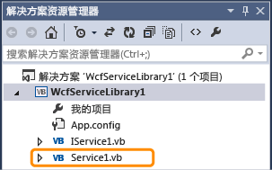
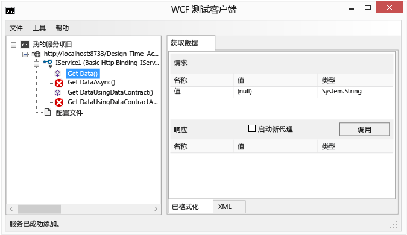
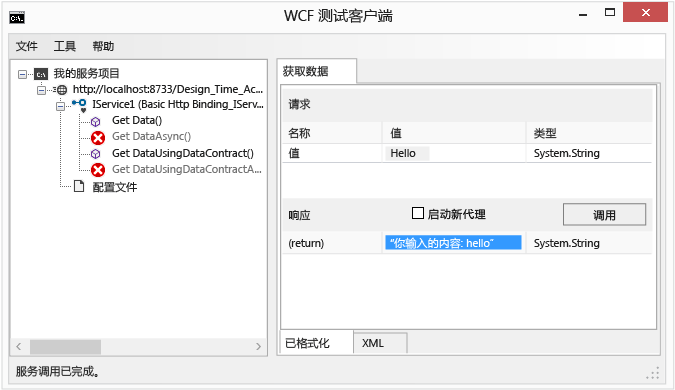
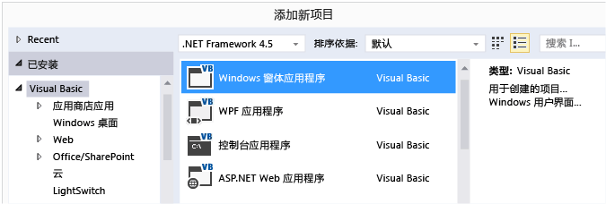
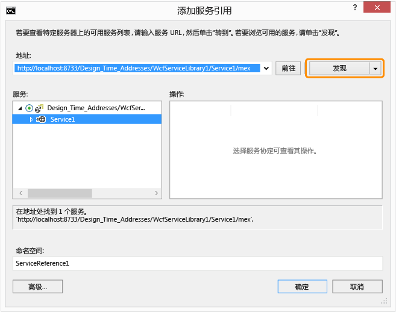
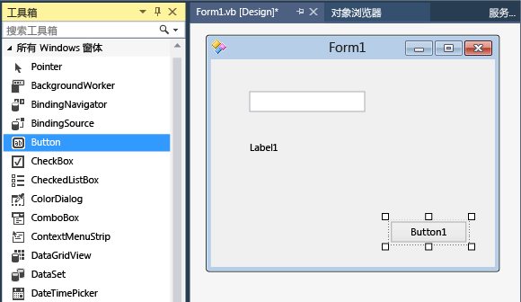

# 演练： 在 Windows 窗体中创建一个简单的 WCF 服务

本演练演示如何创建一个简单[!INCLUDE[vsindigo](../data-tools/includes/vsindigo_md.md)]服务并进行测试，然后从 Windows 窗体应用程序访问它。

[!INCLUDE[note_settings_general](../data-tools/includes/note_settings_general_md.md)]

## 创建服务

### 要创建 WCF 服务

1.  在 **“文件”** 菜单上指向 **“新建”** ，然后单击 **“项目”**。

2.  在“新建项目”对话框中，展开 Visual Basic 或 Visual C# 节点，然后单击 WCF，接着是“WCF 服务库”。 单击“确定”，打开项目。

     

    > [!NOTE]
    >  这将创建可以测试和访问的工作服务。 以下两个步骤演示您可以如何修改使用不同数据类型的默认方法。 在实际应用中，您还会向服务中添加您自己的函数。

3.  

     在解决方案资源管理器中，双击 IService1.vb 或 IService1.cs 并找到以下行：

     [!code-csharp[WCFWalkthrough#4](../data-tools/codesnippet/CSharp/walkthrough-creating-a-simple-wcf-service-in-windows-forms_1.cs)]
     [!code-vb[WCFWalkthrough#4](../data-tools/codesnippet/VisualBasic/walkthrough-creating-a-simple-wcf-service-in-windows-forms_1.vb)]

     更改的类型`value`对字符串的参数：

     [!code-csharp[WCFWalkthrough#1](../data-tools/codesnippet/CSharp/walkthrough-creating-a-simple-wcf-service-in-windows-forms_2.cs)]
     [!code-vb[WCFWalkthrough#1](../data-tools/codesnippet/VisualBasic/walkthrough-creating-a-simple-wcf-service-in-windows-forms_2.vb)]

     在上面的代码中，请注意`<OperationContract()>`或`[OperationContract]`属性。 这些属性是由服务公开的任何方法所必需的。

4.  

     在解决方案资源管理器中，双击 Service1.vb 或 Service1.cs 并找到以下行：

     [!code-vb[WCFWalkthrough#5](../data-tools/codesnippet/VisualBasic/walkthrough-creating-a-simple-wcf-service-in-windows-forms_3.vb)]
     [!code-csharp[WCFWalkthrough#5](../data-tools/codesnippet/CSharp/walkthrough-creating-a-simple-wcf-service-in-windows-forms_3.cs)]

     更改的类型`value`对字符串的参数：

     [!code-csharp[WCFWalkthrough#2](../data-tools/codesnippet/CSharp/walkthrough-creating-a-simple-wcf-service-in-windows-forms_4.cs)]
     [!code-vb[WCFWalkthrough#2](../data-tools/codesnippet/VisualBasic/walkthrough-creating-a-simple-wcf-service-in-windows-forms_4.vb)]

## 测试服务

### 若要测试 WCF 服务

1.  按 F5 运行该服务。 一个**WCF 测试客户端**窗体出现，加载服务。

2.  在“WCF 测试客户端”窗体中，双击 IService1 下的 GetData() 方法。 **GetData**选项卡将出现。

     

3.  在“请求”框中，选择“值”字段，并键入 `Hello`。

     

4.  单击“调用”按钮。 如果**安全警告**出现对话框，请单击**确定**。 结果将显示在**响应**框。

     

5.  在“文件”菜单上单击“退出”，关闭测试窗体。

## 访问服务

### 若要引用 WCF 服务

1.  在“文件”菜单上，指向“添加”，然后单击“新建项目”。

2.  在中**新的项目**对话框框中，展开**Visual Basic**或**Visual C#** 节点中，选择**Windows**，然后选择**Windows 窗体应用程序**。 单击“确定”，打开项目。

     

3.  右键单击 WindowsApplication1，然后单击“添加服务引用”。 **添加服务引用**对话框随即出现。

4.  在“添加服务引用”对话框中，单击“发现”。

     

     **Service1**中显示**Services**窗格。

5.  单击“确定”，添加服务引用。

### 要创建客户端应用程序。

1.  在解决方案资源管理器中，双击 Form1.vb 或 Form1.cs，打开 Windows 窗体设计器（如果尚未打开）。

2.  从工具箱把 `TextBox` 控件、`Label` 控件和 `Button` 控件拖到窗体中。

     

3.  双击 `Button` 并将下面的代码添加到 `Click` 事件处理程序：

     [!code-csharp[WCFWalkthrough#3](../data-tools/codesnippet/CSharp/walkthrough-creating-a-simple-wcf-service-in-windows-forms_5.cs)]
     [!code-vb[WCFWalkthrough#3](../data-tools/codesnippet/VisualBasic/walkthrough-creating-a-simple-wcf-service-in-windows-forms_5.vb)]

4.  在解决方案资源管理器中，右键单击 WindowsApplication1，然后单击“设为启动项目”。

5.  按 F5 运行项目。 输入一些文本，然后单击按钮。 标签显示"输入:"，并显示您输入的文本。

     

## 请参阅

- [Visual Studio 中的 Windows Communication Foundation 服务和 WCF 数据服务](../data-tools/windows-communication-foundation-services-and-wcf-data-services-in-visual-studio.md)