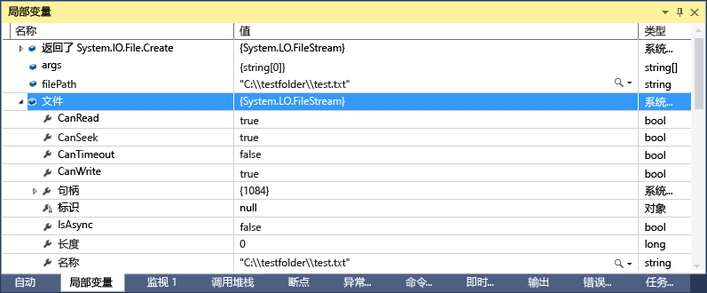

# <a name="inspect-variables-in-the-autos-and-locals-windows"></a>检查自动和局部变量窗口中的变量

在调试时，“自动变量”和“局部变量”窗口会显示变量值。仅在调试会话期间，这两个窗口才可用。“自动变量”窗口显示当前断点周围使用的变量。“局部变量”窗口显示在局部范围内定义的变量，通常是当前函数或方法。如果是首次尝试调试代码，那么在阅读本文前，可能需要阅读[面向初学者的调试](../debugger/debugging-absolute-beginners.md)和[通过编写更好的 C# 代码来修复 bug](../debugger/write-better-code-with-visual-studio.md)****************。

“自动变量”窗口可用于 C#、Visual Basic、C++ 和 Python 代码，但不可用于 JavaScript 或 F# **** 。

若要打开“自动变量”窗口，请在调试时依次选择“调试”>“窗口”>“自动变量”，或按 Ctrl+Alt+V > A******调试**************************。 

若要打开“局部变量”窗口，请在调试时选择“调试”>“窗口”>“局部变量”，或按 Alt+4************************ 。

> [!NOTE]
> 本主题适用于 Visual Studio Windows 版。对于 Visual Studio for Mac，请参阅 [Visual Studio for Mac 的数据可视化效果](/visualstudio/mac/data-visualizations)。

## <a name="use-the-autos-and-locals-windows"></a>使用自动和局部变量窗口

数组和对象在“自动变量”和“局部变量”窗口中显示为树形控件。选择变量名称左侧的箭头可展开视图，以显示字段和属性。以下是“局部变量”窗口中 <xref:System.IO.FileStream?displayProperty=fullName> 对象的示例************：



“局部变量”或“自动变量”窗口中的红色值表示自上次评估后值已更改。此更改可能是在上一个调试会话中进行的，也可能是在窗口中更改了值********。

调试器窗口中的默认数字格式为十进制。 若要将其更改为十六进制，请在“局部变量”或“自动”窗口中右键单击，然后选择“十六进制显示”。 此更改会影响所有调试器窗口。

## <a name="edit-variable-values-in-the-autos-or-locals-window"></a>编辑自动或局部变量窗口中的变量值

若要编辑“自动”或“局部变量”窗口中大多数变量的值，请双击该值并输入新值。

你可以输入表达式作为一个值，例如 `a + b`。 调试器接受大多数合法的语言表达式。

在本机 C++ 代码中，你可能需要限定变量名的上下文。 有关详细信息，请参阅[上下文运算符（C++）](../debugger/context-operator-cpp.md)。

>[!CAUTION]
>在更改值和表达式之前，请确保你了解其后果。一些可能存在的问题有：
>
>-   计算某些表达式可能会更改变量的值或以其他方式影响程序的状态。例如，计算 `var1 = ++var2` 会更改 `var1` 和 `var2` 的值。据说这些表达式具有[副作用](https://en.wikipedia.org/wiki/Side_effect_\(computer_science\))。如果你不了解这些副作用，则可能会导致意外结果。
>
>-   编辑浮点值时，由于要将小数部分从十进制转换为二进制，因此所得的结果可能存在微小误差。 甚至看起来无关紧要的编辑都能引起浮点变量中的位的某些更改。

## <a name="change-the-context-for-the-autos-or-locals-window"></a>更改“自动”或“局部变量”窗口的上下文

可使用“调试位置”工具栏选择所需的函数、线程或进程，这将更改“自动”和“局部变量”窗口的上下文。

若要启用“调试位置”工具栏，请单击工具栏区域的空白部分，然后从下拉列表中选择“调试位置”，或选择“视图”>“工具栏”>“调试位置”。

设置断点并开始调试。命中断点时，执行暂停，你可以在“调试位置”工具栏中看到相应位置。


## <a name="bkmk_whatvariables"></a>自动窗口中的变量（C#、C++、Visual Basic、Python）

 不同的代码语言在“自动”窗口中显示不同的变量。

 - 在 C# 和 Visual Basic 中，“自动”窗口显示当前或前一行中使用的任何变量。 例如，在C#或 Visual Basic 代码中，声明以下四个变量：

   ```csharp
       public static void Main()
       {
          int a, b, c, d;
          a = 1;
          b = 2;
          c = 3;
          d = 4;
       }
   ```

   在 `c = 3;` 行上设置断点并启动调试器。执行暂停时，“自动”窗口随即显示：

   

   `c` 的值为 0，因为尚未执行 `c = 3` 行。

 - 在 C++ 中，“自动”窗口显示在暂停执行的当前行之前至少三行中使用的变量。例如，在 C++ 代码中，声明六个变量：

   ```C++
       void main() {
           int a, b, c, d, e, f;
           a = 1;
           b = 2;
           c = 3;
           d = 4;
           e = 5;
           f = 6;
       }
   ```

    在 `e = 5;` 行设置断点并运行调试器。执行停止时，“自动”窗口随即显示：

    

    未初始化变量 `e`，因为尚未执行 `e = 5` 行。
    
## <a name="bkmk_returnValue"></a> 查看方法调用的返回值
 在.NET 和 C ++ 代码中，当单步调试或退出方法调用时，可以在“自动”窗口中检查返回值。如果方法调用返回值未保存在局部变量中，查看这些返回值会非常有用。方法可以用作参数或用作另一种方法的返回值。

例如，下面的 C# 代码将添加两个函数的返回值：

```csharp
static void Main(string[] args)
{
    int a, b, c, d;
    a = 1;
    b = 2;
    c = 3;
    d = 4;
    int x = sumVars(a, b) + subtractVars(c, d);
}

private static int sumVars(int i, int j)
{
    return i + j;
}

private static int subtractVars(int i, int j)
{
    return j - i;
}
```

要在“自动”窗口中查看 `sumVars()` 和 `subtractVars()` 方法调用的返回值，请执行以下操作：

1. 在 `int x = sumVars(a, b) + subtractVars(c, d);` 行上设置断点。  
   
1. 开始调试，当执行在断点处暂停时，选择“单步跳过”或按 F10。应该在“自动”窗口中看到以下返回值：
   
    
  
## <a name="see-also"></a>请参阅  
 [什么是调试？](../debugger/what-is-debugging.md)  
 [通过编写更优质的 C# 代码来修复 bug](../debugger/write-better-code-with-visual-studio.md)  
 [首先看一下调试](../debugger/debugger-feature-tour.md)[调试器窗口](../debugger/debugger-windows.md)
