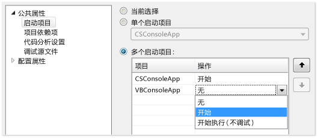
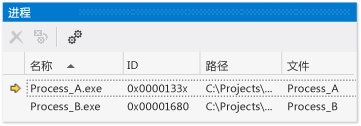

# 在 Visual Studio 中调试一个或多个进程
[!INCLUDE[vs2017banner](../code-quality/includes/vs2017banner.md)]

以下说明了如何启动调试进程、在进程之间切换、中断和继续执行、逐步执行源、停止调试以及终止进程或与进程分离。  
  
##   内容  
 [配置多个进程的执行行为](#BKMK_Configure_the_execution_behavior_of_multiple_processes)  
  
 [查找源文件和符号 (.pdb) 文件](#BKMK_Find_the_source_and_symbol___pdb__files)  
  
 [启动 VS 解决方案中的多个进程，附加到一个进程，然后自动启动调试器中的进程](#BKMK_Start_multiple_processes_in_a_VS_solution__attach_to_a_process__automatically_start_a_process_in_the_debugger)  
  
 [切换进程，中断并继续执行，逐步执行源](#BKMK_Switch_processes__break_and_continue_execution__step_through_source)  
  
 [停止调试进程、终止进程或与进程分离](#BKMK_Stop_debugging__terminate_or_detach_from_processes)  
  
##   配置多个进程的执行行为  
 默认情况下，当多个进程在调试器中运行时，中断、分步和停止调试器命令通常会影响所有进程。  例如，在断点处暂停一个进程时，所有其他进程的执行也会被暂停。  您可以更改此默认行为以获取对执行命令的目标的更多控制。  
  
1.  在**“调试”**菜单上，选择**“选项和设置”**。  
  
2.  在**“调试”**、**“常规”**页上，清除**“一个进程中断时则中断所有进程”**复选框。  
  
  [内容](#BKMK_Contents)  
  
##   查找源文件和符号 \(.pdb\) 文件  
 若要浏览进程的源代码，调试器需要访问进程的源文件和符号文件。  请参阅[指定符号 \(.pdb\) 和源文件](../debugger/specify-symbol-dot-pdb-and-source-files-in-the-visual-studio-debugger.md)。  
  
 如果您无法访问进程的文件，则可使用“反汇编”窗口进行导航。  请参阅[如何：使用“反汇编”窗口](../debugger/how-to-use-the-disassembly-window.md)  
  
  [内容](#BKMK_Contents)  
  
##   启动 VS 解决方案中的多个进程，附加到一个进程，然后自动启动调试器中的进程  
  
-   [开始调试 Visual Studio 解决方案中的多个进程](#BKMK_Start_debugging_multiple_processes_in_a_Visual_Studio_solution) • [更改启动项目](#BKMK_Change_the_startup_project) • [启动解决方案中的特定项目](#BKMK_Start_a_specific_project_in_a_solution) • [启动解决方案中的多个项目](#BKMK_Start_multiple_projects_in_a_solution) • [附加到进程](#BKMK_Attach_to_a_process) • [自动启动调试器中的进程](#BKMK_Automatically_start_an_process_in_the_debugger)  
  
> [!NOTE]
>  调试器不会自动附加到调试进程所启动的子进程中，即使子项目位于同一个解决方案中。  调试子进程：  
>   
>  -   在子进程启动后附加到该子进程。  
>   
>      \- 或 \-  
> -   配置 Windows 以自动启动调试器的新实例中的子进程。  
  
###   开始调试 Visual Studio 解决方案中的多个进程  
 如果您在 Visual Studio 解决方案中有多个可独立运行的项目（在独立进程中运行的项目），则可以选择调试器将启动的项目。  
  
   
  
####   更改启动项目  
 若要更改解决方案的启动项目，则在解决方案资源管理器中选择项目，然后从上下文菜单中选择**“设置为启动项目”**。  
  
####   启动解决方案中的特定项目  
 若要启动解决方案的项目而不更改默认启动项目，请在解决方案资源管理器中选择该项目，然后从上下文菜单中选择**“调试”**。  然后，您可以选择**“启动新实例”**或**“进入并单步执行新实例”**。  
  
  [启动 VS 解决方案中的多个进程，附加到一个进程，然后自动启动调试器中的进程](../debugger/debug-multiple-processes.md#BKMK_Start_multiple_processes_in_a_VS_solution__attach_to_a_process__automatically_start_a_process_in_the_debugger)  
  
  [内容](#BKMK_Contents)  
  
####   启动解决方案中的多个项目  
  
1.  在解决方案资源管理器中选择该解决方案，然后从上下文菜单中选择**“属性”**。  
  
2.  在**“属性”**对话框中，依次选择**“公共属性”**和**“启动项目”**。  
  
3.  对于要更改的每个项目，请选择**“启动”**、**“开始执行\(不调试\)”**或**“无”**。  
  
  [启动 VS 解决方案中的多个进程，附加到一个进程，然后自动启动调试器中的进程](../debugger/debug-multiple-processes.md#BKMK_Start_multiple_processes_in_a_VS_solution__attach_to_a_process__automatically_start_a_process_in_the_debugger)  
  
  [内容](#BKMK_Contents)  
  
###   附加到进程  
 调试器还可以附加到正在 Visual Studio 的外部运行的程序，包括在远程设备上运行的程序。  一旦附加到某个程序，就可以使用调试器执行命令、检查程序状态，等等。  检查程序的能力可能会受到某些限制，这取决于程序是否用调试信息生成，是否可以访问程序源代码，以及公共语言运行时 JIT 编译器是否在跟踪调试信息。  
  
 有关更多信息，请参见[附加到运行的进程](../debugger/attach-to-running-processes-with-the-visual-studio-debugger.md)。  
  
 **附加到本地计算机上运行的进程**  
  
 选择**“调试”**，**“附加到进程”**。  在**“附加到进程”**对话框中，从**“可用进程”**列表中选择进程，然后选择**“附加”**。  
  
   
  
  [内容](#BKMK_Contents)  
  
###   自动启动调试器中的进程  
 有时，您可能需要调试由另一个进程启动的程序的启动代码。  这样的示例包括服务和自定义设置操作。  在这些情况下，可以让调试器在应用程序启动时启动并自动附加。  
  
1.  启动注册表编辑器 \(**regedit.exe**\)。  
  
2.  导航到**“HKEY\_LOCAL\_MACHINE\\Software\\Microsoft\\Windows NT\\CurrentVersion\\Image File Execution Options”**文件夹。  
  
3.  选择要在调试器中启动的应用程序的文件夹。  
  
     如果该应用程序的名称未作为子文件夹列出，请选择**“Image File Execution Options”**，然后在上下文菜单中选择**“新建”**和**“项”**。  选择新项，在快捷菜单中选择**“重命名”**，然后输入应用程序名称。  
  
4.  在应用程序文件夹的上下文菜单中，选择**“新建”**和**“字符串值”**。  
  
5.  将新值的名称从 **New Value** 更改为 `debugger`。  
  
6.  在调试器项的上下文菜单上，选择**“修改”**。  
  
7.  在“编辑字符串”对话框中，在**“值数据”**框中键入 `vsjitdebugger.exe`。  
  
       
  
   
  
  [内容](#BKMK_Contents)  
  
##   切换进程，中断并继续执行，逐步执行源  
  
-   [在进程间切换](#BKMK_Switch_between_processes) • [中断、单步执行和继续命令](#BKMK_Break__step__and_continue_commands)  
  
###   在进程间切换  
 调试时可以附加到多个进程，但在任何给定时间，调试器中只有一个进程处于活动状态。  可以在调试位置工具栏或**“进程”**窗口中设置活动的或当前的进程。  若要在两个进程间切换，这两个进程必须处于中断模式。  
  
 **设置当前进程**  
  
-   在调试位置工具栏上，选择**“进程”**以查看**“进程”**列表框。  选择要指定为当前进程的进程。  
  
       
  
     如果**“调试位置”**工具栏不可见，则选择**“工具”**和**“自定义”**。  在**“工具栏”**选项卡上，选择**“调试位置”**。  
  
-   打开**“进程”**窗口（快捷方式为 **Ctrl\+Alt\+Z**），找到要设置为当前进程的进程，然后双击该进程。  
  
       
  
     当前进程用黄色箭头标记。  
  
 切换到一个项目会将该项目设置为用于调试目的的当前进程。  您查看的所有调试器窗口将显示当前进程的状态，并且所有单步执行命令将仅影响当前进程。  
  
  [切换进程，中断并继续执行，逐步执行源](../debugger/debug-multiple-processes.md#BKMK_Switch_processes__break_and_continue_execution__step_through_source)  
  
  [内容](#BKMK_Contents)  
  
###   中断、单步执行和继续命令  
  
> [!NOTE]
>  默认情况下，中断、继续和分步调试器命令会影响所有正在调试的进程。  若要更改此行为，请参阅[配置多个进程的执行行为](#BKMK_Configure_the_execution_behavior_of_multiple_processes)  
  
||||  
|-|-|-|  
|**命令**|**一个进程中断时则中断所有进程**   已选中（默认值）|**一个进程中断时则中断所有进程**   清除|  
|**“调试”**菜单：   -   **全部中断**|所有进程中断。|所有进程中断。|  
|**“调试”**菜单：   -   **Continue**|所有进程继续。|所有挂起的进程继续。|  
|**“调试”**菜单：   -   **逐语句** -   **逐过程** -   **跳出**|在当前进程单步执行时，所有进程将运行。   然后，所有进程中断。|当前进程单步执行。   已挂起的进程继续。   正在运行的进程继续。|  
|**“调试”**菜单：   -   **单步执行当前进程** -   **逐过程当前进程** -   **跳出当前进程**|不可用|当前进程单步执行。   其他进程保持其现有状态（挂起或运行）。|  
|源窗口   -   **断点**|所有进程中断。|仅源窗口进程中断。|  
|源窗口上下文菜单：   -   **运行到光标处**   源窗口必须在当前进程中。|当源窗口进程运行到光标处所有进程运行，然后中断。   然后，所有其他进程中断。|源窗口进程运行到光标处。   其他进程保持其现有状态（挂起或运行）。|  
|**“进程”**窗口上下文菜单：   -   **中断进程**|不可用|已选进程中断。   其他进程保持其现有状态（挂起或运行）。|  
|**“进程”**窗口上下文菜单：   -   **继续进程**|不可用|已选进程继续。   其他进程保持其现有状态（挂起或运行）。|  
  
  [切换进程，中断并继续执行，逐步执行源](../debugger/debug-multiple-processes.md#BKMK_Switch_processes__break_and_continue_execution__step_through_source)  
  
  [内容](#BKMK_Contents)  
  
##   停止调试进程、终止进程或与进程分离  
  
-   [停止、终止和分离命令](#BKMK_Stop__terminate__and_detach_commands)  
  
 默认情况下，在调试器中打开多个进程并选择**“调试”**和**“停止调试”**时，调试器将终止所有进程或与所有进程分离，具体取决于进程在调试器中的打开方式：  
  
-   如果在调试器中启动了当前进程，则该进程将终止。  
  
-   如果您已将调试器附加到当前进程，则调试器会与进程分离并使进程保持运行。  
  
 例如，如果从 Visual Studio 解决方案中开始调试进程，将其附加到另一个已运行的进程，然后选择**“停止调试”**，则调试会话将结束，在 Visual Studio 中启动的进程也会终止，而您附加的进程将保持运行。  您可以使用以下过程控制停止调试的方法。  
  
> [!NOTE]
>  **“一个进程中断时则中断所有进程”**选项不影响停止调试或终止进程以及与进程分离。  
  
 **更改停止调试影响单个进程的方式**  
  
-   打开**“进程”**窗口（快捷方式为 **Ctrl\+Alt\+Z**）。  选择一个进程，然后选中或清除**“调试停止时分离”**复选框。  
  
###   停止、终止和分离命令  
  
|||  
|-|-|  
|**命令**|**说明**|  
|**“调试”**菜单：   -   **停止调试**|除非行为被**“进程”**窗口中的**“在调试停止时分离”**选项更改，否则：   1.  调试器启动的进程将被终止。 2.  附加的进程将从调试器分离。|  
|**“调试”**菜单：   -   **全部终止**|所有进程将终止。|  
|**“调试”**菜单：   -   **全部分离**|调试器与所有进程分离。|  
|**“进程”**窗口上下文菜单：   -   **分离进程**|调试器与选定进程分离。   其他进程保持其现有状态（挂起或运行）。|  
|**“进程”**窗口上下文菜单：   -   **终止进程**|选定的进程将终止。   其他进程保持其现有状态（挂起或运行）。|  
|**“进程”**窗口上下文菜单：   -   **调试停止时分离**|切换所选进程的**“调试”**和**“停止调试”**行为：   -   已选中：调试器与进程分离。 -   清除：进程已终止。|  
  
  [停止调试进程、终止进程或与进程分离](../debugger/debug-multiple-processes.md#BKMK_Stop_debugging__terminate_or_detach_from_processes)  
  
  [内容](#BKMK_Contents)  
  
## 请参阅  
 [指定符号 \(.pdb\) 和源文件](../debugger/specify-symbol-dot-pdb-and-source-files-in-the-visual-studio-debugger.md)   
 [附加到运行的进程](../debugger/attach-to-running-processes-with-the-visual-studio-debugger.md)   
 [使用调试器浏览代码](../debugger/navigating-through-code-with-the-debugger.md)   
 [实时调试](../debugger/just-in-time-debugging-in-visual-studio.md)   
 [调试多线程应用程序](../debugger/debug-multithreaded-applications-in-visual-studio.md)