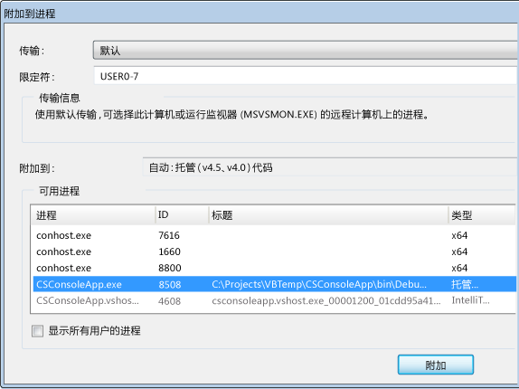
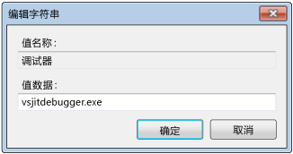

# 调试多个进程

Visual Studio 可以调试包含多个进程的解决方案。 可以启动和进程之间切换、 中断、 继续，并单步执行源、 停止调试和结束或从单个进程中分离。  

##  开始使用多个进程进行调试 

当 Visual Studio 解决方案中的多个项目可以独立运行时，您可以选择调试器启动哪些项目。 显示在当前启动项目中以粗体显示**解决方案资源管理器**。 

若要更改启动项目，在**解决方案资源管理器**，右键单击一个不同的项目，然后选择**设为启动项目**。

若要开始调试项目从**解决方案资源管理器**而不使其启动项目，右键单击项目，然后选择**调试** > **启动新实例**或**单步执行新实例**。 

**若要设置启动项目或多个项目从解决方案属性：**

1. 选择中的解决方案**解决方案资源管理器**，然后选择**属性**工具栏中或右键单击该解决方案中的图标，然后选择**属性**。  
   
1. 上**属性**页上，选择**通用属性** > **启动项目**。
   
     
   
1. 选择**当前所选内容**，**单启动项目**和项目文件，或**多个启动项目**。 

   如果选择**多个启动项目**，可以更改启动顺序和操作需要针对每个项目：**启动**，**启动但不调试**，或者**无**。  
   
1. 选择**Apply**，或**确定**应用并关闭对话框。 

###  附加到进程  

调试器还可以*附加*到在 Visual Studio，包括在远程设备上的外部进程中运行的应用。 附加到应用后，可以使用 Visual Studio 调试器。 调试功能可能会受到限制。 这取决于是否用调试信息生成应用程序、 是否有权访问应用的源代码，和 JIT 编译器是否正在跟踪调试信息。  
  
有关详细信息，请参阅[将附加到正在运行的进程](../debugger/attach-to-running-processes-with-the-visual-studio-debugger.md)。  
  
**附加到正在运行的进程：**  
  
1. 运行应用程序中，选择**调试** > **附加到进程**。 

     
  
1. 在中**附加到进程**对话框框中，选择从进程**可用进程**列表，并选择**附加**。  
  
>[!NOTE]
>调试器不会自动附加到调试进程所启动的子进程中，即使子项目位于同一个解决方案中。 若要调试子进程，请在启动后附加到子进程或配置 Windows 注册表编辑器中新的调试器实例启动子进程。  
  
###   使用注册表编辑器来自动在调试器中启动的进程  

有时，可能需要调试由另一个进程启动的应用的启动代码。 这样的示例包括服务和自定义设置操作。 您可以在调试器启动并自动附加到应用。 

1. 通过运行启动 Windows 注册表编辑器*regedit.exe*。  
   
1. 在注册表编辑器中，导航到**HKEY_LOCAL_MACHINE\Software\Microsoft\Windows NT\CurrentVersion\Image File Execution Options**。  
  
1. 选择要在调试器中启动的应用程序的文件夹。  
   
   如果应用未列出作为子文件夹，右键单击**Image File Execution Options**，选择**新建** > **密钥**，并键入应用名称。 或者，右键单击在树中，选择新的密钥**重命名**，然后输入应用名称。 
   
1. 右键单击在树中，选择新的密钥**新建** > **字符串值**。  
   
1. 中的新值的名称更改**新值 #1**到`debugger`。  
   
1. 右键单击**调试器**，然后选择**修改**。  
   
     
   
1. 在中**编辑字符串**对话框中，键入`vsjitdebugger.exe`中**数值数据**框，，然后选择**确定**。  
   
     
   
##   使用多个进程进行调试 
 

当调试包含多个进程的应用时，中断、 单步执行，并继续调试程序命令默认情况下影响所有进程。 例如，当进程在断点处挂起时，所有其他进程的执行还会挂起。 可更改此默认行为以获取对执行命令的目标的更多控制。  

**若要更改是否所有进程将被都挂起一个进程中断时：**

- 下**工具**(或**调试**) >**选项** > **调试** > **常规**，选中或清除**一个进程中断时则中断所有进程**复选框。  
  
###  中断、单步执行和继续命令  
  
下表介绍的调试行为的命令时**一个进程中断时则中断所有进程**选择或取消选择复选框：

|**命令**|已选定|取消选择|  
|-|-|-|  
|**调试**  > **全部中断**|所有进程中断。|所有进程中断。|  
|**调试** > **继续**|所有进程继续。|所有挂起的进程继续。|  
|**调试** > **单步执行**，**单步跳过**，或**跳出**|在当前进程单步执行时，所有进程将运行。  然后，所有进程中断。|当前进程单步执行。  已挂起的进程继续。  正在运行的进程继续。|  
|**调试** > **单步执行当前进程**，**逐过程执行当前进程**，或**跳出当前进程**|不可用|当前进程单步执行。 其他进程保持其现有状态（挂起或运行）。|  
|源窗口**断点**|所有进程中断。|仅源窗口进程中断。|  
|源窗口**运行到光标处** 源窗口必须在当前进程中。|当源窗口进程运行到光标处所有进程运行，然后中断。 然后，所有其他进程中断。|源窗口进程运行到光标处。 其他进程保持其现有状态（挂起或运行）。|  
|**进程**窗口 >**中断进程**|不可用|已选进程中断。 其他进程保持其现有状态（挂起或运行）。|  
|**进程**窗口 >**继续进程**|不可用|已选进程继续。 其他进程保持其现有状态（挂起或运行）。|  

###  查找源文件和符号 (.pdb) 文件  
若要导航的进程的源代码，调试器需要访问其源文件和符号文件。 有关详细信息，请参阅[指定符号 (.pdb) 和源文件](../debugger/specify-symbol-dot-pdb-and-source-files-in-the-visual-studio-debugger.md)。  
  
如果无法访问进程的文件，可以通过使用导航**反汇编**窗口。 有关详细信息，请参阅[如何： 使用反汇编窗口](../debugger/how-to-use-the-disassembly-window.md)。  

###  在进程之间切换  

当你进行调试时，但在任何给定时间只有一个进程处于调试器中处于活动状态时，可以附加到多个进程。 可以在“调试位置”工具栏或“进程”窗口中设置活动的或当前的进程。 若要在两个进程间切换，这两个进程必须处于中断模式。  
  
**若要设置从调试位置工具栏上的当前进程：**  
  
1. 若要打开**调试位置**工具栏中，选择**视图** > **工具栏** > **调试位置**。  
   
1. 在调试期间，在**调试位置**工具栏上，选择想要设置为当前进程的进程**进程**下拉列表。  
  
     
  
**若要从进程窗口中设置当前进程：**  
  
1. 若要打开**进程**窗口中的，调试时，选择**调试** > **Windows** > **进程**。 

1. 在中**进程**黄色箭头标记窗口中，当前进程。 双击想要设置为当前进程的进程。  
  
     

切换到的进程可将其设置为当前进程以供调试目的。 调试器窗口显示当前进程的状态和单步执行命令的影响不仅仅是当前进程。  
  
## 停止使用多个进程进行调试  
  
默认情况下，当您选择**调试** > **停止调试**，调试器结束或与所有进程分离。 
  
- 如果当前进程在调试器中启动，则会结束进程。  
  
- 如果您已将调试器附加到当前进程，则调试器会与进程分离并使进程保持运行。  
  
如果在开始调试 Visual Studio 解决方案中的进程，然后将附加到已在运行，另一个进程，然后选择**停止调试**，则调试会话将结束。 已结束，在 Visual Studio 中启动的进程，而附加到的进程将保持运行。 

若要控制的方式的**停止调试**影响单个进程，在**进程**窗口中，右键单击进程，然后选中或清除**调试停止时分离**复选框。  
  
>[!NOTE]
>**一个进程中断时则中断所有进程**调试器选项不影响停止、 终止或与进程分离。  
  
###  停止、终止和分离命令  
  
下表介绍调试器停止的行为、 终止和分离命令使用多个进程： 

|**命令**|**说明**|  
|-|-| 
|**调试** > **停止调试**|除非行为更改中，否则**进程**窗口中，由调试器启动的进程，则将结束，并附加的进程分离。|  
|**调试** > **全部终止**|所有进程都将都断开。|  
|**调试** > **全部分离**|调试器与所有进程分离。|  
|**进程**窗口 >**分离进程**|调试器与选定进程分离。 其他进程保持其现有状态（挂起或运行）。|  
|**进程**窗口 >**终止进程**|所选的进程会结束。 其他进程保持其现有状态（挂起或运行）。|  
|**进程**窗口 >**调试停止时分离**|如果选择，请**调试** > **停止调试**与所选的进程分离。  如果未选择，**调试** > **停止调试**结束所选的进程。 |  
## 请参阅  
 [指定符号 (.pdb) 和源文件](../debugger/specify-symbol-dot-pdb-and-source-files-in-the-visual-studio-debugger.md)   
 [附加到正在运行的进程](../debugger/attach-to-running-processes-with-the-visual-studio-debugger.md)   
 [使用调试器浏览代码](../debugger/navigating-through-code-with-the-debugger.md)   
 [实时调试](../debugger/just-in-time-debugging-in-visual-studio.md)   
 [调试多线程应用程序](../debugger/debug-multithreaded-applications-in-visual-studio.md)