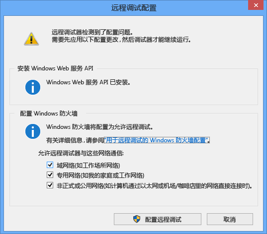

---
translation.priority.ht:
- cs-cz
- de-de
- es-es
- fr-fr
- it-it
- ja-jp
- ko-kr
- pl-pl
- pt-br
- ru-ru
- tr-tr
- zh-cn
- zh-tw
ms.openlocfilehash: 05a288a2d8dff776d8a5d3faea47b06d101f2ea3
ms.sourcegitcommit: aadb9588877418b8b55a5612c1d3842d4520ca4c
ms.translationtype: MT
ms.contentlocale: zh-CN
ms.lasthandoff: 10/27/2017
---
你必须在远程计算机上具有管理权限。  
  
1.  定位远程调试器应用程序。 (其中已安装它的位置中找到 msvsmon.exe 或打开的开始菜单和搜索**远程调试器**。)
  
     如果你远程服务器上运行远程调试器，可以右键单击远程调试器应用并选择**以管理员身份运行**。 如果你不远程服务器上运行它，只是它正常启动。
  
3.  当启动远程工具，第一次 （或之前已配置），则**远程调试配置**对话框随即出现。  
  
       
  
4.  如果 Windows 服务 API 未安装 （这种情况仅在 Windows Server 2008 R2 上），选择**安装**按钮。  
  
5.  选择你想要在上面使用远程工具的网络类型。 必须至少选择一种网络类型。 如果这些计算机通过域连接，则必须选择第一项。 如果这些计算机通过工作组或家庭组连接，你需要视情况选择第二或第三项。  
  
6.  选择**配置远程调试**，配置防火墙并启动该工具。  
  
7.  配置完成后，将显示远程调试器窗口。
  
     
  
     远程调试器现在正在等待连接。 记下的服务器名称和端口号，将显示，因为它必须匹配更高版本使用 Visual Studio 中的配置。  
  
 完成调试和需要停止远程调试器后，，单击**文件 > 退出**窗口上。 你可以重新启动它从**启动**菜单或从命令行：  
  
 **\<Visual Studio 安装目录 > \Common7\IDE\Remote 调试器\\< x86，x64，or Appx\msvsmon.exe**。  