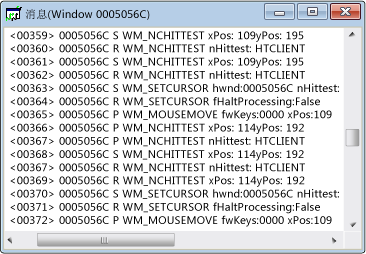

# Messages View
[!INCLUDE[vs2017banner](../code-quality/includes/vs2017banner.md)]

每个窗口都有一个关联的消息流。  消息视图窗口会显示此消息流。  其中显示窗口句柄、消息代码和消息。  您也可以为线程或进程创建消息视图。  这样，您将可以查看发送到特定进程或线程拥有的所有窗口的消息，这对于捕获窗口初始化消息尤其有用。  
  
 下面显示了一个典型的消息视图窗口。  请注意，第一列包含窗口句柄，第二列包含消息代码（在[消息代码](../debugger/message-codes.md)中进行了说明）。  已解码的消息参数和返回值显示在右侧。  
  
   
Spy\+\+ 消息视图  
  
## 过程  
  
#### 打开窗口、进程或线程的消息视图  
  
1.  将焦点移动到[窗口视图](../debugger/windows-view.md)、[进程视图](../debugger/processes-view.md)或[线程视图](../debugger/threads-view.md)窗口上。  
  
2.  找到要检查其消息的项的节点，并选中该节点。  
  
3.  从“监视”菜单中选择“日志消息”。  
  
     [“消息选项”对话框](../debugger/message-options-dialog-box.md)随即打开。  
  
4.  为要显示的消息选择选项。  
  
5.  按“确定”开始记录消息。  
  
     消息视图窗口随即打开，并且会向 Spy\+\+ 工具栏添加“消息”菜单。  根据所选的选项，消息开始流入活动的消息视图窗口。  
  
6.  当您得到足够多的消息后，从“消息”菜单中选择“停止记录”。  
  
## 本节内容  
 [控制消息视图](../debugger/how-to-control-messages-view.md)  
 说明如何管理消息视图。  
  
 [从查找窗口打开消息视图](_asug_choosing_message_options)  
 说明如何在“查找窗口”对话框中打开消息视图。  
  
 [在消息视图中搜索消息](../Topic/How%20to:%20Search%20for%20a%20Message%20in%20Messages%20View.md)  
 说明如何在消息视图中查找特定消息。  
  
 [开始和停止消息日志显示](../debugger/how-to-start-and-stop-the-message-log-display.md)  
 说明如何开始和停止记录消息。  
  
 [消息代码](../debugger/message-codes.md)  
 定义消息视图中列出的消息代码。  
  
 [显示消息属性](../debugger/how-to-display-message-properties.md)  
 如何显示有关消息的更多信息。  
  
## 相关章节  
 [Spy\+\+ 视图](../debugger/spy-increment-views.md)  
 说明窗口、消息、进程和线程的 Spy\+\+ 树视图。  
  
 [使用 Spy\+\+](../debugger/using-spy-increment.md)  
 介绍 Spy\+\+ 工具并说明如何使用。  
  
 [“消息选项”对话框](../debugger/message-options-dialog-box.md)  
 用于选择要在活动消息视图中列出的消息。  
  
 [“消息搜索”对话框](../debugger/message-search-dialog-box.md)  
 用于在消息视图中查找特定消息的节点。  
  
 [“消息属性”对话框](../debugger/message-properties-dialog-box.md)  
 用于显示在消息视图中选择的消息的属性。  
  
 [Spy\+\+ 参考](../debugger/spy-increment-reference.md)  
 包含描述各个 Spy\+\+ 菜单和对话框的章节。