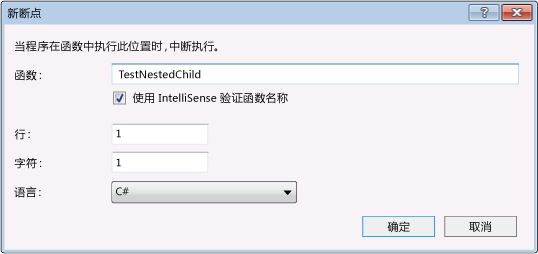

# <a name="navigate-through-code-with-the-visual-studio-debugger"></a>使用 Visual Studio 调试器浏览代码

Visual Studio 调试器可以帮助你浏览代码以检查应用的状态并显示其执行流。 可以使用键盘快捷方式、 调试命令、 断点以及其他功能来快速访问你想要检查的代码。 熟悉的调试器导航命令和快捷方式可以更快、 更轻松地查找和解决应用程序问题。  如果这是你在尝试调试的代码的第一个时间，可能需要阅读[通过编写更好地修复 bugC#代码](../debugger/write-better-code-with-visual-studio.md)并[零基础调试](../debugger/debugging-absolute-beginners.md)之前开始阅读本文。
  
## <a name="basic-debugging"></a>基础调试  

若要启动附有调试器的应用程序，按**F5**，选择**调试** > **开始调试**，或者在 Visual Studio 工具栏中选择绿色箭头。  
  
   
  
当你进行调试时，黄色突出显示框显示了将执行下一步的代码行。  
  
   
  
大多数调试器窗口，如**模块**并**监视**仅运行调试器时，窗口，可用于。 一些调试器的功能，如查看中的变量值**局部变量**窗口或在中计算表达式**监视**窗口中，仅当调试器在断点，也称为处暂停时可用*中断模式下*。 

在中断模式下，应用执行挂起时变量、 函数和对象保留在内存中。 您可以检查元素的位置和状态，以查看存在冲突或 bug。 对于某些项目类型，您还可以在中断模式下应用所做的调整。 有关演示这些功能的视频，请参阅[开始使用调试器](https://www.youtube.com/watch?v=FtGCi5j30YU&list=PLReL099Y5nRfw6VNvzMkv0sabT2crbSpK&index=6)。

如果中断在代码中，因此没有源或符号 (*.pdb*) 加载的文件，调试器将显示**未找到源文件**或**找不到符号**可以帮助您的页面查找并加载这些文件。 请参阅[指定符号 (.pdb) 和源文件](../debugger/specify-symbol-dot-pdb-and-source-files-in-the-visual-studio-debugger.md)。 如果无法加载的符号或源文件的文件，您仍然可以调试中的程序集指令**反汇编**窗口。 

始终无需启动通过启动应用程序在开始调试。 此外可以按**F11**到[单步执行代码](#BKMK_Step_into__over__or_out_of_the_code)，按**F10**到[逐过程执行代码](#BKMK_Step_over_Step_out)，或[运行到特定位置或函数](#BKMK_Break_into_code_by_using_breakpoints_or_Break_All)。    

##  <a name="step-through-code"></a>逐行执行代码

调试器单步执行命令帮助你检查应用的状态或了解有关其执行流的详细信息。 

如果你需要在应用中查找的入口点，请先使用**F10**或**F11**。  

### <a name="BKMK_Step_into__over__or_out_of_the_code"></a> 单步执行代码  

若要停止的代码或调试时的语句每一行上，使用**调试** > **单步执行**，或按**F11**。  

调试器逐句通过代码语句，不是物理行。 例如，`if` 子句可以写在一行内：  
  
  ```csharp  
  int x = 42;  
  string s = "Not answered";  
  if( int x == 42) s = "Answered!";  
  ```  
  
  ```vb  
  Dim x As Integer = 42  
  Dim s As String = "Not answered"  
  If x = 42 Then s = "Answered!"  
  ```  

但是，当单步执行此行时，调试器将该条件视为一个步骤中，并将结果视为另一个。 在前面的示例中，条件为 true。  
  
在嵌套函数调用上， **“逐语句”** 将进入并单步执行嵌套最深的函数。 例如，如果您使用**单步执行**上如下所示`Func1(Func2())`，调试器单步执行函数`Func2`。  

>[!TIP]
>执行每行代码，你可以悬停在变量，以查看它们的值，或者可以使用[局部变量](autos-and-locals-windows.md)并[监视](watch-and-quickwatch-windows.md)监视更改的值。 你可以单步执行函数时还直观地跟踪调用堆栈。 请参阅[调试时映射调用堆栈上的方法](../debugger/map-methods-on-the-call-stack-while-debugging-in-visual-studio.md)。 

###  <a name="BKMK_Step_over_Step_out"></a> 单步执行代码并跳过某些函数  

您可能不关心函数同时调试，或者您知道工作方式，类似于经过全面测试的库代码。 可以使用以下命令以跳过代码。 仍可以执行函数，但调试器跳过它们。  
  
|键盘命令|调试菜单命令|描述|  
|----------------------|------------------|-----------------|  
|**F10**|**逐过程**|如果当前行包含函数调用中，**单步跳过**运行代码，然后在被调用的函数返回之后，在第一行代码处挂起执行。|  
|Shift+F11|**跳出**|**单步跳出**会继续运行代码，当前函数返回时挂起执行。 通过当前函数，调试器会跳过。|  
  
##  <a name="BKMK_Break_into_code_by_using_breakpoints_or_Break_All"></a> 运行到特定位置或函数  

您可能更愿意时知道你想要检查，具体的代码直接向特定位置或函数运行或者您知道你想要开始调试。  
  
### <a name="run-to-a-breakpoint-in-code"></a>运行到代码中的断点  
  
若要在代码中设置简单断点，请单击你想要挂起执行的代码行旁边的最左侧的边距。 您还可以选择行，然后按**F9**，选择**调试** > **切换断点**，或右键单击并选择**断点** > **插入断点**。 断点显示为一个代码行旁的左边距中的红点。 执行行之前，调试器挂起执行。
  
  
  
Visual Studio 中的断点提供了一组丰富的附加功能，例如条件断点和跟踪点。 有关详细信息，请参阅[使用断点](../debugger/using-breakpoints.md)。  
  
### <a name="run-to-a-function-breakpoint"></a>运行到函数断点  

可以让调试器在运行，直至到达指定的函数。 可以通过名称指定函数，也可以从调用堆栈中选择函数。  
  
**若要按名称指定函数断点**

1. 选择**调试** > **新断点** > **函数断点**
   
1. 在中**新函数断点**对话框中，键入函数的名称，并选择其语言。
   
     
   
1. 选择“确定”。 

如果该函数已超载，或者在多个命名空间，你可以选择在所的需**断点**窗口。  

  
  
**若要从调用堆栈中选择函数断点** 
  
1. 调试时，打开**调用堆栈**通过选择窗口**调试** > **Windows** > **调用堆栈**。 
   
1. 在中**调用堆栈**窗口中，右键单击一个函数，然后选择**运行到光标处**，或按**Ctrl**+**F10**。  

若要直观地跟踪调用堆栈，请参阅[调试时映射调用堆栈上的方法](../debugger/map-methods-on-the-call-stack-while-debugging-in-visual-studio.md)。  
  
### <a name="run-to-a-cursor-location"></a>运行到光标位置  

若要运行到光标所在的位置，在源代码中或**调用堆栈**窗口中，选择你想要在处中断，右键单击并选择的行**运行到光标处**，或按**Ctrl** +**F10**。 选择**运行到光标处**如同设置临时断点。

### <a name="run-to-click"></a>运行时单击 

在调试器中暂停时，你可以悬停在源代码中的语句或**反汇编**窗口中，然后选择**执行运行到此处**绿色箭头图标。 使用**运行时单击**无需设置临时断点。

 

> [!NOTE]
> **运行时单击**中的新[!include[vs_dev15](../misc/includes/vs_dev15_md.md)]。
  
### <a name="manually-break-into-code"></a>手动中断代码  
  
若要中断下一个可用的正在运行的应用中的代码行中，选择**调试** > **全部中断**，或按**Ctrl**+**Alt** +**中断**。 
  
##  <a name="BKMK_Set_the_next_statement_to_execute"></a> 移动指针以更改执行流  

调试器暂停时，对源代码的边距中的黄色箭头或**反汇编**窗口标记要执行的下一个语句的位置。 你可以通过移动此箭头执行的下一个语句。 可以跳过了一部分代码，或返回到上一代码行。 移动指针可用于如跳过包含已知的 bug 的代码部分的情况。  

 
  
若要更改要执行的下一个语句，调试器必须处于中断模式。 在源代码中或**反汇编**窗口中，将黄色箭头拖到不同的行，或右键单击你想要执行的下和选择的行**设置下一语句**。 

程序计数器直接跳转到新位置，并说明旧的和新执行点不会执行之间。 但是，如果向后移动执行点，则不撤消插入的指令。  

>[!CAUTION]
>- 将下一条语句移动到另一个函数或范围通常会导致调用堆栈损坏，导致一个运行时错误或异常。 如果尝试将下一条语句移动到另一个范围，则调试器将打开一个含有警告的对话框，并提供一个取消该操作的机会。 
>- 在 Visual Basic 中，不能将下一条语句移动到另一个范围或函数。  
>- 在本机 C++ 中，如果已启用运行时检查，设置下一条语句会导致执行到达方法的结尾时引发异常。  
>- 当启用“编辑并继续”时，如果你进行了“编辑并继续”无法立即重新映射的编辑，那么 **“设置下一语句”** 将失败。 例如，如果你编辑了 catch 块中的代码，将发生这种情况。 在此情况下，会显示错误消息，告知你不支持该操作。  
>- 在托管代码中，您不能移动下一个语句，如果：  
>   - 下一条语句与当前语句不在同一个方法中。  
>   - 在实时调试启动调试。  
>   - 正在进行的调用堆栈展开。  
>   - 已引发一个 System.StackOverflowException 或 System.Threading.ThreadAbortException 异常。  
  
## <a name="BKMK_Restrict_stepping_to_Just_My_Code"></a>调试非用户代码  

默认情况下，调试器尝试通过启用名为设置调试仅应用程序代码*仅我的代码*。 有关对不同项目类型和语言，此功能工作原理以及如何自定义它的更多详细信息，请参阅[仅我的代码](../debugger/just-my-code.md)。 

若要在调试时看一下 framework 代码、 第三方库代码中或系统调用，可以禁用仅我的代码。 在中**工具**(或**调试**) >**选项** > **调试**，则清除**启用 '仅我的代码'** 复选框。 当禁用仅我的代码时，调试器窗口中显示非用户代码，调试器可以单步执行非用户代码。  

> [!NOTE]
> 设备项目不支持“仅我的代码”。  
  
### <a name="debug-system-code"></a>调试系统代码

如果已加载的调试符号的 Microsoft 系统代码，并禁用仅我的代码，您可以单步执行系统调用中，正如其他任何调用。  
  
若要加载 Microsoft 符号，请参阅[配置符号位置和加载选项](specify-symbol-dot-pdb-and-source-files-in-the-visual-studio-debugger.md#configure-symbol-locations-and-loading-options)。  
  
**若要加载特定系统组件的符号：**

1. 当你进行调试时，打开**模块**通过选择窗口**调试** > **Windows** > **模块**，或按**Ctrl**+**Alt**+**U**。  
  
1. 在中**模块**窗口中，您可以知道该模块具有中加载符号**符号状态**列。 右键单击你想要加载符号，然后选择该模块**加载符号**。  
  
##  <a name="BKMK_Step_into_properties_and_operators_in_managed_code"></a> 单步执行托管代码中的属性和运算符  
 默认情况下，调试器将逐过程执行托管代码中的属性和运算符。 在多数情况下，这会提供较好的调试体验。 若要启用单步执行属性或运算符，请选择**调试** > **选项**。 在“调试” > “常规”页面上，清除“逐过程执行属性和运算符(仅限托管)”复选框。

## <a name="see-also"></a>请参阅
 [什么是调试？](../debugger/what-is-debugging.md)  
 [通过编写更优质的 C# 代码来修复 bug](../debugger/write-better-code-with-visual-studio.md)  
 [首先看一下调试](../debugger/debugger-feature-tour.md) 
