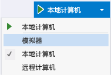

# 刷新 Visual Studio 中的 UWP 应用
  
 你进行调试，然后刷新通过选择使用 JavaScript UWP 应用时，可以对你的代码进行更改**刷新 Windows 应用程序**按钮上**调试**工具栏。 选择此按钮将重新加载应用程序，但不会停止并重新启动调试器。 通过“刷新”功能，可修改 HTML、CSS 和 JavaScript 代码并迅速看到结果。 适用于 UWP 应用支持此功能。  
  
 刷新功能不保持应用程序状态，也不反映对应用程序的以下更改：  
  
-   程序包清单文件更改，其中包括对程序包清单中指定图像的更改。  
  
-   引用更改（如添加或移除 SDK 引用）或 Windows 运行时组件（.winmd 文件）更改。  
  
-   资源更改，如对 .resjson 文件中字符串的更改。  
  
-   导致路径名更改、新建项目文件或删除文件的项目文件更改。  
  
-   项目和项属性更改（如对所选调试设备的更改）或对文件的程序包操作的更改（在“属性”窗口中）。  
  
> [!IMPORTANT]
>  在更改引用或包清单或者进行上面的列表中指定的其他更改时，必须停止并重新启动调试器以更新 HTML、CSS 和 JavaScript 源文件。  
  
### 刷新应用程序  
  
1.  使用 Visual Studio 中打开你 UWP 项目中，选择**本地计算机**作为调试目标。
  
       
  
3.  按 F5 以在调试模式下运行应用程序。  
  
4.  切换到 Visual Studio。 
  
5.  在 UWP 应用的主页页中，编辑一些 HTML。
  
7.  单击**刷新 Windows 应用程序**按钮，如下所示像这样：。 （或按 F4。）  
  
8.  切换到该应用程序。 重新加载应用程序和更新的 HTML 用于呈现应用程序。
  
## 请参阅  
 [快速入门：调试 HTML 和 CSS](../debugger/quickstart-debug-html-and-css.md)