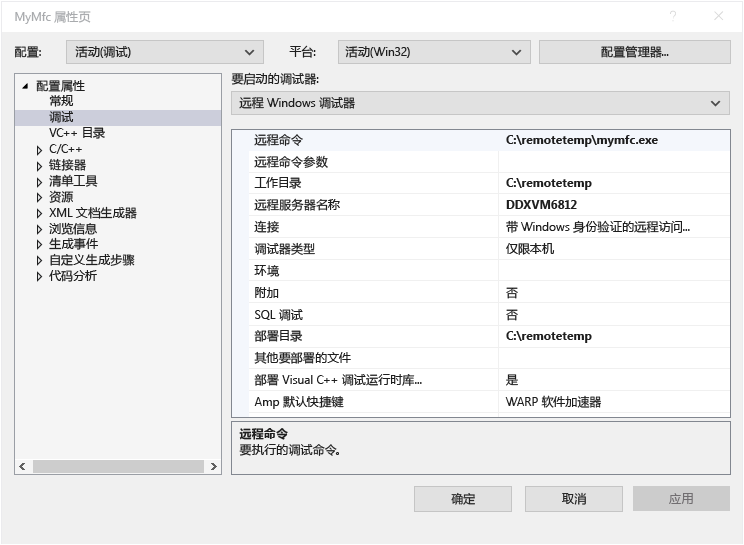

# 远程调试 Visual Studio 中的 Visual c + + 项目
若要调试 Visual Studio 应用程序的其他计算机上，安装，并在计算机上运行远程工具将在其中部署您的应用程序配置你的项目，以从 Visual Studio 中，连接到远程计算机然后部署并运行你的应用。

有关远程调试通用 Windows 应用 (UWP) 的信息，请参阅[调试安装的应用程序包](debug-installed-app-package.md)。

## 惠?

远程调试器都支持 Windows 7 和更高版本 (不 phone) 和从 Windows Server 2008 Service Pack 2 的 Windows Server 版本。 有关要求的完整列表，请参阅[要求](../debugger/remote-debugging.md#requirements_msvsmon)。

> [!NOTE]
> 不支持调试通过代理连接的两台计算机之间。 国家/地区中调试通过高延迟或低带宽连接，如拨号 Internet，或通过 Internet 不建议和可能失败也是非常慢。
  
## 下载并安装远程工具

[!INCLUDE [remote-debugger-download](../debugger/includes/remote-debugger-download.md)]
  
> [!TIP]
> 在某些情况下，它可以从文件共享运行远程调试器方式效率最高。 有关详细信息，请参阅[从文件共享运行远程调试器](../debugger/remote-debugging.md#fileshare_msvsmon)。
  
## 设置远程调试器

[!INCLUDE [remote-debugger-configuration](../debugger/includes/remote-debugger-configuration.md)]

> [!NOTE]
> 如果你需要添加其他用户的权限更改身份验证模式中，或者远程调试器端口号，请参阅[配置远程调试器](../debugger/remote-debugging.md#configure_msvsmon)。

## 远程调试 Visual c + + 项目  
 在下面的过程的名称和路径的项目是 C:\remotetemp\MyMfc，和远程计算机的名称是**MJO DL**。  
  
1.  创建 MFC 应用程序名为**mymfc。**  
  
2.  中的应用程序容易到达，例如，在某处设置断点**MainFrm.cpp**，开始时`CMainFrame::OnCreate`。  
  
3.  在解决方案资源管理器，右键单击项目并选择**属性**。 打开**调试**选项卡。  
  
4.  设置**要启动的调试器**到**远程 Windows 调试器**。  
  
       
  
5.  对属性进行以下更改：  
  
    |设置|“值”|
    |-|-|  
    |远程命令|C:\remotetemp\mymfc.exe|  
    |工作目录|C:\remotetemp|  
    |远程服务器名称|MJO DL:*端口号*|  
    |连接|带 Windows 身份验证的远程访问|  
    |调试器类型|仅限本机|  
    |部署目录|C:\remotetemp。|  
    |其他要部署的文件|C:\data\mymfcdata.txt。|  
  
     如果你部署其他文件 （可选），该文件夹必须存在两台计算机上。  
  
6.  在解决方案资源管理器，右键单击该解决方案并选择**Configuration Manager**。  
  
7.  有关**调试**配置，请选择**部署**复选框。  
  
       
  
8.  开始调试 (**调试 > 启动调试**，或**F5**)。  
  
9. 可执行文件会自动部署到远程计算机。  
  
10. 如果出现提示，输入用于连接到远程计算机的网络凭据。  
  
     特定于你的网络安全配置所需的凭据。 例如，在域计算机上，可能会选择一个安全证书或输入你的域用户名和密码。 在非域计算机上，你可以输入计算机名和有效的用户帐户名称，如 **MJO-DL\name@something.com** ，以及正确的密码。  
  
11. 在 Visual Studio 计算机上，你应看到在断点处已停止执行。  
  
    > [!TIP]
    >  或者，你可以采用单独的步骤部署文件。 在**解决方案资源管理器，**右键单击**mymfc**节点，然后选择**部署**。  
  
 如果具有需要由应用程序使用的非代码文件，则需要将其包含在 Visual Studio 项目中。 创建为其他文件的项目文件夹 (在**解决方案资源管理器**，单击**添加 > 新文件夹**。)然后将文件添加到的文件夹 (在**解决方案资源管理器**，单击**添加 > 现有项**，然后选择的文件)。 上**属性**对于每个文件页上，设置**复制到输出目录**到**始终复制**。
  
## 使用远程符号设置调试 

[!INCLUDE [remote-debugger-symbols](../debugger/includes/remote-debugger-symbols.md)] 
  
## 请参阅  
 [在 Visual Studio 中进行调试](../debugger/index.md)  
 [调试器功能简介](../debugger/debugger-feature-tour.md)   
 [配置 Windows 防火墙以允许远程调试](../debugger/configure-the-windows-firewall-for-remote-debugging.md)   
 [远程调试器端口分配](../debugger/remote-debugger-port-assignments.md)   
 [远程调试远程 IIS 计算机上的 ASP.NET](../debugger/remote-debugging-aspnet-on-a-remote-iis-computer.md)  
 [远程调试错误和疑难解答](../debugger/remote-debugging-errors-and-troubleshooting.md)