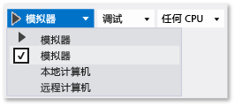

# 在模拟器中运行的 UWP 和 Windows 8.1 应用
UWP 和 Windows 8.1 应用程序的 Visual Studio 模拟器是一个可模拟 UWP 或 Windows 8.1 应用程序的桌面应用程序。 你可以运行应用程序选择的物理屏幕大小和你想要模拟的分辨率。 此外可以模拟常用的触摸和旋转事件，并模拟网络连接属性。
  
 模拟器提供在其中可以设计、 开发、 调试和测试 UWP 应用的环境。 但是，将应用发布到 Microsoft 应用商店之前，你应测试您实际设备上的应用程序。  
  
 不，本地计算机上的独立环境中对适用于 UWP 应用的 Visual Studio 模拟器不会运行。 因此，模拟器中发生的错误（如不可恢复的系统范围错误）也会影响整个计算机。  
  
 有关 Windows Phone 的信息，请参阅 [Run Windows Phone apps in the emulator](../debugger/run-windows-phone-apps-in-the-emulator.md) 。  
  
> [!IMPORTANT]
>  Visual Studio 2015 模拟器不包括地理位置按钮。 这是因为 Windows 10 模拟器中不包含地理位置模拟。 如果需要进行这种类型的模拟，则可以在 Windows 8.1 或更早的操作系统上使用 Visual Studio 2013 模拟器。  
  
##   设置模拟器作为目标  
 若要在模拟器中运行 UWP 应用，选择**模拟器**下拉列表中下一步**启动调试**上调试器按钮**标准**工具栏。  
  
   
  
##   选择交互模式  
 可以选择下列交互模式  
  
-   鼠标模式： 将交互模式设置为鼠标手势。 鼠手势包括单击、双击和拖动。  
  
-   开始触摸仿真： 将交互模式为单指的触摸手势设置。 单指事件包括点击、拖动和轻扫。  
  
     单目标图标指示事件在模拟器中的位置。 使用鼠标为指针定位。  
  
     按鼠标左键以激活触摸模式。 例如，单击按钮以模拟点击，或按住该按钮以模拟拖动或轻扫。  
  
## 捏合与缩放  
 将交互模式设置为双指的捏合与缩放手势。  
  
-     
  
     双目标图标指示双指在设备屏幕上的位置。  
  
    -   移动鼠标以将图标放置在设备屏幕上的对象上。  
  
    -   在捏合或缩放之前，向前或向后滚动鼠标滚轮以更改双指的模拟距离。  
  
-   -     
  
         按左键并向后旋转滚轮（朝向你）以缩小（捏合）。  
  
    -   按左键并向前旋转鼠标滚轮（远离你）以放大（缩放）。  
  
## 对象旋转  
 
             **** “触摸仿真旋转”按钮将交互模式设置为使用双指的旋转手势。  
  
-   -   移动鼠标以将图标放置在设备屏幕上的对象上。  
  
    -   在旋转对象之前，向前或向后滚动鼠标滚轮以更改双指的模拟方向。  
  
-   -   按左键并向后旋转滚轮（朝向你）以逆时针旋转对象。 在旋转鼠标滚轮时，两个目标图标中的一个围绕另一个旋转以指示旋转的相对大小。  
  
    -   按左键并向前旋转鼠标滚轮（远离你）以顺时针旋转对象。  
  
##   启用或禁用“总在最前面”模式  
 可将模拟器窗口设置为始终位于其他窗口之上。  “切换最顶端窗口”按钮启用或禁用模拟器窗口的“总在最前面”  模式。  
  
##   更改设备方向  
 可通过以任意方向将模拟器旋转 90 度，在纵向与横向之间切换设备方向。  
  
> [!NOTE]
>  模拟器不遵从项目的 [DisplayProperties.AutoRotationPreferences](http://go.microsoft.com/fwlink/?LinkId=249460) 属性。 例如，如果项目将方向设置为 `Landscape`，然后将模拟器的方向旋转至纵向，则模拟器显示的图像仍将经过旋转和调整大小。 请在真实设备上测试这些设置。  
  
> [!NOTE]
>  如果旋转模拟器，并因此使模拟器的一个边大于显示模拟器的屏幕，则自动调整模拟器大小以适合屏幕。 如果再次旋转模拟器，也不会将大小调整回其原始大小。  
  
##   更改模拟屏幕的大小和分辨率  
 若要更改模拟屏幕的大小和分辨率，请选择调色板上的  “更改分辨率”按钮，然后从列表中选择新的大小和分辨率。  
  
 屏幕的大小和分辨率以 *屏幕宽度（以英寸为单位）、像素宽度 X 像素高度*形式列出。 注意，同时模拟屏幕大小和分辨率。 模拟器上的位置坐标将转换为所选设备大小和分辨率的坐标。  
  
> [!NOTE]
>  可在应用程序中保存位图的缩放版本，而 Windows 将加载适合当前比例的图像。 有关详细信息，请参阅[设计和用户界面简介](/windows/uwp/layout/design-and-ui-intro)。 但是，如果更改模拟器分辨率，以使 Windows 选取不同图像以适合该分辨率，则必须停止再重新启动调试会话才能查看新图像。  
  
##  捕获的应用程序提交到 Microsoft 应用商店的屏幕快照  
 在提交到 Microsoft 应用商店应用程序时，必须包括应用的屏幕快照。  
  
> [!NOTE]
>  屏幕快照按模拟器的当前分辨率进行保存。 若要更改分辨率，请选择 **“更改分辨率”** 按钮。  
  
-   若要从模拟器创建应用程序的屏幕快照，请选择 **“将屏幕快照捕获到剪贴板”** 按钮。  
  
-   若要设置屏幕快照所在的位置，请选择  “屏幕快照设置”按钮，然后从快捷菜单中选择该位置。  
  
       
  
##   模拟网络连接属性  
 你可以帮助你的应用的用户通过维护感知网络连接成本或数据计划状态更改并启用你的应用以使用此信息避免产生额外的漫游成本或超出管理按流量计费的网络连接的成本指定的数据传输限制。 [Windows.Networking.Connectivity](/uwp/api/windows.networking.connectivity) Api 可响应[NetworkStatusChanged](/uwp/api/windows.networking.connectivity.networkinformation)和[TriggerType](/uwp/api/windows.applicationmodel.background.systemtrigger)登录的事件。 请参见 [快速入门：管理按流量计费的网络成本约束](http://msdn.microsoft.com/library/windows/apps/Hh750310.aspx)。  
  
 若要调试或测试网络成本感知代码，可使用模拟器模拟通过公开的网络属性[ConnectionProfile](/uwp/api/windows.networking.connectivity.connectionprofile)返回对象[GetInternetConnectionProfile](/uwp/api/windows.networking.connectivity.networkinformation)。
  
 若要模拟网络属性，请执行以下操作：  
  
1.  在模拟器工具栏上，选择  “更改网络属性”按钮。  
  
2.  在  “设置网络属性”对话框中，选择“使用模拟网络属性” 。  
  
     清除复选框以移除模拟并返回到当前连接的接口的网络属性。  
  
3.  输入模拟网络的 **“配置文件名”** 。 我们建议使用唯一的名称，可用于标识中的模拟[ProfileName](/uwp/api/windows.networking.connectivity.connectionprofile)属性[ConnectionProfile](/uwp/api/windows.networking.connectivity.connectionprofile)对象。  
  
4.  选择[NetworkCostType](/uwp/api/windows.networking.connectivity.networkcosttype)的配置文件的值**网络成本类型**列表。  
  
5.  从**数据限制状态标志**列表中，你可以设置[ApproachingDataLimit](/uwp/api/windows.networking.connectivity.connectioncost)属性或[OverDataLimit](/uwp/api/windows.networking.connectivity.connectioncost)属性为 true，也可以选择**在数据限制**将这两个值设置为 false。  
  
6.  从**漫游状态**列表中，设置[漫游](/uwp/api/windows.networking.connectivity.connectioncost)属性。  
  
7.  选择**设置属性**来模拟网络属性通过触发前台[NetworkStatusChanged](/uwp/api/windows.networking.connectivity.networkinformation)事件和后台[SystemTrigger](/uwp/api/windows.applicationmodel.background.systemtrigger)类型的**NetworkStateChange**。  
  
 **有关管理网络连接的详细信息**  
  
 [快速入门：管理按流量计费的网络成本约束](http://msdn.microsoft.com/library/windows/apps/Hh750310.aspx)  
  
 [网络信息示例](http://code.msdn.microsoft.com/windowsapps/Network-Information-Sample-63aaa201)  
  
 [分析能量使用情况](../profiling/analyze-energy-use-in-store-apps.md)  
  
 [Windows.Networking.Connectivity](/uwp/api/windows.networking.connectivity)  
  
 [如何通过后台任务响应系统事件](http://msdn.microsoft.com/en-us/f7c86e86-a7ae-4abb-a923-76b03337a80a)  
  
 [如何在 UWP 应用中触发挂起、继续和后台事件](http://msdn.microsoft.com/library/windows/apps/hh974425.aspx)  
  
##   用键盘在模拟器中导航  
 你可以通过按导航模拟器工具栏**CTRL + ALT + 向上键**将焦点从模拟器窗口切换到模拟器工具栏。 使用 **向上键头** 和 **向下键头** 在工具栏按钮之间移动。  
  
 可以通过按来关闭模拟器**CTRL + ALT + F4**。  
  
## 请参阅  
 [从 Visual Studio 运行应用](../debugger/run-store-apps-from-visual-studio.md)