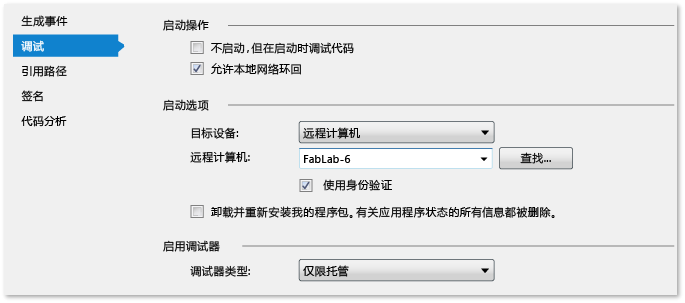

# 在 Visual Studio 中的远程计算机上运行 UWP 应用
  
若要在远程计算机上运行 UWP 应用，必须附加到其用于 Visual Studio 远程工具。 远程工具，可运行、 调试、 分析和测试 UWP 应用运行 Visual Studio 的第二个计算机在一台设备上运行。 在 Visual Studio 计算机不支持特定于 UWP 应用，如触摸、 地理位置和物理方向的功能时，远程设备上运行可能特别有效。 本主题介绍配置和启动远程会话的过程。

在某些情况下，部署到远程设备时将自动安装远程工具。

- 对于运行创意者更新及更高版本的 Windows 10 电脑，将会自动安装远程工具。
- 对于 Windows 10 Xbox、 IOT 和 HoloLens 设备，将自动安装远程工具。
- 适用于 Windows Mobile 10，您必须以物理方式连接到手机，则必须启用[开发人员模式](/windows/uwp/get-started/enable-your-device-for-development)并且你必须选择**设备**作为调试目标。 远程工具不需要或支持。

对于 Windows 10 电脑运行 pre-Creator 的更新版本的 Windows，您必须安装远程工具在远程计算机上手动之前可以调试。 按照本主题中的说明。 
  
##   先决条件  
 在远程设备上进行调试：  
  
- 远程设备与 Visual Studio 的计算机必须通过网络连接或通过 USB 或以太网电缆直接连接。 不支持通过 Internet 进行调试。  

- 必须启用[开发人员模式](/windows/uwp/get-started/enable-your-device-for-development)。 
  
- 对于运行早于 Windows 10 创意者更新版本的 Windows 10 的 Windows 10 电脑，您必须[安装和运行远程调试组件](#BKMK_download)。
  
##   安全性  
默认情况下**通用 （未加密的协议）** 在 Windows 10 上使用。 仅应在受信任的网络上使用此协议。 调试连接容易受到恶意用户无法截获和更改开发和远程计算机之间传递的数据。
  
> [!WARNING]
>  没有任何网络安全身份验证模式设置为时**通用 （未加密的协议）** 或**None**。 仅当你确信网络不会遇到恶意通信的从存在的风险，请选择这些模式。  
  
##   如何直接使用 USB 电缆进行连接 

在 Windows 10 中，您可以将部署到连接了 USB 的设备通过选择**设备**而不是**远程计算机**作为部署目标 (可以执行此操作**标准**工具栏或在调试属性页）。

##   配置远程调试的 Visual Studio 项目  
 可在项目的属性中指定所连接到的远程计算机。 该过程因编程语言而有所不同。 可以键入远程设备的网络名称也可以选择从**远程连接**对话框。  
  
   
  
 该对话框仅列出在 Visual Studio 计算机的本地子网上并且正在运行远程调试器的那些设备。  
  
> [!TIP]
>  如果连接到远程设备时遇到问题，则尝试访问设备的 IP 地址。 若要确定设备的 IP 地址，请打开命令窗口，然后键入 **ipconfig**。 随后将以 **IPv4 Address**为标题列出 IP 地址。  
  
###   选择 C# 和 Visual Basic 项目的远程设备  
  
1.  在解决方案资源管理器中选择项目名称，然后从快捷菜单中选择 **“属性”** 。  
  
2.  选择 **“调试”**。  
  
3.  从 **“目标设备”** 列表中选择 **“远程计算机”** 。  
  
4.  在 **“远程计算机”** 框中输入远程设备的网络名称，或选择 **“查找”** ，从 **“选择远程调试器连接”** 对话框中选择该设备。 

      
  
###   选择远程设备的 JavaScript 和 c + + 项目  
  
1.  在解决方案资源管理器中选择项目名称，然后从快捷菜单中选择 **“属性”** 。  
  
2.  展开 **“配置属性”** 节点，然后选择 **“调试”**。  
  
3.  从 **“要启动的调试器”** 列表中选择 **“远程调试器”** 。  
  
4.  在 **“计算机名称”** 框中输入远程设备的网络名称，或选择该框中的下箭头，从 **“选择远程调试器连接”** 对话框中选择该设备。  

    
  
##  下载并安装远程工具 （预创意者更新）

如果使用 pre-Creator 的更新版本的 Windows 10，然后按照这些说明。 否则，则可以跳过本部分中。

[!INCLUDE [remote-debugger-download](../debugger/includes/remote-debugger-download.md)]
  
###  设置远程调试器

[!INCLUDE [remote-debugger-configuration](../debugger/includes/remote-debugger-configuration.md)]  
  
##   启动远程调试会话  
 开始、停止和导航远程调试会话的方法与进行本地会话相同。 在之前的创建者的更新版本的 Windows 10 中，确保在远程设备上运行远程调试监视器。  
  
 然后在 **“调试”** 菜单上，选择 **“启动调试”** （键盘：F5）。 项目会重新编译，然后部署到远程设备上并启动。 调试器在断点暂停执行，以使您可进入逐语句执行、逐过程执行和跳出代码。 选择 **“停止调试”** 以结束调试会话并关闭远程应用程序。
  
## 请参阅  
 [高级远程部署选项](/windows/uwp/debug-test-perf/deploying-and-debugging-uwp-apps#advanced-remote-deployment-options)  
 [使用 Visual Studio 测试 UWP 应用](../test/testing-store-apps-with-visual-studio.md)   
 [在 Visual Studio 中调试应用](../debugger/debug-store-apps-in-visual-studio.md)
