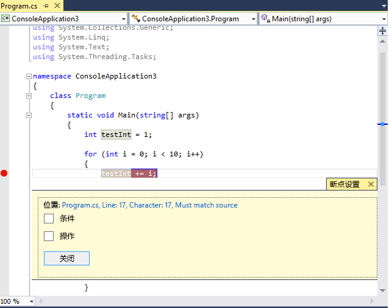
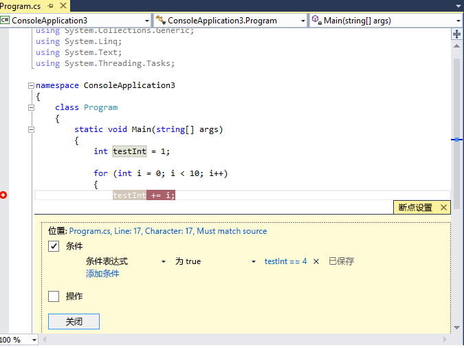
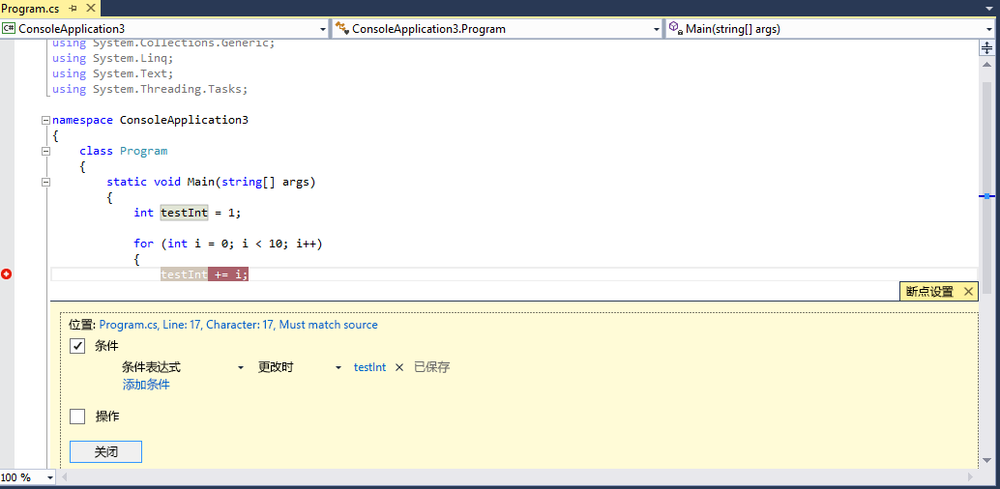
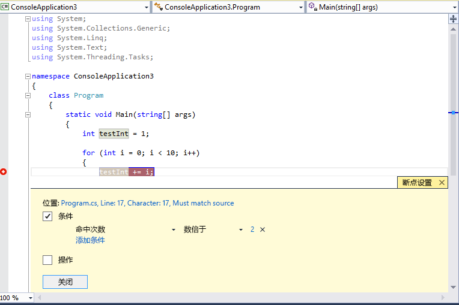

# <a name="use-breakpoints-in-the-visual-studio-debugger"></a>在 Visual Studio 调试器中使用断点
断点是开发人员的工具箱中最重要的调试技术之一。 若要暂停调试程序执行所需的位置设置断点。 例如，你可能想要查看代码变量的状态或查看调用堆栈的某些断点。 如果这是你第一次尝试调试代码，可能需要在浏览本文之前阅读[零基础调试](../debugger/debugging-absolute-beginners.md)。

##  <a name="BKMK_Overview"></a> 在源代码中设置断点
 可以在任意可执行代码行上设置断点。 例如，在以下 C# 代码，可以设置断点在变量声明`for`循环中或内的任何代码`for`循环。 命名空间或类声明或方法签名，无法设置断点。

 若要在源代码中设置断点，请单击代码行旁边的最左侧边距中。 您还可以选择行，然后按**F9**，选择**调试** > **切换断点**，或右键单击并选择**断点** > **插入断点**。 断点显示为左边距中的一个红点。

在C#自动突出显示代码、 断点和当前执行行。 有关C++代码中，您也可以通过选择断点和当前行的突出显示**工具**(或**调试**) >**选项** >  **调试** >  **为突出显示整个源行断点和当前语句 (C++仅)**。

 

 调试时，执行的断点处暂停，在执行该行上的代码之前。 断点符号显示黄色箭头。

 下面的示例的值中的断点处`testInt`仍为 1。

 

 当调试器在断点处停止时，您可以查看应用程序，包括变量值和调用堆栈的当前状态。 有关调用堆栈的详细信息，请参阅[如何：使用调用堆栈窗口](../debugger/how-to-use-the-call-stack-window.md)。

- 断点是一个触发器。 您可以单击它，请按**F9**，或使用**调试** > **切换断点**删除或重新插入。

- 若要禁用断点而不删除它，将鼠标悬停或右键单击它，然后选择**禁用断点**。 已禁用的断点显示为左边距中的空点或**断点**窗口。 若要重新启用断点，请将鼠标悬停或右键单击它，然后选择**启用断点**。

- 设置条件和操作、 添加和编辑标签，或将断点导出，右键单击该和选择合适的命令，或将鼠标悬停其上，然后选择**设置**图标。

##  <a name="BKMK_Set_a_breakpoint_in_a_function"></a> Windows 从调试器中设置断点

您还可以设置从断点**调用堆栈**并**反汇编**调试器窗口。

### <a name="BKMK_Set_a_breakpoint_in_the_call_stack_window"></a> 调用堆栈窗口中设置断点

 若要中断的指令或调用函数返回到的行处，可以设置断点**调用堆栈**窗口。

**在调用堆栈窗口中设置断点：**

1. 若要打开**调用堆栈**窗口中，您必须在调试期间暂停。 选择**调试** > **Windows** > **调用堆栈**，或按**Ctrl** + **Alt**+**C**。

2. 在中**调用堆栈**窗口中，右键单击调用函数，然后选择**断点** > **插入断点**，或按**F9**.

   调用堆栈的左边距中的函数调用名称旁边会显示一个断点符号。

调用堆栈断点显示在**断点**窗口具有对应于在函数中的下一步可执行指令的内存位置的地址。

调试器在指令处中断。

有关调用堆栈的详细信息，请参阅[如何：使用调用堆栈窗口](../debugger/how-to-use-the-call-stack-window.md)。

在代码执行过程中直观地跟踪断点，请参阅[调试时映射调用堆栈上的方法](../debugger/map-methods-on-the-call-stack-while-debugging-in-visual-studio.md)。

### <a name="set-a-breakpoint-in-the-disassembly-window"></a>在反汇编窗口中设置断点

1. 若要打开**反汇编**窗口中，您必须在调试期间暂停。 选择**调试** > **Windows** > **反汇编**，或按**Alt** + **8**。

2. 在中**反汇编**窗口中，单击想要中断的指令的左边距中。 此外可以选择它，然后按**F9**，或右键单击并选择**断点** > **插入断点**。

##  <a name="BKMK_Set_a_breakpoint_in_a_source_file"></a> 设置函数断点

  当调用函数，可以中断执行。

**若要设置函数断点：**

1. 选择**调试** > **新断点** > **函数断点**，或按**Alt** +**F9** > **Ctrl**+**B**。

   您还可以选择**新建** > **函数断点**中**断点**窗口。

1. 在中**新函数断点**对话框中，输入中的函数名称**函数名称**框。

   若要缩小范围的函数规范：

   - 使用完全限定的函数名称。

     示例：`Namespace1.ClassX.MethodA()`

   - 添加重载函数的参数类型。

     示例：`MethodA(int, string)`

   - 使用 ！ 符号指定模块。

     示例：`App1.dll!MethodA`

   - 在本机中使用上下文运算符C++。

     `{function, , [module]} [+<line offset from start of method>]`

     示例：`{MethodA, , App1.dll}+2`

1. 在中**语言**下拉列表中，选择该函数的语言。

1. 选择 **确定**。

### <a name="set-a-function-breakpoint-using-a-memory-address-native-c-only"></a>设置函数断点使用的内存地址 (本机C++仅)
 一个对象的地址可用于由特定类的实例调用的方法上设置函数断点。  例如，给定类型的对象可寻址`my_class`，可以在设置函数断点`my_method`实例调用的方法。

1.  实例化类的实例之后，地方设置断点。

2.  查找实例的地址 (例如， `0xcccccccc`)。

3.  选择**调试** > **新断点** > **函数断点**，或按**Alt** +**F9** > **Ctrl**+**B**。

4.  以下内容添加至**函数名**，然后选择**C++** 语言。

    ```C++
    ((my_class *) 0xcccccccc)->my_method
    ```
::: moniker range=">= vs-2019"

## <a name="BKMK_set_a_data_breakpoint_managed"></a>设置数据断点 (.NET Core 3.0 或更高版本)

为特定对象的属性发生更改时，数据断点中断执行。

**若要设置数据断点**

1. 在.NET Core 项目中，开始调试，并等待，直到到达一个断点。

2. 在**自动**，**监视**，或**局部变量**窗口中，右键单击一个属性，然后选择**值更改时中断**的上下文菜单中。

    

在.NET Core 中的数据断点不适用于：

- 不是可扩展的工具提示中，局部变量，自动或监视窗口属性
- 静态变量
- 使用 DebuggerTypeProxy 特性类
- 在结构内的字段 

::: moniker-end

## <a name="BKMK_set_a_data_breakpoint_native_cplusplus"></a>设置数据断点 (本机C++仅)

 数据断点中断执行时存储在指定的内存地址发生更改处的值。 如果只读取但不更改该值，则执行不会中断。

**若要设置数据断点：**

1. 在C++项目，开始调试，并等待，直到到达一个断点。 上**调试**菜单中，选择**新断点** > **数据断点**

    您还可以选择**新建** > **数据断点**中**断点**窗口，或右键单击中的项**自动**，**Watch**，或**局部变量**窗口，然后选择**值发生更改时中断**的上下文菜单中。

2. 在“地址”框中，键入内存地址或计算结果为内存地址的表达式。 例如，键入 `&avar` 以在变量 `avar` 的内容更改时执行中断操作。

3. 在 **“字节计数”** 下拉菜单中，选择你想要调试程序监视的字节数。 例如，如果选择 **4**，则调试程序将监视从 `&avar` 开始的四个字节，并在其中任何字节的值发生更改时执行中断操作。

在以下情况下，数据断点不起作用：
-   将未经调试的进程写入内存位置。
-   在两个或多个进程间共享内存位置。
-   内存位置在内核内更新。 例如，如果内存传递给 32 位 Windows`ReadFile`函数，将从内核模式下，更新内存，因此调试器不会中断该更新。

>[!NOTE]
>- 数据断点依赖于特定的内存地址。 变量的地址更改从一个调试会话为下一步，因此数据断点将被自动禁用每个调试会话结束时。
>
>- 如果在局部变量上设置数据断点，则断点在函数结束时仍处于启用状态，但内存地址不再适用，因此断点的行为不可预测。 如果在本地变量上设置数据断点，应删除或禁用在函数结束前的断点。

##  <a name="BKMK_Specify_advanced_properties_of_a_breakpoint_"></a>在“断点”窗口中管理断点

 可以使用**断点**窗口来查看和管理你的解决方案中的所有断点。 此集中的位置是在大型解决方案中，或对于复杂断点非常关键的调试方案尤其有用。

在中**断点**窗口中，您可以搜索、 排序、 筛选、 启用/禁用或删除断点。 您还可以设置条件和操作，或添加新的函数或数据断点。

若要打开**断点**窗口中，选择**调试** > **Windows** > **断点**，或按**Alt**+**F9**或**Ctrl**+**Alt**+**B**。


若要选择要在中显示的列**断点**窗口中，选择**显示列**。 选择一个列标题以对断点列表，可按该列进行排序。

###  <a name="BKMK_Set_a_breakpoint_at_a_function_return_in_the_Call_Stack_window"></a> 断点标签
可以使用标签进行排序和筛选列表中的断点**断点**窗口。

1. 若要将标签添加到断点中，右键单击该断点的源代码中或**断点**窗口中，并选择**编辑标签**。 添加新标签或选择一个现有证书，然后选择**确定**。
2. 对在断点列表进行排序**断点**通过选择窗口**标签**，**条件**，或其他列标题。 可以选择要通过选择显示的列**显示列**工具栏中。

### <a name="export-and-import-breakpoints"></a>导入和导出断点
 若要保存或共享的状态和您的断点的位置，可以导出或导入它们。

- 若要将单个断点导出到 XML 文件中，右键单击该断点的源代码中或**断点**窗口中，然后选择**导出**或**导出所选**。 选择导出位置，然后选择**保存**。 默认位置为解决方案文件夹。
- 若要在导出多个断点**断点**窗口中，选中断点旁边的框，或输入中的搜索条件**搜索**字段。 选择**导出满足当前搜索条件的所有断点**图标，并保存该文件。
- 要导出的所有断点，请取消选中所有框，并将**搜索**字段留空。 选择**导出满足当前搜索条件的所有断点**图标，并保存该文件。
- 若要在中导入断点，**断点**窗口中，选择**从文件导入断点**图标，导航到 XML 文件位置，然后选择**打开**。

##  <a name="breakpoint-conditions"></a>断点条件
 可以通过设置条件来控制在何时何处执行断点。 条件可以是调试器能够识别任何有效表达式。 有关有效表达式的详细信息，请参见[调试器中的表达式](../debugger/expressions-in-the-debugger.md)。

**若要设置断点条件：**

1. 右键单击断点符号，然后选择**条件**。 或悬停在断点符号，选择**设置**图标，并选择**条件**中**断点设置**窗口。

   您还可以在设置条件**断点**窗口中的右键单击断点并选择**设置**，然后选择**条件**。

   

2. 在下拉列表中，选择**条件表达式**，**命中计数**，或**筛选器**，并相应地设置值。

3. 选择**关闭**或按**Ctrl**+**Enter**关闭**断点设置**窗口。 或者，从**断点**窗口中，选择**确定**关闭对话框。

显示具有设置条件断点**+** 源代码中的符号和**断点**windows。

<a name="BKMK_Specify_a_breakpoint_condition_using_a_code_expression"></a>
### <a name="conditional-expression"></a>条件表达式

当选择**条件表达式**，可以选择两个条件：**为 true**或**发生更改时**。 选择**如此**时，满足表达式时中断或**发生更改时**表达式的值已更改时中断。

 在以下示例中，命中断点时，才的值`testInt`是**4**:

 

 在以下示例中，命中断点时，才的值`testInt`更改：

 

 如果使用无效语法设置断点条件，则会显示警告消息。 如果在指定断点条件时使用的语法有效但语义无效，则在第一次命中断点将出现警告消息。 在任一情况下，调试器将中断时它会命中断点无效。 仅在条件有效且计算结果为 `false`时才会跳过断点。

 >[!NOTE]
 >不同编程语言的“更改时”字段的行为不同。
 >- 对于本机代码，调试器不会考虑更改，因此不会命中第一次计算断点条件的第一次计算。
 >- 对于托管代码，调试器命中断点后第一次计算**发生更改时**处于选中状态。

### <a name="using-object-ids-in-conditional-expressions-c-and-f-only"></a>在条件表达式中使用对象 Id (C#和F#仅)
 有些的时候，当你想要观察特定对象的行为。 例如，你可能想要找出为什么对象插入到集合一次以上。 在 C# 和 F# 中，可以创建[引用类型](/dotnet/csharp/language-reference/keywords/reference-types)的特定实例的对象 ID，并在断点条件下使用它们。 对象 ID 由公共语言运行时 (CLR) 调试服务生成并与该对象关联。

**创建对象 ID：**

1. 设置断点在代码中的某个位置后创建对象。

2. 开始调试，并在断点处暂停执行，选择**调试** > **Windows** > **局部变量**或**Alt**+ **4**以打开**局部变量**窗口。

   查找中的断点**局部变量**窗口中，右键单击它，然后选择**创建对象 ID**。

   应该会在“局部变量” **$** 窗口中看到 **$** 窗口中设置断点来中断调用函数返回到的指令或行处的执行。 这就是对象 ID。

3. 你想要调查; 点处添加新的断点例如，当该对象是添加到集合。 右键单击该断点并选择“条件”。

4. 在“条件表达式”字段中使用对象 ID。 例如，如果变量`item`是要添加到集合中，选择的对象**为 true**并键入**item = = $\<n >**，其中\<n > 的对象 ID 号.

   会在将该对象添加到集合中时中断执行。

   若要删除对象 ID，请右键单击中的变量**局部变量**窗口，然后选择**删除对象 ID**。

>[!NOTE]
>对象 ID 创建弱引用，且不会阻止对象被垃圾回收。 它们仅对当前调试会话有效。

### <a name="hit-count"></a>命中次数
 如果你怀疑你的代码中的循环开始产生错误行为在一定数量的迭代后，可以设置一个断点以停止执行的命中数，而无需重复按该数后**F5**来访问该迭代。

 下**条件**中**断点设置**窗口中，选择**命中计数**，然后指定迭代数。 在以下示例中，断点设置为其他每次迭代命中：

 

### <a name="filter"></a>筛选器
可以将断点限制为仅在指定设备上或在指定进程和线程中触发。

下**条件**中**断点设置**窗口中，选择**筛选器**，然后输入一个或多个以下表达式：

-   MachineName = "name"
-   ProcessId = value
-   ProcessName = "name"
-   ThreadId = value
-   ThreadName = "name"

将字符串值放在双引号内。 可以使用 `&` (AND)、 `||` (OR)、 `!` (NOT) 和括号合并子句。

##  <a name="BKMK_Print_to_the_Output_window_with_tracepoints"></a>断点操作和跟踪点
 “跟踪点”是将消息打印到“输出”窗口的断点。 跟踪点的作用像这种编程语言中的一个临时跟踪语句。

**若要设置跟踪点：**

1. 右键单击断点并选择**操作**。 或者，在**断点设置**窗口中，悬停在所需断点，选择**设置**图标，，然后选择**操作**。

1. 输入中的消息**将消息记录到输出窗口**字段。 消息可以包含通用文本字符串，值的变量或表达式括在大括号和格式说明符 ([ C# ](../debugger/format-specifiers-in-csharp.md)并[ C++ ](../debugger/format-specifiers-in-cpp.md)) 的值。

   此外可以在消息中使用以下特殊关键字：

   - **$ADDRESS** -当前指令
   - **$CALLER** -调用函数名
   - **$CALLSTACK** -调用堆栈
   - **$FUNCTION** -当前函数名
   - **$PID** -进程 id
   - **$PNAME** -进程名称
   - **$TID** -线程 id
   - **$TNAME** -线程名称
   - **$TICK** -选中计数 (从 Windows `GetTickCount`)

1. 若要打印到的消息**输出**但不会中断，选择窗口**继续执行**复选框。 若要打印在跟踪点的消息和中断执行，请清除该复选框。

跟踪点显示为红色方块中的源代码的左边距和**断点**windows。

## <a name="see-also"></a>请参阅

- [什么是调试？](../debugger/what-is-debugging.md)
- [更好地编写C#使用 Visual Studio 代码](../debugger/write-better-code-with-visual-studio.md)
- [首先看一下调试](../debugger/debugger-feature-tour.md)
- [在 Visual Studio 调试器中的断点疑难解答](../debugger/troubleshooting-breakpoints.md)