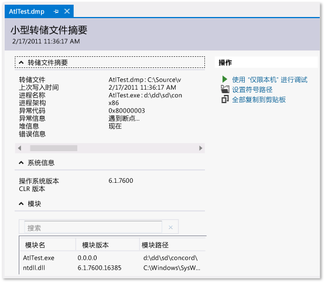

# 使用 Visual Studio 使用转储文件
使用或不带堆; 的转储文件创建转储文件;打开转储文件;查找二进制文件、 pdb，并为转储文件的源文件。
  
##  什么是转储文件？  
 A*转储文件*采用转储的时间是应用程序在该点的快照。 它显示了执行的进程和加载的模块。 如果转储与堆信息一起保存，转储文件将包含该时间点在应用程序的内存中储存的内容的快照。 在 Visual Studio 中打开带堆的转储文件类似于在调试会话中在断点处停止。 尽管你无法继续执行，但在转储发生时可以检查应用程序的堆栈、线程和变量值。  
  
 转储主要用于调试发生在开发人员无权访问的计算机的问题。 例如，可以使用来自客户的计算机的转储文件，如果您无法重现客户的崩溃或挂起计算机上。 测试人员还会创建转储文件来保存故障或挂起数据，以便让测试计算机可用于更多测试。 Visual Studio 调试器可为托管或本机代码保存转储文件。 该调试器可加载由 Visual Studio 或保存文件的其他程序创建的转储文件*小型转储*格式。  
  
##  使用或不带堆的转储文件  
 你可以创建带有或不带堆信息的转储文件。  
  
-   **转储文件的堆**包含应用程序的内存的快照。 这包括创建转储时的变量的值。 如果加载与堆一起保存的转储文件，即使未找到应用程序二进制文件，Visual Studio 也可以加载符号。 Visual Studio 还会在转储文件中保存加载的本机模块的二进制文件，这可让调试更加容易。  
  
-   **转储文件不带堆**比带有堆信息的转储小得多。 但是，调试器必须加载应用程序二进制文件才能查找符号信息。 该二进制文件必须与创建转储时使用的二进制文件完全匹配。 仅在不带堆数据的转储文件中存储堆栈变量的值。  
  
##  要求和限制  
  
-   调试优化过代码的转储文件可能让人困惑。 例如，函数的编译器内联可能产生意外的调用堆栈，而其他优化可能更改变量的生存期。  
  
-   64 位计算机中的转储文件必须在运行于 64 位计算机中的 Visual Studio 的实例上进行调试。  
  
-   在 VS 2013 之前的 Visual Studio 版本中，对于在 64 位计算机上运行的 32 位应用，通过某些工具（例如，任务管理器和 64 位 WinDbg）收集的转储无法在 Visual Studio 中打开。 VS 2013 中已经取消了此限制。  
  
-   Visual Studio 可以调试 ARM 设备中的本机应用程序的转储文件。 Visual Studio 还可以调试 ARM 设备中的托管应用的应用转储文件，但仅限于本机调试器中。  
  
-   若要调试[内核模式](http://msdn.microsoft.com/library/windows/hardware/ff551880.aspx)转储文件在 Visual Studio 2013，请下载[Windows 8.1 版本的 Windows 调试工具](http://msdn.microsoft.com/windows/hardware/gg463009)。 请参阅[Visual Studio 中的内核调试](http://msdn.microsoft.com/library/windows/hardware/jj149675.aspx)。  
  
-   Visual Studio 无法调试转储文件保存在较旧转储格式称为[完整的用户模式转储](http://msdn.microsoft.com/library/windows/hardware/ff545506.aspx)。 请注意，完全用户模式转储与带有堆的转储不同。  
  
-   使用进行调试[SOS.dll （SOS 调试扩展）](/dotnet/framework/tools/sos-dll-sos-debugging-extension)在 Visual Studio 中，你必须安装 Windows 调试工具的一部分的 Windows 驱动程序工具包 (WDK)。 请参阅[Windows 8.1 预览版： 下载工具包、 组件和工具](http://msdn.microsoft.com/library/windows/hardware/bg127147.aspx)。  
  
##  创建转储文件  
 使用 Visual Studio 创建转储文件：  
  
-   在 Visual Studio 中调试进程时，你可以在调试器已在异常或断点处停止时保存转储文件。 选择**调试**，然后**保存为转储**，然后**调试**。 在**转储另存为**对话框中，在**另存为类型**列表，你可以选择**小型转储**或**小型转储与堆**（默认值）。  
  
-   与[实时调试](../debugger/just-in-time-debugging-in-visual-studio.md)启用，可以将调试器附加到在调试器外部运行的故障进程，然后保存转储文件。 请参阅[将附加到正在运行的进程](../debugger/attach-to-running-processes-with-the-visual-studio-debugger.md)  
  
 你还可以使用支持 Windows 小型转储格式的任意程序创建转储文件。 例如， **Procdump**从命令行实用工具[Windows Sysinternals](http://technet.microsoft.com/sysinternals/default)可以创建基于触发器或按需进程故障转储文件。 请参阅[要求和限制](../debugger/using-dump-files.md#BKMK_Requirements_and_limitations)有关使用其他工具创建转储文件的其他信息的本主题中。 
  
##  打开转储文件  
  
1.  在 Visual Studio 中，选择**文件**，**打开**，**文件**。  
  
2.  在**打开的文件**对话框框中，找到并选择转储文件。 它通常具有 .dmp 扩展名。 然后选择**确定**。  
  
3.  **转储文件摘要**窗口随即显示。 在该窗口中，你可以查看转储文件的调试摘要信息、设置符号路径、启动调试以及将摘要信息复制到剪贴板中。  
  
       
  
4.  若要开始调试，请转到**操作**部分，然后选择以下两者之一**使用仅限托管调试**，**使用仅限本机调试**或**调试混合**.  
  
##  查找二进制文件、 符号 (.pdb) 文件和源文件  
 若要使用 Visual Studio 的完整功能来调试转储文件，则需要访问以下文件：  
  
-   为其执行转储的 .exe 文件和转储过程中使用的其他二进制文件（DLL 等）。  
  
     如果要调试带有堆数据的转储，则 Visual Studio 可以处理某些模块缺少二进制文件的情况，但是它必须具有足够多的模块的二进制文件才能生成有效的调用堆栈。 Visual Studio 将本机模块包含在带有堆的转储文件中。  
  
-   .exe 的符号 (.pdb) 文件以及其他二进制文件。  
  
-   与你相关的模块的源文件。  
  
     可执行文件和 .pdb 文件必须与创建转储时使用的文件的版本和内部版本完全匹配。  
  
     则可以使用模块的反汇编，如果找不到源文件，调试  
  
 **可执行文件的默认搜索路径**  
  
 Visual Studio 会自动搜索可执行文件的转储文件中未包含这些位置：  
  
1.  包含转储文件的目录。  
  
2.  转储文件中指定的模块的路径。 这是收集转储的计算机上的模块路径。  
  
3.  中指定的符号路径**调试**，**选项**，**符号**的 Visual Studio 的页**工具**，**选项**对话框。 你可以在此页上添加更多要搜索的位置。  
  
 **使用无二进制 > 符号 > 源页**  
  
 如果 Visual Studio 找不到调试转储中的模块所需的文件，它将显示相应的页 (**未找到二进制**，**未找到符号**，或**未找到源**)。 这些页面提供了有关问题原因的详细信息，并提供了可帮助你识别文件的正确位置的操作链接。 请参阅[指定符号 (.pdb) 和源文件](../debugger/specify-symbol-dot-pdb-and-source-files-in-the-visual-studio-debugger.md)。  
  
## 请参阅  
 [在实时调试](../debugger/just-in-time-debugging-in-visual-studio.md)   
 [指定符号 (.pdb) 和源文件](../debugger/specify-symbol-dot-pdb-and-source-files-in-the-visual-studio-debugger.md)   
 [IntelliTrace](../debugger/intellitrace.md)