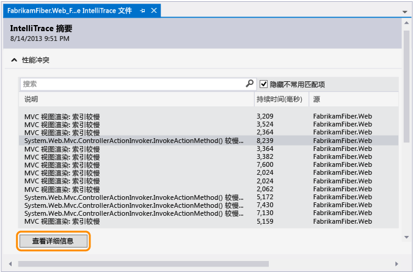
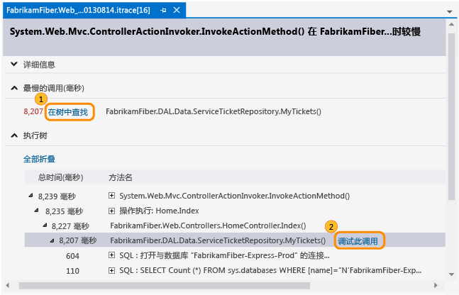
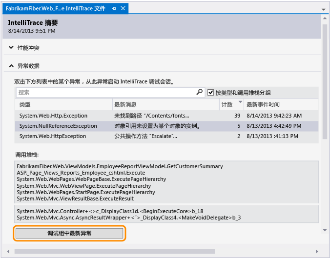
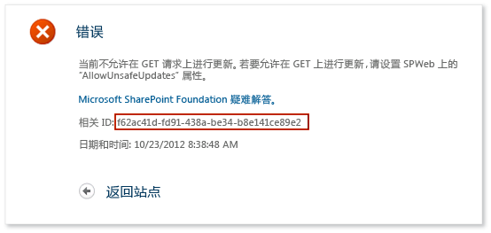
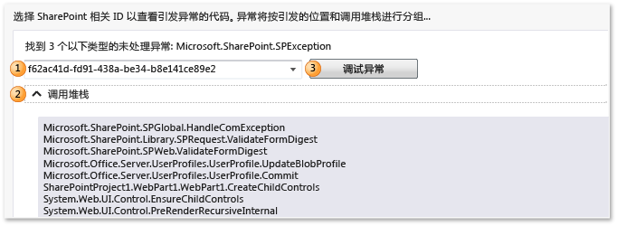

# 使用保存的 IntelliTrace 数据
从 IntelliTrace 日志 (.iTrace) 文件开始调试时，转到应用程序执行中的特定点。 此文件可包含应用程序运行时 IntelliTrace 记录下的性能事件、异常、线程、测试步骤、模块和其他系统信息。  
  
 确保你有：  
  
-   应用程序代码的匹配源文件和符号 (.pdb) 文件。 如果没有，Visual Studio 无法解析源位置并显示消息“未找到符号”。 请参阅[指定符号 (.pdb) 和源文件](../debugger/specify-symbol-dot-pdb-and-source-files-in-the-visual-studio-debugger.md)和[部署后诊断问题](../debugger/diagnose-problems-after-deployment.md)。  
  
-   开发计算机或其他计算机上的 Visual Studio Enterprise（但不是 Professional 或 Community 版本），可用来打开 .iTrace 文件  
  
-   来自以下源之一的 .iTrace 文件：  
  
    |**源**|**请参阅**|  
    |----------------|-------------|  
    |Visual Studio Enterprise（但不是 Professional 或 Community 版）中的 IntelliTrace 会话|[IntelliTrace 功能](../debugger/intellitrace-features.md)|  
    |Microsoft 测试管理器中的测试会话。 这会将 .iTrace 文件附加到 Team Foundation Server 工作项。|[在手动测试中收集更多诊断数据](/vsts/manual-test/mtm/collect-more-diagnostic-data-in-manual-tests)|  
    |Microsoft Monitoring Agent（单独使用或与 System Center 2012 R2 Operations Manager 一起使用），用于监视部署中运行的 ASP.NET Web 应用和 SharePoint 应用程序|-   [部署后诊断问题](../debugger/diagnose-problems-after-deployment.md) -   [System Center 2012 R2 Operations Manager 的新增功能](http://technet.microsoft.com/library/dn249700.aspx)|  
  
##   你希望做什么？  
  
-   [打开 IntelliTrace 日志](#Open)  
  
-   [理解 IntelliTrace 日志](#Understand)  
  
-   [从 IntelliTrace 日志开始调试](#StartDebugging)  
  
##   打开 IntelliTrace 日志  
 在装有 Visual Studio Enterprise 的计算机上，打开 .iTrace 文件。  
  
-   双击 Visual Studio 外的 .iTrace 文件或从 Visual Studio 内打开文件。  
  
     \- 或 -  
  
-   如果 .iTrace 文件附加到 Team Foundation Server 工作项，请执行该工作项中的以下步骤：  
  
    -   在“所有链接” 下，找到 .iTrace 文件。 打开此文件。  
  
         \- 或 -  
  
    -   在“重现步骤” 下，选择“IntelliTrace”  链接。  
  
> [!TIP]
>  如果在调试期间已关闭 IntelliTrace 文件，可轻松将其重新打开。 转至“调试”  菜单，选择“IntelliTrace” 、“显示日志摘要” 。 还可以在“IntelliTrace”  窗口中选择“显示日志摘要”  。 只有在使用 IntelliTrace 进行调试时才能使用。  
  
##   理解 IntelliTrace 日志  
 .iTrace 文件的以下各节中的某些内容只有当你从特定源（如从测试管理器或 SharePoint 应用程序）收集数据时才会显示。  
  
|**节**|**包含**|**集合源**|  
|-----------------|------------------|---------------------------|  
|[性能冲突](#Performance)|函数调用超出已配置阈值的性能事件|Microsoft Monitoring Agent，或者独立收集器或与 System Center 2012 R2 Operations Manager 用于在 IIS 上托管的 ASP.NET web 应用|  
|[异常数据](#ExceptionData)|异常，包括每个异常的完整调用堆栈|所有源|  
|[分析](#Analysis)|仅限于 SharePoint 2010 和 SharePoint 2013 应用程序。 诊断 IntelliTrace 和 SharePoint 事件，如调试器事件、ULS 事件、未经处理的异常以及 Microsoft Monitoring Agent 记录的其他数据。|Microsoft Monitoring Agent，或者独立收集器或与 System Center 2012 R2 Operations Manager|  
|[系统信息](#SystemInfo)|主机系统的设置和规范|所有源|  
|[线程列表](#ThreadsList)|在集合期间运行的线程|所有源|  
|[测试数据](#TestData)|从测试会话测试步骤及其结果|测试管理器|  
|[模块](#Modules)|目标进程按其加载顺序加载的模块。|所有源| 
|[Web 请求](#Modules)|生产 IIS 的 web 请求数据的 web 应用程序和 SharePoint 2010 和 SharePoint 2013|Microsoft Monitoring Agent 和独立收集器| 
  
 下面提供的一些提示可帮助你找到每个部分中的信息：  
  
-   选择列标题对数据进行排序。  
  
-   使用搜索框筛选数据。 纯文本搜索可搜索除时间列以外的所有列。 还可以通过每列一个筛选器来筛选到特定列的搜索。 键入没有空格、冒号 (**:**) 和搜索值的列名。 在列名后加分号 (**;**) 可添加另一列和搜索值。  
  
     例如，若要查找“Description”  列中具有“slow”一词的性能事件，应键入：  
  
     `Description:slow`  
  
##   从 IntelliTrace 日志开始调试  
  
###   性能冲突  
 查看针对你的应用所记录的性能事件。 可以隐藏不经常发生的事件。  
  
##### 从性能事件开始调试  
  
1.  在“性能冲突” 下，查看记录的性能事件、其总执行时间以及其他事件信息。 然后，深入查看在特定性能事件期间调用的方法。  
  
       
  
     也可以直接双击事件。  
  
2.  在事件页上，查看这些调用的执行时间。 在执行树中查找缓慢调用。  
  
     当你有多个调用（嵌套调用或其他调用）时，最慢的调用将显示在它们自己的部分中。  
  
3.  展开调用以查看在该时间点记录的所有嵌套调用和参数值。  
  
     （键盘：若要显示或隐藏嵌套调用，请分别按“向右键”  或“向左键”  。 若要显示和隐藏嵌套调用的参数值，请按“空格”  键。）  
  
     从调用开始调试。  
  
       
  
     也可以直接双击调用或按“Enter”  键。  
  
     如果方法在应用程序代码中，Visual Studio 将转到该方法。  
  
       
  
     现在你可以查看其他记录的值和调用堆栈、单步执行代码，或者使用“IntelliTrace”  窗口在此性能事件期间调用的 [其他方法之间“及时”前后移动](../debugger/intellitrace.md) 。  
  
###   异常数据  
 查看针对你的应用引发和记录的异常。 可以将具有相同类型和调用堆栈的异常分组在一起，以便仅查看最近异常。  
  
##### 从异常开始调试  
  
1.  在“异常数据” 下，查看记录的异常事件，它们的类型、消息以及异常发生的时间。 若要深入查看代码，请从异常组中的最近事件开始调试。  
  
       
  
     也可以直接双击事件。 如果未分组事件，请选择“调试此事件” 。  
  
     如果应用程序代码发生异常，Visual Studio 将转到发生异常的位置。  
  
       
  
     现在你可以查看其他记录的值和调用堆栈，或者使用“IntelliTrace”  窗口 [在其他记录的事件、相关代码和在这些时间点记录的值之间“及时”前后移动](../debugger/intellitrace.md)。  
  
    |**列**|**显示**|  
    |----------------|-------------------|  
    |**类型**|异常的 .NET 类型|  
    |“最新消息” （对于分组异常）或“消息”  （对于未分组异常）|异常提供的消息|  
    |“计数” （对于分组异常）|引发异常的次数|  
    |“线程 ID” （对于未分组异常）|引发异常的线程的 ID|  
    | 或“向左键” |引发异常时记录的时间戳|  
    |**调用堆栈**|异常的调用堆栈。   若要查看调用堆栈，请在该列表中选择异常。 调用堆栈显示在异常列表下面。|  
  
###   分析  
 通过使用 SharePoint 相关 ID 诊断 SharePoint 2010 和 SharePoint 2013 应用程序的问题，或者查看 Microsoft Monitoring Agent 发现的任何未经处理的异常。  
  
-   使用 SharePoint 相关 ID 查找匹配的 Web 请求和事件。 选择一个事件，然后在该事件发生的位置和时间点开始调试。  
  
-   如果 Microsoft Monitoring Agent 发现未经处理的异常，请选择一个异常，然后在该异常发生的位置和时间点开始调试。  
  
##### 使用 SharePoint 相关 ID 开始调试  
  
1.  从源复制 SharePoint 相关 ID。  
  
     例如：  
  
       
  
2.  打开 .iTrace 文件，然后转到“分析”  并输入 SharePoint 相关 ID，以查看匹配的 Web 请求和记录的事件。  
  
       
  
3.  在“请求事件” 下，检查事件。 从顶部开始，事件按发生顺序显示。  
  
    1.  选择事件，查看其详细信息。  
  
    2.  选择“启动调试”  ，在事件发生点开始调试。  
  
       
  
 你可以同时查看以下类型的 SharePoint 事件和 IntelliTrace 事件：  
  
-   **用户配置文件事件**  
  
     这些事件在 SharePoint 加载用户配置文件以及读取或更改用户配置文件属性时发生。  
  
-   **统一日志记录系统 (ULS) 事件**  
  
     Microsoft Monitoring Agent 记录一部分 SharePoint ULS 事件及以下字段：  
  
    |**IntelliTrace 字段**|**SharePoint ULS 字段**|  
    |----------------------------|------------------------------|  
    |**Id**|**事件 ID**|  
    |**级别**|**级别**|  
    |**类别 ID**|**类别 ID**|  
    |**类别**|**类别**|  
    |**区域**|**产品**|  
    |**输出**|**消息**|  
    |**相关 ID**|**相关 ID**|  
  
##### 从未经处理的异常开始调试  
  
1.  选择异常的 SharePoint 相关 ID。 异常按类型和调用堆栈分组。  
  
2.  （可选）展开“调用堆栈”  以查看调用堆栈是否存在异常组。  
  
3.  选择“调试异常”  以在异常发生的位置和时间点开始调试。  
  
       
  
 有关演练，请参阅[演练： 调试 SharePoint 应用程序通过使用 IntelliTrace](../sharepoint/walkthrough-debugging-a-sharepoint-application-by-using-intellitrace.md)。 类型的数据的代理记录，请参阅[IntelliTrace 功能](../debugger/intellitrace-features.md)。  
  
###   线程列表  
 检查目标进程中运行的记录线程。 你可以从选定线程的第一个有效 IntelliTrace 事件开始调试。  
  
##### 从特定线程开始调试  
  
1.  在“线程列表” 下选择线程。  
  
2.  在“线程列表” 的底部，选择“启动调试” 。 也可以双击线程。  
  
     从应用开始处开始调试，双击“主线程” 。 请参阅[IntelliTrace 功能](../debugger/intellitrace-features.md)。  
  
 用户创建的线程数据可能比服务器创建的线程更加有用，并且能管理 IIS 托管的 Web 应用。  
  
|**列**|**显示**|  
|----------------|-------------------|  
|**ID**|线程 ID 号|  
|**名称**|线程名。 未命名的线程显示为"\<没有名称 >"。|  
|**开始时间**|线程创建时间|  
|**结束时间**|线程完成时间|  
  
###   测试数据  
 测试应用的同时检查测试管理器记录的 IntelliTrace 数据。  
  
##### 从特定测试步骤开始调试  
  
1.  展开“测试步骤网格” 。 选择测试步骤。  
  
2.  在“测试步骤网格” 的底部，选择“启动调试” 。 也可以双击测试步骤。  
  
     这将从选定测试步骤后的第一个有效 IntelliTrace 事件开始调试。  
  
     如果存在测试数据，IntelliTrace 将尝试解析用于执行测试运行的关联 Team Foundation Server 生成。 如果找到生成，则将自动解析应用的关联符号。  
  
|**字段**|**显示**|  
|---------------|-------------------|  
|**测试会话**|记录的测试会话。 通常只有一个。 如果测试数据是通过手动探索测试创建，则此列表为空。|  
|**测试用例**|从选定测试会话测试用例。 如果测试数据是通过手动探索测试创建，则此列表为空。|  
|**测试步骤网格**|使用测试结果（通过或失败）记录的测试步骤|  
  
###   系统信息  
 本部分展示了有关托管应用的系统的详细信息，例如硬件、操作系统、环境和特定于进程的信息。  
  
###   模块  
 本部分展示了目标进程加载的模块。 这些模块按加载顺序显示。  
  
|**列**|**显示**|  
|----------------|-------------------|  
|**模块名**|模块文件名|  
|**模块路径**|加载模块的磁盘位置|  
|**模块 ID**|模块的唯一标识符特定于版本，并分配给匹配的符号 (PDB) 文件。 请参阅 [Finding symbol (.pdb) files and source files](http://msdn.microsoft.com/en-us/05384c85-d264-4e18-abaa-aa482ab25470)。|  
  
### 在何处可以获取详细信息？  
 [使用 IntelliTrace 独立收集器](../debugger/using-the-intellitrace-stand-alone-collector.md)  
  
 [IntelliTrace 功能](../debugger/intellitrace-features.md)  
  
 [在手动测试中收集更多诊断数据](/vsts/manual-test/mtm/collect-more-diagnostic-data-in-manual-tests)  
  
 [IntelliTrace](../debugger/intellitrace.md)  
  
#### 论坛  
 [Visual Studio 调试器](http://go.microsoft.com/fwlink/?LinkId=262263)  
  
#### 指导  
 [对使用 Visual Studio 2012-第 6 章的连续交付进行测试： 测试工具箱](http://go.microsoft.com/fwlink/?LinkID=255203)