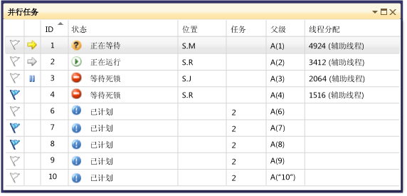
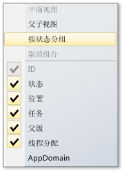
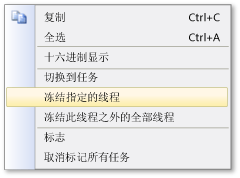

# 使用“任务”窗口
**任务**窗口类似于**线程**窗口中，但它显示有关的信息<xref:System.Threading.Tasks.Task?displayProperty=fullName>， [task_handle](/cpp/parallel/concrt/reference/task-group-class.md)，或[WinJS.Promise](http://msdn.microsoft.com/library/windows/apps/br211867.aspx)而不是每个线程的对象。 与线程一样，任务表示可并行运行的异步操作；但是，多个任务可以在同一个线程上运行。 
  
 在托管代码中，你可以使用**任务**窗口时，你使用<xref:System.Threading.Tasks.Task?displayProperty=fullName>对象或与**await**和**异步**关键字 (**Await**和**异步**visual Basic 中)。 有关托管代码中的任务的详细信息，请参阅[的并行编程](/dotnet/standard/parallel-programming/index)。  
  
 在本机代码中，你可以使用**任务**窗口时，你使用[任务组](/cpp/parallel/concrt/task-parallelism-concurrency-runtime)，[并行算法](/cpp/parallel/concrt/parallel-algorithms)，[异步代理](/cpp/parallel/concrt/asynchronous-agents)，和[轻量级任务](/cpp/parallel/concrt/task-scheduler-concurrency-runtime)。 有关本机代码中的任务的详细信息，请参阅[并发运行时](/cpp/parallel/concrt/concurrency-runtime)。  
  
 在 JavaScript 中，当使用 promise .then 代码时，可使用“任务”窗口。 请参阅[JavaScript （UWP 应用程序） 中的异步编程](http://msdn.microsoft.com/library/windows/apps/hh700330.aspx)有关详细信息。   
  
 你可以使用**任务**窗口时中断调试器。 你可以访问它的计算机上**调试**菜单中单击**Windows** ，然后单击**任务**。 下图显示**任务**窗口处于默认模式。  
  
   
  
> [!NOTE]
>  在托管代码中，当托管线程处于休眠或联接状态时，状态为 <xref:System.Threading.Tasks.Task>、<xref:System.Threading.Tasks.TaskStatus> 或 <xref:System.Threading.Tasks.TaskStatus> 的 <xref:System.Threading.Tasks.TaskStatus> 不能显示在“任务”窗口中。  
  
## 任务列信息  
 中的列**任务**窗口显示了以下信息。  
  
|列名|描述|  
|-----------------|-----------------|  
|**标志**|显示哪些任务已被标记，并且你可以标记或取消标记任务。|  
|**图标**|黄色箭头指示当前任务。 当前任务是当前线程上处于最顶层的任务。   白色箭头指示中断的任务，即调用调试器时的任务。   暂停图标指示已被用户冻结的任务。 在列表中右击某一任务可以冻结或取消冻结该任务。|  
|**ID**|系统为任务提供的编号。 在本机代码中，该编号是任务的地址。|  
|**状态**|任务的当前状态（已计划、活动、已死锁、正在等待或已完成）。 已计划的任务是指尚未运行的任务，因此它没有调用堆栈、已分配的线程或相关信息。   活动任务是指在中断调试器之前正在执行代码的任务。   正在等待的任务是指因以下原因而被阻止的任务：正在等待向事件发送信号、释放锁或完成其他任务。   死锁任务是指其线程与其他线程相互死锁的正在等待的任务。   将鼠标悬停在**状态**死锁或正在等待的任务以查看有关阻塞的详细信息的单元格。 **警告：** **任务**窗口报告仅针对使用 Wait Chain Traversal (WCT) 支持的同步基元的受阻任务的死锁。 例如，对于死锁<xref:System.Threading.Tasks.Task>对象，后者使用 WCT，调试器则会报告**等待-死锁**。 对于由并发运行时不使用 WCT 的死锁任务调试器报告**等待**。 有关 WCT 的详细信息，请参阅[Wait Chain Traversal](http://msdn.microsoft.com/library/ms681622\(VS.85\).aspx)。|  
|**开始时间**|任务变为活动状态的时间。|  
|**持续时间**|任务已处于活动状态的秒数。|  
|**完成时间**|任务完成的时间。|  
|**位置**|任务调用堆栈中的当前位置。 将鼠标指针悬停在此单元格上可以查看任务的整个调用堆栈。 已计划的任务在该列中没有相应的值。|  
|**Task**|创建任务时传递到该任务的初始方法以及任何自变量。|  
|**父**|创建此任务的任务的 ID。 如果为空白，则说明该任务没有父级。 这仅适用于托管程序。|  
|**线程分配**|运行任务的线程的 ID 和名称。|  
|**返回状态**|任务完成时的状态。 返回的状态值为**成功**，**已取消**，和**错误**。|  
|**AppDomain**|对于托管代码，该列表示要在其中执行任务的应用程序域。|  
|**task_group**|对于本机代码的地址[task_group](/cpp/parallel/concrt/reference/task-group-class.mdd)计划任务的对象。 对于异步代理和轻量级任务，该列设置为 0。|  
|进程|运行任务的进程的 ID。|  
|异步状态|对于托管代码，即任务状态。 默认情况下，此列被隐藏。 若要显示此列，请打开其中一个列标题的上下文菜单。 选择**列**， **AsyncState**。|  
  
 通过右击列标题并选择所需的列可以向视图添加列。 （通过清除所选内容即可移除列。）您还可以通过向左或向右拖动列来对列重新排序。 列的快捷菜单如下图所示。  
  
   
  
## 对任务进行排序  
 若要按列条件对任务进行排序，请单击相应的列标题。 例如，通过单击**ID**列标题，可以按任务 ID 任务进行排序： 1,2,3,4,5 依次类推。 若要反转排序顺序，请再次单击相应的列标题。 当前排序列和排序顺序由该列上的箭头指示。  
  
## 对任务进行分组  
 你可以根据列表视图中的任何列对任务进行分组。 例如，通过右击**状态**列标题，然后单击**按状态分组**，可以具有相同状态的所有任务进行都分组。 例如，你可以快速查看正在等待的任务，以便关注其阻止原因。 您还可以在调试会话期间折叠不相关的组。 同样，还可以按其他列进行分组。 只需单击组标题旁的按钮即可标记或取消标记组。 下图显示**任务**处于分组模式下的窗口。  
  
   
  
## 父子视图  
 （此视图仅可用于托管代码。）通过右击列标题，然后单击**父子视图**，可以将任务列表更改为在每个子任务是，可以显示或隐藏在其父级下的子节点的层次结构视图。 下图所示为父子视图中的任务。  
  
   
  
## 标记任务  
 你可以标记的线程，方法是选择任务在其运行任务的任务列表项，然后选择**标志**从上下文菜单中，或通过单击第一列中的标志图标。 如果标记了多个任务，则可以按标记列进行排序以在顶部显示标记的所有任务，从而仅关注这些任务。 你还可以使用**并行堆栈**窗口，以查看仅已标记任务。 这样，你便可以为调试操作滤出不相关的任务。 标记不会在调试会话之间保留。  
  
## 冻结和解冻任务  
 你可以冻结通过右击任务列表项，然后单击在其运行任务的线程**冻结指定的线程**。 (如果任务已冻结，则命令是**解冻指定的线程**。)如果已冻结线程，当单步执行当前断点后的代码时，将不会执行该线程。 **冻结线程，但此线程全部**命令冻结除正在执行的任务列表项的所有线程。  
  
 下图所示为每项任务的其他菜单项。  
  
   
  
## 另请参阅  
 [Debugger Basics](../debugger/debugger-basics.md) （调试器基础知识）  
 [Debugging Managed Code](../debugger/debugging-managed-code.md) （调试托管代码）  
 [并行编程](/dotnet/standard/parallel-programming/index)   
 [并发运行时](/cpp/parallel/concrt/concurrency-runtime)   
 [使用并行堆栈窗口](../debugger/using-the-parallel-stacks-window.md)   
 [演练：调试并行应用程序](../debugger/walkthrough-debugging-a-parallel-application.md)