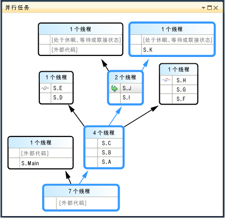
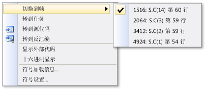
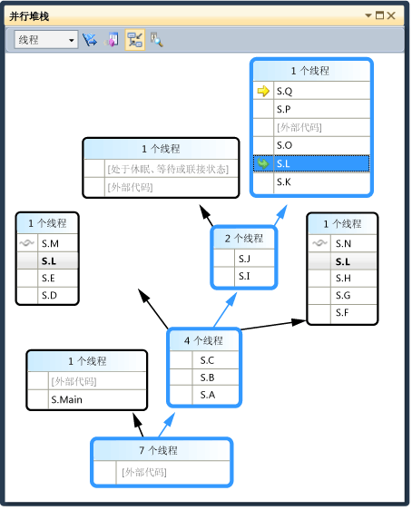
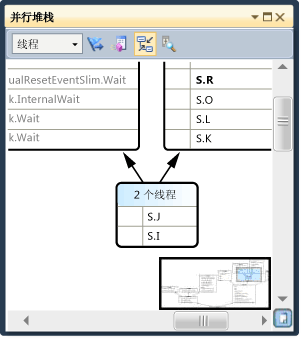
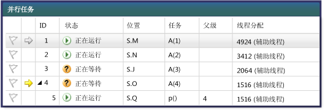
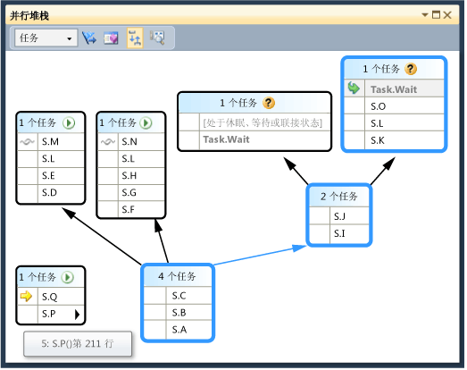
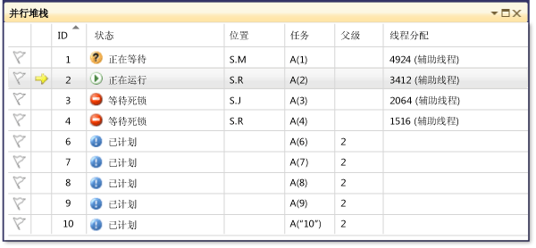

# 演练：调试并行应用程序
[!INCLUDE[vs2017banner](../code-quality/includes/vs2017banner.md)]

本演练演示如何使用**“并行任务”**和**“并行堆栈”**窗口调试并行应用程序。  这些窗口有助于您了解和验证使用[Task Parallel Library \(TPL\)](../Topic/Task%20Parallel%20Library%20\(TPL\).md)和[并发运行时](/visual-cpp/parallel/concrt/concurrency-runtime)的代码的运行时行为。  本演练提供了具有内置断点的代码示例。  本演练演示如何在代码中断后使用**“并行任务”**和**“并行堆栈”**窗口检查代码。  
  
 本演练介绍了以下任务：  
  
-   如何在一个视图中查看所有线程的调用堆栈。  
  
-   如何查看在应用程序中创建的 `System.Threading.Tasks.Task` 实例的列表。  
  
-   如何查看任务（而不是线程）的实际调用堆栈。  
  
-   如何从**“并行任务”**和**“并行堆栈”**窗口定位到代码。  
  
-   窗口如何通过分组、缩放和其他相关功能来处理缩放。  
  
## 系统必备  
 本演练假定已启用**“仅我的代码”**。  在**“工具”**菜单上，单击**“选项”**，展开**“调试”**节点，选择**“常规”**，然后选择**“启用‘仅我的代码’\(仅限托管\)”**。  如果未设置此功能，您仍可以使用本演练，但结果可能会与以下各图不同。  
  
## C\# 示例  
 如果使用 C\# 示例，本演练还将假定外部代码处于隐藏状态。  若要在是否显示外部代码之间进行切换，请右击**“调用堆栈”**窗口的**“名称”**表标题，然后选中或清除**“显示外部代码”**。  如果未设置此功能，您仍可以使用本演练，但结果可能会与以下各图不同。  
  
## C\+\+ 示例  
 如果使用 C\+\+ 示例，则可以忽略本主题中对外部代码的引用。  外部代码仅适用于 C\# 示例。  
  
## 图示  
 本主题中的图示是在运行 C\# 示例的四核计算机上记录的。  您也可以使用其他配置完成本演练，但您的计算机上显示的内容可能与这些图示不同。  
  
## 创建示例项目  
 本演练中的代码示例适用于不执行任何操作的应用程序。  其目的仅在于理解如何使用工具窗口调试并行应用程序。  
  
#### 创建示例项目  
  
1.  在 Visual Studio 中的**“文件”**菜单上，指向**“新建”**，然后单击**“项目”**。  
  
2.  在**“已安装的模板”**窗格中，选择“Visual C\#”、“Visual Basic”或“Visual C\+\+”。  对于托管语言，请确保 [!INCLUDE[net_v40_short](../debugger/includes/net_v40_short_md.md)] 显示在框架框中。  
  
3.  选择**“控制台应用程序”**，再单击**“确定”**。  保留默认的调试配置。  
  
4.  在项目中打开 .cpp、.cs 或 .vb 代码文件。  删除其内容以创建一个空代码文件。  
  
5.  将所选语言的以下代码粘贴到上述空代码文件中。  
  
 [!code-cs[Debugger#1](../debugger/codesnippet/CSharp/walkthrough-debugging-a-parallel-application_1.cs)]
 [!code-cpp[Debugger#1](../debugger/codesnippet/CPP/walkthrough-debugging-a-parallel-application_1.cpp)]
 [!code-vb[Debugger#1](../debugger/codesnippet/VisualBasic/walkthrough-debugging-a-parallel-application_1.vb)]  
  
1.  在**“文件”**菜单上，单击**“全部保存”**。  
  
2.  在**“生成”**菜单上，单击**“重新生成解决方案”**。  
  
     请注意，有四个对 `Debugger.Break`（在 C\+\+ 示例中为 `DebugBreak`）的调用。因此，您无需插入断点；您只需运行应用程序即可使其四次中断调试器。  
  
## 使用“并行堆栈”窗口：“线程”视图  
 在**“调试”**菜单上，单击**“启动调试”**。  等待命中第一个断点。  
  
#### 查看一个线程的调用堆栈  
  
1.  在**“调试”**菜单上指向**“窗口”**，再单击**“线程”**。  将**“线程”**窗口停靠在 Visual Studio 底部。  
  
2.  在**“调试”**菜单上指向**“窗口”**，然后单击**“调用堆栈”**。  将**“调用堆栈”**窗口停靠在 Visual Studio 底部。  
  
3.  在**“线程”**窗口中双击线程，使其作为当前线程。  当前线程具有一个黄色箭头。  更改当前线程时，将在**“调用堆栈”**窗口中显示其调用堆栈。  
  
#### 查看“并行堆栈”窗口  
  
1.  在**“调试”**菜单上指向**“窗口”**，然后单击**“并行堆栈”**。  在左上角的框中，确保选择**“线程”**。  
  
     使用**“并行堆栈”**窗口可以在一个视图中同时查看多个调用堆栈。  以下图示在**“调用堆栈”**窗口上方显示**“并行堆栈”**窗口。  
  
       
  
     主线程的调用堆栈显示在一个框中，其他四个线程的调用堆栈则划分到另一个框中。  将这四个线程划分在一起是因为其堆栈帧共享相同的方法上下文；也就是说，它们处于相同的方法中：`A`、`B` 和 `C`。  若要查看处于同一框中的线程的线程 ID 和名称，请将鼠标指针悬停在标题（**“4 个线程”**）上。  当前线程显示为粗体，如下图所示。  
  
       
  
     黄色箭头指示当前线程的活动堆栈帧。  若要获取更多信息，请将鼠标指针悬停在堆栈帧上。  
  
       
  
     通过右击**“调用堆栈”**窗口，可以设置要显示堆栈帧的多少细节（**“模块名称”**、**“参数类型”**、**“参数名称”**、**“参数值”**、**“行号”**和**“字节偏移量”**）。  
  
     方框周围的蓝色突出显示指示当前线程是该框的一部分。  工具提示中的粗体堆栈帧也可指示当前线程。  如果双击“线程”窗口中的主线程，您可以看到**“并行堆栈”**窗口中的蓝色突出显示将相应移动。  
  
       
  
#### 继续执行到第二个断点  
  
1.  若要继续执行到命中第二个断点，请在**“调试”**菜单上，单击**“继续”**。  下图所示为第二个断点处的线程树。  
  
       
  
     在第一个断点处，所有四个线程均从 S.A 执行到 S.B 再到 S.C 方法。  该信息仍会显示在**“并行堆栈”**窗口中，但是这四个线程已进一步执行。  其中一个线程继续执行到 S.D 再到 S.E。  另一个线程继续执行到 S.F、S.G 和 S.H。  其余两个线程继续执行到 S.I 和 S.J，其中一个线程从此方法执行到 S.K，而另一个线程继续执行到非用户外部代码。  
  
     您可以将鼠标指针悬停在框标题（例如，**“1 个线程”**或**“2 个线程”**）上，以查看线程的线程 ID。  将鼠标指针悬停在堆栈帧上可以查看线程 ID 和其他帧详细信息。  蓝色突出显示指示当前线程，黄色箭头指示当前线程的活动堆栈帧。  
  
     细线图标（重叠的蓝色和红色波浪线）指示非当前线程的活动堆栈帧。  在**“调用堆栈”**窗口中，双击 S.B 可以切换帧。  **“并行堆栈”**窗口通过使用绿色的曲线箭头图标指示当前线程的当前堆栈帧。  
  
     在**“线程”**窗口中进行线程切换时，**“并行堆栈”**窗口中的视图将相应更新。  
  
     在**“并行堆栈”**窗口中使用快捷菜单可以切换到其他线程或其他线程的其他帧。  例如，右击 S.J，指向**“切换到帧”**，然后单击某一命令。  
  
       
  
     右击 S.C，指向**“切换到帧”**。  其中一个带有选中标记的命令指示当前线程的堆栈帧。  您可以切换到相同线程的上述帧（将仅移动绿色箭头），也可以切换到其他线程（将同时移动蓝色突出显示）。  下图所示为子菜单。  
  
       
  
     当方法上下文只与一个堆栈帧关联时，框标题将显示**“1 个线程”**，双击它即可切换到该线程。  如果双击关联有一个以上的帧的方法上下文，则会自动弹出该菜单。  将鼠标指针悬停在方法上下文上时，请注意右侧的黑色三角形。  单击该三角形也可以显示该快捷菜单。  
  
     对于具有多个线程的大型应用程序，您可能只希望关注某个线程子集。  **“并行堆栈”**窗口可仅显示已标记线程的调用堆栈。  在工具栏上，单击列表框旁边的**“仅显示已标记项”**按钮。  
  
       
  
     接着，在**“线程”**窗口中依次标记线程，以查看其调用堆栈在**“并行堆栈”**窗口中的显示方式。  若要标记线程，请使用快捷菜单或线程的第一个单元格。  再次单击**“仅显示已标记项”**工具栏按钮可以显示所有线程。  
  
#### 继续执行到第三个断点  
  
1.  若要继续执行到命中第三个断点，请在**“调试”**菜单上，单击**“继续”**。  
  
     如果有多个线程位于同一方法中，但该方法不在调用堆栈开头，则会在不同框中显示该方法。  当前断点处的一个示例是 S.L，它包含三个线程并在三个框中显示这三个线程。  双击 S.L。  
  
       
  
     请注意，S.L 在其他两个框中为粗体，这样您可以看到 S.L 的其他显示位置。  如果您希望查看对 S.L 进行调用的帧和 S.L 所调用的帧，请单击工具栏上的**“切换方法视图”**按钮。  下图所示为**“并行堆栈”**窗口的方法视图。  
  
       
  
     请注意以上关系图以所选方法为中心并将其单独放在视图中间的方框中。  被调用方和调用方分别显示在顶部和底部。  再次单击**“切换方法视图”**按钮可以退出该模式。  
  
     **“并行堆栈”**窗口的快捷菜单还包括以下其他项。  
  
    -   **“十六进制显示”**，用于在十进制和十六进制之间切换工具提示中的数字。  
  
    -   **“符号加载信息”**和**“符号设置”**，用于打开各自的对话框。  
  
    -   **“转到源代码”**和**“转到反汇编”**，用于在编辑器中定位到选定方法。  
  
    -   **“显示外部代码”**，用于显示所有帧（即使这些帧未处于用户代码中）。  使用此项可查看展开的关系图，其中包含其他帧（这些帧可能因没有相应符号而灰显）。  
  
     如果关系图较大，当单步执行到下一断点时，您可能希望视图自动滚动到当前线程的活动堆栈帧；即第一个命中该断点的线程。  在**“并行堆栈”**窗口中，确保已启用工具栏上的**“自动滚动到当前堆栈帧”**按钮。  
  
       
  
2.  继续之前，请在**“并行堆栈”**窗口中一直滚动到左侧和底部。  
  
#### 继续执行到第四个断点  
  
1.  若要继续执行到命中第四个断点，请在**“调试”**菜单上，单击**“继续”**。  
  
     请注意视图如何自动滚动到位。  在**“线程”**窗口中切换线程或在**“调用堆栈”**窗口中切换堆栈帧，请注意视图如何一直自动滚动到正确的帧。  禁用**“自动滚动到当前工具帧”**选项并查看不同之处。  
  
     **“鸟瞰图”**还有助于在**“并行堆栈”**窗口中处理大型关系图。  通过单击窗口右下角滚动条之间的按钮可以查看**“鸟瞰图”**，如下图所示。  
  
       
  
     移动矩形可以快速移动到关系图的任何位置。  
  
     朝任意方向移动此关系图的另一种方法是：单击此关系图的空白区域并将其拖动到所需位置。  
  
     若要放大和缩小此关系图，请按住 Ctrl 并移动鼠标滚轮。  或者，也可以单击工具栏上的“缩放”按钮并使用缩放工具。  
  
       
  
     通过单击**“工具”**菜单和**“选项”**，并选中或清除**“调试”**节点下的相应选项，您还可以按从上到下（而不是从下到上）的方向查看堆栈。  
  
2.  继续之前，请在**“调试”**菜单上，单击**“停止调试”**以结束执行。  
  
## 使用“并行任务”窗口和“并行堆栈”窗口的任务视图  
 继续之前，建议您先完成前面的过程。  
  
#### 重新启动应用程序，直到命中第一个断点  
  
1.  在**“调试”**菜单上，单击**“启动调试”**并等待命中第一个断点。  
  
2.  在**“调试”**菜单上指向**“窗口”**，再单击**“线程”**。  将**“线程”**窗口停靠在 Visual Studio 底部。  
  
3.  在**“调试”**菜单上指向**“窗口”**，然后单击**“调用堆栈”**。  将**“调用堆栈”**窗口停靠在 Visual Studio 底部。  
  
4.  在**“线程”**窗口中双击线程，以将其作为当前线程。  当前线程具有一个黄色箭头。  更改当前线程时，将更新其他窗口。  接着，我们将查看任务。  
  
5.  在**“调试”**菜单上指向**“窗口”**，然后单击**“并行任务”**。  下图所示为**“并行任务”**窗口。  
  
       
  
     对于运行的每一项任务，您可以读取其 ID（由名称相同的属性返回）、运行该任务的线程的 ID 和名称以及任务位置（悬停以显示具有整个调用堆栈的工具提示）。  此外，**“任务”**列下还会显示传递到任务中的方法，即起始点。  
  
     可以对任何列进行排序。  请注意指示排序列和方向的排序标志符号。  您还可以通过向左或向右拖动列来对列重新排序。  
  
     黄色箭头指示当前任务。  通过双击某一任务或使用快捷菜单可以切换任务。  切换任务时，基础线程即成为当前线程并更新其他窗口。  
  
     在不同任务之间进行手动切换时，黄色箭头将相应移动，而白色箭头仍显示导致调试器中断的任务。  
  
#### 继续执行到第二个断点  
  
1.  若要继续执行到命中第二个断点，请在**“调试”**菜单上，单击**“继续”**。  
  
     **“状态”**列以前将所有任务显示为正在运行，而现在有两个任务处于等待状态。  任务可能因多种不同原因而被阻止。  在**“状态”**列中，将鼠标指针悬停在正在等待的任务上可以确定其阻止原因。  例如，在下图中，任务 3 正在等待任务 4。  
  
       
  
     任务 4 又在等待分配给任务 2 的线程所拥有的监视器。  
  
       
  
     单击**“并行任务”**窗口第一列中的标志可以对任务进行标记。  
  
     使用标记功能可以跟踪同一调试会话中的不同断点之间的任务或筛选**“并行堆栈”**窗口中显示的调用堆栈所对应的任务。  
  
     在先前使用**“并行堆栈”**窗口时，您已查看了应用程序线程。  请再次查看**“并行堆栈”**窗口，但这次查看应用程序任务。  请在左上方的框中选择**“任务”**来执行此操作。  下图所示为任务视图。  
  
       
  
     当前未在执行任务的线程不会显示在**“并行堆栈”**窗口的任务视图中。  此外，对于执行任务的线程，某些与任务无关的堆栈帧将从堆栈的顶部和底部筛选掉。  
  
     再次查看**“并行任务”**窗口。  右击任何列标题可以查看该列的快捷菜单。  
  
       
  
     您可以使用此快捷菜单添加或移除列。  例如，AppDomain 列未处于选中状态；因此，不会在列表中显示它。  单击**“父级”**。  此时将显示**“父级”**列，但不显示四个任务中任何任务的值。  
  
#### 继续执行到第三个断点  
  
1.  若要继续执行到命中第三个断点，请在**“调试”**菜单上，单击**“继续”**。  
  
     此时，新任务（即任务 5）正在运行，而任务 4 则处于等待状态。  通过将鼠标指针悬停在**“状态”**窗口中正在等待的任务上，您可以查看其原因。  在**“父级”**列中，请注意任务 4 是任务 5 的父级。  
  
     为了更直观地显示父子关系，请右击**“父级”**列标题，并单击**“父子视图”**。  您应看到以下图示。  
  
       
  
     请注意，任务 4 和任务 5 正在同一线程上运行。  此信息不会显示在**“线程”**窗口中；在此处显示此信息是**“并行任务”**窗口的另一优势。  为确认这一点，请查看**“并行堆栈”**窗口。  确保您正在查看**“任务”**。  在**“并行任务”**窗口中双击任务 4 和任务 5，找到这两个任务。  执行此操作时，将更新**“并行堆栈”**窗口中的蓝色突出显示。  此外，您还可以通过扫描**“并行堆栈”**窗口上的工具提示来查找任务 4 和任务 5。  
  
       
  
     在**“并行堆栈”**窗口中右击 S.P，再单击**“转至线程”**。  此时，窗口将切换到线程视图，并显示相应帧。  您可以在同一线程上查看两个任务。  
  
       
  
     这是**“并行堆栈”**窗口中的任务视图的另一优势（相较于**“线程”**窗口而言）。  
  
#### 继续执行到第四个断点  
  
1.  若要继续执行到命中第三个断点，请在**“调试”**菜单上，单击**“继续”**。  单击要按 ID 排序的**“ID”**列标题。  您应看到以下图示。  
  
       
  
     由于任务 5 已完成，因此不再显示该任务。  如果您的计算机上并非如此并且未显示死锁，请通过按 F11 单步执行一次。  
  
     此时，任务 3 和任务 4 正在相互等待，且处于死锁状态。  此外，还存在 5 个作为任务 2 的子级的新任务，目前已计划这些任务。  已计划任务是已在代码中启动但尚未运行的任务。  因此，其**“位置”**和**“线程分配”**列为空。  
  
     再次查看**“并行堆栈”**窗口。  每个框的标题都具有一个显示线程 ID 和名称的工具提示。  在**“并行堆栈”**窗口中切换到任务视图。  将鼠标指针悬停在标题上可以查看任务 ID 和名称以及任务状态，如下图所示。  
  
       
  
     可以按列对任务进行分组。  在**“并行任务”**窗口中，右击**“状态”**列标题并单击**“按状态分组”**。  下图所示为按状态分组的**“并行任务”**窗口。  
  
       
  
     此外，还可以按其他列进行分组。  通过对任务进行分组，您可以关注某个任务子集。  每个可折叠的组都包含一个分组在一起的项的计数。  也可以通过单击**“折叠”**按钮右侧的**“标志”**按钮来快速标记该组中的所有项。  
  
       
  
     要查看的最后一个**“并行任务”**窗口功能是在右击任务时所显示的快捷菜单。  
  
       
  
     快捷菜单根据任务状态显示不同的命令。  这些命令可能包括**“复制”**、**“全选”**、**“十六进制显示”**、**“切换到任务”**、**“冻结指定的线程”**、**“冻结此线程之外的全部线程”**、**“解冻指定的线程”**和**“标志”**。  
  
     您可以冻结一个或多个任务的基础线程，也可以冻结除指定线程外的所有线程。  冻结的线程在**“并行任务”**窗口中的表示方式与在**“线程”**窗口中相同，由蓝色的“暂停”图标指示。  
  
## 摘要  
 本演练演示**“并行任务”**和**“并行堆栈”**调试器窗口。  请在采用多线程代码的实际项目中使用这些窗口。  可以检查用 C\+\+、C\# 或 Visual Basic 编写的并行代码。  
  
## 请参阅  
 [Debugging Multithreaded Applications](../debugger/walkthrough-debugging-a-parallel-application.md)   
 [调试器基础知识](../debugger/debugger-basics.md)   
 [调试托管代码](../debugger/debugging-managed-code.md)   
 [Parallel Programming](../Topic/Parallel%20Programming%20in%20the%20.NET%20Framework.md)   
 [并发运行时](/visual-cpp/parallel/concrt/concurrency-runtime)   
 [使用“并行堆栈”窗口](../debugger/using-the-parallel-stacks-window.md)   
 [使用“任务”窗口](../debugger/using-the-tasks-window.md)