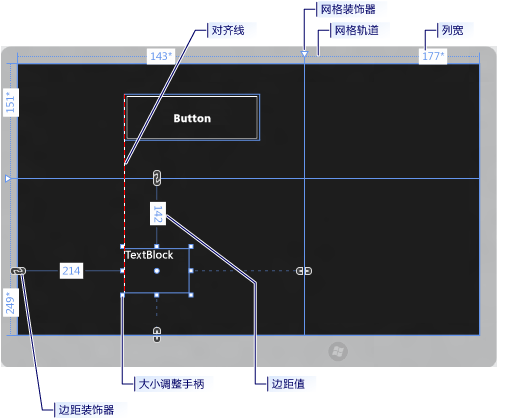
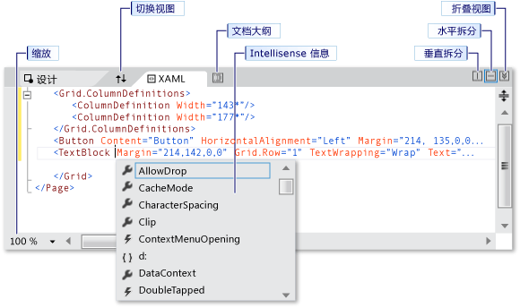

# 在 Visual Studio 中使用 XAML 设计器创建 UI

Visual Studio 中的 XAML 设计器提供可视化界面，有助于设计基于 XAML 的 Windows 和 Web 应用。 可以通过拖动“工具箱”  中的控件，并在“属性”  窗口设置属性，为应用程序创建用户界面。 还可以直接在 XAML 视图中编辑 XAML。

有关高级 XAML 设计任务（例如动画和行为）的详细信息，请参阅 [Creating a UI by using Blend for Visual Studio](../designers/creating-a-ui-by-using-blend-for-visual-studio.md)。 另请参阅[在 Visual Studio 和 Blend for Visual Studio 中设计 XAML](../designers/designing-xaml-in-visual-studio.md)，查看这两种工具之间的比较。

## XML 设计器工作区

XAML 设计器中的工作区由若干可视界面元素组成。 这些元素包括美工板、XAML 编辑器、“设备”窗口、“文档大纲”窗口和“属性”窗口。 若要打开 XAML 设计器，请右键单击“解决方案资源管理器”  中的 XAML 文件，然后选择“视图设计器” 。

## 创作视图

XAML 设计器提供 XAML 视图和应用程序呈现的 XAML 标记的同步设计视图。 打开 Visual Studio 中的某个 XAML 文件后，可以通过使用“设计”  和“XAML”  选项卡，在“设计”视图和“XAML”视图之间进行切换。 可以使用“交换窗格”  按钮，切换显示于顶部的窗口：美工板或 XAML 编辑器。

在“设计”视图，包括 *“美工板”* 的窗口是活动窗口，并且可以将其用作主要工作台面。 可通过添加或绘制元素，然后对其进行修改，在应用程序中用于直观地设计页面。 有关更多信息，请参见 [Working with elements in XAML Designer](../designers/working-with-elements-in-xaml-designer.md)。 此图显示了“设计”视图中的美工板。

这些功能在美工板中可用：

**对齐线**

对齐线是显示为红色虚线的 *“对齐边界”* ，在控件的边缘对齐时或文本基线对齐时进行显示。 仅当启用了“对齐线对齐”  时，才会显示对齐边界。

**网格轨道**

使用`Grid` 轨道可以管理 [网格](/uwp/api/Windows.UI.Xaml.Controls.Grid) 面板中的行和列。 可以创建和删除行和列，并可以调整其相对宽度和高度。 显示在美工板左侧的垂直网格轨道用于行，而显示在顶部的水平线则用于列。

**网格装饰器**

网格装饰器显示为三角形，在网格轨道上它附加有垂直线或水平线。 拖动网格装饰器时，相邻的列或行的宽度或高度随鼠标的移动而改变。

网格装饰器用于控制网格的行和列的宽度和高度。 可以通过单击网格轨道，添加新列或行。 当为具有两个或多个列或行的网格面板添加新行或列时，轨道外将显示一个小型工具栏，可显式设置宽度和高度。 小型工具栏使你能够为网格行和列设置调整大小选项。

**重设句柄大小**

重设句柄大小显示在所选控件上，使你能够调整控件的大小。 当调整控件大小时，通常会出现宽度和高度值，帮助设置控件的大小。 有关在“设计”视图中操作控件的详细信息，请参阅[使用 XAML 设计器中的元素](../designers/working-with-elements-in-xaml-designer.md)。

**边距**

边距表示控件边缘与其容器边缘之间的固定空间量。 可使用“属性”窗口中 **“布局”** 下的 [Margin](/uwp/api/windows.ui.xaml.frameworkelement.margin) 属性来设置控件的边距。

**边距装饰器**

可使用边距装饰器更改元素相对于其布局容器的边距。 打开边距装饰器，未设置边距时，边距装饰器将显示断开的锁链。 未设置边距时，元素在运行时调整布局容器的大小时保留在原处。 边距装饰器关闭时，边距装饰器将显示完好的锁链，且在运行时调整布局容器的大小时，元素随边距一起移动（边距保持固定）。

**元素句柄**

当将指针移动到环绕某元素的蓝色方框的角落时，可以通过使用显示于美工板上的元素句柄修改元素。 利用这些句柄可以旋转、调整大小、翻转、移动或向元素添加圆角半径。 元素句柄的符号因函数而异，且更具指针的确切位置进行更改。 如果看不到元素句柄，请确保已选定该元素。

在“设计”视图中，其他美工板命令在屏幕的左下角区域可用，如下所示：

此工具栏上的这些命令可用：

**缩放**

缩放能够确定设计图面的大小。 可以从 12.5% 缩放到 800%，或选择如“适应所选内容”  和“适合所有” 之类的选项。

**显示/隐藏对齐网格**

显示或隐藏显示网格线的对齐网格。 当启用“网格线对齐”或“对齐线对齐”时，将使用网格线。

**开启/关闭网格线对齐**

如果“网格线对齐”已启用，在美工板上拖动某个元素后，此元素会与最靠近的水平和垂直网格线对齐。

**开启/关闭对齐线对齐**

对齐线有助于控件彼此对齐。 如果已启用了“对齐线对齐”  ，则当相对于其他控件拖动某个控件时，在某些控件的边缘和文本水平或垂直对齐时，将显示对齐边界。 对齐边界显示为红色虚线。

在 XAML 视图中，包含 XAML 编辑器窗口是活动窗口，且 XAML 编辑器是主要创作工具。 可扩展应用程序标记语言 (XAML) 提供基于 XML 的声明性词汇，用于指定应用程序的用户界面。 XAML 视图包括 IntelliSense、自动格式设置、语法突出显示和标记导航。 此图显示了 XAML 视图：

**拆分视图栏**

当 XAML 编辑器在下方窗口时，拆分视图栏将显示在 XAML 视图中的顶部。 拆分视图栏可控制“设计”视图和 XAML 视图的相对大小。 也可交换视图的位置（使用“交换窗格”  按钮），指定视图是水平排列或是垂直排列以及折叠任一视图。

**标记缩放**

借助标记缩放，可以调整 XAML 视图的大小。 可以从 20% 缩放到 400%。

## 设备窗口

> [!NOTE]
> 如果 UWP 应用程序的目标平台版本 (`TargetPlatformVersion`) 是 10.0.16299.0 或更高版本，则“设备”窗口不可用。

通过 XAML 设计器中的“设备”窗口，可在设计时为项目模拟各种视图、显示屏和显示选项。 在 XAML 设计器中工作时，“设备”窗口在“设计”菜单中可用。 如下所示：

以下是“设备”窗口中可用的选项：

**显示**

为应用程序指定不同的显示大小和分辨率。

**方向**

为应用程序指定不同的方向：“横向”或“纵向”。

**边缘**

为应用程序指定不同的边缘对齐方式：“两者”、“左对齐”、“右对齐”或“无”。

**高对比度**

以选定的对比度设置预览应用程序。 如果将此设置的值不是“默认值”，则重写 App.xaml 中的 `RequestedTheme` 属性设置。

**重写缩放**

在设计图面中开启和关闭文档缩放仿真。 这使你可以按系数提高缩放百分比。 选中该复选框，以开启仿真。 例如，如果缩放百分比为 100%，则设计图面中的文档将最大纵向扩展至 140%。 如果当前缩放百分比为 180，则将禁用此选项。

**最小宽度**

指定最小宽度设置。 最小宽度可在 App.xaml 中更改。

**主题**

指定应用程序主题。 例如，可以在“深色”和“浅色”主题之间进行切换。

**显示镶边**

在“设计”视图中，开启和关闭应用程序周围的模拟平板电脑框架。 选择该复选框，以显示帧。

**剪裁以显示**

指定显示模式。 选择此复选框，以将文档大小剪裁到显示屏大小。

## “文档大纲”窗口

XAML 设计器中的“文档大纲”窗口有助于执行这些任务：

- 查看美工板上所有元素的层次结构。

- 选择元素，以便可以对其进行修改（在层次结构中移动它们、在美工板上对其进行修改以及在“属性”窗口中设置其属性等）。 有关详细信息，请参阅[使用 XAML 设计器中的元素](../designers/working-with-elements-in-xaml-designer.md)

- 创建和修改控件元素的模板。

- 使用选定元素的右键单击菜单（关联菜单）。 同一个菜单对美工板中的所选元素也可用。

若要查看“文档大纲”窗口，请依次在菜单栏上选择“查看” > “其他窗口” > “文档大纲”。

以下是“文档大纲”窗口中可用的选项：

**文档大纲**

“文档大纲”窗口中的主视图采用树结构显示文档的层次结构。 可以使用文档大纲的层次结构性质检查不同级别的文档的详细信息，单个或成组地锁定和隐藏元素。

**显示/隐藏**

显示或隐藏与文档大纲中项对应的美工板元素。 使用“显示/隐藏”按钮，该按钮显示时是一个眼睛状的标志，或者按 Ctrl+H 隐藏元素，按 Shift+Ctrl+H 显示元素。

**锁定/解锁**

锁定或解锁与“文档大纲”中各项相对应的美工板元素。 不能修改已锁定的元素。 使用“锁定/解锁”按钮，该按钮锁定时是一个挂锁状的标志，或按 Ctrl+L 锁定元素，按 Shift+Ctrl+L 解锁元素。

**返回到 pageRoot 范围**

“文档大纲”窗口顶部的选项显示向上箭头符号，可将文档大纲返回到之前的范围。 仅当在样式或模板的范围中时，范围向上可用。

## “属性”窗口

通过“属性”窗口可以设置控件的属性值。 如下所示：

“属性”窗口顶部有多种选项。 可以通过使用“名称”  框，更改当前所选元素的名称。 在左上角，有一个表示当前所选元素的图标。 若要按类别或按字母顺序排列属性，请单击“类别” 、“名称” 或“排列方式”  列表中的“源”  。 若要查看控件的事件列表，请单击“事件”  按钮，该按钮显示为一个闪电形符号。 若要搜索属性，请开始在“搜索属性”  框中键入属性的名称。 “属性”窗口将显示与键入搜索的内容相匹配的属性。 某些属性允许通过选择向下箭头按钮设置高级属性。 有关使用属性和处理事件的详细信息，请参阅[控件和模式简介](/windows/uwp/design/controls-and-patterns/controls-and-events-intro)

每个属性值的右侧是一个“属性标记”  ，显示为一个方框符号。 属性标记的外观指示是否有数据绑定到或有资源应用于该属性。 例如，白色方框符号指示默认值，黑色方框符号通常指示已应用某个本地资源，而橙色方框通常指示已应用某个数据绑定。 单击属性标记时，可以导航到一种样式的定义、打开数据绑定生成器或打开资源选取器。

## 请参阅

- [在 XAML 设计器中使用元素](../designers/working-with-elements-in-xaml-designer.md)
- [如何创建和应用资源](../designers/how-to-create-and-apply-a-resource.md)
- [演练：在 XAML 设计器中绑定数据](../designers/walkthrough-binding-to-data-in-xaml-designer.md)