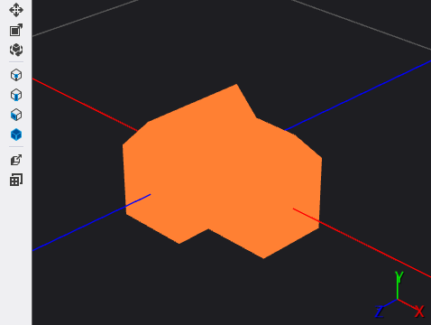

# 如何：向三维模型应用着色器
[!INCLUDE[vs2017banner](../code-quality/includes/vs2017banner.md)]

本文档演示如何使用模型编辑器，以便将定向关系图着色器语言 \(DGSL\) 着色器应用到三维模型中。  
  
 本文档演示此活动：  
  
-   应用着色器到三维模型  
  
## 应用着色器到三维模型  
 可以将着色器效果应用于三维模型来为它指定有趣的外表。  
  
 在开始之前，请确保显示**“属性”**窗口。  
  
#### 将着色器应用到三维模型  
  
1.  以包含一个或多个模型的三维场景开始。  如果没有适当的三维场景，请创建一个如[如何：创建基本三维模型](../Topic/How%20to:%20Create%20a%20Basic%203-D%20Model.md)所述。  必须拥有可以应用于模型的 DGSL 着色器。  如果没有适当的着色器，请创建一个，如[如何：创建基本颜色着色器](../designers/how-to-create-a-basic-color-shader.md) 所述，并确保已保存到文件才能继续。  
  
2.  在 **选择** 模式中，选择要应用于着色器的模型，然后在 **属性** 窗口中，在 **文件名** 属性 **效果** 属性组中，指定要应用于模型的 DGSL 着色器。  
  
 这是具有应用于该模型的基本颜色效果：  
  
   
  
 在适用于着色器模型后，您可以通过选择模型打开在着色器设计器，然后在 **属性** 窗口中，在 **\(高级\)** 属性 **效果** 属性组，选择省略号 \(**...**\) 按钮。  
  
## 请参阅  
 [如何：创建基本三维模型](../Topic/How%20to:%20Create%20a%20Basic%203-D%20Model.md)   
 [如何：创建基本颜色着色器](../designers/how-to-create-a-basic-color-shader.md)   
 [模型编辑器](../designers/model-editor.md)   
 [着色器设计器](../designers/shader-designer.md)