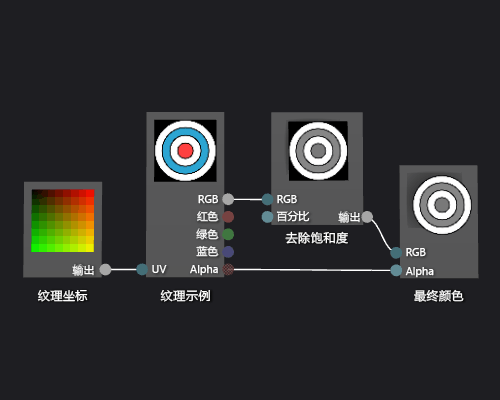

# 如何：创建灰度纹理着色器
[!INCLUDE[vs2017banner](../code-quality/includes/vs2017banner.md)]

本文档演示如何使用着色器设计器和定向关系图着色器语言 \(DGSL\) 来创建灰度纹理着色器。  此着色器修改纹理示例的 RGB 颜色值，然后将其与未修改的 alpha 值一起使用以便设置最终颜色。  
  
## 创建灰度纹理着色器  
 您可以通过在写入其到最终输出颜色之前修改纹理示例的颜色值实现灰度纹理着色器。  
  
 在开始之前，请确保显示**“属性”**窗口和**“工具箱”**。  
  
#### 创建灰度纹理着色器  
  
1.  创建基本的纹理着色器，如 [如何：创建基本纹理着色器](../designers/how-to-create-a-basic-texture-shader.md)所述。  
  
2.  从**“最终颜色”**节点的**“RGB”**终端断开连接**“纹理示例”**节点的**“RGB”**终端。  在 **选择** 模式中，选择 **RGB 纹理示例** 终端节点，然后选择 **断开链接**。  这为在下一步中添加的节点腾出空间。  
  
3.  添加一个**“降低饱和”**节点到关系图中。  在**“算术”**下的**“筛选器”**中，选择**“饱和度”**并将其移动到设计图面。  
  
4.  使用 **去除饱和度** 节点计算值。  在**“选择”**模式下，移动**Texture Sample** 节点的**RGB**终端到**RGB** 终端的**Desaturate** 节点.  
  
    > [!NOTE]
    >  默认情况下，节点 **去除饱和度** 完全减小输入颜色的饱和度，并且使用标准亮度加权灰阶的转换  通过改变**Luminance** 属性值来改变**去饱和度** 节点行为，或通过部分减小输入颜色的饱和度。  对于部分减小输入颜色饱和度，提供了范围 \[0,1\) 的标量值为 **百分比**的 **去除饱和度** 终端节点。  
  
5.  连接灰度颜色值到最终颜色。  将**“去饱和度”**节点的**“输出”**终端移到**“最终颜色”**节点的**“RGB”**终端。  
  
 下图显示了完整的着色器关系图和应用于多维数据集的着色器的预览。  
  
> [!NOTE]
>  在此插图，指定为预览形状和纹理平面，更好地演示着色器的效果。  
  
   
  
 某些形状可能为某些着色器提供更好的预览。  有关在着色器设计器中预览着色器的更多信息，请参见 [着色器设计器](../designers/shader-designer.md)  
  
## 请参阅  
 [如何：向三维模型应用着色器](../designers/how-to-apply-a-shader-to-a-3-d-model.md)   
 [如何：导出着色器](../designers/how-to-export-a-shader.md)   
 [图像编辑器](../designers/image-editor.md)   
 [着色器设计器](../designers/shader-designer.md)   
 [着色器设计器节点](../designers/shader-designer-nodes.md)