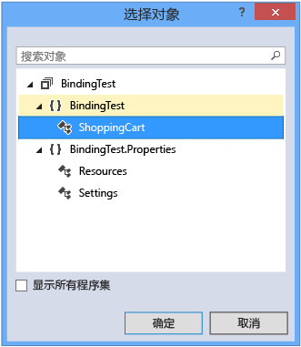

# <a name="walkthrough-binding-to-data-in-xaml-designer"></a>演练：将数据绑定到 XAML 设计器
在 XAML 设计器中，可以通过使用美工板和“属性”窗口设置数据绑定属性。 本演练中的示例演示如何将数据绑定到控件。 具体而言，本演练展示如何创建具有名为 `ItemCount` 的 [DependencyProperty](http://msdn.microsoft.com/library/windows/apps/windows.ui.xaml.dependencyproperty.aspx) 的简单购物车类，然后将 `ItemCount` 属性绑定到 [TextBlock](http://msdn.microsoft.com/library/windows/apps/windows.ui.xaml.controls.textblock.aspx) 控件的 **Text** 属性。  
  
### <a name="to-create-a-class-to-use-as-a-data-source"></a>创建一个类以用作数据源的步骤  
  
1.  在“文件”  菜单上，选择“新建” 、“项目” 。  
  
2.  在“新建项目”对话框中，选择“Visual C#”或“Visual Basic”节点，展开“Windows 桌面”节点，然后选择“WPF 应用程序”模板。  
  
3.  将项目命名为“BindingTest”，然后选择“确定”按钮。  
  
4.  打开 MainWindow.xaml.cs（或 MainWindow.xaml.vb）文件并添加下面的代码。 在 C# 中，在 `BindingTest` 命名空间中添加代码（文件中最后一个右括号之前）。 在 Visual Basic 中，仅添加新类。  
  
    ```csharp  
    public class ShoppingCart : DependencyObject  
    {  
        public int ItemCount  
        {  
            get { return (int)GetValue(ItemCountProperty); }  
            set { SetValue(ItemCountProperty, value); }  
        }  
  
        public static readonly DependencyProperty ItemCountProperty =  
             DependencyProperty.Register("ItemCount", typeof(int),  
             typeof(ShoppingCart), new PropertyMetadata(0));  
    }  
  
    ```  
  
    ```vb  
    Public Class ShoppingCart  
        Inherits DependencyObject  
  
        Public Shared ReadOnly ItemCountProperty As DependencyProperty = DependencyProperty.Register(  
            "ItemCount", GetType(Integer), GetType(ShoppingCart), New PropertyMetadata(0))  
        Public Property ItemCount As Integer  
            Get  
                ItemCount = CType(GetValue(ItemCountProperty), Integer)  
            End Get  
            Set(value As Integer)  
                SetValue(ItemCountProperty, value)  
            End Set  
        End Property  
    End Class  
    ```  
  
     这段代码使用 [PropertyMetadata](http://msdn.microsoft.com/library/windows/apps/windows.ui.xaml.propertymetadata.aspx) 对象，将默认项计数的值设置为 0。  
  
5.  在“文件”菜单上，选择“生成”、“生成解决方案。  
  
### <a name="to-bind-the-itemcount-property-to-a-textblock-control"></a>将 ItemCount 属性绑定到 TextBlock 控件的步骤  
  
1.  在解决方案资源管理器中，打开 MainWindow.xaml 的快捷菜单，然后选择“视图设计器”。  
  
2.  在工具箱中，选择[网格](http://msdn.microsoft.com/library/windows/apps/windows.ui.xaml.controls.grid.aspx)控件，并将其添加到窗体。  
  
3.  选定 `Grid` 后，在属性窗口中，选择“DataContext”属性旁边的“新建”按钮。  
  
4.  在“选择对象”对话框中，确保清除“显示所有程序集”复选框，选择“BindingTest”命名空间下的“ShoppingCart”，然后选择“确定”按钮。  
  
     下图显示了“ShoppingCart”处于选中状态的“选择对象”对话框。  
  
       
  
5.  在“工具箱”中，选择一个 `TextBlock` 控件将其添加到窗体。  
  
6.  选定 `TextBlock` 控件后，在“属性”窗口中，选择“文本”属性右侧的属性标记，然后选择“创建数据绑定”。 （属性标记看上去像一个小框。）  
  
7.  在“创建数据绑定”对话框的“路径”框中，选择“ItemCount: (int32)”属性，然后选择“确定”按钮。  
  
     下图显示选定“ItemCount”属性的“创建数据绑定”对话框。  
  
       
  
8.  按 F5 运行应用。  
  
     `TextBlock` 控件应将默认值 0 显示为文本。  
  
## <a name="see-also"></a>请参阅  
 [使用 XAML 设计器创建 UI](../designers/creating-a-ui-by-using-xaml-designer-in-visual-studio.md)   
 [添加值转换器”对话框](https://msdn.microsoft.com/en-us/c5f3d110-a541-4b55-8bca-928f77778af8)