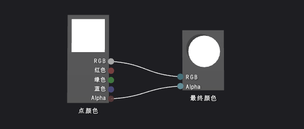
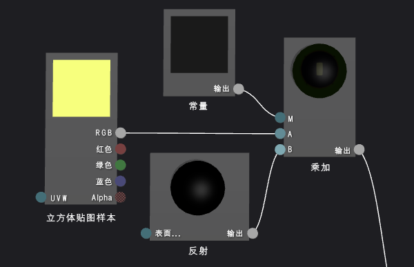

# 演练：创建真实的三维撞球
[!INCLUDE[vs2017banner](../code-quality/includes/vs2017banner.md)]

本演练演示如何在 [!INCLUDE[vsprvs](../code-quality/includes/vsprvs_md.md)] 中使用着色器设计器和图像编辑器来创建切实可行的三维撞球。  撞球的三维外观通过将多个着色器技术借助适当的纹理资源。  
  
 本文档演示这些活动：  
  
-   通过使用形状和纹理，创建撞球的基本外观。  
  
-   使用朗伯照明模型添加深度。  
  
-   使用镜像突出显示增强基本外观。  
  
-   通过反映环境创建空白的意义。  
  
## 系统必备  
 为了完成本演练，您需要以下组件和技巧：  
  
-   程序集纹理的工具到多维数据集映射中，例如在 2010 年 6 月 DirectX SDK 中包含的 DirectX 纹理工具。  
  
-   熟悉 [!INCLUDE[vsprvs](../code-quality/includes/vsprvs_md.md)] 中的图像编辑器。  
  
-   熟悉 [!INCLUDE[vsprvs](../code-quality/includes/vsprvs_md.md)] 中的着色器设计器。  
  
## 使用形状和纹理创建基本的外观  
 在计算机图形中，外观的最基本元素是形状和颜色。  在计算机模拟中，通常会使用三维模型来表示实际对象的形状。  通过使用纹理映射，颜色详细信息然后将应用于模型的图面。  
  
 通常，您必须要求一个艺术家创建您可以使用的 3\-D 模型，但是因为撞球是常用形状（球体），所以“着色器设计器”以在其内生成了合适的模型。  
  
 的球体是着色器设计器中的默认预览形状；如果您当前使用不同的形状预览您的着色器，请切换回该球体。  
  
#### 通过使用球体预览着色器  
  
-   在“着色器设计器”工具栏上，选择**“用球体预览”**。  
  
 在下一步骤中，您将创建应用纹理于模型的着色器程序，但是，首先您必须创建可以使用的纹理。  本演练演示了如何使用作为 [!INCLUDE[vsprvs](../code-quality/includes/vsprvs_md.md)] 一部分的图像编辑器创建纹理，但可以使用可以以合适格式保存该纹理的任何图象编辑器。  
  
 确保**“属性”**窗口和**“工具箱”**都显示。  
  
#### 通过使用图像编辑器创建撞球纹理  
  
1.  创建要使用的纹理。  有关如何向项目中添加纹理的信息，请参见[图像编辑器](../designers/image-editor.md) 中的“入门”部分。  
  
2.  设置图像大小，使其宽度是其高度的两倍；考虑到纹理映射到撞球的球状图面上的方式，必须进行这样的设置。  若要重新调整图像的大小，在**“属性”**窗口中，为**“宽度”**和**“高度”**属性指定新的值。  例如，将“宽度”设置为 512，将“高度”设置为 256。  
  
3.  绘制撞球的纹理，记住纹理如何映射到球体上。  
  
     纹理看起来应该类似于：  
  
       
  
4.  或者，您可能想要减少此纹理的存储要求。  您可以通过减少纹理的宽度以匹配其高度来执行此操作。  这沿着其宽度压缩纹理，并因纹理映射到球体的方式，而在呈现撞球时将其扩展。  在调整大小之后，纹理看起来应该类似于：  
  
       
  
 现在您可以创建将此纹理应用到模型的着色器。  
  
#### 创建基本纹理着色器  
  
1.  创建要使用的 DGSL 着色器。  有关如何向项目中添加 DGSL 着色器的信息，请参见[着色器设计器](../designers/shader-designer.md)中的“入门”部分。  
  
     默认情况下，着色器关系图如下所示:  
  
       
  
2.  修改默认着色器，以便着色器将纹理示例的值应用于当前像素中。  着色器关系图应类似于：  
  
       
  
3.  应用通过配置纹理属性在上一过程中创建的纹理。  将**“纹理示例”**节点的**“纹理”**属性设置为**“纹理”**，然后通过使用相同属性窗口中**“纹理”**属性组的**“文件名”**属性来指定纹理文件。  
  
 有关如何在您的着色器中应用纹理的更多信息，请参见 [如何：创建基本纹理着色器](../designers/how-to-create-a-basic-texture-shader.md)。  
  
 现在，您的撞球看起来应类似于以下这种情况：  
  
   
  
## 用朗伯照明模型创建深度  
 到目前为止，已创建容易注意的台球。  但是，它看上去没有立体感且无趣 \- 更像是动画图片上的台球，而不是令人信服的仿制品。  简单化的着色器中的平面外观，其行为就像撞球的图面上的每个像素接收数量相同的光源。  
  
 在实际情况中，光显示最直接图面的直接文本光源并在光源的一个斜角显示很少的光在图面上。  这是因为当图面直接面对光源时光线的能源分布在最小表面积上。  当图面启用离开该光源，分布能源的同一量在一增加地较大图面区域外围。  面对远离光源的图面没有收到光源，可以导致完全黑色的外观。  在对象的图面上，亮度中的此变体是帮助指示对象的形状的重要可视提示；没有该变体，该对象以平面呈现。  
  
 在计算机图形中，*照明模型*—复杂的简单近似、现实世界的照明交互—用于复制现实世界照明的外观。  朗伯照明模型随跨以前段落中描述的图面的漫性反映光的量变化。  可以将朗伯照明模型添加到您的着色器提供撞球令人信服三维外观。  
  
#### 向您的着色器添加朗伯照明  
  
-   修改您的着色器以通过朗伯照明值来调整纹理示例的值。  您的着色器关系图应类似于：  
  
       
  
-   或者，通过配置着色器关系图的“MaterialDiffuse”属性来调整光照的行为方式。  要访问着色器关系图的属性，请选择设计图面的空白区域，然后在“属性”窗口中找到您想要访问的属性。  
  
 有关如何在您的着色器中应用朗伯照明的更多信息，请参见 [如何：创建基本朗伯着色器](../designers/how-to-create-a-basic-lambert-shader.md)。  
  
 使用朗伯照明应用，您的撞球看起来应类似于以下这种情况：  
  
   
  
## 使用镜像突出显示增强基本外观  
 朗伯照明模型提供不存在于仅纹理着色器中的形状和维度的意义。  但是，台球的外观看上去仍然单调。  
  
 实际撞球通常具有反射其上面的光的一部分的光滑完成。  某些自反镜像中突出显示的小的结果，模拟图面的反射属性。  基于完成的属性，突出显示可本地化或清除，强烈或细微变化。  这些镜面反映使用的光源、图面方向和照相机位置之间的关系建模—即，当图面方向直接将光源反射到照相机中时，突出显示最强烈，而当该反射不那么直接时突出显示就不那么强烈。  
  
 Phong 照明模型在朗伯照明模型中生成，包括如前一段中描述的反射高光。  您可以将 Phong 照明模型添加到您的着色器来提供给撞球模拟完成导致更有趣的外观。  
  
#### 向您的着色器添加镜像突出显示  
  
1.  修改您的着色器以通过使用附加混合来包含反射量。  您的着色器关系图应类似于：  
  
       
  
2.  或者，通过配置着色器关系图的反射属性（“MaterialSpecular”和“MaterialSpecularPower”）来调整反射光线的行为方式。  要访问着色器关系图的属性，请选择设计图面的空白区域，然后在“属性”窗口中找到要访问的属性。  
  
 有关如何在您的着色器中应用反射高光的更多信息，请参见 [如何：创建基本 Phong 着色器](../designers/how-to-create-a-basic-phong-shader.md)。  
  
 使用反射突出显示应用，您的撞球看起来应类似于以下这种情况：  
  
   
  
## 通过反映环境创建空白的意义  
 应用反射突出显示，您的撞球看起来相当信服。  它获得了正确的形状、正确的绘制作业并完成正确。  但是，还有一种方法，使您的台球更像其所处环境的一部分。  
  
 如果您进一步检查实际撞球，可以看到它的光滑表面不仅仅是显示反射高光，还微弱地反映在它周围的世界的图像。  您可以通过使用该环境的图像作为纹理并与模型自己的纹理结合确定每个像素的最终颜色来模拟此反射。  根据实现的需要，您可以与着色器的其余部分一起合并或多或少反射纹理。  例如，模拟一个高度反射性图面（如镜子）的着色器可能仅适用反射材质，但模拟更精细的反射（如台球表面）的着色器，通常是将反射材质的值的一小部分与着色器的计算结果（其余部分）结合。  
  
 当然，您不能以应用模型的纹理贴图的方式，将反射的图像应用到模型中。  如果这样，则世界的反射将与撞球一起移动，就象反射粘到它上面一样。  由于反射可能来自任意方向，需要从任何角度提供反射映射值的方法，以及基于世界保持面向反射映射的方法。  若要满足可使用纹理映射的这些要求，调用 *数据集映射* — 为形成立方体各边安排的六个纹理。  从此多维数据集内，可以指向任意方向，以查找纹理值。  如果多维数据集的每一面的纹理都包含环境的图像，则可以通过采样多维数据集的图面的正确位置模拟所有反射。  通过使多维数据集对齐该领域，您将收到该环境的准确反射。  若要确定应采样多维数据集的位置，只在对象的图面外计算照相机矢量的反射，然后将其用作三维纹理坐标。  使这种方式使用多维数据集映射是一种名为*“环境映射”*的常见技术。  
  
 环境映射提供如前面所述的实际反射的一个有效的近似。  可以混合环境映射的反射到您的着色器中来指定撞球在场景中进行撞球似乎更接地的模拟完成。  
  
 第一步是创建一个数据集映射纹理。  在大多数应用程序中，多维映射的内容不完全有效，特别在反射细微或不在屏幕上占有突出显示的空间。  例如，许多游戏使用预先计算的立方体贴图进行环境映射，对于每个反射对象，仅使用最接近的一个，尽管这意味着反射不准确。  甚至一个大致的焦点视觉样式通常足够有益于一个令人信服效果。  
  
#### 通过使用图像编辑器创建环境映射的纹理  
  
1.  创建要使用的纹理。  有关如何向项目中添加纹理的信息，请参见[图像编辑器](../designers/image-editor.md) 中的“入门”部分。  
  
2.  设置图像大小，使其宽度与其高度相等并且是 2 的幂；立方体贴图编入索引的方式决定了这是必需的。  若要重新调整图像的大小，在**“属性”**窗口中，为**“宽度”**和**“高度”**属性指定新的值。  例如，将“宽度”和“高度”属性的值设置为 256。  
  
3.  使用纯色填充纹理。  此纹理将为多维数据集映射的底部，与台球台图面对应。  保留颜色记住用于下一个纹理。  
  
4.  创建与第一纹理大小相同的第二纹理。  此纹理在多维数据集映射的四个边中重复，与台球台各边和各面以及周围的区域对应。  通过使用与底部纹理相同的颜色绘制此纹理的台球台的表面。  纹理看起来应该类似于：  
  
       
  
     请记住，反射映射不必逼真才会有效，例如，用于创建本文中的图像的立方体贴图仅包含四个凹槽门而不是六个。  
  
5.  创建与其他纹理大小相同的第三纹理。  此纹理将为多维数据集映射的顶部，与台球台的上限对应。  若要使此部分反射更有趣，您可以绘制一盏吊灯增强您在上一过程的着色器的镜像突出显示。  纹理看起来应该类似于：  
  
       
  
 既然已为立方体贴图的侧面创建各个纹理，那么您可以使用工具将这些纹理组建到可以存储在一个 .dds 纹理中的立方体贴图中。  您可以使用要创建多维数据集映射的所有程序，只要它可以用 .dds 纹理格式保存多维数据集映射。  本演练演示如何使用 2010 年 6 月 DirectX SDK 的部件的 DirectX 纹理工具来创建纹理。  
  
#### 通过使用 DirectX 纹理工具安装多维数据集映射  
  
1.  在 DirectX 纹理工具中，在主菜单上，选择**“文件”**，**“新的纹理”**。  此时将出现**“新纹理”**对话框。  
  
2.  在**“纹理类型”**组中，选择**“立方体贴图纹理”**。  
  
3.  在**“维度”**组中，输入**“宽度”**和**“高度”**的正确值，然后选择**“确定”**。  显示新的纹理文档。  默认情况下，纹理首先显示在对应于**“正 X”**多维数据集文本的纹理文档。  
  
4.  将您为纹理立方体侧面创建的纹理加载到立方体图面。  在主菜单中，选择**“文件”**、**“打开此 Cubemap 图面”**，选择您为立方体侧面创建的纹理，然后选择**“打开”**。  
  
5.  重复**“负 X”**、**“正 Z”**和**“负 Z”**立方体面的步骤 4。  为此，您必须查看要加载的面。  若要查看其他多维数据集映射文本，在主菜单上，选择**“视图”**、**“多维数据集映射文本”**，然后选择要查看的文本。  
  
6.  将您为纹理多维数据集顶面创建的纹理加载到**“正 Y”**多维数据集表面。  
  
7.  将您为纹理多维数据集底面创建的纹理加载到**“负 Y”**多维数据集表面。  
  
8.  保存该文理。  
  
 您可以假设立方体贴图的格式如下：  
  
   
  
 在顶部的图像是正 Y \(\+Y\) 多维数据集文本；在中间，从左至右，为 –X、\+Z、\+X 和 –Z多维数据集文本；在底部是 –Y 多维数据集文本。  
  
 现在您可以修改着色器以将立方体贴图示例混合到其他着色器中。  
  
#### 向您的着色器添加环境映射  
  
1.  修改您的着色器以通过使用附加混合来包含环境映射量。  您的着色器关系图应类似于：  
  
       
  
     请注意，可以使用“乘加”节点简化着色器关系图。  
  
     这是实现环境映射着色器节点的更详细的视图：  
  
       
  
2.  应用通过配置多维映射的纹理属性在上一过程中创建的纹理。  使用**“Texture2”**属性组的**“文件名”**属性，请**“Cubemap 示例”**节点的 **“纹理”**属性的值设置为**“Texture2”**，然后指定纹理文件。  
  
3.  或者，通过配置“常数”节点的“输出”属性来调整撞球的反射率。  要访问节点的属性，请选择属性然后在“属性”窗口中找到要访问的属性。  
  
 使用环境映射应用，您的撞球看起来应类似于以下这种情况：  
  
   
  
 在此最后图像中，请注意添加的工作量如何合在一起创建非常逼真的撞球。  形状、纹理和照明创建三维对象的基本外观，且反射高光和反射使撞球更有趣并看起来像其环境的一部分。  
  
## 请参阅  
 [如何：导出着色器](../designers/how-to-export-a-shader.md)   
 [如何：向三维模型应用着色器](../designers/how-to-apply-a-shader-to-a-3-d-model.md)   
 [着色器设计器](../designers/shader-designer.md)   
 [图像编辑器](../designers/image-editor.md)   
 [着色器设计器节点](../designers/shader-designer-nodes.md)