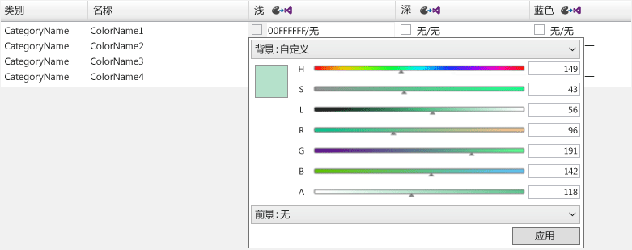
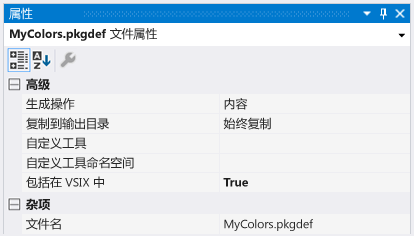
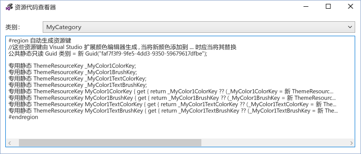

# VSIX 颜色编辑器
[!INCLUDE[vs2017banner](../../code-quality/includes/vs2017banner.md)]

Visual Studio 扩展颜色编辑器工具可以创建和编辑 Visual Studio 自定义颜色。 该工具还可以生成主题的资源键，以便可以在代码中使用的颜色。 此工具可用于使支持主题的 Visual Studio 扩展插件的颜色。 此工具可以打开.pkgdef 和.xml 文件。 通过更改文件扩展名为.xml，visual Studio 主题 \(.vstheme 文件\) 可以使用与 Visual Studio 扩展颜色编辑器。 此外，可以将.vstheme 文件导入当前的.xml 文件。  
  
   
  
 **包定义文件**  
  
 包定义 \(.pkgdef\) 文件是用于定义主题的文件。 颜色本身存储在主题颜色.xml 文件，可编译成一个.pkgdef 文件。 .Pkgdef 文件部署到 Visual Studio 可搜索位置，在运行时，处理和合并，以定义主题。  
  
 **颜色令牌**  
  
 颜色令牌由四个元素组成:  
  
-   **类别名称:** 的颜色集的逻辑分组。 如果已有特定于所需的 UI 元素或组的用户界面元素的颜色，请使用现有的类别名称。  
  
-   **令牌名称:** 颜色令牌和标记集的描述性名称。 设置包括背景和前景 \(文本\) 标记名称，以及所有其状态，以及这些应命名，因此很容易识别对，并且它们应用于的状态。  
  
-   **颜色值 \(或色调\):** 所需的每个彩色的主题。 始终创建背景和文本颜色值对。 颜色背景\/前景成对出现，以便始终在其上绘制背景色可读的文本 \(前景\) 颜色。 这些颜色进行链接，将在 UI 中一起使用。 如果不能用文本的背景，不要定义前景色。  
  
-   **系统颜色名称:** 用于在高对比度的显示。  
  
## 如何使用该工具  
 尽可能多地，并根据需要，而不是进行新的应重复使用现有的 Visual Studio 颜色。 但是，在其中定义没有适当的颜色的情况下，自定义颜色应为创建以保留扩展主题兼容。  
  
 **创建新颜色令牌**  
  
 若要创建使用 Visual Studio 扩展颜色编辑器的自定义颜色，请按照下列步骤:  
  
1.  确定新的颜色标记的类别和标记名称。  
  
2.  选择为高对比度的用户界面元素将用于每个主题和的系统颜色色调。  
  
3.  使用颜色编辑器来创建新颜色令牌。  
  
4.  在 Visual Studio 扩展中使用的颜色。  
  
5.  在 Visual Studio 中测试所做的更改。  
  
 **第 1 步: 确定类别和的新颜色令牌的令牌名称。**  
  
 首选的命名方案为 VSColor **\[Category\] \[UI 类型\] \[State\]**。 不要 VSColor 名称中使用单词"color"，因为它是冗余。  
  
 类别名称提供逻辑分组，并且应定义为尽可能窄。 例如，一个工具窗口的名称可能是类别名称，但不是整个业务部门或项目团队的名称。 分组为类别条目有助于防止具有相同名称的颜色之间产生混淆。  
  
 元素类型的情况下或"状态，"颜色将为其应用，必须清楚地指示令牌的名称。 例如，活动数据提示的 **\[UI type\]** 可以命名为"**数据提示**"和 **\[State\]** 可以命名为"**Active**,，"生成的颜色名称"**DataTipActive**。" 由于数据提示文本，前景色和背景色会需要定义。 通过使用后台\/前景配对，颜色编辑器将自动创建颜色"**DataTipActive**"背景和"**DataTipActiveText**"的前景。  
  
 如果用户界面有只有一个状态， **\[State\]** 名称的一部分，则可以省略。 例如，如果搜索框中有一个边框，并且没有未发生状态更改将影响边框的颜色，然后边框的颜色标记的名称可以简单地调用"**SearchBoxBorder**。"  
  
 一些常见的状态名称包括:  
  
-   活动  
  
-   非活动状态  
  
-   鼠标悬停  
  
-   MouseDown  
  
-   已选定  
  
-   已设定焦点  
  
 列表项控件的部分的几个令牌名称的示例:  
  
-   ListItem  
  
-   ListItemBorder  
  
-   ListItemMouseOver  
  
-   ListItemMouseOverBorder  
  
-   ListItemSelected  
  
-   ListItemSelectedBorder  
  
-   ListItemDisabled  
  
-   ListItemDisabledBorder  
  
 **步骤 2: 选择为高对比度的用户界面元素将用于每个主题和的系统颜色色调。**  
  
 为用户界面中选择自定义颜色时, 选择类似现有的用户界面元素，并为基础使用其颜色。 框中 UI 元素的颜色已进行审核和测试，因此它们将外观更加适合并且可在所有的主题中的正确行为。  
  
 **步骤 3: 使用颜色编辑器来创建新颜色令牌。**  
  
 启动颜色编辑器和打开或创建新的自定义主题颜色.xml 文件。 选择 **编辑 \> 新颜色** 从菜单。 这将打开一个对话框，以指定类别以及该类别中的颜色项的一个或多个名称:  
  
   
  
 选择现有类别，或选择 **新类别** 要创建新类别。 将打开另一个对话框，并创建一个新的类别名称:  
  
   
  
 新的类别然后将变为可用在 **新颜色** 类别下拉菜单。 选择后一个类别，输入新的每个颜色标记每行一个名称，然后选择"创建"完成后:  
  
   
  
 使用"None"，该值指示尚未定义颜色背景\/前景对列出颜色值。 注意: 如果颜色不具有文本颜色\/背景颜色对，则只有背景需要进行定义。  
  
   
  
 若要编辑颜色标记，请选择该令牌的主题 \(列\) 的颜色条目。 通过以 8 位 ARGB 格式键入十六进制颜色值、 签署该单元格，系统颜色名称或使用下拉菜单中选择所需的颜色，通过一组颜色滑块或系统颜色的列表中添加的颜色值。  
  
   
  
   
  
 对于不需要显示文本的组件，请输入只能有一个颜色值: 的背景色。 否则，输入文本和背景色，并用正斜杠分隔的值。  
  
 高对比度为输入值，当输入有效的 Windows 系统的颜色名称。 不要输入硬编码 ARGB 值。 可以通过从颜色值下拉列表菜单选择"背景:: 系统"或"前景:: 系统"来查看有效的系统颜色名称的列表。 创建具有文本组件的元素时，使用正确的背景文本系统颜色对或文字可能无法读取。  
  
 当您完成创建、 设置和编辑颜色令牌时，将它们保存到所需的.xml 或.pkgdef 格式。 令牌具有既没有背景的颜色也前景集将另存为.xml 格式的空颜色，但在.pkgdef 格式中被丢弃。 如果您尝试将空颜色保存到一个.pkgdef 文件，一个对话框将警告您可能颜色丢失。  
  
 **步骤 4: 使用 Visual Studio 扩展中的颜色。**  
  
 定义新颜色后，"生成操作"设置为"Content"在项目文件中的标记，包括.pkgdef 和"包括在 VSIX"设置为"True。  
  
   
  
 在 Visual Studio 扩展颜色编辑器中，选择文件 \> 查看资源的代码，若要查看用于访问自定义的代码中的基于 WPF 的 UI 的颜色。  
  
   
  
 在项目中的静态类中包含此代码。 对引用 **Microsoft.VisualStudio.Shell。 \< VSVersion \>.0.dll** 需要添加到要使用的项目 **ThemeResourceKey** 类型。  
  
```c#  
namespace MyCustomColors { public static class MyCategory { #region Autogenerated resource keys // These resource keys are generated by Visual Studio Extension Color Editor, and should be replaced when new colors are added to this category. public static readonly Guid Category = new Guid("faf7f3f9-9fe5-4dd3-9350-59679617dfbe"); private static ThemeResourceKey _MyColor1ColorKey; private static ThemeResourceKey _MyColor1BrushKey; private static ThemeResourceKey _MyColor1TextColorKey; private static ThemeResourceKey _MyColor1TextBrushKey; public static ThemeResourceKey MyColor1ColorKey { get { return _MyColor1ColorKey ?? (_MyColor1ColorKey = new ThemeResourceKey(Category, "MyColor1", ThemeResourceKeyType.BackgroundColor)); } } public static ThemeResourceKey MyColor1BrushKey { get { return _MyColor1BrushKey ?? (_MyColor1BrushKey = new ThemeResourceKey(Category, "MyColor1", ThemeResourceKeyType.BackgroundBrush)); } } public static ThemeResourceKey MyColor1TextColorKey { get { return _MyColor1TextColorKey ?? (_MyColor1TextColorKey = new ThemeResourceKey(Category, "MyColor1", ThemeResourceKeyType.ForegroundColor)); } } public static ThemeResourceKey MyColor1TextBrushKey { get { return _MyColor1TextBrushKey ?? (_MyColor1TextBrushKey = new ThemeResourceKey(Category, "MyColor1", ThemeResourceKeyType.ForegroundBrush)); } } #endregion } }  
```  
  
 这使用户可以访问 XAML 代码中的颜色，并允许 UI 主题的更改作出响应。  
  
```xaml  
<UserControl x:Class="NewTestProject.TestPackageControl" Name="MyToolWindow" xmlns="http://schemas.microsoft.com/winfx/2006/xaml/presentation" xmlns:x="http://schemas.microsoft.com/winfx/2006/xaml" xmlns:ns="clr-namespace:MyCustomColors"> <Grid> <TextBlock Background="{DynamicResource {x:Static ns:MyCategory.MyColor1BrushKey}}" Foreground="{DynamicResource {x:Static ns:MyCategory.MyColor1TextBrushKey}}" >Sample Text</TextBlock> </Grid> </UserControl>  
```  
  
 **步骤 5: 在 Visual Studio 中测试所做的更改。**  
  
 颜色编辑器可以暂时将颜色令牌应用到 Visual Studio 以查看对颜色的实时更改而无需重新生成扩展包的运行中实例。 若要执行此操作，请单击位于主题中的每一列的标题上的"将此主题应用于运行 Visual Studio 窗口"按钮。 VSIX 颜色编辑器关闭时，此临时主题将消失。  
  
   
  
 若要进行永久性更改，重新生成并向.pkgdef 文件添加新的颜色和编写代码，将使用这些颜色之后重新部署 Visual Studio 扩展。 重新生成的 Visual Studio 扩展将合并到主题的其余部分的新颜色的注册表值。 然后重新启动 Visual Studio、 查看用户界面，并验证的新颜色都按预期方式。  
  
## 备注  
 此工具旨在用来创建自定义颜色的预先存在的 Visual Studio 主题，或者要编辑的自定义 Visual Studio 主题颜色。 若要创建自定义 Visual Studio 的完整主题，请下载 [Visual Studio Color Theme Editor 扩展](http://visualstudiogallery.msdn.microsoft.com/6f4b51b6-5c6b-4a81-9cb5-f2daa560430b) 从 Visual Studio 扩展库。  
  
## 示例输出  
 **XML 颜色输出**  
  
 由工具生成的.xml 文件将类似于这样:  
  
```xml  
<Themes> <Theme Name="Light" GUID="{de3dbbcd-f642-433c-8353-8f1df4370aba}"> <Category Name="CategoryName" GUID="{eee9d521-dac2-48d9-9a5e-5c625ba2040c}"> <Color Name="ColorName1"> <Background Type="CT_RAW" Source="FFFFFFFF" /> </Color> <Color Name="ColorName2"> <Background Type="CT_RAW" Source="FFFFFFFF" /> <Foreground Type="CT_RAW" Source="FF000000" /> </Color> <Color Name="ColorName3"> <Background Type="CT_RAW" Source="FFFF0000" /> </Color> <Color Name="ColorName4"> <Background Type="CT_RAW" Source="FF000088" /> <Foreground Type="CT_RAW" Source="FFFFFFFF" /> </Color> </Category> </Theme> <Theme Name="Dark" GUID="{1ded0138-47ce-435e-84ef-9ec1f439b749}">...</Theme> <Theme Name="Blue" GUID="{a4d6a176-b948-4b29-8c66-53c97a1ed7d0}">...</Theme> <Theme Name="HighContrast" GUID="{a5c004b4-2d4b-494e-bf01-45fc492522c7}">...</Theme> </Themes>  
  
```  
  
 **PKGDEF 颜色输出**  
  
 由工具生成.pkgdef 文件将类似于这样:  
  
```  
[$RootKey$\Themes\{de3dbbcd-f642-433c-8353-8f1df4370aba}\CategoryName] "Data"=hex:78,00,00,00,0b,00,00,00,01,00,00,00,21,d5,e9,ee,c2,da,d9,48,9a,5e,5c,62,5b,a2,04,0c,04,00,00,00,0a,00,00,00,43,6f,6c,6f,72,4e,61,6d,65,31,01,ff,ff,ff,ff,00,0a,00,00,00,43,6f,6c,6f,72,4e,61,6d,65,32,01,ff,ff,ff,ff,01,00,00,00,ff,0a,00,00,00,43,6f,6c,6f,72,4e,61,6d,65,33,01,ff,00,00,ff,00,0a,00,00,00,43,6f,6c,6f,72,4e,61,6d,65,34,01,00,00,88,ff,01,ff,ff,ff,ff [$RootKey$\Themes\{1ded0138-47ce-435e-84ef-9ec1f439b749}\CategoryName] "Data"=hex:... [$RootKey$\Themes\{a4d6a176-b948-4b29-8c66-53c97a1ed7d0}\CategoryName] "Data"=hex:... [$RootKey$\Themes\{a5c004b4-2d4b-494e-bf01-45fc492522c7}\CategoryName] "Data"=hex:...  
  
```  
  
 **C\# 资源键包装器**  
  
 由工具生成的颜色资源键将类似于这样:  
  
```c#  
namespace MyNamespace { public static class MyColors { #region Autogenerated resource keys // These resource keys are generated by Visual Studio Extension Color Editor, and should be replaced when new colors are added to this category. public static string ColorName1ColorKey { get { return "ColorName1ColorKey"; } } public static string ColorName1BrushKey { get { return "ColorName1BrushKey"; } } public static string ColorName2ColorKey { get { return "ColorName2ColorKey"; } } public static string ColorName2BrushKey { get { return "ColorName2BrushKey"; } } public static string ColorName2TextColorKey { get { return "ColorName2TextColorKey"; } } public static string ColorName2TextBrushKey { get { return "ColorName2TextBrushKey"; } } public static string ColorName3ColorKey { get { return "ColorName4ColorKey"; } } public static string ColorName3BrushKey { get { return "ColorName4BrushKey"; } } public static string ColorName3TextColorKey { get { return "ColorName4TextColorKey"; } } public static string ColorName3TextBrushKey { get { return "ColorName4TextBrushKey"; } } #endregion } }  
```  
  
 **WPF 资源字典包装器**  
  
 颜色 **ResourceDictionary** 由该工具生成的密钥将类似于这样:  
  
```xaml  
<ResourceDictionary xmlns="http://schemas.microsoft.com/winfx/2006/xaml/presentation" xmlns:x="http://schemas.microsoft.com/winfx/2006/xaml" xmlns:colors="clr-namespace:MyNamespace"> <SolidColorBrush x:Key="{x:Static colors:MyColors.ColorName1BrushKey}" Color="#FFFFFFFF" /> <Color x:Key="{x:Static colors:MyColors.ColorName1ColorKey}" A="255" R="255" G="255" B="255" /> <SolidColorBrush x:Key="{x:Static colors:MyColors.ColorName2BrushKey}" Color="#FFFFFFFF" /> <Color x:Key="{x:Static colors:MyColors.ColorName2ColorKey}" A="255" R="255" G="255" B="255" /> <SolidColorBrush x:Key="{x:Static colors:MyColors.ColorName2TextBrushKey}" Color="#FF000000" /> <Color x:Key="{x:Static colors:MyColors.ColorName2TextColorKey}" A="255" R="0" G="0" B="0" /> <SolidColorBrush x:Key="{x:Static colors:MyColors.ColorName3BrushKey}" Color="#FFFF0000" /> <Color x:Key="{x:Static colors:MyColors.ColorName3ColorKey}" A="255" R="255" G="0" B="0" /> <SolidColorBrush x:Key="{x:Static colors:MyColors.ColorName4BrushKey}" Color="#FF000088" /> <Color x:Key="{x:Static colors:MyColors.ColorName4ColorKey}" A="255" R="0" G="0" B="136" /> <SolidColorBrush x:Key="{x:Static colors:MyColors.ColorName4TextBrushKey}" Color="#FFFFFFFF" /> <Color x:Key="{x:Static colors:MyColors.ColorName4TextColorKey}" A="255" R="255" G="255" B="255" /> </ResourceDictionary>  
```