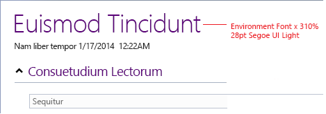
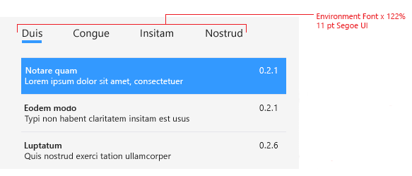

# 字体和格式对 Visual Studio
[!INCLUDE[vs2017banner](../../code-quality/includes/vs2017banner.md)]

##  <a name="BKMK_TheEnvironmentFont"></a> 环境字体  
 在 Visual Studio 中的所有字体必须都公开给用户进行自定义项。 这主要通过实现 **字体和颜色** 页 **工具 \> 选项** 对话框。 字体设置的三个主要类别是:  
  
-   **环境字体** — 主要字体的 IDE \(集成的开发环境\)，用于所有的界面元素，包括对话框、 菜单、 工具窗口和文档窗口。 默认情况下，环境字体取决于显示为 9 pt Segoe UI 在当前版本的 Windows 系统字体。 使用的所有界面元素的一种字体，有助于确保整个 IDE 具有一致的字体的外观。  
  
-   **文本编辑器** — 图面中的代码和其他基于文本的编辑器可以自定义的文本编辑器中的元素在页上 **工具 \> 选项**。  
  
-   **特定集合** — 提供用户界面元素的自定义可能会公开字体特定于其设计的设计器窗口图面自己设置页中 **工具 \> 选项**。  
  
### 自定义编辑器字体和大小调整  
 用户通常将放大或放大大小和\/或根据其喜好选择，独立于常规用户界面编辑器中文本的颜色。 由于可能会出现在中或作为一个编辑器\/设计器的一部分的元素上的使用环境字体，很重要时，要注意预期的行为更改了其中一个这些字体分类。  
  
 在编辑器中，但不是属于中创建显示的 UI 元素时 *内容*, ，很重要使用环境字体和不将文本字体，这样可预测的方式调整元素的大小。  
  
1.  有关代码文本在编辑器中，与代码文本字体设置调整大小并响应编辑器文本的缩放级别。  
  
2.  该接口的所有其他元素应绑定到环境字体设置，并在环境中的任何全局更改作出响应。 这包括 \(但不限于\):  
  
    -   上下文菜单中的文本  
  
    -   文本编辑器修饰，如变量的灯泡图标菜单文本、 快速查找编辑器窗格中，并定位到窗格中  
  
    -   在对话框中，如文件或重构代码中查找的文本设置标签  
  
### 访问环境字体  
 在本机模式或 WinForms 代码中，可以通过调用该方法访问环境字体 **IUIHostLocale::GetDialogFont** 后查询从 SID\_SUIHostLocale 服务接口。  
  
 有关 Windows Presentation Foundation \(WPF\) 中，从 shell 的派生自己的对话框窗口类 **DialogWindow** 类而不是 WPF 的 **窗口** 类。  
  
 在 XAML 中，代码如下所示:  
  
```  
<ui:DialogWindow x:Class"MyNameSpace.MyWindow" xmlns="http://schemas.microsoft.com/winfx/2006/xaml/presentation" xmlns:s="http://schemas.microsoft.com/winfx/2006/xaml" xmlns:ui="clr-namespace:Microsoft.VisualStudio.PlatformUI;assembly=Microsoft.VisualStudio.Shell.11.0" ShowInTaskbar="False" WindowStartupLocation="CenterOwner" Title="My Dialog"> </ui:DialogWindow> code behind: internal partial class WebConfigModificationWindow : DialogWindow { }  
  
```  
  
 \(替换 `Microsoft.VisualStudio.Shell.11.0` MPF dll 的当前版本。\)  
  
 若要显示对话框中，调用"**ShowModal\(\)**"通过类上 **ShowDialog\(\)**。**ShowModal\(\)** 在外壳程序中设置正确的模式状态，可确保该对话框位于父窗口中，依次类推。  
  
 代码如下所示:  
  
```  
MyWindow window = new MyWindow(); window.ShowModal()  
  
```  
  
 **ShowModal** 返回一个布尔值? \(可以为 null 的布尔值\) 与 **DialogResult**, ，如果需要可以使用它。 返回值时为 true 对话框中，已关闭 **确定**。  
  
 如果您需要在其自身中显示一些 WPF UI，不是一个对话框，并且承载 **HwndSource**, ，如弹出窗口或 Win32\/WinForms 父窗口窗口的 WPF 子窗口，您将需要设置 **FontFamily** 和 **FontSize** 的 WPF 元素的根元素上。 \(外壳中设置的属性在主窗口中，但它们不能被继承过去 HWND\)。 外壳中提供了该属性可以绑定到，像这样的资源:  
  
```  
<Setter property="FontFamily" Value="{DynamicResource VsFont.EnvironmentFontFamily}" /> <Setter property="FontSize" Value="{DynamicResource VsFont.EnvironmentFontSize}" />  
  
```  
  
###  <a name="BKMK_Formatting"></a> 格式设置 \(缩放\/粗体\) 参考  
 某些对话框需要特定的文本为粗体或以外环境字体的大小。 以前，大于环境字体的字体是编码为"环境字体 \+ 2"或类似。 使用提供的代码段将支持高 DPI 监视器，并确保在正确的大小和权重 \(如灯或 Semilight\) 始终显示的显示文本。  
  
> **请注意: 在应用格式设置之前，确保遵循以下中的指南 [文本样式](../../extensibility/ux-guidelines/fonts-and-formatting-for-visual-studio.md#BKMK_TextStyle)。**  
  
 若要缩放环境字体，请设置 TextBlock 或如所示的标签的样式。 每个使用得当，这些代码段将生成正确的字体，包括适当的尺寸和重量变体。  
  
 其中"vsui"是对 Microsoft.VisualStudio.Shell 的命名空间的引用:  
  
```  
xmlns:vsui="clr-namespace:Microsoft.VisualStudio.Shell;assembly=Microsoft.VisualStudio.Shell.14.0"  
  
```  
  
#### 375%环境字体 \+ Light  
 **显示为:** 34 pt Segoe UI Light  
  
 **用于:** \(很少\) 唯一署名的 UI，例如在启动页  
  
 **程序代码:** 其中"textBlock"是以前定义的 TextBlock，"标签"是以前定义的标签。  
  
```  
textBlock.SetResourceReference(TextBlock.StyleProperty, VsResourceKeys.TextBlockEnvironment375PercentFontSizeStyleKey); label.SetResourceReference(Label.StyleProperty, VsResourceKeys.LabelEnvironment375PercentFontSizeStyleKey);  
  
```  
  
 **XAML:** 设置 TextBlock 或标签的样式，如所示。  
  
```  
<TextBlock Style="{DynamicResource {x:Static vsui:VsResourceKeys.TextBlockEnvironment375PercentFontSizeStyleKey}}">TextBlock: 375 Percent Scaling</TextBlock> <Label Style="{DynamicResource {x:Static vsui:VsResourceKeys.LabelEnvironment375PercentFontSizeStyleKey}}">Label: 375 Percent Scaling</Label>  
  
```  
  
#### 310%环境字体 \+ Light  
 **显示为:** 28 pt Segoe UI Light  
  
 **用于:** 大签名对话框标题，主要在报表标题  
  
 **程序代码:** 其中"textBlock"是以前定义的 TextBlock，"标签"是以前定义的标签。  
  
```  
textBlock.SetResourceReference(TextBlock.StyleProperty, VsResourceKeys.TextBlockEnvironment310PercentFontSizeStyleKey); label.SetResourceReference(Label.StyleProperty, VsResourceKeys.LabelEnvironment310PercentFontSizeStyleKey);  
  
```  
  
 **XAML:** 设置 TextBlock 或标签的样式，如所示。  
  
```  
<TextBlock Style="{DynamicResource {x:Static vsui:VsResourceKeys.TextBlockEnvironment310PercentFontSizeStyleKey}}">TextBlock: 310 Percent Scaling</TextBlock> <Label Style="{DynamicResource {x:Static vsui:VsResourceKeys.LabelEnvironment310PercentFontSizeStyleKey}}">Label: 310 Percent Scaling</Label>  
  
```  
  
#### 200%环境字体 \+ Semilight  
 **显示为:** 18 pt Segoe UI Semilight  
  
 **用于:** 子标题、 小型和中型对话框中的标题  
  
 **程序代码:** 其中"textBlock"是以前定义的 TextBlock，"标签"是以前定义的标签。  
  
```  
textBlock.SetResourceReference(TextBlock.StyleProperty, VsResourceKeys.TextBlockEnvironment200PercentFontSizeStyleKey); label.SetResourceReference(Label.StyleProperty, VsResourceKeys.LabelEnvironment200PercentFontSizeStyleKey);  
  
```  
  
 **XAML:** 设置 TextBlock 或标签的样式，如所示。  
  
```  
<TextBlock Style="{DynamicResource {x:Static vsui:VsResourceKeys.TextBlockEnvironment200PercentFontSizeStyleKey}}">TextBlock: 200 Percent Scaling</TextBlock> <Label Style="{DynamicResource {x:Static vsui:VsResourceKeys.LabelEnvironment200PercentFontSizeStyleKey}}">Label: 200 Percent Scaling</Label>  
  
```  
  
#### 155%环境字体  
 **显示为:** 14 pt Segoe UI  
  
 **用于:** 文档中的节标题好用户界面或报告  
  
 **程序代码:** 其中"textBlock"是以前定义的 TextBlock，"标签"是以前定义的标签。  
  
```  
textBlock.SetResourceReference(TextBlock.StyleProperty, VsResourceKeys.TextBlockEnvironment155PercentFontSizeStyleKey); label.SetResourceReference(Label.StyleProperty, VsResourceKeys.LabelEnvironment155PercentFontSizeStyleKey);  
  
```  
  
 **XAML:** 设置 TextBlock 或标签的样式，如所示。  
  
```  
<TextBlock Style="{DynamicResource {x:Static vsui:VsResourceKeys.TextBlockEnvironment155PercentFontSizeStyleKey}}">TextBlock: 155 Percent Scaling</TextBlock> <Label Style="{DynamicResource {x:Static vsui:VsResourceKeys.LabelEnvironment155PercentFontSizeStyleKey}}">Label: 155 Percent Scaling</Label>  
  
```  
  
#### 133%环境字体  
 **显示为:** 12 磅 Segoe UI  
  
 **用于:** 在签名对话框和文档中的较小副标题好用户界面  
  
 **程序代码:** 其中"textBlock"是以前定义的 TextBlock，"标签"是以前定义的标签。  
  
```  
textBlock.SetResourceReference(TextBlock.StyleProperty, VsResourceKeys.TextBlockEnvironment133PercentFontSizeStyleKey); label.SetResourceReference(Label.StyleProperty, VsResourceKeys.LabelEnvironment133PercentFontSizeStyleKey);  
  
```  
  
 **XAML:** 设置 TextBlock 或标签的样式，如所示。  
  
```  
<TextBlock Style="{DynamicResource {x:Static vsui:VsResourceKeys.TextBlockEnvironment133PercentFontSizeStyleKey}}">TextBlock: 133 Percent Scaling</TextBlock> <Label Style="{DynamicResource {x:Static vsui:VsResourceKeys.LabelEnvironment133PercentFontSizeStyleKey}}">Label: 133 Percent Scaling</Label>  
  
```  
  
#### 122%环境字体  
 **显示为:** 11 pt Segoe UI  
  
 **用于:** 部分签名的对话框中的标题中前在树视图中，垂直选项卡导航节点,  
  
 **程序代码:** 其中"textBlock"是以前定义的 TextBlock，"标签"是以前定义的标签。  
  
```  
textBlock.SetResourceReference(TextBlock.StyleProperty, VsResourceKeys.TextBlockEnvironment122PercentFontSizeStyleKey); label.SetResourceReference(Label.StyleProperty, VsResourceKeys.LabelEnvironment122PercentFontSizeStyleKey);  
  
```  
  
 **XAML:** 设置 TextBlock 或标签的样式，如所示。  
  
```  
<TextBlock Style="{DynamicResource {x:Static vsui:VsResourceKeys.TextBlockEnvironment122PercentFontSizeStyleKey}}">TextBlock: 122 Percent Scaling</TextBlock> <Label Style="{DynamicResource {x:Static vsui:VsResourceKeys.LabelEnvironment122PercentFontSizeStyleKey}}">Label: 122 Percent Scaling</Label>  
  
```  
  
#### 环境字体 \+ 粗体  
 **显示为:** 粗体 9 pt Segoe UI  
  
 **用于:** 标签和签名对话框、 报表和文档中的副标题好用户界面  
  
 **程序代码:** 其中"textBlock"是以前定义的 TextBlock，"标签"是以前定义的标签。  
  
```  
textBlock.SetResourceReference(TextBlock.StyleProperty, VsResourceKeys.TextBlockEnvironmentBoldStyleKey); label.SetResourceReference(Label.StyleProperty, VsResourceKeys.LabelEnvironmentBoldStyleKey);  
  
```  
  
 **XAML:** 设置 TextBlock 或标签的样式，如所示。  
  
```  
<TextBlock Style="{DynamicResource {x:Static vsui:VsResourceKeys.TextBlockEnvironmentBoldStyleKey}}"> Bold TextBlock</TextBlock> <Label Style="{DynamicResource {x:Static vsui:VsResourceKeys.LabelEnvironmentBoldStyleKey}}"> Bold Label</Label>  
  
```  
  
### 可本地化的样式  
 在某些情况下，本地化人员将需要修改不同的区域设置，如粗体移除的东亚语言文本的字体样式。 若要使本地化的字体样式成为可能，这些样式必须是在.resx 文件中。 完成此操作并仍编辑 Visual Studio 窗体设计器中的字体样式的最好办法是在设计时显式设置字体样式。 尽管此创建一个完整 font 对象，而且可能似乎违背了父字体的继承，只有 FontStyle 属性用于设置字体。  
  
 解决方案是将对话框窗体的 **FontChanged** 事件。 在 **FontChanged** 事件，遍历所有控件，并检查是否设置了其字体。 如果设置，请将其更改为基于窗体的字体和控件的上一个字体样式的新字体。 此代码中的一个示例是:  
  
```  
private void Form1_FontChanged(object sender, System.EventArgs e) { SetFontStyles(); } /// <summary> /// SetFontStyles - This function will iterate all controls on a page /// and recreate their font with the desired fontstyle. /// It should be called in the OnFontChanged handler (and also in the constructor /// in case the IUIService is not available so OnFontChange doesn't fire). /// This way, when the VS shell font is given to us the controls that have /// a different style for the font (bolded for example) will recreate their font /// and use the VS shell font but with a style variation (bolded ...). /// </summary> protected void SetFontStyles() { SetFontStyles(this, this, this.Font); } protected static void SetFontStyles(Control topControl, Control parent, Font referenceFont) { foreach(Control c in parent.Controls) { if (c.Controls != null && c.Controls.Count > 0) { SetFontStyles(topControl, c, referenceFont); } if (c.Font != topControl.Font) { c.Font = new Font(referenceFont, c.Font.Style); } } }  
```  
  
 使用此代码可保证，当更新窗体的字体时，控件的字体将更新以及。 应调用此方法还会从窗体的构造函数，因为对话框中可能会失败，若要获取其实例 **IUIService** 和 **FontChanged** 将永远不会触发事件。 挂接 **FontChanged** 将允许动态拾取新的字体，即使对话框已打开的对话框。  
  
### 测试环境字体  
 若要确保您的 UI 使用环境字体和遵循的大小设置，请打开 **工具 \> 选项 \> 环境 \> 字体和颜色** 并选择"环境字体"下"显示其设置:"下拉菜单。  
  
   
  
 **在工具的字体和颜色设置 \> 选项对话框**  
  
 设置为更非常不同于默认字体。 若要更加明显的 UI 不会更新，请选择一种字体与带有衬线 \(例如"Times New Roman"\)，并设置很大的大小。 然后，测试您的 UI，以确保它符合该环境。 下面是使用许可证对话框中的一个示例:  
  
   
  
 **不遵从环境字体的 UI 文本的示例**  
  
 "用户信息"和"产品信息"未在此情况下，遵守字体。 在某些情况下，这可能是明确的设计选择，但如果显式字体未指定作为红线规范的一部分，可 bug。  
  
 若要重置该字体，请单击"使用默认值"下 **工具 \> 选项 \> 环境 \> 字体和颜色**。  
  
##  <a name="BKMK_TextStyle"></a> 文本样式  
 文本样式是指字体大小、 宽度和大小写。 实现指南，请参阅 [环境字体](../../extensibility/ux-guidelines/fonts-and-formatting-for-visual-studio.md#BKMK_TheEnvironmentFont)。  
  
### 文本大小写  
  
#### 全部大写  
 不要使用全大写形式的 Visual Studio 中的标签或标题。  
  
#### 所有小写  
 不要使用全部采用小写形式的 Visual Studio 中的标签或标题。  
  
#### 句子和标题大小写  
 为首字母大写或句子大小写，具体取决于这种情况，应使用 Visual Studio 中的文本。  
  
|使用为首字母大写的:|使用句子大小写的:|  
|----------------|---------------|  
|对话框标题|标签|  
|分组框|复选框|  
|菜单项|单选按钮|  
|上下文菜单项|列表框项|  
|按钮|状态栏|  
|表标签||  
|列标题||  
|工具提示||  
  
##### 为首字母大写  
 为首字母大写是大多数或所有短语中单词的第一个字母首字母大写的样式。 在 Visual Studio 中，为首字母大写用于多个项，包括:  
  
-   **工具提示。**示例:"预览选择的项"  
  
-   **列标题。**响应示例:"系统"  
  
-   **菜单项。**示例:"全部保存"  
  
 当使用为首字母大写，以下是有关何时将大写的单词以及何时将其保留为小写的准则:  
  
|大写|注释和示例|  
|--------|-----------|  
|所有名词||  
|所有谓词|包括"Is"和其他形式的"要"|  
|所有副词|包括"不是"和"时间"|  
|所有形容词|包括"This"和"程序"|  
|所有代词|包括所有格"Its"以及"它是"，如代词的缩写式"it"和谓词"is"|  
|第一个和最后一个单词，而不考虑词类||  
|介词属于动词短语|"所有 Windows 关闭"或者"关闭系统"|  
|首字母缩写词的所有字母|HTML、 XML、 URL、 IDE、 RGB|  
|第二个 word 中的组合词是否名词、 专有形容词，或者如果字具有相等的权重|交叉引用预 Microsoft 软件，读\/写访问，运行时|  
  
|小写|示例|  
|--------|--------|  
|如果它是另一种词性或修改的第一个单词分词的组合词中的第二个单词|如何主题起飞|  
|文章，除非其中一个为标题中的第一个单词|a、，|  
|协调连词|并且，但是，也没有，或|  
|介词舞文弄墨的动词短语以外的四个或更少字母|构成，到，作为为 out 的在最前面的|  
|"To"无穷短语中使用时|"如何设置您的硬盘的格式"|  
  
##### 句子大小写  
 句子大小写是标准的大小写方法以进行写入中只有第一个词句子大小写，以及任何专有名词和代词"I"。 一般情况下，句子大小写是为全球客户要阅读，尤其是当内容将被转换一台计算机更容易。 使用句子大小写的:  
  
1.  **状态栏消息。**这些简单地说，很简单，并只提供状态信息。 示例:"加载项目文件"  
  
2.  **所有其他 UI 元素**, ，其中包括标签、 复选框、 单选按钮和列表框项。 示例:"所有项在列表中选择"  
  
### 文本格式设置  
 Visual Studio 2013 中的格式设置的默认文本由控制 [环境字体](../../extensibility/ux-guidelines/fonts-and-formatting-for-visual-studio.md#BKMK_TheEnvironmentFont)。 此服务可帮助确保整个 IDE \(集成的开发环境中\)，具有一致的字体的外观，并且必须使用它来保证一致的体验为您的用户。  
  
 Visual Studio 字体服务所使用的默认大小由 Windows 提供，并且显示为 9 pt。  
  
 您可以应用到环境字体格式。 本主题介绍如何以及在何处使用样式。 有关实现的信息，请参阅 [环境字体](../../extensibility/ux-guidelines/fonts-and-formatting-for-visual-studio.md#BKMK_TheEnvironmentFont)。  
  
#### 显示为粗体文本  
 显示为粗体文本在 Visual Studio 中尽量少使用，并且应为保留:  
  
-   在向导中的问题标签  
  
-   指定在解决方案资源管理器中的活动项目  
  
-   在属性工具窗口中重写的值  
  
-   Visual Basic 编辑器下拉列表中的特定事件  
  
-   服务器生成 web 页的文档大纲中的内容  
  
-   在复杂的对话或设计器用户界面的部分标头  
  
#### 斜体  
 Visual Studio 不使用斜体或粗体斜体文本。  
  
#### 颜色  
  
-   蓝色留待超链接 \(导航和命令\)，并应永远不会用于方向。  
  
-   可以出于这些目的着色较大的标题 \(环境字体 x 155%或更高版本\):  
  
    -   若要提供与签名 Visual Studio 用户界面的视觉效果  
  
    -   若要引人注意的特定区域  
  
    -   提供让用户不再困扰标准暗灰色\/黑环境文本颜色  
  
-   在标题中的颜色应利用现有 Visual Studio 品牌颜色，主要是主要的紫色，\#FF68217A。  
  
-   使用颜色时使用在标题中，您必须遵守 [Windows 颜色准则](https://msdn.microsoft.com/en-us/library/dn742482.aspx), ，包括对比度和其他可访问性注意事项。  
  
### 字体大小  
 Visual Studio 用户界面设计功能具有更多的空白空间具有较浅的外观。 如有可能，chrome 和标题栏已减少或移除。 尽管信息密度是 Visual Studio 中的要求，版式仍是重要的是，主要侧重于更为开放行距和字体大小和重量的变体。  
  
 下表包括设计详细信息和直观示例使用在 Visual Studio 中的显示字体。 一些不同的显示字体具有的大小和权重，如 Semilight 或光，编码到它们的外观。  
  
 在找不到字体的所有显示的实现代码段 [格式设置 (缩放/粗体) 参考](../../extensibility/ux-guidelines/fonts-and-formatting-for-visual-studio.md#BKMK_Formatting)。  
  
#### 375%环境字体 \+ Light  
  
|||  
|-|-|  
|**用法:** 少见。 唯一署名的 UI 仅。<br /><br /> **执行操作:**<br /><br /> -   使用句子大小写<br />-   始终使用轻型<br /><br /> **不这样做:**<br /><br /> -   用于签名 UI 如起始页以外的用户界面<br />-   加粗、 倾斜或加粗斜体<br />-   用于正文文本<br />-   在工具窗口中使用|**显示为:** 34 pt Segoe UI Light<br /><br /> **可视示例:**<br /><br /> *当前未使用。 可能在启动页中使用。*|  
  
#### 310%环境字体 \+ Light  
  
|||  
|-|-|  
|**ㄏ ノ 秖 **<br /><br /> -   签名对话框中的较大标题<br />-   主报表标题<br /><br /> **执行操作:**<br /><br /> -   使用句子大小写<br />-   始终使用轻型<br /><br /> **不这样做:**<br /><br /> -   用于签名 UI 如起始页以外的用户界面<br />-   加粗、 倾斜或加粗斜体<br />-   用于正文文本<br />-   在工具窗口中使用|**显示为:** 28 pt Segoe UI Light<br /><br /> **可视示例:**<br /><br /> |  
  
#### 200%环境字体 \+ Semilight  
  
|||  
|-|-|  
|**ㄏ ノ 秖 **<br /><br /> -   副标题<br />-   小型和中型对话框中的标题<br /><br /> **执行操作:**<br /><br /> -   使用句子大小写<br />-   始终使用 Semilight 权重<br /><br /> **不这样做:**<br /><br /> -   加粗、 倾斜或加粗斜体<br />-   用于正文文本<br />-   在工具窗口中使用|**显示为:** 18 pt Segoe UI Semillight<br /><br /> **可视示例:**<br /><br /> |  
  
#### 155%环境字体  
  
|||  
|-|-|  
|**ㄏ ノ 秖 **<br /><br /> -   在文档中的节标题好用户界面<br />-   报表<br /><br /> **不要:** 使用句子大小写<br /><br /> **不这样做:**<br /><br /> -   加粗、 倾斜或加粗斜体<br />-   用于正文文本<br />-   使用的标准 Visual Studio 控制中<br />-   在工具窗口中使用|**显示为:** 14 pt Segoe UI<br /><br /> **可视示例:**<br /><br /> |  
  
#### 133%环境字体  
  
|||  
|-|-|  
|**ㄏ ノ 秖 **<br /><br /> -   签名的对话框中的较小副标题<br />-   在文档中的较小副标题好用户界面<br /><br /> **不要:** 使用句子大小写<br /><br /> **不这样做:**<br /><br /> -   加粗、 倾斜或加粗斜体<br />-   用于正文文本<br />-   使用的标准 Visual Studio 控制中<br />-   在工具窗口中使用|**显示为:** 12 磅 Segoe UI<br /><br /> **可视示例:**<br /><br /> |  
  
#### 122%环境字体  
  
|||  
|-|-|  
|**ㄏ ノ 秖 **<br /><br /> -   签名的对话框中的节标题<br />-   在树视图中的顶级节点<br />-   垂直制表符导航<br /><br /> **不要:** 使用句子大小写<br /><br /> **不这样做:**<br /><br /> -   加粗、 倾斜或加粗斜体<br />-   用于正文文本<br />-   使用的标准 Visual Studio 控制中<br />-   在工具窗口中使用|**显示为:** 11 pt Segoe UI<br /><br /> **可视示例:**<br /><br /> |  
  
#### 环境字体 \+ 粗体  
  
|||  
|-|-|  
|**ㄏ ノ 秖 **<br /><br /> -   标签和签名的对话框中的副标题<br />-   标签和在报表中的副标题<br />-   标签和文档中的副标题好用户界面<br /><br /> **执行操作:**<br /><br /> -   使用句子大小写<br />-   使用加粗的权重<br /><br /> **不这样做:**<br /><br /> -   斜体或粗体斜体<br />-   用于正文文本<br />-   使用的标准 Visual Studio 控制中<br />-   在工具窗口中使用|**显示为:** 粗体 9 pt Segoe UI<br /><br /> **可视示例:**<br /><br /> |  
  
#### 环境字体  
  
|||  
|-|-|  
|**用法:** 在所有其他文本<br /><br /> **不要:** 使用句子大小写<br /><br /> **不这样做:** 斜体或粗体斜体|**显示为:** 9 pt Segoe UI<br /><br /> **可视示例:**<br /><br /> |  
  
### 边距和间距  
 标题需要它们向它们授予适当的重点周围的空间。 此空间各不相同，具体取决于点大小和其他什么是附近的标题，例如水平标尺或环境字体的文本行。  
  
-   标题本身的理想之选填充应为大写字符高度空间的 90%。 例如，28 pt Segoe UI Light 标题的线帽高度为 26 pt，填充大约应该 23 pt 或大约 31 像素为单位。  
  
-   标题周围的最小空间应 50%的大写字符高度。 在标题都伴有一条规则或其他过度拟合元素时，可能使用较少的空间。  
  
-   加粗环境字体的文本应遵循默认行高度间距和边距。  
  
## 请参阅  
 [MSDN: 字体 \(Windows\)](https://msdn.microsoft.com/en-us/library/windows/desktop/dn742483\(v=vs.85\).aspx)   
 [MSDN: 用户界面文本 \(Windows\)](https://msdn.microsoft.com/en-us/library/windows/desktop/dn742478\(v=vs.85\).aspx)