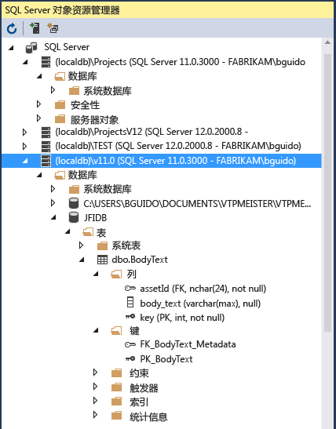

# Visual Studio 2017 的功能

[Visual Studio IDE 概述](../ide/visual-studio-ide.md)一文提供 Visual Studio 的基本简介。 本文介绍的功能可能更适合经验丰富的开发人员或已熟练掌握 Visual Studio 的人员。

## 模块化安装

通过 Visual Studio 的模块化安装程序，可以选择和安装工作负载。工作负载是你习惯使用的编程语言或平台所需的一些功能。 此策略使安装 Visual Studio 占用的空间更小，这也意味着安装和更新速度更快。

如果尚未安装 Visual Studio 2017，请转到 [Visual Studio 下载](https://visualstudio.microsoft.com/downloads/?utm_medium=microsoft&utm_source=docs.microsoft.com&utm_campaign=button+cta&utm_content=download+vs2017)页免费安装。

若要了解设置系统上的 Visual Studio 的详细信息，请参阅[安装 Visual Studio 2017](../install/install-visual-studio.md)。

## 创建 Azure 云启用应用

通过 Visual Studio 提供的工具套件，可以轻松地创建由 Microsoft Azure 提供支持的云启用应用程序。 可以轻松地从 IDE 直接配置、构建、调试、打包和部署 Microsoft Azure 上的应用程序和服务。 若要获取 Azure 工具和项目模板，安装 Visual Studio 时请选择“Azure 开发”工作负载。

安装“Azure 开发”工作负载后，“新建项目”对话框中将提供以下适用于 C# 的“云”模板：

通过 Visual Studio 的 [Cloud Explorer](/azure/vs-azure-tools-resources-managing-with-cloud-explorer)，可以查看和管理 Visual Studio 中基于 Azure 的云资源。 这些资源可能包括虚拟机、表、SQL 数据库等。 Cloud Explorer 可以显示登录的 Azure 订阅下托管的所有帐户中的 Azure 资源。 如果某一特定操作需要 Azure 门户，Cloud Explorer 将提供相应链接，转到 门户中的所需位置。

可通过以下连接服务为应用使用 Azure 服务：

- [Active Directory 连接服务](/azure/active-directory/develop/vs-active-directory-add-connected-service)，借助该服务，用户可通过 [Azure Active Directory](/azure/active-directory/active-directory-whatis) 帐户连接到 Web 应用
- [Azure 存储连接服务](/azure/vs-azure-tools-connected-services-storage)，该服务适用于 blob 存储、队列和表
- [密钥保管库连接服务](/azure/key-vault/vs-key-vault-add-connected-service)，可用于管理 Web 应用的机密

项目类型决定了可用的连接服务。 右键单击“解决方案资源管理器”中的项目并选择“添加” > “连接服务”来添加服务。

有关详细信息，请参阅[使用 Visual Studio 和 Azure 移动到云](https://visualstudio.microsoft.com/vs/azure-tools/)。

## 创建 web 应用

Web 推动着现代社会前进，Visual Studio 可以帮助你编写 Web 应用。 可以使用 ASP.NET、Node.js、Python、JavaScript 和 TypeScript 来创建 Web 应用。 Visual Studio 了解 Angular、jQuery、Express 等 Web 框架。 ASP.NET Core 和 .NET Core 在 Windows、Mac 和 Linux 操作系统上运行。 [ASP.NET Core](http://www.asp.net/core/overview) 是 MVC、WebAPI 和 SignalR 的一个重大更新，并在 Windows、Mac 和 Linux 上运行。  ASP.NET Core 旨在完全为你提供可组合的精益 .NET 堆栈，以便生成基于云的新式 Web 应用和服务。

有关详细信息，请参阅[新式 Web 工具](https://visualstudio.microsoft.com/vs/modern-web-tooling/)。

## 生成跨平台应用和游戏

可使用 Visual Studio 生成适用于 macOS、Linux 和 Windows，以及 Android、iOS 和其他[移动设备](https://visualstudio.microsoft.com/vs/mobile-app-development/)的应用和游戏。

- 生成在 Windows、macOS 和 Linux 上运行的 [.NET Core](/dotnet/core/) 应用。

- 通过使用 [Xamarin](https://developer.xamarin.com/guides/cross-platform/windows/visual-studio/)，在 C# 和 F# 中生成适用于 iOS、Android 和 Windows 的移动应用。

- 通过 [Apache Cordova](/visualstudio/cross-platform/tools-for-cordova/)，使用标准 Web 技术 &mdash;HTML、CSS 和 JavaScript&mdash; 生成适用于 iOS、Android 和 Windows 的移动应用。

- 通过使用 [Visual Studio Tools for Unity](../cross-platform/visual-studio-tools-for-unity.md)，在 C# 中生成 2D 和 3D 游戏。

- 可通过[适用于跨平台开发的 C++](../cross-platform/visual-cpp-for-cross-platform-mobile-development.md)，构建面向 iOS、Android 和 Windows 设备的本机 C++ 应用，并在为 iOS、Android 和 Windows 构建的库中分享通用代码。

- 通过 [Android 仿真器](../cross-platform/visual-studio-emulator-for-android.md)部署、测试和调试 Android 应用。

## 连接到数据库

服务器资源管理器有助于你浏览和管理本地、远程以及 Azure、Salesforce.com、Office 365 和网站上的 SQL Server 实例及资产。 若要打开“服务器资源管理器”，请依次选择主菜单上的“视图” > “服务器资源管理器”。 请参阅[添加新连接](../data-tools/add-new-connections.md)，了解有关使用服务器资源管理器的详细信息。

[SQL Server Data Tools (SSDT)](/sql/ssdt/download-sql-server-data-tools-ssdt) 是一个适用于 SQL Server、Azure SQL 数据库和 Azure SQL 数据仓库的强大的开发环境。 通过它可以生成、调试、维护和重构数据库。 可使用数据库项目，或直接使用已连接的数据库实例（本地或非本地）。

Visual Studio 中的 **SQL Server 对象资源管理器**提供类似于 SQL Server Management Studio 中的数据库对象。 使用 SQL Server 对象资源管理器可以执行轻负载数据库管理和设计工作，包括使用 SQL Server 对象资源管理器右侧的上下文菜单编辑表数据、对比架构和执行查询等。

## 调试、测试和改进代码

编写代码时，需要运行并测试该代码以了解 bug 和性能。 使用 Visual Studio 先进的调试系统，可以调试在本地项目、远程设备或[设备仿真器](../cross-platform/visual-studio-emulator-for-android.md)上运行的代码。 可单步执行代码，一次执行一条语句，逐步检查变量。 可设置仅当指定条件为真时才命中的断点。 上述所有操作均可在代码编辑器中管理，因此无需离开代码。 有关在 Visual Studio 中进行调试的详细信息，请参阅[调试器功能简介](../debugger/debugger-feature-tour.md)。

有关提升应用性能的详细信息，请参阅 Visual Studio 的[分析](../profiling/profiling-feature-tour.md)功能。

针对[测试](../test/improve-code-quality.md)，Visual Studio 提供单元测试、Live Unit Testing、IntelliTest、负载和性能测试等。 Visual Studio 还拥有高级的[代码分析](../code-quality/code-analysis-for-managed-code-overview.md)功能，可捕获设计、安全性和其他类型的缺陷。

## 部署完成的应用程序

当应用程序可以部署给用户或客户时，无论是部署到 Microsoft Store 还是 SharePoint 站点，无论是通过 InstallShield 还是 Windows Installer 技术进行部署，Visual Studio 都会提供实现此操作的工具。 这些都可以通过 IDE 进行访问。 有关详细信息，请参阅[部署应用程序、服务和组件](../deployment/deploying-applications-services-and-components.md)。

## 管理源代码并与他人协作

可以在任意提供商（包括 GitHub）托管的 Git 存储库中管理源代码。 或者，使用 [Azure DevOps Services](/azure/devops/index?view=vsts) 管理整个项目的代码、Bug 和工作项。 若要详细了解如何在 Visual Studio 中使用团队资源管理器管理 Git 存储库，请参阅[开始使用 Git 和 Azure Repos](/azure/devops/repos/git/gitquickstart?tabs=visual-studio)。 Visual Studio 还内置有其他源代码管理功能。 若要了解详细信息，请参阅 [Visual Studio 2017 中的新 Git 功能（博文）](https://blogs.msdn.microsoft.com/visualstudioalm/2017/03/06/new-git-features-in-visual-studio-2017/)。

Azure DevOps Services 是基于云的服务，用于规划、托管、自动化和部署软件以及在团队中实现协作。 Azure DevOps Services 支持 Git 存储库（分布式版本控制）和 Team Foundation 版本控制（集中式版本控制），以及用于版本控制系统中存储的代码的持续生成和发布 (CI/CD) 的管道。 Azure DevOps Services 还支持 Scrum、CMMI 和敏捷开发方法。

Team Foundation Server (TFS) 是 Visual Studio 的应用程序生命周期管理中心。 它使用单个解决方案，使开发过程中涉及的所有人均可参与该开发过程。 TFS 对于管理异类团队和项目也非常有用。

如果网络中已经具有 Azure DevOps 组织或 Team Foundation Server，则可通过 Visual Studio 中的“团队资源管理器”窗口连接。 可在此窗口中将代码签入（出）源控件、管理工作项、启动生成以及访问团队聊天室和工作区。 可以从“快速启动”框，或者从“视图” > “团队资源管理器”或“团队” > “管理连接”的主菜单中打开“团队资源管理器”。

下图展示了 Azure DevOps Services 中托管的解决方案的“团队资源管理器”窗口。

还可以自动执行生成过程以生成团队中的开发人员签入到版本控制的代码。 例如，您可以在夜间或每次签入此代码时生成一个或多个项目。 有关详细信息，请参阅 [Azure Pipelines](/azure/devops/pipelines/index?view=vsts)。

## 扩展 Visual Studio

如果 Visual Studio 中没有你需要的确切功能，你可以进行添加！ 可以根据你的工作流和风格自定义 IDE，对尚未与 Visual Studio 集成的外部工具添加支持并修改现有的功能，以提高工作效率。 若要查找 Visual Studio 扩展性工具 (VS SDK) 的最新版本，请参阅 [Visual Studio SDK](../extensibility/visual-studio-sdk.md)。

可使用 .NET Compiler Platform（“Roslyn”）自行编写代码分析器和代码生成器。 在 [Roslyn](https://github.com/dotnet/Roslyn)中查找所需的一切内容。

查找由 Microsoft 开发人员以及我们的开发社区创建的 Visual Studio [现有扩展](https://marketplace.visualstudio.com/vs)。

若要了解有关扩展 Visual Studio 的详细信息，请参阅[扩展 Visual Studio IDE](https://visualstudio.microsoft.com/vs/extend/)。

## 请参阅

- [Visual Studio IDE 概述](../ide/visual-studio-ide.md)
- [Visual Studio 2017 中的新增功能](../ide/whats-new-in-visual-studio.md)