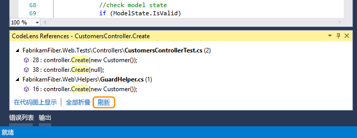

# 使用 CodeLens 查找代码更改和其他历史记录

通过 CodeLens，你可以在专注于工作的同时了解代码所发生的情况 &ndash; 而无需离开编辑器。 可以查找代码引用、代码更改、关联的 Bug、工作项、代码评审和单元测试。

> [!NOTE]
> CodeLens 仅在 Visual Studio Enterprise 和 Visual Studio Professional 版中可用。 在 Visual Studio Community 版中不可用。

了解各个部分的代码在解决方案中的使用位置和使用方式：

在不离开编辑器的情况下就对代码进行的更改联系你的团队：

若要选择想要查看的指示器或要关闭和打开 CodeLens，请依次转到“工具” > “选项” > “文本编辑器” > “所有语言” > “CodeLens”。

## 查找对代码的引用

可以在 C# 或 Visual Basic 代码中查找引用。

1. 选择“引用”指示器或按 Alt+2。

   

   > [!NOTE]
   > 如果指示器显示 0 个引用，则没有来自 C# 或 Visual Basic 代码的引用。 但可能存在其他项（如 .xaml 和 .aspx 文件）中的引用。

2. 若要查看引用代码，将鼠标悬停在列表中的引用上方。

   

3. 若要打开包含该引用的文件，双击该引用。

### 代码图

若要查看该代码与其引用之间的关系，[创建代码图](../modeling/map-dependencies-across-your-solutions.md)。 在代码图快捷菜单中，选择“显示所有引用”。

## <a name="find-code-history"/>查找代码中的更改

检查代码的历史记录，了解代码所发生的情况。 或者，在将这些更改合并到你的代码中之前查看它们，这样你可以更好地了解其他分支中的更改可能影响你的代码的方式。

需要：

- Visual Studio Enterprise 或 Visual Studio Professional

- Team Foundation Server 2013 或更高版本、Azure DevOps Services 或 Git

- [Skype for Business](/skypeforbusiness/)，可从代码编辑器联系团队

对于随 Team Foundation 版本控制 (TFVC) 或 Git 一起存储的 C# 或 Visual Basic 代码，可以获取类和方法级别上的 CodeLens 详细信息（码位元素级别指示器）。 如果你的 Git 存储库托管在 TfGit 中，则还可以获取指向 TFS 工作项的链接。

对于除 .cs 或 .vb 以外的文件类型，在窗口底部的某个位置获取整个文件的 CodeLens 详细信息（文件级指示器）。

### 代码元素级别指示器

通过码位元素级别指示器，可以查看更改代码的人员以及他们所做的更改。 码位元素级别指示器可用于 C# 和 Visual Basic 代码。

下面便是在 Team Foundation Server 或 Azure DevOps Services 中使用 Team Foundation 版本控制 (TFVC) 时显示的内容：

默认时间段为最近 12 个月。 如果代码存储在 Team Foundation Server 中，可以通过运行具有 [CodeIndex 命令](/tfs/server/ref/command-line/tfsconfig-cmd)和 [/indexHistoryPeriod](../ide/codeindex-command.md) 标志的 **TFSConfig 命令**对时间段进行更改。

若要查看所有更改（包括一年前的更改）的详细历史记录，选择“显示所有文件更改”：

此时将打开“历史记录”窗口：

当文件位于 Git 存储库中并选择码位元素级更改指示器时，下面是将显示的内容：

### 文件级别指示器

在窗口底部中的文件级别指示器中查找对整个文件进行的更改：

> [!NOTE]
> 文件级别指示器不可用于 C# 和 Visual Basic 文件。

若要获得有关更改的详细信息，请右键单击该项。 根据使用的是 TFVC 还是 Git，可使用一些选项来比较文件的版本、查看详细信息和跟踪变更集、获取文件的所选版本并向进行该更改的作者发送电子邮件。 某些详细信息会在“团队资源管理器”中显示。

还可以查看在某段时间内更改代码的人员。 这可以帮助发现团队更改中的模式并评估它们的影响。

### 查找当前分支中的更改

团队可能会有多个分支（例如，一个主分支和一个子开发分支），以降低破坏稳定代码的风险。

按 Alt+6 可了解在主要分支中更改代码的人数和所做更改数：

### 查找何时对你的代码进行了分支

若要了解何时对代码进行了分支，导航到子分支中的代码。 然后，选择“更改”指示器或按 Alt+6：

### 查找来自其他分支的传入更改

可以查看传入的更改。 在以下屏幕截图中，“开发”分支中进行了 bug 修复：

可以在不离开当前分支（“主分支”）的情况下查看该更改：

### 查找何时对更改进行了合并

可以查看何时对更改进行了合并，这样便可确定分支中包括了哪些更改：

例如，主分支中的代码现在具有来自“开发”分支的 Bug 修复：

### 将传入更改与本地版本进行比较

按 Shift+F10 或双击变更集，将传入更改与本地版本进行比较。

### 分支图标

通过“分支”列中的图标，可了解该分支与你正在使用的分支之间的关系。

|**图标**|**更改来源：**|
|--------------| - |
||当前的分支|
||父分支|
||子分支|
||对等分支|
||比父、子或对等更进一步的分支|
||从父分支到子分支的合并|
||从子分支到父分支的合并|
||来自不相关分支的合并（baseless 合并）|

## 链接的工作项

选择“工作项”指示器或按 Alt+8，查找关联的工作项。

## 关联的代码评审

选择“评审”指示器，查找关联的代码评审。 若要使用键盘，按住 Alt，然后按“向左键”或“向右键”来导航指示器选项。

## 关联的 bug

选择“bug”指示器或按 Alt+7，查找关联的 bug。

## 联系项的所有者

选择“作者”指示器或按 Alt+5，查找项的作者。

打开一个项的快捷菜单来查看联系人选项。 如果安装了 Lync 或 Skype for Business，则会看到以下选项：

## 关联的单元测试

无需打开“测试资源管理器”便可发现针对 C# 或 Visual Basic 代码存在的单元测试。

1. 转到具有关联的[单元测试代码](../test/unit-test-your-code.md)的应用程序代码。

2. 如果还没有，请生成应用程序以加载 CodeLens 测试指示器。 确保已打开[各生成程序集的发现](../test/test-explorer-faq.md#assembly-based-discovery)。

3. 按 Alt+3，查看代码的测试。

     

4. 如果看到警告图标 测试尚未运行，请运行它们。

     

5. 若要查看某个测试的定义，请双击 CodeLens 指示器窗口中的测试项，从而在编辑器中打开代码文件。

     

6. 若要查看测试的结果，选择测试状态指示器（或）或按 Alt+1.

     

7. 若要查看更改过此测试的人数、更改者或对此测试所做的更改数，[查找代码的历史记录](#find-code-history)和关联的项。

## 键盘快捷键

若要使用键盘来选择指示器，按住 Alt 可显示相关的数字键，然后按对应于要选择的指示器的数字。

> [!NOTE]
> 若要选择“评审”指示器，按住 Alt 的同时，使用向左键和向右键进行导航。

## 问题解答

### 问：如何关闭或打开 CodeLens 或选择要查看的指示器？

**答：** 可以关闭或打开指示器，引用指示器除外。 转到“工具” > “选项” > “文本编辑器” > “所有语言” > “CodeLens”。

指示器打开后，你也可以从指示器上打开“CodeLens”选项。

使用编辑器窗口底部的 V 形图标打开和关闭 CodeLens 文件级指示器。

### 问：CodeLens 位于何处？

**答：** CodeLens 出现在方法、类、索引器和属性级别的 C# 和 Visual Basic 代码中。 对于所有其他文件类型，CodeLens 出现在文件级别。

- 确保 CodeLens 开启。 转到“工具” > “选项” > “文本编辑器” > “所有语言” > “CodeLens”。

- 如果代码存储在 TFS 中，请确保使用 [CodeIndex 命令](../ide/codeindex-command.md) 和 [TFS Config 命令](/tfs/server/ref/command-line/tfsconfig-cmd)打开代码索引。

- 仅当工作项已链接到代码并且你有权打开链接的工作项时，才显示与 DevOps 相关的指示器。 确认具有[团队成员权限](/azure/devops/organizations/security/view-permissions?view=vsts)。

- 当应用程序代码没有单元测试时，单元测试指示器不显示。 测试状态指示器自动显示在测试项目中。 如果知道应用程序代码具有单元测试，但测试指示器未显示，请尝试生成解决方案 (Ctrl+Shift+B)。

### 问：为什么没有看见提交的工作项详情？

**答：** 可能是因为 CodeLens 无法查找到 Azure Boards 或 TFS 中的工作项。 检查是否连接到具有这些工作项的项目，以及你是否有权限查看这些工作项。 如果提交说明中关于 Azure Boards 或 TFS 中工作项 ID 的信息有误，工作项详细信息可能也不会显示。

### 问：为什么没有看见 Skype 指示器？

**答：** 如果未登录或未安装 Skype for Business，或者没有支持的配置，则不会显示 Skype 指示器。 但是仍可以发送电子邮件：

**支持哪些 Skype 和 Lync 配置？**

- Skype for Business（32 位或 64 位）

- 仅 Lync 2010 或更高版本（32 位或 64 位），但不是使用 Windows 8.1 的 Lync Basic 2013

CodeLens 不支持安装不同版本的 Lync 或 Skype。 可能不会针对所有本地化版本的 Visual Studio 本地化 Lync 或 Skype。

### 问：如何更改 CodeLens 的字体和颜色？

**答：** 转到“工具” > “选项” > “环境” > “字体和颜色”。

使用键盘：

1. 按 Alt+T+O 可打开“选项”对话框。

2. 按向上键  或向下键  转到 **“环境”** 节点，然后按向左键  展开该节点。

3. 按向下键  转到 **“字体和颜色”**。

4. 按 Tab 转到“显示其设置”列表，然后按向下键选择“CodeLens”。

### 问：我是否能移动 CodeLens 平视显示？

**答：** 可以，选择，将 CodeLens 作为窗口停靠。

### 问：如何刷新指示器？

**答：** 这取决于指示器：

- **引用**：代码更改时，此指示器会自动更新。 如果“引用”指示器作为单独的窗口停靠，请选择“刷新”来刷新该指示器：

     

- **团队**：从右键单击菜单中选择“刷新 CodeLens 团队指示器”，刷新这些指示器：

     

- **测试**：[查找代码的单元测试](#associated-unit-tests)，刷新“测试”指示器。

### 问：什么是“本地版本”？

**答：**“本地版本”箭头指向文件的本地版本中的最新变更集。 当服务器具有最新的变更集时，它们显示在 **“本地版本”** 箭头的上方或下方，具体取决于排列变更集的顺序。

### 问：是否可以管理 CodeLens 如何处理代码以显示历史记录和链接的项？

**答：** 可以。 如果代码位于 TFS 中，结合使用 [CodeIndex 命令](../ide/codeindex-command.md)和 [TFS Config 命令](/tfs/server/ref/command-line/tfsconfig-cmd)。

### 问：首次打开解决方案时，文件中不再显示 CodeLens 测试指示器。 如何加载它们？

**答：** 重新生成项目，获取要加载到文件中的 CodeLens 测试指示器。 确保已打开[各生成程序集的发现](../test/test-explorer-faq.md#assembly-based-discovery
)。 为了提高性能，Visual Studio 在加载代码文件时不再提取测试指示器的源信息。 测试指示器在生成后或在导航到测试时（通过在“测试资源管理器”中双击该测试）加载。

## 请参阅

- [代码编辑器功能](../ide/writing-code-in-the-code-and-text-editor.md)
