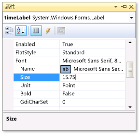
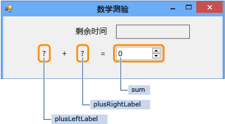
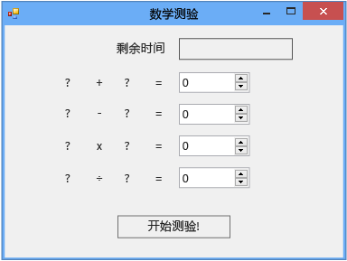

# 步骤 1：创建项目并向窗体添加标签
[!INCLUDE[vs2017banner](../code-quality/includes/vs2017banner.md)]

在开发此测验的过程中，首先应创建项目并将数个标签、一个按钮和其他控件添加到窗体。  此外还要设置已添加各个控件的属性。  项目将包含窗体、控件和代码（在本教程下文中）。  按钮用于启动测验，标签用于显示测验问题，其他控件则用于显示测验答案和完成测验所剩时间。  
  
> [!NOTE]
>  本主题是基本编码概念教程系列中的一部分。  有关本教程的概述，请参阅[教程 2：创建计时数学测验](../ide/tutorial-2-create-a-timed-math-quiz.md)。  
  
### 创建项目并设置窗体的属性  
  
1.  在菜单栏上，依次选择**“文件”**、**“新建”**、**“项目”**。  
  
2.  在**“已安装的模板”**列表中选择**“Visual C\#”**或**“Visual Basic”**。  
  
3.  在模板列表中，选择**“Windows 窗体应用程序”**模板，将其命名为 Math Quiz，然后选择**“确定”**按钮。  
  
     此时将显示名为**“Form1.cs”**或**“Form1.vb”**的窗体，具体取决于您所选择的编程语言。  
  
4.  选择该窗体，然后将其**“Text”**属性设置为**“Math Quiz”**。  
  
     **“属性”**窗口包含窗体的各个属性。  
  
5.  将窗体大小更改为 500 像素（宽）× 400 像素（高）。  
  
     您可通过拖动窗体边缘来调整其大小，直到集成开发环境 \(IDE\) 的左下角显示正确的大小。  或者，您也可以更改**“Size”**属性的值。  
  
6.  将**“FormBorderStyle”**属性的值更改为**“Fixed3D”**，并将**“MaximizeBox”**属性设置为**“False”**。  
  
     这些值用于防止测验对象改变窗体大小。  
  
### 创建“剩余时间”框  
  
1.  从工具箱中添加一个**“Label”**控件，然后将其**“\(Name\)”**属性的值设置为 `timeLabel`。  
  
     此标签将变成右上角的一个框，其中显示测验的剩余秒数。  
  
2.  将**“AutoSize”**属性更改为**“False”**，这样您便可以自行调整该框的大小。  
  
3.  将**“BorderStyle”**属性更改为**“FixedSingle”**以在该框的周围绘制线条。  
  
4.  将**“Size”**属性设置为**“200, 30”**。  
  
5.  将该标签移到窗体的右上角，此处将显示蓝色分隔线。  
  
     这些分隔线可以帮助您在窗体上对齐控件。  
  
6.  在**“属性”**窗口中，选择**“Text”**属性，然后选择 Backspace 键以清除此属性的值。  
  
7.  选择**“Font”**属性旁边的加号 \(\+\)，然后将**“Size”**属性的值更改为 15.75。  
  
     如下图所示，您可以更改多个字体属性。  
  
       
显示字号的“属性”窗口  
  
8.  从工具箱再添加一个**“Label”**控件，然后将其字号设置为 15.75。  
  
9. 将**“Text”**属性设置为**“剩余时间”**。  
  
10. 移动该标签，使之整齐排列在**“timeLabel”**标签的左侧。  
  
### 添加加法题的控件  
  
1.  从工具箱添加一个**“Label”**控件，然后将其**“Text”**属性设置为**“?”**（问号）。  
  
2.  将**“AutoSize”**属性设置为**“False”**。  
  
3.  将**“Size”**属性设置为**“60, 50”**。  
  
4.  将字号设置为**“18”**。  
  
5.  将**“TextAlign”**属性设置为**“MiddleCenter”**。  
  
6.  将**“Location”**属性设置为**“50, 75”**，以便将此控件置于窗体上。  
  
7.  将**“\(Name\)”**属性设置为**“plusLeftLabel”**。  
  
8.  选择**“plusLeftLabel”**标签，然后选择 Ctrl\+C 键或**“编辑”**菜单上的**“复制”**。  
  
9. 通过选择 Ctrl\+V 键或**“编辑”**菜单上的**“粘贴”**，将此标签粘贴三次。  
  
10. 排列这三个新标签，使之在**“plusLeftLabel”**标签的右侧排成一行。  
  
     您可以使用分隔线将它们隔开并将它们排成一行。  
  
11. 将第二个标签的**“Text”**属性值设置为**“\+”**（加号）。  
  
12. 将第三个标签的**“\(Name\)”**属性值设置为**“plusRightLabel”**。  
  
13. 将第四个标签的**“Text”**属性值设置为**“\=”**（等号）。  
  
14. 从工具箱添加一个**“NumericUpDown”**控件，将其字号设置为**“18”**，并将其宽度设置为**“100”**。  
  
     稍后您将了解到有关此类控件的详细信息。  
  
15. 将此**“NumericUpDown”**控件与加法题的各标签控件排成一行。  
  
16. 将**“NumericUpDown”**控件的**“\(Name\)”**属性值更改为**“sum”**。  
  
     如下图所示，您已创建了第一行。  
  
       
数学测验的第一行  
  
### 添加减法、乘法和除法题的控件  
  
1.  复制加法题的全部五个控件（四个 Label 控件和一个 NumericUpDown 控件），然后粘贴这些控件。  
  
     此窗体包含五个新控件，它们仍处于选中状态。  
  
2.  将所有控件移至某处，使之在加法控件的下方排成一行。  
  
     您可以使用分隔线在两行之间留出足够的距离。  
  
3.  将第二个标签的**“Text”**属性值更改为**“–”**（减号）。  
  
4.  将第一个问号标签命名为**“minusLeftLabel”**。  
  
5.  将第二个问号标签命名为**“minusRightLabel”**。  
  
6.  将 **NumericUpDown** 控件命名为**“difference”**。  
  
7.  将这五个控件再粘贴两次。  
  
8.  在第三行中，将第一个标签命名为**“timesLeftLabel”**，将第二个标签的**“Text”**属性更改为**“×”**（乘号），将第三个标签命名为**“timesRightLabel”**，然后将 NumericUpDown 控件命名为**“product”**。  
  
9. 在第四行中，将第一个标签命名为**“dividedLeftLabel”**，将第二个标签的**“Text”**属性更改为**“÷”**（除号），将第三个标签命名为**“dividedRightLabel”**，然后将 NumericUpDown 控件命名为**“quotient”**。  
  
    > [!NOTE]
    >  您可以复制本教程中的乘号 × 和除号 ÷，将它们粘贴到窗体中。  
  
### 添加“开始”按钮并设置 Tab 键索引顺序  
  
1.  从工具箱添加一个**“Button”**控件，然后将其**“\(Name\)”**属性设置为**“startButton”**。  
  
2.  将**“Text”**属性设置为**“开始测验”**。  
  
3.  将字号设置为**“14”**。  
  
4.  将**“AutoSize”**属性设置为**“True”**，这可使此按钮自动调整大小以适合文本。  
  
5.  将此按钮置于窗体底部附近的中心位置。  
  
6.  将**“startButton”**控件的**“TabIndex”**属性值设置为**“1”**。  
  
    > [!NOTE]
    >  **“TabIndex”**属性用于设置测验对象选择 Tab 键时的控件顺序。  若要查看其工作原理，请打开任何对话框（例如，在菜单栏上，依次选择**“文件”**、**“打开”**），然后选择几次 Tab 键。  观察每次选择 Tab 键时，光标是如何从一个控件移动到另一个控件的。  程序员在创建该窗体时便已确定这一顺序。  
  
7.  将 NumericUpDown sum 控件的**“TabIndex”**属性值设置为**“2”**，将 difference 控件的此属性值设置为**“3”**，将 product 控件的此属性值设置为**“4”**，将 quotient 控件的此属性值设置为**“5”**。  
  
     窗体看上去应该如下图所示。  
  
       
初始数学测验窗体  
  
8.  若要验证**“TabIndex”**属性是否按照您的预期运行，请选择 F5 键或选择菜单栏上的**“调试”**、**“启动调试”**保存并运行您的程序，然后选择几次 Tab 键。  
  
### 继续或查看  
  
-   若要转到下一个教程步骤，请参见[步骤 2：创建随机加法问题](../ide/step-2-create-a-random-addition-problem.md)。  
  
-   若要返回概述主题，请参见[教程 2：创建计时数学测验](../ide/tutorial-2-create-a-timed-math-quiz.md)。