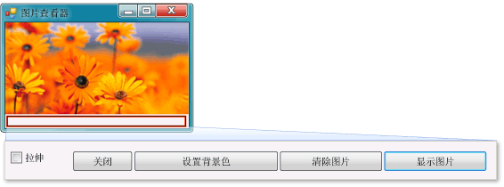

# 教程 1：创建图片查看器

在本教程中，您将生成一个从文件加载图片并将其显示在窗口中的程序。 你将学习如何使用 Windows 窗体设计器拖动控件（如窗体上的按钮和图片框）、设置控件属性，以及如何使用容器来平滑地调整窗体的大小。 您还将开始编写代码。 您将学习如何：

-   创建新项目。

-   测试（调试）应用程序。

-   向窗体中添加基本控件（如复选框和按钮）。

-   使用布局在窗体上定位控件。

-   向窗体中添加“打开文件”和“颜色”对话框。

-   使用 IntelliSense 和代码片段编写代码。

-   编写事件处理程序方法。

完成时，程序将类似下图所示：

## 教程链接

若要下载完整的示例版本，请参阅[图片查看器教程的完整示例](http://code.msdn.microsoft.com/Complete-Picture-Viewer-7d91d3a8)。

有关本主题的视频版本，请参阅[如何在 Visual Basic 中创建图片查看器？](http://go.microsoft.com/fwlink/?LinkId=205207)或[如何在 C# 中创建图片查看器？](http://go.microsoft.com/fwlink/?LinkId=205198)。

> [!NOTE]
> 这些视频使用 Visual Studio 的早期版本，因此在一些菜单命令和其他用户界面元素上略有差异。 但是，概念和过程与当前版本的 Visual Studio 大同小异。 本教程中同时涉及 Visual C# 和 Visual Basic，因此请关注特定于您所用编程语言的信息。
>
> 若要查看适用于 Visual Basic 的代码，请在代码块顶部选择“VB”选项卡；若要查看适用于 Visual C# 的代码，请选择“C#”选项卡。如果有兴趣了解 Visual C++，请参阅[入门](../ide/getting-started-with-cpp-in-visual-studio.md)和 [C++ 语言教程](http://www.cplusplus.com/doc/tutorial/)。
>
> 如果有兴趣了解如何编写 Visual C# 或 Visual Basic UWP 应用，请参阅[构建 UWP 应用](https://developer.microsoft.com/windows/apps)。

## 相关主题

|标题|描述|
|-----------|-----------------|
|[步骤 1：创建 Windows 窗体应用程序项目](../ide/step-1-create-a-windows-forms-application-project.md)|首先创建 Windows 窗体应用程序项目。|
|[步骤 2：运行程序](../ide/step-2-run-your-program.md)|运行您在上一步中创建的 Windows 窗体应用程序。|
|[步骤 3：设置窗体属性](../ide/step-3-set-your-form-properties.md)|使用“属性”窗口更改窗体的显示方式。|
|[步骤 4：使用 TableLayoutPanel 控件设置窗体布局](../ide/step-4-lay-out-your-form-with-a-tablelayoutpanel-control.md)|向窗体添加一个 `TableLayoutPanel` 控件。|
|[步骤 5：向窗体添加控件](../ide/step-5-add-controls-to-your-form.md)|向窗体添加控件，如 `PictureBox` 控件和 `CheckBox` 控件。 向窗体中添加按钮。|
|[步骤 6：命名按钮控件](../ide/step-6-name-your-button-controls.md)|将按钮重命名为更有意义的名称。|
|[步骤 7：向窗体添加对话框组件](../ide/step-7-add-dialog-components-to-your-form.md)|向窗体添加 `OpenFileDialog` 组件和 `ColorDialog` 组件。|
|[步骤 8：为“显示图片”按钮事件处理程序编写代码](../ide/step-8-write-code-for-the-show-a-picture-button-event-handler.md)|使用 IntelliSense 工具编写代码。|
|[步骤 9：评审代码、为代码添加注释和测试代码](../ide/step-9-review-comment-and-test-your-code.md)|评审并测试代码。 根据需要添加注释。|
|[步骤 10：编写其他按钮和复选框的代码](../ide/step-10-write-code-for-additional-buttons-and-a-check-box.md)|使用 IntelliSense 编写代码以使其他按钮和复选框工作。|
|[步骤 11：运行程序并尝试其他功能](../ide/step-11-run-your-program-and-try-other-features.md)|运行程序并设置背景颜色。 尝试其他功能，例如更改颜色、字体和边框。|
