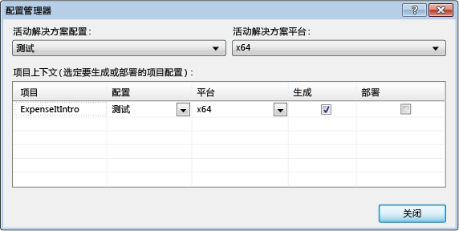
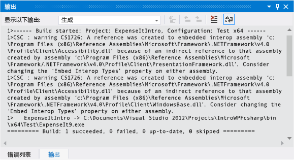

# 演练：生成应用程序
完成本演练后，你会更熟悉使用 Visual Studio 生成应用程序时可配置的多个选项。 将为示例应用程序创建自定义生成配置、隐藏特定警告消息以及增加生成输出信息。  
  
 本主题包含以下各节：  
  
 [安装示例应用程序](../ide/walkthrough-building-an-application.md#BKMK_installapp)  
  
 [创建自定义生成配置](../ide/walkthrough-building-an-application.md#BKMK_CreateBuildConfig)  
  
 [生成应用程序](../ide/walkthrough-building-an-application.md#BKMK_building)  
  
 [隐藏编译器警告](../ide/walkthrough-building-an-application.md#BKMK_hidewarning)  
  
 [在输出窗口中显示其他生成详细信息](../ide/walkthrough-building-an-application.md#BKMK_outputdetails)  
  
 [创建版本生成](../ide/walkthrough-building-an-application.md#BKMK_releasebuild)  
  
##   安装示例应用程序  
下载 [Introduction to Building WPF Applications](https://code.msdn.microsoft.com/Introduction-to-Building-b8d16419)（生成 WPF 应用程序简介）示例。 选择 C# 或 Visual Basic。 下载 .zip 文件后，将它解压缩并使用 Visual Studio 打开 ExpenseItIntro.sln 文件。  
  
##   创建自定义生成配置  
 创建解决方案时，调试和发布生成配置，并为解决方案自动定义它们的默认平台目标。 然后，可以自定义这些配置，或创建自己的配置。 生成配置指定生成类型。 生成平台指定应用程序为该配置定向的操作系统。 有关详细信息，请参阅[了解生成配置](../ide/understanding-build-configurations.md)、[了解生成平台](../ide/understanding-build-platforms.md)以及[调试和发布项目配置](http://msdn.microsoft.com/en-us/0440b300-0614-4511-901a-105b771b236e)。  
  
 可以使用“配置管理器”对话框更改或创建配置和平台设置。 在此过程中将创建用于测试的生成配置。  
  
#### 创建生成配置  
  
1.  打开“配置管理器”对话框。  
  
       
  
2.  在“活动解决方案配置”列表中，选择“\<新建...\>”。  
  
3.  在“新建解决方案配置”对话框中，命名新配置 `Test`，复制现有“调试”配置中的设置，然后选择“确定”按钮。  
  
       
  
4.  在“活动解决方案平台”列表中，选择“\<新建...\>”。  
  
5.  在“新建解决方案平台”对话框中，选择“x64”，且不要复制 x86 平台中的设置。  
  
       
  
6.  选择“确定”  按钮。  
  
 “活动解决方案配置”已更改为“测试”，且“活动解决方案平台”设置为“x64”。  
  
   
  
7. 选择“关闭”。  

使用“标准”工具栏上的“解决方案配置”列表，可快速验证或更改“活动解决方案配置”。  
  
  
  
##   生成应用程序  
 接下来将生成具有自定义生成配置的解决方案。  
  
#### 生成解决方案  
  
-   在菜单栏上，依次选择 **“生成”**、 **“生成解决方案”**。  
  
    “输出”窗口将显示生成的结果。 成功生成。  
  
##   隐藏编译器警告  
接下来将介绍一些会导致编译器生成警告的代码。  

1. 在 C# 项目中，打开 ExpenseReportPage.xaml.cs 文件。 在 ExpenseReportPage 方法中，添加以下代码：`int i;`。  

    或

    在 Visual Basic 项目中，打开 ExpenseReportPage.xaml.vb 文件。 在自定义的构造函数“Public Sub New...”中，添加以下代码：`Dim i`。  

2. 生成解决方案。  

“输出”窗口将显示生成的结果。 成功生成，但生成了警告：  

 图 1：Visual Basic 警告  
  
   
  
 图 2：Visual C# 警告  
  
   
  
可在生成期间暂时隐藏某些警告消息，而不是使其扰乱生成输出。  

#### 隐藏特定的 Visual C# 警告  
  
1.  在“解决方案资源管理器”中，选择顶级项目节点。  
  
2.  在菜单栏上，依次选择 **“查看”**、 **“属性页”**。  
  
     将打开“项目设计器”。  
  
3.  选择“生成”页，然后在“禁止显示警告”框中，指定警告编号“0168”。  
  
       
  
     有关详细信息，请参阅 [“项目设计器”->“生成”页 (C#)](../ide/reference/build-page-project-designer-csharp.md)。  
  
4.  生成解决方案。  
  
     “输出”窗口仅显示生成的摘要信息。  
  
       
  
#### 禁止显示所有 Visual Basic 生成警告  
  
1.  在“解决方案资源管理器”中，选择顶级项目节点。  
  
2.  在菜单栏上，依次选择 **“查看”**、 **“属性页”**。  
  
     将打开“项目设计器”。  
  
3.  在“编译”页上，选择“禁用所有警告”复选框。  
  
       
  
     有关详细信息，请参阅[在 Visual Basic 中配置警告](../ide/configuring-warnings-in-visual-basic.md)。  
  
4.  生成解决方案。  
  
 “输出”窗口仅显示生成的摘要信息。  
  
   
  
 有关详细信息，请参阅[如何：禁止显示编译器警告](../ide/how-to-suppress-compiler-warnings.md)。  
  
##   在输出窗口中显示其他生成详细信息  
 你可以更改“输出”窗口中显示的关于生成过程的信息量。 生成详细程度通常设置为“最小”，这意味着，“输出”窗口仅显示生成过程的摘要以及任何高优先级的警告或错误。 使用[“选项”对话框->“项目和解决方案”->“生成和运行”](../ide/reference/options-dialog-box-projects-and-solutions-build-and-run.md)，可显示生成的详细信息。  
  
> [!IMPORTANT]
>  如果显示详细信息，生成将花费更长时间才能完成。  
  
#### 更改“输出”窗口中的信息量  
  
1.  打开“选项”对话框。  
  
       
  
2.  选择“项目和解决方案”类别，然后选择“生成和运行”页。  
  
3.  在“MSBuild 项目生成输出详细信息”列表中，选择“常规”，然后选择“确定”按钮。  
  
4.  在菜单栏上，依次选择“生成”、“清理解决方案”。  
  
5.  生成解决方案，然后查看“输出”窗口中的信息。  
  
     生成信息包括生成开始的时间（位于开头）和处理文件的顺序。 此信息还包括生成期间 Visual Studio 运行的实际的编译器语法。  
  
     例如，在 Visual C# 生成中，[/nowarn](/dotnet/visual-basic/reference/command-line-compiler/nowarn) 选项列出了本主题前面部分随其他三个警告一起指定的警告代码 1762。  
  
     在 Visual Basic 生成中，[/nowarn](/dotnet/visual-basic/reference/command-line-compiler/nowarn) 不包括要排除的特定警告，因此不会出现任何警告。  
  
    > [!TIP]
    >  通过选择 Ctrl + F 键，显示“查找”窗口，可以搜索“输出”窗口的内容。  
  
有关详细信息，请参阅[如何：查看、保存和配置生成日志文件](../ide/how-to-view-save-and-configure-build-log-files.md)。  
  
##   创建版本生成  
 可以生成针对交付进行了优化的示例应用程序版本。 对于版本生成，需指定在启动生成前，将可执行文件复制到网络共享。  
  
 有关详细信息，请参阅[如何：更改生成输出目录](../ide/how-to-change-the-build-output-directory.md)和[在 Visual Studio 中生成和清理项目和解决方案](../ide/building-and-cleaning-projects-and-solutions-in-visual-studio.md)。  
  
#### 指定 Visual Studio 的版本生成  
  
1.  打开“项目设计器”。  
  
       
  
2.  选择“编译”页。  
  
3.  在“配置”列表中，选择“版本”。  
  
4.  在“平台”列表中，选择“x86”。  
  
5.  在“生成输出路径”框中，指定网络路径。  
  
     例如，可以指定 \\\myserver\builds。  
  
    > [!IMPORTANT]
    >  可能会出现一个消息框，警告指定的网络共享位置可能不受信任。 如果信任指定的位置，请在消息框中选择“确定”按钮。  
  
6.  生成应用程序。  
  
       
  
#### 指定 Visual C# 的版本生成 #
  
1.  打开“项目设计器”。  
  
       
  
2.  选择“生成”页。  
  
3.  在“配置”列表中，选择“版本”。  
  
4.  在“平台”列表中，选择“x86”。  
  
5.  在“输出路径”框中，指定网络路径。  
  
     例如，可以指定 \\\myserver\builds。  
  
    > [!IMPORTANT]
    >  可能会出现一个消息框，警告指定的网络共享位置可能不受信任。 如果信任指定的位置，请在消息框中选择“确定”按钮。  
  
6.  在“标准工具栏”上，将解决方案配置设置为“发布”，将解决方案平台设置为“x86”。  

7.  生成应用程序。  
  
       
  
 可执行文件已复制到指定的网络路径。 其路径为 \\\myserver\builds\\*FileName*.exe。  
  
祝贺：你已成功完成此演练。  
  
## 另请参阅  
 [演练：生成项目(C++)](/cpp/ide/walkthrough-building-a-project-cpp)   
 [ASP.NET Web 应用程序项目预编译概述](http://msdn.microsoft.com/en-us/b940abbd-178d-4570-b441-52914fa7b887)   
 [演练：使用 MSBuild](../msbuild/walkthrough-using-msbuild.md)
