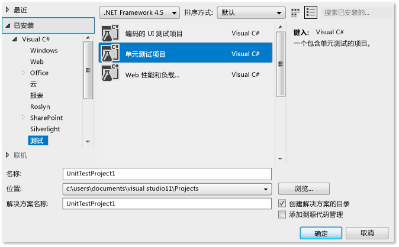
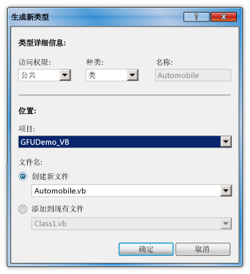
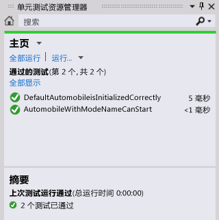

# 演练：带有“使用时生成”功能的测试优先开发

本主题演示如何利用可支持测试优先开发的[使用时生成](../ide/visual-csharp-intellisense.md#generate-from-usage)功能。

 *测试优先的开发* 是一种软件设计的方法，其中首先基于产品规格编写单元测试，然后编写测试成功所需的源代码。 首次在测试用例中引用新类型和成员时，Visual Studio 通过在对其进行定义之前在源代码中生成这些新类型和成员来支持测试优先的开发。

 Visual Studio 生成对工作流中断次数最少的新类型和成员。 你可以创建类型、方法、属性、字段或构造函数的存根而无需从当前代码中的位置离开。 当打开一个对话框以指定类型生成的选项时，焦点会在对话框关闭时立即返回到当前打开的文件。

 可用于与 Visual Studio 集成的测试框架的“使用时生成”功能。 本主题中演示了 Microsoft 单元测试框架。

[!INCLUDE[note_settings_general](../data-tools/includes/note_settings_general_md.md)]

### 创建一个 Windows 类库项目和测试项目

1.  在 [!INCLUDE[csprcs](../data-tools/includes/csprcs_md.md)] 或 [!INCLUDE[vbprvb](../code-quality/includes/vbprvb_md.md)]中新建一个“Windows 类库”项目。 将其命名为 `GFUDemo_VB` 或 `GFUDemo_CS`，具体取决于所使用的语言。

2.  在“解决方案资源管理器”中，右键单击顶部的解决方案图标，选择“添加”，然后选择“新建项目”。 在“新建项目”对话框的左窗格中，选择“测试”。

3.  在中间窗格中，选择“单元测试项目”并接受 UnitTestProject1 的默认名称。 下图显示了出现在 [!INCLUDE[csprcs](../data-tools/includes/csprcs_md.md)]中的对话框。 在 [!INCLUDE[vbprvb](../code-quality/includes/vbprvb_md.md)] 中，对话框看起来与此类似。

     

4.  选择“确定”，关闭“新建项目”对话框。

### 向类库项目添加引用

1.  在“解决方案资源管理器”中的相应单元测试项目下，右键单击“引用”条目，然后选择“添加引用”。

2.  在“引用管理器”对话框中，选择“项目”，然后选择类库项目。

3.  选择“确定”，关闭“引用管理器”对话框。

4.  保存解决方案。 现在，就可以开始编写测试。

### 从单元测试生成一个新类

1.  测试项目包含名为 UnitTest1 的文件。 在“解决方案资源管理器”  中双击此文件以在代码编辑器中打开。 已生成测试类和测试方法。

2.  找到类 `UnitTest1` 的声明并将其重命名为 `AutomobileTest`。

 > [!NOTE]
 >  IntelliSense 现在提供完成 IntelliSense 语句的两种模式： *完成模式* 和 *建议模式*。 对于先使用类和成员然后再对其进行定义的情况，采用建议模式。 当 IntelliSense 窗口打开时，可以按“Ctrl+Alt+空格键”以实现完成模式与建议模式之间的切换。 有关更多信息，请参见 [Using IntelliSense](../ide/using-intellisense.md) 。 当你在下一步键入 `Automobile` 时，建议模式将有助于完成此操作。

3.  找到 `TestMethod1()` 方法并将其重命名为 `DefaultAutomobileIsInitializedCorrectly()`。 在此方法中，创建名为 `Automobile` 的类的新实例，如以下屏幕截图所示。 将出现一条波浪形下划线，指示编译时错误，且[快速操作](../ide/quick-actions.md)灯泡会出现在左边距（仅 C#）中，或直接出现在波浪线下（如果将鼠标悬停在波浪线上）。

     

     

4.  选择或单击“快速操作”灯泡。 将会看到一条错误消息，表明未定义类型 `Automobile`。 也会显示一些解决方案。

5. 单击“生成新类型...”，打开“生成类型”对话框。 此对话框中提供了许多选项，包含在其他项目中生成类型。

6. 在“项目”列表中，单击“GFUDemo\_VB”或“GFUDemo_CS”，指示 Visual Studio 将文件添加到类库项目而不是测试项目。 如果尚未选中，则选择“创建新文件”并将其命名为 Automobile.cs 或 Automobile.vb。

     

6.  单击“确定”  以关闭对话框并创建新文件。

7.  在“解决方案资源管理器” 中，在 GFUDemo_VB 或 GFUDemo_CS 项目节点下查看，以验证是否存在新的 Automobile.vb 或 Automobile.cs 文件。 在代码编辑器中，焦点仍处于 `AutomobileTest.DefaultAutomobileIsInitializedCorrectly` 中，这可尽可能减少继续编写测试的过程中的中断。

### 生成属性存根
假定产品规范规定 `Automobile` 类具有两个公共属性，分别名为 `Model` 和 `TopSpeed`。 这些属性必须由默认的构造函数使用默认值 `"Not specified"` 和 `-1` 进行初始化。 下面的单元测试将验证默认构造函数将属性设置为正确的默认值。

1. 将以下代码行添加到 `DefaultAutomobileIsInitializedCorrectly` 测试方法。

     [!code-csharp[VbTDDWalkthrough#1](../ide/codesnippet/CSharp/walkthrough-test-first-support-with-the-generate-from-usage-feature_1.cs)]
     [!code-vb[VbTDDWalkthrough#1](../ide/codesnippet/VisualBasic/walkthrough-test-first-support-with-the-generate-from-usage-feature_1.vb)]

2. 由于该代码引用 `Automobile` 上未定义的两个属性，所以 `Model` 和 `TopSpeed` 下将显示波浪形下划线。 将鼠标悬停在 `Model` 上，选择“快速操作”灯泡，然后选择“生成属性 'Automobile.Model'”。

3. 采用相同的方式为 `TopSpeed` 属性生成属性存根。

     在 `Automobile` 类中，从上下文正确推断出新属性的类型。

### 为新的构造函数生成存根
现在创建一个测试方法，该方法将生成一个构造函数存根来初始化 `Model` 和 `TopSpeed` 属性。 稍后将添加更多代码以完成测试。

1. 将以下其他测试方法添加到你的 `AutomobileTest` 类。

     [!code-csharp[VbTDDWalkthrough#2](../ide/codesnippet/CSharp/walkthrough-test-first-support-with-the-generate-from-usage-feature_2.cs)]
     [!code-vb[VbTDDWalkthrough#2](../ide/codesnippet/VisualBasic/walkthrough-test-first-support-with-the-generate-from-usage-feature_2.vb)]

2.  单击红色波形线下的“快速操作”灯泡，然后单击“在 'Automobile' 中生成构造函数”。

     在 `Automobile` 类文件中，请注意，新的构造函数已检查构造函数调用中使用的局部变量的名称，在 `Automobile` 类中找到具有相同名称的属性，并在构造函数主体中提供代码以存储属性 `Model` 和 `TopSpeed` 中的参数。

3.  生成新的构造函数后，在 `DefaultAutomobileIsInitializedCorrectly`中默认构造函数的调用下出现一条波浪形下划线。 该错误消息指出 `Automobile` 类不具有不含参数的构造函数。 若要生成不带参数的显式默认构造函数，请单击“快速操作”灯泡，然后单击“在 'Automobile' 中生成构造函数”。

### 生成一个方法的存根
假定该规范指明，如果新的 `Automobile` 的属性 `Model` 和 `TopSpeed` 设置为默认值以外的值，则可将其置于“运行”状态中。

1. 向 `AutomobileWithModelNameCanStart` 方法添加以下行。

     [!code-csharp[VbTDDWalkthrough#3](../ide/codesnippet/CSharp/walkthrough-test-first-support-with-the-generate-from-usage-feature_3.cs)]
     [!code-vb[VbTDDWalkthrough#3](../ide/codesnippet/VisualBasic/walkthrough-test-first-support-with-the-generate-from-usage-feature_3.vb)]

2.  单击 `myAuto.Start` 方法调用的“快速操作”灯泡，然后单击“生成方法 'Automobile.Start'”。

3.  单击 `IsRunning` 属性的“快速操作”灯泡，然后单击“生成属性 'Automobile.IsRunning'”。

     `Automobile` 类现在包含一个名为 `Start()` 的方法和一个名为 `IsRunning` 的属性。

### 运行测试

1.  在“测试”菜单中，依次选择“运行”、“全部测试”。

     “Run”、“All Tests”命令会运行任何测试框架中为当前解决方案编写的所有测试。 在本例中，存在两个测试，并如预期一样，它们都失败了。 `DefaultAutomobileIsInitializedCorrectly` 测试失败，因为 `Assert.IsTrue` 条件返回了 `False`。 `AutomobileWithModelNameCanStart` 测试失败，因为 `Start` 类中的 `Automobile` 方法引发异常。

     下图显示了“测试结果”  窗口。

     

2.  在“测试结果”窗口中，双击每个测试结果行以转到每个测试的位置。

### 实现源代码

1.  将以下代码添加到默认构造函数，以便 `Model`、`TopSpeed` 和 `IsRunning` 属性全部初始化为其正确的默认值 `"Not specified"`、`-1` 和 `False`（或对于 C#，`false`）。

     [!code-csharp[VbTDDWalkthrough#5](../ide/codesnippet/CSharp/walkthrough-test-first-support-with-the-generate-from-usage-feature_5.cs)]
     [!code-vb[VbTDDWalkthrough#5](../ide/codesnippet/VisualBasic/walkthrough-test-first-support-with-the-generate-from-usage-feature_5.vb)]

2.  当调用 `Start` 方法时，它应仅在 `IsRunning` 或 `Model` 属性设置为其默认值以外的值时才将 `TopSpeed` 标志设置为 true。 从方法主体删除 `NotImplementedException` 并添加以下代码。

     [!code-csharp[VbTDDWalkthrough#6](../ide/codesnippet/CSharp/walkthrough-test-first-support-with-the-generate-from-usage-feature_6.cs)]
     [!code-vb[VbTDDWalkthrough#6](../ide/codesnippet/VisualBasic/walkthrough-test-first-support-with-the-generate-from-usage-feature_6.vb)]

### 再次运行测试

- 在“测试”菜单上，指向“运行”，然后单击“全部测试”。

     这次测试通过了。 下图显示了“测试结果”  窗口。

     

## 请参阅

- [使用时生成](../ide/visual-csharp-intellisense.md#generate-from-usage)
- [编写代码](../ide/writing-code-in-the-code-and-text-editor.md)
- [使用 IntelliSense](../ide/using-intellisense.md)
- [单元测试代码](../test/unit-test-your-code.md)
- [快速操作](../ide/quick-actions.md)