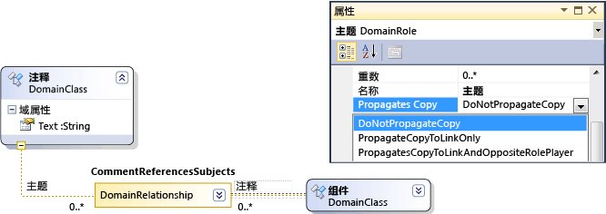
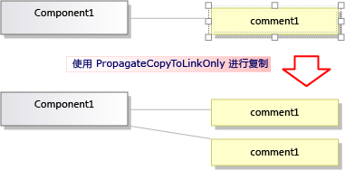
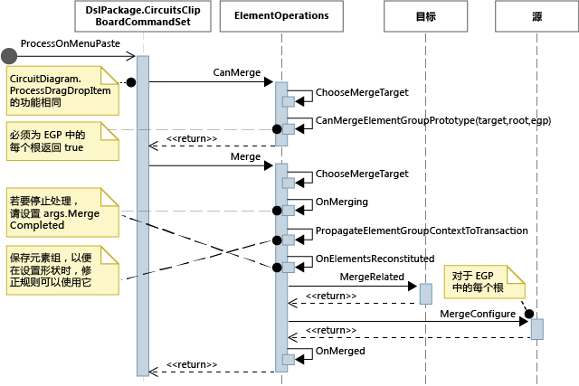

# <a name="customizing-copy-behavior"></a>自定义复制行为
在使用 [!INCLUDE[vsprvs](../code-quality/includes/vsprvs_md.md)] 可视化和建模 SDK 创建的域特定语言 (DSL) 中，你可以更改当用户复制并粘贴元素时所发生的情况。

## <a name="standard-copy-and-paste-behavior"></a>标准的复制和粘贴行为
 若要启用复制，设置**启用复制粘贴**属性**编辑器**DSL 资源管理器中的节点。

 默认情况下，当用户将元素复制到剪贴板时，还会复制以下元素：

-   所选元素的嵌入后代。 （即，作为源于复制元素的嵌入关系目标的元素。）

-   复制的元素之间的关系链接。

 此规则将按递归方式应用到复制的元素和链接。

 

 复制的元素和链接将进行序列化并存储在位于剪贴板上的 <xref:Microsoft.VisualStudio.Modeling.ElementGroupPrototype> (EGP)。

 复制的元素的图像也位于该剪贴板上。 这将允许用户将其粘贴到其他应用程序（如 Word）中。

 用户可以根据 DSL 定义将复制的元素粘贴到可以接受元素的目标上。 例如，在从组件解决方案模板生成的 DSL 中，用户可以将端口复制到组件上，但不能复制到关系图上；并且可以将组件粘贴到关系图上，但不能粘贴到其他组件上。

## <a name="customizing-copy-and-paste-behavior"></a>自定义复制和粘贴行为
 有关自定义模型，使用程序代码的详细信息，请参阅[导航和更新程序代码中的模型](../modeling/navigating-and-updating-a-model-in-program-code.md)。

 **启用或禁用复制、 剪切、 和粘贴。**
在 DSL 资源管理器，设置**启用复制粘贴**属性**编辑器**节点。

 **将链接复制到相同的目标。** 例如，具有一个复制的注释框链接到相同的 subject 元素。
设置**传播复制**到角色的属性**传播副本仅链接**。 有关详细信息，请参阅[自定义链接复制行为](#customizeLinks)。

 复制链接的元素。 例如，在复制新元素时，还建立了任何链接的注释框的副本。
设置**传播复制**到角色的属性**传播副本到链接和相反角色扮演者**。 有关详细信息，请参阅[自定义链接复制行为](#customizeLinks)。

 **通过复制并粘贴的快速重复元素。** 通常情况下，刚刚复制的项仍处于选中状态，并不能粘贴到它上面的元素的同一类型。
将元素合并指令添加到域类，并将其设置为向前合并到父类。 这将在拖动操作上产生相同的效果。 有关详细信息，请参阅[移动数据和自定义元素创建](../modeling/customizing-element-creation-and-movement.md)。

 \- 或 -

 通过重写 `ClipboardCommandSet.ProcessOnPasteCommand()` 选择关系图，然后再粘贴元素。 在 DslPackage 项目的自定义文件中添加此代码：

```csharp
namespace Company.MyDsl {
using System.Linq;
using Microsoft.VisualStudio.Modeling.Diagrams;
using Microsoft.VisualStudio.Modeling.Shell;
partial class MyDslClipboardCommandSet
{
  protected override void ProcessOnMenuPasteCommand()
  {
 // Deselect the current selection after copying:
 Diagram diagram = (this.CurrentModelingDocView as SingleDiagramDocView).Diagram;
    this.CurrentModelingDocView
     .SelectObjects(1, new object[] { diagram }, 0);
  }
} }

```

 **当用户将粘贴到所选目标，请创建更多链接。** 例如，当一个注释框粘贴到元素上时，它们之间将形成链接。
将元素合并指令添加到目标域类，并将其设置为通过添加链接来处理合并。 这将在拖动操作上产生相同的效果。 有关详细信息，请参阅[移动数据和自定义元素创建](../modeling/customizing-element-creation-and-movement.md)。

 \- 或 -

 重写 `ClipboardCommandSet.ProcessOnPasteCommand()` 以在调用基方法后创建附加链接。

 **自定义可以在其中复制元素的格式**到外部应用程序-例如，若要添加到位图窗体的边框。
重写*MyDsl* `ClipboardCommandSet.ProcessOnMenuCopyCommand()` DslPackage 项目中。

 **自定义如何元素的复制命令中，但不是在拖动操作将复制到剪贴板。**
重写*MyDsl* `ClipboardCommandSet.CopyModelElementsIntoElementGroupPrototype()` DslPackage 项目中。

 **保留通过副本形状布局并粘贴。**
当用户复制多个形状时，可以在粘贴它们时保留其相对位置。 在该示例演示了此技术[VMSDK： 线路关系图示例](http://go.microsoft.com/fwlink/?LinkId=213879)。

 若要获得此效果，请将形状和连接符添加到复制的 ElementGroupPrototype。 重写的最简便方法是 ElementOperations.CreateElementGroupPrototype()。 为此，请将以下代码添加到 DSL 项目：

```csharp

public class MyElementOperations : DesignSurfaceElementOperations
{
  // Create an EGP to add to the clipboard.
  // Called when the elements to be copied have been
  // collected into an ElementGroup.
 protected override ElementGroupPrototype CreateElementGroupPrototype(ElementGroup elementGroup, ICollection<ModelElement> elements, ClosureType closureType)
  {
 // Add the shapes and connectors:
 // Get the elements already in the group:
    ModelElement[] mels = elementGroup.ModelElements
        .Concat(elementGroup.ElementLinks) // Omit if the paste target is not the diagram.
        .ToArray();
 // Get their shapes:
    IEnumerable<PresentationElement> shapes =
       mels.SelectMany(mel =>
            PresentationViewsSubject.GetPresentation(mel));
    elementGroup.AddRange(shapes);

 return base.CreateElementGroupPrototype
           (elementGroup, elements, closureType);
  }

 public MyElementOperations(IServiceProvider serviceProvider, ElementOps1Diagram diagram)
      : base(serviceProvider, diagram)
  { }
}

// Replace the standard ElementOperations
// singleton with your own:
partial class MyDslDiagram // EDIT NAME
{
 /// <summary>
 /// Singleton ElementOperations attached to this diagram.
 /// </summary>
 public override DesignSurfaceElementOperations ElementOperations
  {
 get
    {
 if (singleton == null)
      {
        singleton = new MyElementOperations(this.Store as IServiceProvider, this);
      }
 return singleton;
    }
  }
 private MyElementOperations singleton = null;
}

```

 **在选定的位置，例如当前光标位置粘贴形状。**
当用户复制多个形状时，可以在粘贴它们时保留其相对位置。 在该示例演示了此技术[VMSDK： 线路关系图示例](http://go.microsoft.com/fwlink/?LinkId=213879)。

 为实现此效果，请重写 `ClipboardCommandSet.ProcessOnMenuPasteCommand()`，以使用特定于位置的版本的 `ElementOperations.Merge()`。 为此，请在 DslPackage 项目中添加以下代码：

```csharp

partial class MyDslClipboardCommandSet // EDIT NAME
{
   /// <summary>
    /// This method assumes we only want to paste things onto the diagram
    /// - not onto anything contained in the diagram.
    /// The base method pastes in a free space on the diagram.
    /// But if the menu was used to invoke paste, we want to paste in the cursor position.
    /// </summary>
    protected override void ProcessOnMenuPasteCommand()
    {

  NestedShapesSampleDocView docView = this.CurrentModelingDocView as NestedShapesSampleDocView;

      // Retrieve data from clipboard:
      System.Windows.Forms.IDataObject data = System.Windows.Forms.Clipboard.GetDataObject();

      Diagram diagram = docView.CurrentDiagram;
      if (diagram == null) return;

      if (!docView.IsContextMenuShowing)
      {
        // User hit CTRL+V - just use base method.

        // Deselect anything that's selected, otherwise
        // pasted item will be incompatible:
        if (!this.IsDiagramSelected())
        {
          docView.SelectObjects(1, new object[] { diagram }, 0);
        }

        // Paste into a convenient spare space on diagram:
    base.ProcessOnMenuPasteCommand();
      }
      else
      {
        // User right-clicked - paste at mouse position.

        // Utility class:
        DesignSurfaceElementOperations op = diagram.ElementOperations;

        ShapeElement pasteTarget = diagram;

        // Check whether what's in the paste buffer is acceptable on the target.
        if (pasteTarget != null && op.CanMerge(pasteTarget, data))
        {

        // Although op.Merge would be a no-op if CanMerge failed, we check CanMerge first
          // so that we don't create an empty transaction (after which Undo would be no-op).
          using (Transaction t = diagram.Store.TransactionManager.BeginTransaction("paste"))
          {
            PointD place = docView.ContextMenuMousePosition;
            op.Merge(pasteTarget, data, PointD.ToPointF(place));
            t.Commit();
          }
        }
      }
    }
  }
```

 **让用户元素拖放。**
请参阅[如何： 添加的拖放处理](../modeling/how-to-add-a-drag-and-drop-handler.md)。

##  <a name="customizeLinks"></a> 自定义链接复制行为
 当用户复制元素时，标准行为是还会复制所有嵌入元素。 可以修改标准复制行为。 在 DSL 定义中，选择关系的和属性窗口集中一方上的角色**传播复制**值。

 

 有三个值：

-   不传播复制

-   仅将复制传播到链接 - 在粘贴该组时，此链接的新副本将引用链接另一端上的现有元素。

-   将复制传播到链接和相反的角色扮演者 - 复制的组包括位于链接另一端上的元素的副本。

 

 所进行的更改将同时影响元素和复制的图像。

## <a name="programming-copy-and-paste-behavior"></a>编程复制和粘贴行为
 对于复制、 粘贴、 创建和删除对象的 DSL 的行为的许多方面均由的实例<xref:Microsoft.VisualStudio.Modeling.ElementOperations>到关系图结合使用的。 你可以通过派生您自己的类从修改 DSL 的行为<xref:Microsoft.VisualStudio.Modeling.ElementOperations>和重写<xref:Microsoft.VisualStudio.Modeling.Diagrams.Diagram.ElementOperations%2A>图类的属性。

> [!TIP]
>  有关自定义模型，使用程序代码的详细信息，请参阅[导航和更新程序代码中的模型](../modeling/navigating-and-updating-a-model-in-program-code.md)。

 

 

#### <a name="to-define-your-own-elementoperations"></a>定义自己的 ElementOperations

1.  在 DSL 项目的新文件中，创建派生自 <xref:Microsoft.VisualStudio.Modeling.Diagrams.DesignSurfaceElementOperations> 的类。

2.  为关系图类添加分部类定义。 此类的名称可在**Dsl\GeneratedCode\Diagrams.cs**。

     在关系图类中，重写 <xref:Microsoft.VisualStudio.Modeling.Diagrams.Diagram.ElementOperations%2A> 以返回 ElementOperations 子类的实例。 应在每次调用时返回同一个实例。

 在 DslPackage 项目的自定义代码文件中添加此代码：

```csharp

using Microsoft.VisualStudio.Modeling;
using Microsoft.VisualStudio.Modeling.Diagrams;
using Microsoft.VisualStudio.Modeling.Diagrams.ExtensionEnablement;

  public partial class MyDslDiagram
  {
    public override DesignSurfaceElementOperations ElementOperations
    {
      get
      {
        if (this.elementOperations == null)
        {
          this.elementOperations = new MyElementOperations(this.Store as IServiceProvider, this);
        }
        return this.elementOperations;
      }
    }
    private MyElementOperations elementOperations = null;
  }

  public class MyElementOperations : DesignSurfaceElementOperations
  {
    public MyElementOperations(IServiceProvider serviceProvider, MyDslDiagram diagram)
      : base(serviceProvider, diagram)
    { }
    // Overridden methods follow
  }

```

## <a name="receiving-items-dragged-from-other-models"></a>接收从其他模型拖动的项
 ElementOperations 还可用于定义复制、移动、删除和拖放行为。 作为 ElementOperations 用法的演示，此处提供的示例将定义自定义拖放行为。 但是，为该目的可能考虑中所述的备用方法[如何： 添加的拖放处理](../modeling/how-to-add-a-drag-and-drop-handler.md)，即扩展性更强。

 在 ElementOperations 类中定义两个方法：

-   `CanMerge(ModelElement targetElement, System.Windows.Forms.IDataObject data)`，用于确定是否可将源元素拖动到目标形状、连接符或关系图上。

-   `MergeElementGroupPrototype(ModelElement targetElement, ElementGroupPrototype sourcePrototype)`，用于将源元素合并到目标中。

### <a name="canmerge"></a>CanMerge()
 调用 `CanMerge()`，以确定当鼠标在关系图上移动时应向用户提供的反馈。 该方法的参数是在其上鼠标悬停的元素，以及有关源的数据（拖动操作从该源执行）。 用户可以从屏幕上的任何位置进行拖动。 因此，源对象可以为多种不同类型，并且可以采用不同的格式进行序列化。 如果源是 DSL 或 UML 模型，则数据参数是 <xref:Microsoft.VisualStudio.Modeling.ElementGroupPrototype> 的序列化。 拖动、复制和工具箱操作使用 ElementGroupPrototypes 来表示模型的片段。

 元素组原型可以包含任意数目的元素和链接。 元素类型可由其 GUID 标识。 GUID 属于已拖动的形状，而不属于基础模型元素。 在以下示例中，如果将来自 UML 关系图的类形状拖动到此关系图上，则 `CanMerge()` 将返回 True。

```csharp
public override bool CanMerge(ModelElement targetShape, System.Windows.Forms.IDataObject data)
 {
  // Extract the element prototype from the data.
  ElementGroupPrototype prototype = ElementOperations.GetElementGroupPrototype(this.ServiceProvider, data);
  if (targetShape is MyTargetShape && prototype != null &&
        prototype.RootProtoElements.Any(rootElement =>
          rootElement.DomainClassId.ToString()
          ==  "3866d10c-cc4e-438b-b46f-bb24380e1678")) // Guid of UML Class shapes
          // or SourceClass.DomainClassId
        return true;
   return base.CanMerge(targetShape, data);
 }

```

## <a name="mergeelementgroupprototype"></a>MergeElementGroupPrototype()
 当用户将元素放置在关系图、形状或连接符上时，将调用此方法。 它应将拖动的内容合并到目标元素中。 在此示例中，该代码将确定它是否可识别目标和原型类型的组合；如果识别，则该方法可将拖动的元素转换到应添加到模型的元素的原型中。 调用基方法来执行转换或未转换的元素的合并。

```csharp
public override void MergeElementGroupPrototype(ModelElement targetShape, ElementGroupPrototype sourcePrototype)
{
  ElementGroupPrototype prototypeToMerge = sourcePrototype;
  MyTargetShape pel = targetShape as MyTargetShape;
  if (pel != null)
  {
    prototypeToMerge = ConvertDraggedTypeToLocal(pel, sourcePrototype);
  }
  if (prototypeToMerge != null)
    base.MergeElementGroupPrototype(targetShape, prototypeToMerge);
}

```

 此示例将处理从 UML 类关系图中拖动的 UML 类元素。 DSL 的设计目的不是直接存储 UML 类，而是为每个拖动的 UML 类创建 DSL 元素。 例如，如果 DSL 是实例关系图，则这将十分有用。 用户可以将类拖动到关系图上来创建这些类的实例。

```csharp

private ElementGroupPrototype ConvertDraggedTypeToLocal (MyTargetShape snapshot, ElementGroupPrototype prototype)
{
  // Find the UML project:
  EnvDTE.DTE dte = snapshot.Store.GetService(typeof(EnvDTE.DTE)) as EnvDTE.DTE;
  foreach (EnvDTE.Project project in dte.Solution.Projects)
  {
    IModelingProject modelingProject = project as IModelingProject;
    if (modelingProject == null) continue; // not a modeling project
    IModelStore store = modelingProject.Store;
    if (store == null) continue;
    // Look for the shape that was dragged:
    foreach (IDiagram umlDiagram in store.Diagrams())
    {
      // Get modeling diagram that implements UML diagram:
      Diagram diagram = umlDiagram.GetObject<Diagram>();
      Guid elementId = prototype.SourceRootElementIds.FirstOrDefault();
      ShapeElement shape = diagram.Partition.ElementDirectory.FindElement(elementId) as ShapeElement;
      if (shape == null) continue;
      IClass classElement = shape.ModelElement as IClass;
      if (classElement == null) continue;

      // Create a prototype of elements in my DSL, based on the UML element:
      Instance instance = new Instance(snapshot.Store);
      instance.Type = classElement.Name;
      // Pack them into a prototype:
      ElementGroup group = new ElementGroup(instance);
      return group.CreatePrototype();
    }
  }
  return null;
}

```

## <a name="standard-copy-behavior"></a>标准复制行为
 此部分中的代码将显示可进行重写以更改复制行为的方法。 为了帮助你了解如何实现自己的自定义，此部分显示了可重写涉及复制的方法但不更改标准行为的代码。

 当用户按 CTRL+C 或使用“复制”菜单命令时，将调用方法 <xref:Microsoft.VisualStudio.Modeling.Shell.ClipboardCommandSet.ProcessOnMenuCopyCommand%2A>。 你可以看到如何这在中设置**DslPackage\Generated Code\CommandSet.cs**。 有关命令的设置的方式的详细信息，请参阅[如何： 向快捷菜单添加命令](../modeling/how-to-add-a-command-to-the-shortcut-menu.md)。

 你可以通过添加分部类定义的替代 ProcessOnMenuCopyCommand *MyDsl* `ClipboardCommandSet` DslPackage 项目中。

```csharp
using System.Collections.Generic;
using System.Drawing;
using System.Windows.Forms;
using Microsoft.VisualStudio.Modeling;
using Microsoft.VisualStudio.Modeling.Diagrams;

partial class MyDslClipboardCommandSet
{
  /// <summary>
  /// Override ProcessOnMenuCopyCommand() to copy elements to the
  /// clipboard in different formats, or to perform additional tasks
  /// before or after copying - for example deselect the copied elements.
  /// </summary>
  protected override void ProcessOnMenuCopyCommand()
  {
    IList<ModelElement> selectedModelElements = this.SelectedElements;
    if (selectedModelElements.Count == 0) return;

    // System container for clipboard data.
    // The IDataObject can contain data in several formats.
    IDataObject dataObject = new DataObject();

    Bitmap bitmap = null; // For export to other programs.
    try
    {
      #region Create EGP for copying to a DSL.
      this.CopyModelElementsIntoElementGroupPrototype
                     (dataObject, selectedModelElements);
      #endregion

      #region Create bitmap for copying to another application.
      // Find all the shapes associated with this selection:
      List<ShapeElement> shapes = new List<ShapeElement>(
        this.ResolveExportedShapesForClipboardImages
              (dataObject, selectedModelElements));

      bitmap = this.CreateBitmapForClipboard(shapes);
      if (bitmap != null)
      {
        dataObject.SetData(DataFormats.Bitmap, bitmap);
      }
      #endregion

      // Add the data to the clipboard:
      Clipboard.SetDataObject(dataObject, true, 5, 100);
    }
    finally
    {
      // Dispose bitmap after SetDataObject:
      if (bitmap != null) bitmap.Dispose();
    }
  }
/// <summary>
/// Override this to customize the element group that is copied to the clipboard.
/// </summary>
protected override void CopyModelElementsIntoElementGroupPrototype(IDataObject dataObject, IList<ModelElement> selectedModelElements)
{
  return this.ElementOperations.Copy(dataObject, selectedModelElements);
}
}
```

 每个关系图都具有 ElementOperations 的单一实例。 你可以提供自己的派生。 此文件（可放置在 DSL 项目中）的行为将与它重写的代码相同：

```csharp
using System;
using System.Collections.Generic;
using System.Linq;
using Microsoft.VisualStudio.Modeling;
using Microsoft.VisualStudio.Modeling.Diagrams;

namespace Company.MyDsl
{
  partial class MyDslDiagram
  {
    /// <summary>
    /// Singleton ElementOperations attached to this diagram.
    /// </summary>
    public override DesignSurfaceElementOperations ElementOperations
    {
      get
      {
        if (this.elementOperations == null)
        {
          this.elementOperations = new MyElementOperations(this.Store as IServiceProvider, this);
        }
        return this.elementOperations;
      }
    }
    private MyElementOperations elementOperations = null;
  }

  // Our own version of ElementOperations so that we can override:
  public class MyElementOperations : DesignSurfaceElementOperations
  {
    public MyElementOperations(IServiceProvider serviceProvider, ElementOps1Diagram diagram)
      : base(serviceProvider, diagram)
    { }

    /// <summary>
    /// Copy elements to the clipboard data.
    /// Provides a hook for adding custom data.
    /// </summary>
    public override void Copy(System.Windows.Forms.IDataObject data,
      ICollection<ModelElement> elements,
      ClosureType closureType,
      System.Drawing.PointF sourcePosition)
    {
      if (CanAddElementGroupFormat(elements, closureType))
      {
        AddElementGroupFormat(data, elements, closureType);
      }

      // Override these to store additional data:
      if (CanAddCustomFormat(elements, closureType))
      {
        AddCustomFormat(data, elements, closureType, sourcePosition);
      }
    }

    protected override void AddElementGroupFormat(System.Windows.Forms.IDataObject data, ICollection<ModelElement> elements, ClosureType closureType)
    {
      // Add the selected elements and those implied by the propagate copy rules:
      ElementGroup elementGroup = this.CreateElementGroup(elements, closureType);

      // Mark all the elements that are not embedded under other elements:
      this.MarkRootElements(elementGroup, elements, closureType);

      // Store in the clipboard data:
      ElementGroupPrototype elementGroupPrototype = this.CreateElementGroupPrototype(elementGroup, elements, closureType);
      data.SetData(ElementGroupPrototype.DefaultDataFormatName, elementGroupPrototype);
    }

    /// <summary>
    /// Override this to store additional elements in the element group:
    /// </summary>
    protected override ElementGroupPrototype CreateElementGroupPrototype(ElementGroup elementGroup, ICollection<ModelElement> elements, ClosureType closureType)
    {
      ElementGroupPrototype prototype = new ElementGroupPrototype(this.Partition, elementGroup.RootElements, elementGroup);
      return prototype;
    }

    /// <summary>
    /// Create an element group from the given starting elements, using the
    /// copy propagation rules specified in the DSL Definition.
    /// By default, this includes all the embedded descendants of the starting elements,
    /// and also includes reference links where both ends are already included.
    /// </summary>
    /// <param name="startElements">model elements to copy</param>
    /// <param name="closureType"></param>
    /// <returns></returns>
    protected override ElementGroup CreateElementGroup(ICollection<ModelElement> startElements, ClosureType closureType)
    {
      // ElementClosureWalker finds all the connected elements,
      // according to the propagate copy rules specified in the DSL Definition:
      ElementClosureWalker walker = new ElementClosureWalker(this.Partition,
        closureType, // Normally ClosureType.CopyClosure
        startElements,
        true, // Do not load other models.
        null, // Optional list of domain roles not to traverse.
        true); // Include relationship links where both ends are already included.

      walker.Traverse(startElements);
      IList<ModelElement> closureList = walker.ClosureList;
      Dictionary<object, object> closureContext = walker.Context;

      // create a group for this closure
      ElementGroup group = new ElementGroup(this.Partition);
      group.AddRange(closureList, false);

      // create the element group prototype for the group
      foreach (object key in closureContext.Keys)
      {
        group.SourceContext.ContextInfo[key] = closureContext[key];
      }

      return group;
    }
  }
}

```

## <a name="see-also"></a>请参阅

- [自定义元素创建和移动](../modeling/customizing-element-creation-and-movement.md)
- [如何：添加拖放处理程序](../modeling/how-to-add-a-drag-and-drop-handler.md)
- [自定义删除行为](../modeling/customizing-deletion-behavior.md)
- [示例： VMSDK 线路关系图示例](http://go.microsoft.com/fwlink/?LinkId=213879)

[!INCLUDE[modeling_sdk_info](includes/modeling_sdk_info.md)]