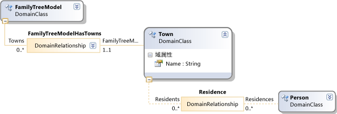

# <a name="getting-started-with-domain-specific-languages"></a>域特定语言入门
本主题介绍中定义和使用的建模 SDK for Visual Studio 创建域特定语言 (DSL) 的基本概念。

> [!NOTE]
> 在 Visual Studio 2017，文本模板转换 SDK 和 Visual Studio 建模 SDK 时会自动安装在安装 Visual Studio 的特定功能。 有关更多详细信息，请参阅[这篇博客文章](https://blogs.msdn.microsoft.com/visualstudioalm/2016/12/12/the-visual-studio-modeling-sdk-is-now-available-with-visual-studio-2017/)。

如果你不熟悉 Dsl，我们建议你通读**DSL 工具实验室**，你可以在此站点中查找： [Visualizaton 和建模 SDK](http://go.microsoft.com/fwlink/?LinkID=186128)

## <a name="what-can-you-do-with-a-domain-specific-language"></a>域特定语言，你可以做什么？
 域特定语言是表示法，通常为图形，用于为特定目的而设计。 与此相反，例如 UML 的语言是通用的。 在 DSL，你可以定义类型的模型元素和它们之间的关系，以及它们在屏幕上的呈现方式。

 当您设计 DSL 时，可以将其作为 Visual Studio 集成扩展 (VSIX) 包的一部分进行分发。 用户要使用 Visual Studio 中 DSL:

 

 表示法是仅的 DSL 的一部分。 表示法，以及你的 VSIX 包包括多种工具，用户可以应用来编辑和从其模型生成材料。

 Dsl 的主体应用程序之一是生成程序代码、 配置文件和其他项目。 特别是在大型项目和产品系列，其中将创建的一种产品的多个变体，从 Dsl 生成多个变量方面可以提供大幅增加在可靠性和非常快速响应要求更改。

 本概述的其余部分是一个演练，介绍创建和使用 Visual Studio 中的域特定语言的基本操作。

## <a name="prerequisites"></a>系统必备
 若要定义 DSL，必须安装以下组件：

|||
|-|-|
|Visual Studio|[http://go.microsoft.com/fwlink/?LinkId=185579](http://go.microsoft.com/fwlink/?LinkId=185579)|
|[!INCLUDE[vssdk_current_short](../modeling/includes/vssdk_current_short_md.md)]|[http://go.microsoft.com/fwlink/?LinkId=185580](http://go.microsoft.com/fwlink/?LinkId=185580)|
|For Visual Studio 建模 SDK||


[!INCLUDE[modeling_sdk_info](includes/modeling_sdk_info.md)]


## <a name="creating-a-dsl-solution"></a>创建 DSL 解决方案
 若要创建新的域特定语言，请通过使用域特定语言的项目模板创建新的 Visual Studio 解决方案。

#### <a name="to-create-a-dsl-solution"></a>创建 DSL 解决方案

1.  在 **“文件”** 菜单上，指向 **“新建”**，然后单击 **“项目”**。

2.  下**项目类型**，展开**其他项目类型**节点，然后单击**扩展性**。

3.  单击**域特定语言设计器**。

     

4.  在**名称**框中，键入**FamilyTree**。 单击 **“确定”**。

     **域特定语言向导**将打开，并且显示模板 DSL 解决方案的列表。

     单击以查看的描述，每个模板

     模板是有用起始点。 每个提供完成工作 DSL，可编辑以满足您的需要。 通常，你将选择最接近你想要创建的模板。

5.  对于本演练中，选择**最小语言**模板。

6.  在相应的向导页中输入 DSL 的文件扩展名。 这是包含 DSL 的实例的文件将使用的扩展名。

    -   选择所关联的任何应用程序在你的计算机，或你想要安装 DSL 任何计算机中的扩展。 例如， **docx**和**htm**是不可接受的文件扩展名。

    -   如果你输入的扩展名已用作 DSL，则该向导将向你发出警告。 请考虑使用不同的文件扩展名。 还可以重置 Visual Studio SDK 实验实例以清除旧的实验设计器。 单击**启动**，单击**所有程序**， **Microsoft Visual Studio 2010 SDK**，**工具**，，然后**重置 MicrosoftVisual Studio 2010 实验实例**。

7.  检查其他页，然后单击**完成**。

     解决方案将生成包含两个项目。 它们是名为 Dsl 和 DslPackage。 关系图文件，它是打开命名的 DslDefinition.dsl。

    > [!NOTE]
    >  从 DslDefinition.dsl 生成的大部分代码，你可以在两个项目中的文件夹中看到。 出于此原因，到 DSL 的大多数修改都会在此文件中。

 用户界面现在类似于下图。

 

 此解决方案将定义域特定语言。 有关详细信息，请参阅[的域特定语言工具用户界面概述](../modeling/overview-of-the-domain-specific-language-tools-user-interface.md)。

## <a name="the-important-parts-of-the-dsl-solution"></a>DSL 解决方案的重要部分
 请注意新的解决方案的以下方面。

-   **Dsl\DslDefinition.dsl**这是你看到创建 DSL 解决方案时的文件。 在解决方案中的几乎所有代码从该文件中，都生成和此处所做大部分对 DSL 定义所做的更改。 有关详细信息，请参阅使用[使用 DSL 定义关系图](../modeling/working-with-the-dsl-definition-diagram.md)。

-   **Dsl 项目**此项目包含用于定义特定于域的语言代码。

-   **DslPackage 项目**此项目包含允许的 DSL 来打开和编辑 Visual Studio 中的实例的代码。

##  <a name="Debugging"></a> 运行 DSL
 一旦你已创建，则可以运行 DSL 解决方案。 更高版本，你可以修改 DSL 定义逐渐，每项更改后再次运行解决方案。

#### <a name="to-experiment-with-the-dsl"></a>尝试使用 DSL

1.  单击**转换所有模板**解决方案资源管理器工具栏中。 这将重新生成大部分 DslDefinition.dsl 中的源代码。

    > [!NOTE]
    >  每当你更改 DslDefinition.dsl，必须单击**转换所有模板**重新生成解决方案之前。 可以自动化执行此步骤。 有关详细信息，请参阅[如何自动转换所有模板](http://msdn.microsoft.com/b63cfe20-fe5e-47cc-9506-59b29bca768a)。

2.  按 F5，或在**调试**菜单上，单击**启动调试**。

     DSL 生成，并已安装 Visual Studio 的实验实例中。

     启动 Visual Studio 的实验实例。 实验实例将其设置从注册表中，其中以便进行调试注册 Visual Studio 扩展的单独子树。 Visual Studio 的正常实例不能访问到那里注册的扩展。

3.  在 Visual Studio 的实验实例中，打开名为的模型文件**测试**从**解决方案资源管理器**。

     \- 或 -

     右键单击调试项目，指向**添加**，然后单击**项**。 在**添加项**对话框中，选择文件类型 DSL。

     作为一个空白图表打开模型文件。

     工具箱中打开并显示与该关系图类型相应的工具。

4.  使用工具在图上创建的形状和连接符。

    1.  若要创建形状，将从示例形状工具拖动到关系图。

    2.  若要连接两个形状，单击示例连接器工具，单击第一个形状，然后单击第二个形状。

5.  单击以更改它们的形状的标签。

 实验性 Visual Studio 将类似于下面的示例：

 

### <a name="the-content-of-a-model"></a>模型的内容
 文件的 DSL 实例的内容称为*模型*。 该模型包含*模型 * * 元素*和*链接*元素之间。 DSL 定义指定哪些类型的模型元素和链接可以在模型中存在。 例如，在最小语言模板创建的 DSL，没有一种类型的模型元素和一种类型的链接。

 DSL 定义可以指定模型关系图上的显示方式。 你可以选择使用不同的形状和连接器的样式。 你可以指定某些形状出现在其他形状内。

 你可以为中的树中查看模型**资源管理器**查看进行编辑模型时。 在形状添加到关系图中，模型元素还显示在浏览器。 即使没有关系图，可以使用资源管理器。

 如果上看不到资源管理器中的 Visual Studio 中，调试实例**视图**菜单中的指向**其他窗口**，然后单击*\<你语言 >***资源管理器**。

### <a name="the-api-of-your-dsl"></a>DSL 的 API
 DSL 生成一个 API，使你能够读取和更新的 DSL 实例模型。 一个应用程序的 api 是从模型生成文本文件。 有关详细信息，请参阅[使用 T4 文本模板生成设计时代码](../modeling/design-time-code-generation-by-using-t4-text-templates.md)。

 在调试解决方案中，打开模板文件扩展名".tt"。 这些示例演示如何从模型中，生成文本和允许你测试 DSL 的 API。 其中一个示例用编写[!INCLUDE[vbprvb](../code-quality/includes/vbprvb_md.md)]，则在其他[!INCLUDE[csprcs](../data-tools/includes/csprcs_md.md)]。

 在每个模板文件是它会生成的文件。 展开解决方案资源管理器中的模板文件并打开生成的文件。

 模板文件包含短列出模型中的所有元素的代码段。

 生成的文件包含的结果。

 更改模型文件时，你将看到生成的文件中的相应更改后重新生成文件。

##### <a name="to-regenerate-text-files-after-you-change-the-model-file"></a>若要重新生成后的文本文件，将更改模型文件

1.  在 Visual Studio 的实验实例中，保存模型文件。

2.  请确保每个.tt 文件中的文件名称参数指用于试验的模型文件。 保存.tt 文件。

3.  单击**转换所有模板**工具栏中**解决方案资源管理器**。

     \- 或 -

     右键单击你想要重新生成，然后单击模板**运行自定义工具**。

 可以向项目添加任意数量的文本模板文件。 每个模板生成一个结果文件。

> [!NOTE]
>  DSL 定义更改时，示例文本模板代码将无法工作，除非你更新它。

 有关详细信息，请参阅[从域特定语言生成代码](../modeling/generating-code-from-a-domain-specific-language.md)和[编写代码，以自域特定语言](../modeling/writing-code-to-customise-a-domain-specific-language.md)。

## <a name="customizing-the-dsl"></a>自定义 DSL
 如果你想要修改的 DSL 定义，关闭实验实例并更新主 Visual Studio 实例中的定义。

> [!NOTE]
>  修改了 DSL 定义之后，你可能会丢失在使用早期版本创建的测试模型的信息。  例如，调试的解决方案包含名为示例，其中包含一些形状和连接符的文件。 你开始开发 DSL 定义后，它们将不可见，并保存文件时它们将会丢失。

 你可以扩展的各种 DSL。 下面的示例会向你展示了可能的匹配项。

 每个在更改之后，保存 DSL 定义中，单击**转换所有模板**中**解决方案资源管理器**，然后按**F5**尝试更改 DSL。

### <a name="rename-the-types-and-tools"></a>重命名类型和工具
 重命名现有的域类和关系。 例如，从最小语言模板创建的 Dsl 定义开始，你可以执行以下重命名操作，以使 DSL 表示系列树。

##### <a name="to-rename-domain-classes-relationships-and-tools"></a>若要重命名域类、 关系和工具

1.  在 DslDefinition 图中，重命名**ExampleModel**到**FamilyTreeModel**， **ExampleElement**到**人员**， **目标**到**父级**，和**源**到**子级**。 你可以单击每个标签以更改它。

     

2.  重命名的元素和连接器工具。

    1.  通过在解决方案资源管理器下单击选项卡中打开 DSL 资源管理器窗口。 如果你不能上看到它，**视图**菜单中的指向**其他窗口**，然后单击**DSL 资源管理器**。 仅当 DSL 定义关系图活动窗口时，DSL 资源管理器才可见。

    2.  打开属性窗口，并将其置于，这样您可以同时看到 DSL 资源管理器和属性。

    3.  DSL 资源管理器，展开**编辑器**，**工具箱选项卡**，  *\<DSL >*，，然后**工具**。

    4.  单击**ExampleElement**。 这是用于创建元素的工具箱项。

    5.  在属性窗口中，更改**名称**属性**人员**。

         请注意，**标题**属性也会更改。

    6.  在同样的方式将名称更改**ExampleConnector**工具到**ParentLink**。 Alter**标题**属性，以便它不是一份 Name 属性。 例如，输入**父链接**。

3.  重新生成 DSL。

    1.  保存 DSL 定义文件。

    2.  单击**转换所有模板**的工具栏中的解决方案资源管理器

    3.  按 F5。 等待，直到显示 Visual Studio 的实验实例。

4.  在 Visual Studio 的实验实例中的调试解决方案中，打开测试模型文件。 将元素从工具箱拖放到它上面。 请注意，已更改的工具标题和 DSL 资源管理器中的类型名称。

5.  保存模型文件。

6.  打开一个.tt 文件，并将旧的类型和属性名称的匹配项替换为新名称。

7.  请确保.tt 文件中指定的文件名称指定测试模型。

8.  保存.tt 文件。 打开生成的文件，以查看.tt 文件中运行代码的结果。 验证它正确。

### <a name="add-domain-properties-to-classes"></a>向类添加域属性
 将属性添加到域类，例如，若要表示的出生年份和死亡的个人。

 若要使新的属性在关系图上可见，你必须添加*修饰符*到显示的模型元素的形状。 你还必须将属性映射到修饰符。

##### <a name="to-add-properties-and-display-them"></a>添加属性，并将它们显示

1.  添加属性。

    1.  在 DSL 定义关系图中，右键单击**人员**域类，指向**添加**，然后单击**域属性**。

    2.  键入新的属性名称的列表，如**出生**和**死亡**。 按**Enter**后每个。

2.  添加将在形状中显示的属性的修饰符。

    1.  按照灰线中从 Person 域类关系图的另一端。 这是一个关系图元素映射。 其链接到形状类链接域类。

    2.  右键单击此形状类，指向**添加**，然后单击**文本修饰器**。

    3.  将具有名称的两个修饰符添加比如**BirthDecorator**和**DeathDecorator**。

    4.  选择每个新的修饰器，并在属性窗口中，设置**位置**字段。 这将确定将在形状中显示域属性值。 例如，设置**InnerBottomLeft**和**InnerBottomRight**。

         

3.  映射到属性修饰器。

    1.  打开 DSL 详细信息窗口。 它通常是在输出窗口的旁边的选项卡中。 如果你不能上看到它，**视图**菜单上，指向**其他窗口**，然后单击**DSL 详细信息**。

    2.  在 DSL 定义关系图中，单击连接的行**人员**域类形状类。

    3.  在**DSL 详细信息**上**修饰器地图**选项卡上，单击未映射的修饰器上的复选框。 在**显示属性**，选择想它映射的 domain 属性。 例如，映射**BirthDecorator**到**出生**。

4.  保存 DSL、 单击转换所有模板并按 F5。

5.  在示例模型图中，验证你现在可以单击您选择的位置并向其中键入值。 此外，当选择**人员**形状，属性窗口显示出生和死亡的新属性。

6.  在.tt 文件中，你可以添加获取每个人员的属性的代码。

 

### <a name="define-new-classes"></a>定义新类
 可以向模型添加域类和关系。 例如，你可以创建一个新类来表示城镇和新的关系来表示一个人居住在镇。

 若要在模型关系图上进行不同的类型不同，可以对不同类型的形状，或使用不同的几何图形和颜色的形状映射的域类。

##### <a name="to-add-and-display-a-new-domain-class"></a>可以添加和显示新的域类

1.  添加域类，并使其成为子模型根。

    1.  DSL 定义关系图中，在单击**嵌入关系**工具，单击根类**FamilyTreeModel**，然后单击关系图的空白部分。

         新的域类将出现，连接到具有嵌入关系 FamilyTreeModel。

         设置其名称，例如**镇**。

        > [!NOTE]
        >  除根模型的每个域类必须是目标的至少一个嵌入的关系，或它必须继承自是嵌入的目标类。 出于此原因，是通过使用嵌入关系工具创建域类经常方便。

    2.  域属性添加到新的类，例如**名称**。

2.  添加人员和镇之间的引用关系。

    1.  单击**引用关系**工具，单击人员，然后单击镇。

         

        > [!NOTE]
        >  引用关系表示从模型树的一部分的交叉引用，到另一个。

3.  添加形状以表示市分别有模型关系图上。

    1.  拖动**几何形状**从工具箱拖到关系图和其重命名，例如**TownShape**。

    2.  在属性窗口中，将设置新形状，如填充颜色和几何图形的外观字段。

    3.  添加要显示的镇非常受欢迎，名称修饰器，并将其重命名 NameDecorator。 设置其位置属性。

4.  映射到 TownShape 镇域类。

    1.  单击**关系图元素映射**工具，然后单击镇域类，然后 TownShape 形状类。

    2.  在**修饰器地图**选项卡**DSL 详细信息**与地图连接器窗口选择、 检查 NameDecorator 和设置**显示属性**为名称。

5.  创建连接器，以显示人员和城镇之间的关系。

    1.  将连接器从工具箱拖到关系图。 将其重命名并设置其外观属性。

    2.  使用**关系图元素映射**工具以将新的连接器链接到用户和镇之间的关系。

         

6.  创建用于发起新建镇元素工具。

    1.  在**DSL 资源管理器**，展开**编辑器**然后**工具箱选项卡**。

    2.  右键单击 *\<DSL >* ，然后单击**添加新元素工具**。

    3.  设置**名称**属性的新工具，并设置其**类**镇的属性。

    4.  设置**工具箱图标**属性。 单击 **[…]** 并在**文件名**字段中，选择一个图标文件。

7.  创建一个连接器工具进行城镇与人员之间的链接。

    1.  右键单击 *\<DSL >* ，然后单击**添加新的连接器工具**。

    2.  设置新工具的名称属性。

    3.  在**ConnectionBuilder**属性，选择包含人员镇关系的名称的生成器。

    4.  设置**工具箱图标**。

8.  保存 DSL 定义，请单击**转换所有模板**，然后按**F5**。

9. 在 Visual Studio 的实验实例中，打开测试模型文件。 使用新的工具创建城镇和城镇和人员之间的链接。 请注意，你只能创建正确类型的元素之间的链接。

10. 创建列出每个人员的存在镇的代码。 文本模板是一种可在其中运行此类代码的位置。 例如，你可以修改调试解决方案中的现有 Sample.tt 文件，以使其包含以下代码：

    ```
    <#@ template inherits="Microsoft.VisualStudio.TextTemplating.VSHost.ModelingTextTransformation" debug="true" #>
    <#@ output extension=".txt" #>
    <#@ FamilyTree processor="FamilyTreeDirectiveProcessor" requires="fileName='Sample.ftree'" #>

    <#
      foreach (Person person in this.FamilyTreeModel.People)
      {
    #>
        <#= person.Name #><#if (person.Town != null) {#> of <#= person.Town.Name #> <#}#>

    <#
          foreach (Person child in person.Children)
      {
    #>
                <#= child.Name #>
    <#
      }
      }
    #>

    ```

     保存 *.tt 文件时，它将创建一个附属文件包含人员和其派驻服务的列表。 有关详细信息，请参阅[从域特定语言生成代码](../modeling/generating-code-from-a-domain-specific-language.md)。

## <a name="validation-and-commands"></a>验证和命令
 无法通过添加验证约束来开发此 DSL 进一步。 这些约束是你可以定义，请确保在模型处于正确状态的方法。 例如，你可以的子级的出生日期晚于其父级的定义一个约束以确保。 如果 DSL 用户尝试保存模型会中断任何约束，验证功能将显示警告。 有关详细信息，请参阅[域特定语言中的验证](../modeling/validation-in-a-domain-specific-language.md)。

 你还可以定义用户可调用的菜单命令。 命令可以修改模型。 它们可以使用 Visual Studio 中的其他模型和外部资源进行交互。 有关详细信息，请参阅[如何： 修改标准的菜单命令](../modeling/how-to-modify-a-standard-menu-command-in-a-domain-specific-language.md)。

## <a name="deploying-the-dsl"></a>部署 DSL
 若要允许其他用户使用的域特定语言，你将分发 Visual Studio 扩展 (VSIX) 文件。 这被创建时生成的 DSL 解决方案。

 你的解决方案的 bin 文件夹中找到.vsix 文件。 将其复制到你要在其安装它的计算机。 在该计算机中，双击 VSIX 文件。 DSL 可在该计算机上的 Visual Studio 的所有实例。

 可以使用相同的过程可以在你自己的计算机上安装 DSL，这样，则不需要使用 Visual Studio 的实验实例。

 有关详细信息，请参阅[部署域特定语言解决方案](../modeling/deploying-domain-specific-language-solutions.md)。

##  <a name="Reset"></a> 删除旧的实验 Dsl
 如果你已创建但不再希望的实验 dsl 相关联，可以从您的计算机重置的 Visual Studio 实验实例来删除它们。

 这将从计算机中删除你所有实验 Dsl 和其他实验性 Visual Studio 扩展。 这些是在调试模式下执行的扩展。

 此过程不会删除 Dsl 或已通过执行的 VSIX 文件的完全安装其他 Visual Studio 扩展。

#### <a name="to-reset-the-visual-studio-experimental-instance"></a>若要重置的 Visual Studio 实验实例

1.  单击**启动**，单击**所有程序**， **Microsoft Visual Studio 2010 SDK**，**工具**，，然后**重置 MicrosoftVisual Studio 2010 实验实例**。

2.  重新生成任何实验 Dsl 或你仍想要使用其他实验性 Visual Studio 扩展。

## <a name="see-also"></a>请参阅

- [了解模型、类和关系](../modeling/understanding-models-classes-and-relationships.md)
- [如何定义域特定语言](../modeling/how-to-define-a-domain-specific-language.md)