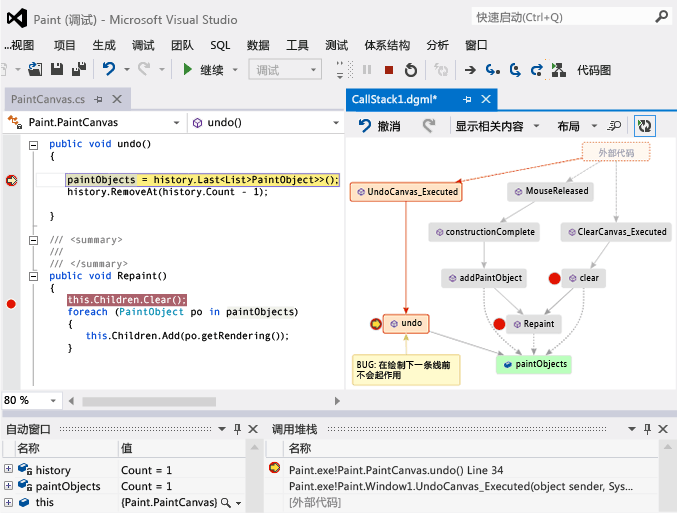
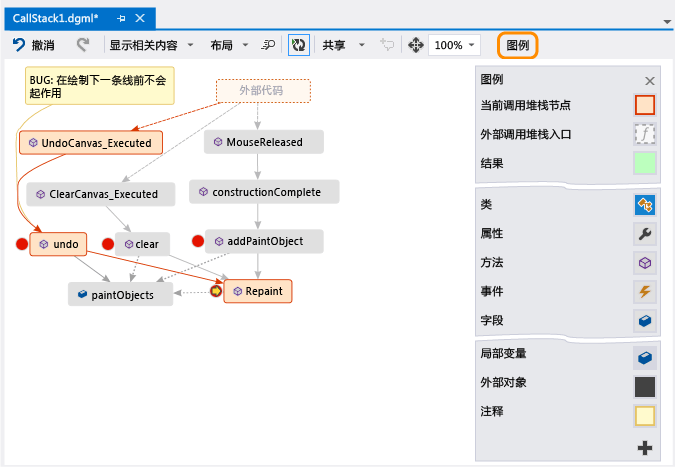

# 在 Visual Studio 中调试时映射调用堆栈上的方法
创建一个代码图以进行调试时直观地跟踪调用堆栈。 你可以在图中进行标注以跟踪代码执行的操作，以便专注于查找 Bug。

 

 你将需要：

-   [Visual Studio Enterprise](https://www.visualstudio.com/downloads/download-visual-studio-vs)

-   你可以调试，如 Visual C#、 Visual Basic、 c + +、 JavaScript 或 X + + 的代码

 请参阅：

-   [视频： 直观地调试与代码图调试器集成 (通道 9)](http://go.microsoft.com/fwlink/?LinkId=293418)

-   [映射调用堆栈](#MapStack)

-   [对代码进行标注](#MakeNotes)

-   [使用下一个调用堆栈更新图](#UpdateMap)

-   [向地图添加相关的代码](#AddRelatedCode)

-   [使用图发现 bug](#FindBugs)

-   [问题解答](#QA)

 有关命令和使用代码图时，可以使用的操作的详细信息，请参阅[浏览和重新排列代码图](../modeling/browse-and-rearrange-code-maps.md)。

##   映射调用堆栈

1.  开始调试。 (键盘： **F5**)

2.  你的应用进入中断模式或你单步执行函数后，请选择**代码图**。 (键盘： **Ctrl** + **Shift** + **`**)

     

     当前的调用堆栈在新代码图上显示为橙色：

     

     在你继续调试时，该代码图将自动更新。 请参阅[使用下一个调用堆栈更新图](#UpdateMap)。

##   对代码进行标注
 添加注释以跟踪代码中发生了什么情况。 若要在注释中添加新行，请按**Shift + Return**。

 

##   使用下一个调用堆栈更新图
 运行你的应用到下一个断点或单步执行某一函数。 此图将添加新的调用堆栈。

 

##   向地图添加相关的代码
 现在你已生成一个图的新增功能下一步？ 如果你正在使用 C# 或 Visual Basic，添加项，例如字段、 属性和其他方法，来跟踪代码中发生了什么情况。

 双击某个方法以查看其代码定义，或者使用该方法的快捷菜单。 (键盘： 选择在图上按方法**F12**)

 

 添加要在图上跟踪的项。

 

> [!NOTE]
>  默认情况下，向图添加项还会添加父组节点（如类、命名空间和程序集）。 尽管这很有用，你可以仅仅保留图通过关闭此功能使用**包括父级**按钮在图工具栏上，或按**CTRL**添加项时。

 

 在这里，你可以轻松查看哪些方法使用了相同的字段。 最近添加的项显示为绿色。

 继续生成图以查看更多代码。

 

 

##   使用图发现 bug
 通过代码可视化，可帮助你更快发现 Bug。 例如，假设你正在调查的绘图程序中的 bug。 当你绘制一条线并尝试撤消该操作时，直到你绘制另一条线后才会发生变化。

 因此，可在 `clear`、`undo` 和 `Repaint` 方法中设置断点，启动调试，然后生成如下所示的图：

 

 你注意到图中所有用户笔势均调用 `Repaint`，但 `undo` 除外。 这可能解释`undo`不立即发挥作用。

 在修复此 Bug 并继续运行程序后，图中增加了从 `undo` 到 `Repaint` 的新调用：

 

##   问题解答

-   **并非所有调用将都显示在图中。为什么?**

     默认情况下，只有你自己的代码会显示在图中。 若要查看外部代码，它在中启用**调用堆栈**窗口：

     

     关闭或**启用 ' 仅我的代码**在 Visual Studio 调试选项：

     

-   **更改图是否会影响代码？**

     更改图不会对代码造成任何影响。 你可随意在图上重命名、移动或移除任何内容。

-   **此消息意味着什么:"关系图可能基于旧版本的代码"？**

     在你上次更新图后，代码可能已发生更改。 例如，图中的某个调用可能已在代码中不存在了。 请关闭此消息，然后在再次更新图之前，尝试重新生成解决方案。

-   **如何控制图的布局？**

     打开**布局**图工具栏上的菜单：

    -   更改默认布局。

    -   若要停止自动重新排列图，请关闭**调试时自动布局**。

    -   若要添加项时，重新排列图降至最低，请关闭**增量布局**。

-   **可以与他人共享此图？**

     你可以导出映射，将其发送给他人（如果你有 Microsoft Outlook）或保存到你的解决方案中，以便你将其签入 Team Foundation 版本控制。

     

-   **如何停止自动添加新的调用堆栈中的映射？**

     选择图工具栏上。 若要手动添加到映射的当前调用堆栈，请按**Ctrl** + **Shift** + **`**。

     图中将继续进行调试时突出显示现有调用堆栈代码图上。

-   **项图标和箭头代表什么？**

     若要获取有关某个项的详细信息，请将鼠标指针移到它，然后查看该项的工具提示。 你还可以查看在**图例**要了解每个图标的含义。

     

 请参阅：

-   [映射调用堆栈](#MapStack)

-   [对代码进行标注](#MakeNotes)

-   [使用下一个调用堆栈更新图](#UpdateMap)

-   [向地图添加相关的代码](#AddRelatedCode)

-   [使用图发现 bug](#FindBugs)

## 请参阅

- [映射解决方案中的依赖项](../modeling/map-dependencies-across-your-solutions.md)
- [使用代码图调试应用程序](../modeling/use-code-maps-to-debug-your-applications.md)
- [使用代码图分析查找潜在问题](../modeling/find-potential-problems-using-code-map-analyzers.md)
- [浏览和重新排列代码图](../modeling/browse-and-rearrange-code-maps.md)
