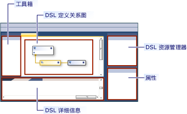
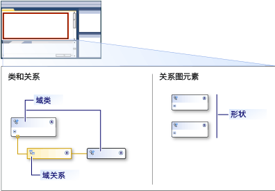

# 域特定语言工具用户界面的概述
首次打开中的域特定语言工具 （DSL 工具） 解决方案[!INCLUDE[vsprvs](../code-quality/includes/vsprvs_md.md)]，用户界面将类似于下图。  
  
   
  
 下表介绍了如何使用 UI 的部分。  
  
|**元素**|**定义**|  
|-----------------|--------------------|  
|关系图|此图表显示域模型。   关系图有两条边。 一方模型中定义的元素的类型。 在另一侧定义您的模型将在屏幕上的显示方式。|  
|工具箱|将工具从工具箱添加域类和调整到关系图的类型。 若要添加关系、 连接器和形状图，单击工具，然后单击关系图的源节点，然后目标节点。|  
|DSL 资源管理器|**DSL 资源管理器**DSL 定义为活动窗口时，将出现。 它显示为树的 DSL。 DSL 资源管理器，可以编辑模型的未显示在关系图的功能。 例如，你可以将工具箱项添加，并通过使用切换的验证过程**DSL 资源管理器**。|  
|DSL 详细信息窗口|**DSL 详细信息**窗口显示的域的属性可用于控制元素的显示方式，以及元素的复制和删除的模型的元素。   -默认情况下， **DSL 详细信息**旁边显示窗口**错误列表**和**输出**windows。|  
  
## 域模型图  
 域模型图分为两个部分。 关系图的一侧显示模型中的元素和关系。 在另一侧显示模型的方式显示，并包含用于显示元素和属性的模型关系图的形状。 下图显示关系图的元素。  
  
   
  
 下表介绍了某些域模型关系图的元素。  
  
|**术语**|**定义**|  
|--------------|--------------------|  
|域类|域类是您的模型中的元素的类型。   域类可以出现一次在关系图中，如果它是多个关系的目标。   若要添加的域类，拖动中的域类工具**工具箱**到**类和关系**侧的关系图。|  
|域关系|域关系是您的模型中的元素之间的链接的类型。   *嵌入关系*指出的目标元素已拥有或包含的源元素，并显示为实线。 在模型中的每个元素应为目标的一种嵌入关系，以便模型形成一个树。 A*引用关系*指示模型元素之间的常规链接并且显示为虚线。 任何元素可包含任意数量的参考链接。   通过单击该工具创建的关系**工具箱**，单击源域类中，，然后单击目标类。|  
|形状和连接符|形状指定的模型元素上 DSL 关系图。 的显示方式，连接器可以用于显示关系的 DSL 关系图上指定行。   若要创建形状或连接器，将工具拖至**图表元素**侧的关系图。|  
|形状映射|形状图将显示为在域模型关系图中，将形状链接到此图显示了域类或连接到它显示的域关系的连接器上的行。|  
  
## 另请参阅  
 [域特定语言工具的概述](../modeling/overview-of-domain-specific-language-tools.md)   
 [域特定语言工具词汇表](http://msdn.microsoft.com/ca5e84cb-a315-465c-be24-76aa3df276aa)   
 [自定义和扩展域特定语言](../modeling/customizing-and-extending-a-domain-specific-language.md)