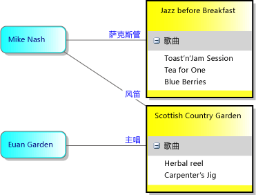

# 了解模型、类和关系
域特定语言 (DSL) 定义由其 DSL 定义文件，以及你可以编写任何自定义程序代码中。 此文件从生成的 DSL 解决方案中的程序代码的大多数。

 本主题介绍 DSL 定义的中心功能。

## DSL 定义
 当你打开`Dsl\DslDefinition.dsl`、 你[!INCLUDE[vsprvs](../code-quality/includes/vsprvs_md.md)]窗口类似于下图。

 

 DSL 定义中最重要的信息显示在 DSL 定义关系图。 其他信息，也是 DslDefinition.dsl 的一部分，如所示 DSL 资源管理器，它通常显示在关系图的一端。 您可以使用的最常见的任务的图示和使用更多高级自定义项的 DSL 资源管理器。

 DSL 定义关系图显示定义模型元素以及定义链接模型元素之间的关系的域类。 它还显示形状和用于向用户显示的模型元素的连接器。

 

 DSL 定义，在图上或在 DSL 资源管理器中选择一项与其有关的信息将显示在属性窗口中。 可能在 DSL 详细信息窗口中显示的其他信息。

### 模型是的 Dsl 实例
 A*模型*是 DSL 由某个用户创建的实例。 模型包含模型元素，它们是你定义的域类和元素，它们是你定义的域关系的实例之间的链接的实例。 形状和连接符、 关系图显示的模型元素和链接，还可以具有一个模型。 DSL 定义包括形状类、 连接器类和关系图的类。

 DSL 定义是也称为*域模型*。 DSL 定义或域模型是的设计时表示形式的域特定语言，而该模型是域特定语言的运行时实例化。

## 域类定义模型元素
 域类用于在域中，创建各种元素和域之间的关系不元素之间的链接。 它们是设计时表示形式的元素和将进行实例化设计特定于语言的用户在创建其模型时的链接。

 此图显示已创建的用户的音乐库 DSL 的模型。 音乐集由包含歌曲列表的框表示。 专业人员圆角框中，由表示和连接到它们提供到唱片集。

 

 DSL 定义用于分隔两个方面。 使用形状类和连接器类可定义模型关系图上的模型元素的外观。 使用域类和域关系定义在模型中携带的信息。

 下图显示的音乐库 DSL 定义中的域类和关系。

 

 图中显示的四个域类： 音乐、 唱片集、 艺术家和歌曲。 域类定义域属性，如名称、 标题和等等。 在实例模型中，关系图上显示的其中一些属性的值。

 类之间是域关系： MusicHasAlbums、 MusicHasArtists、 AlbumbHasSongs 和 ArtistAppearedOnAlbums。 关系具有多重性 1..1，如 0..*。 例如，每个首歌曲必须与通过 AlbumHasSongs 关系恰好一个唱片集。 每个唱片集可以具有任意数量的歌曲。

### 重新排列 DSL 定义关系图
 请注意，域类上可显示多次 DSL 定义关系图中，在此图中唱片集一样。 始终没有一个主视图，并且可以有一些*引用*视图。

 若要重新排列 DSL 定义关系图，您可以：

-   交换主并通过引用视图**此处使树**和**拆分树**命令。 右键单击单个域类，以查看这些命令。

-   通过按 Ctrl + 向上和 Ctrl + 向下进行重新排序域类和形状类。

-   折叠或展开类使用的每个形状的左上角的图标。

-   通过单击底部的域类的减号 （-） 来折叠树的部分。

## 继承
 可以使用继承定义域类。 若要创建继承派生，单击继承工具，单击派生的类中，，然后单击类的基类。 模型元素都有其自己的域类，以及从基类继承的所有属性定义的所有属性。 它还会继承关系中的其角色。

 此外可以之间的关系、 形状和连接器使用继承。 继承必须保持相同的组中。 一种形状不能从域类继承。

## 域关系
 可以通过关系链接模型元素。 链接始终是二进制;他们将链接恰好两个元素。 但是，任何元素都可以有多个链接到其他对象，并且存在甚至可以是相同的元素对之间的多个链接。

 就像你可以定义不同的元素的类，你可以定义链接的不同的类。 链接的类称为*域关系*。 域关系指定的元素哪些类其实例可以连接。 每个关系一端的称为*角色*，和域之间的关系定义为两个角色，以及关系本身的名称。

 有两种类型的域关系： 嵌入关系和引用关系。 DSL 定义关系图中，在嵌入关系实线在每个角色，并且引用关系具有虚线行。

### 嵌入关系
 在模型中，其根除外的每个元素是链接的一个嵌入的目标。 因此，将整个模型窗体嵌入链接的单个的树。 嵌入关系表示包含或所有权。 以这种方式相关的两个模型元素也称为为 parent 和 child。 子称为父中嵌入。

 嵌入的链接并不通常显示显式为关系图上的连接器。 相反，它们通常由包含表示。 关系图中，由表示模型的根和嵌入在它的元素显示为关系图上的形状。

 在示例中，根类音乐具有嵌入关系到唱片集，具有到首歌曲嵌入 AlbumHasSongs MusicHasAlbums。 歌曲显示为每个唱片集内的列表中的项。 音乐还具有嵌入 MusicHasArtists 到艺术家类，其实例也显示为关系图上的形状。

 默认情况下，删除其父项时，会自动删除嵌入的元素。

 保存模型时若要在 XML 窗体中，嵌入的元素嵌套在内的其父项，除非你已自定义序列化。

> [!NOTE]
>  嵌入与继承不同。 嵌入关系中的子级不会继承父属性。 嵌入是链接的一种模型元素之间。 继承是类，之间的关系，并不会创建模型元素之间的链接。

### 嵌入的规则
 实例模型中的每个元素必须恰好一个嵌入的链接，模型的根除外的目标。

 因此，每个非抽象域类，除了根类，必须为目标的至少一个嵌入的关系，或它必须继承自基类的嵌入。 类可以是两个或多个嵌入的目标，但其实例的模型元素一次只能有一个父级。 从目标到源多重性必须为 0..1 或 1..1。

### 浏览器可显示嵌入树
 DSL 定义还会创建资源管理器，它旁边其模型关系图的用户查看。

 

 资源管理器在模型中，甚至那些不已为其定义的所有形状显示的所有元素。 它显示元素和嵌入的关系，但不是能引用关系。

 若要查看的元素的域属性的值，用户模型关系图中或在模型资源管理器，选择一个元素，并打开属性窗口。 它会显示所有域属性，包括那些未显示在关系图。 在示例中，播放每首歌曲具有标题和一种风格，但只有标题的值显示在关系图上。

## 引用关系
 引用关系表示任何类型的不嵌入的关系。

 引用关系通常在关系图上显示为形状之间的连接器。

 在模型的 XML 表示中，使用表示两个元素间的引用链接*名字对象。* 也就是说，名字对象是唯一标识模型中的每个元素的名称。 每个模型元素的 XML 节点包含指定关系的名称和其他元素的标记的节点。

## 角色
 每个域之间的关系具有两个角色、 源角色和目标角色。

 在下面的图中，行之间**发布服务器**域类和**PublisherCatalog**域之间的关系是源角色。 域关系之间的行和**唱片集**域类是目标角色。

 

 编写遍历模型的程序代码，具有关系相关联的名称时尤其重要。 例如，生成的 DSL 解决方案时，生成的类发布者将具有一个属性是集合的唱片集的目录。 唱片集的类具有一个属性是类发布服务器具有单个实例的发布服务器。

 DSL 定义中创建的关系时, 的名称属性和关系名称指定默认值。 但是，你可以更改它们。

## 多重性
 重数指定元素数量可以在域关系具有相同的角色。 在示例中，对多零 (0..\*) 上的重数设置**目录**角色指定的任何实例**发布服务器**域类可以有任意多个**PublisherCatalog**关系链接，当您想要为其提供。

 通过键入关系图上或通过修改配置 role 多重性`Multiplicity`中的属性**属性**窗口。 下表介绍了此属性的设置。

|多重性类型|描述|
|-----------------------|-----------------|
|0..* （从零到多个）|每个实例的域类可以具有多个实例的关系或关系的任何实例。|
|0..1 (0 到 1)|每个实例的域类可以具有多个实例的关系或关系的任何实例。|
|1..1 （一个）|每个实例的域类可以有关系的一个实例。 无法从角色类的任何实例来创建此关系的多个实例。 如果验证已启用，当角色类的任何实例不具有关系的任何实例时，将出现验证错误。|
|1..* （一个到多个）|上有此多重性的角色类的每个实例可以有多个实例的关系，并且每个实例必须具有至少一个实例的关系。 如果验证已启用，当角色类的任何实例不具有关系的任何实例时，将出现验证错误。|

## 作为类的域关系
 链接表示为 LinkElement，它是模型元素的派生的类的实例存储中。 你可以对域关系的域模型图中定义这些属性。

 您还可以使关系的源或目标的其他关系。 在域模型关系图中，右键单击域关系，然后单击**显示为类**。 其他类框会显示。 然后可以连接到它的关系。

 就像可以使用域类，你可以部分地由继承，定义的关系。 选择派生的关系并设置**基本关系**属性窗口中。

 派生的关系专用化其基本关系。 域类链接应派生自它或链接的基本关系的类相同。 在模型中创建的派生关系的链接时，它是派生和基关系的实例。 在程序代码中，你可以导航到相对的一端使用由基类或派生类生成的属性的链接。

## 请参阅

- [域特定语言工具词汇表](http://msdn.microsoft.com/ca5e84cb-a315-465c-be24-76aa3df276aa)
