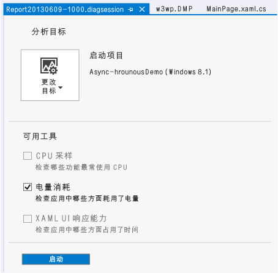
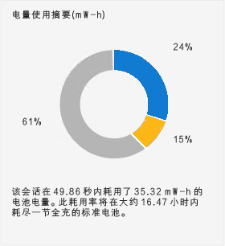

# <a name="analyze-energy-use-in-uwp-apps"></a>分析 UWP 应用中的能量使用
Visual Studio 的“能耗”探查器可以帮助你分析低功率平板设备上的 UWP 应用的功率和能耗情况，这些低功率平板设备在所有时间或部分时间内靠自有电池运行。 在电池供电的设备上，如果应用程序使用过多的能量，可能导致客户非常不满，最终客户甚至可能将其卸载。 能量利用的优化可使更多的客户选择并使用你的应用程序。  
  
##  <a name="BKMK_What_the_Energy_Consumption_tool_is__how_it_works__and_what_it_measures"></a> “能量消耗”探查器的定义、工作机制和测量内容  
 “能耗”探查器在分析会话期间捕获设备的显示器、CPU 和网络连接的活动。 然后生成这些活动所使用功率的估计值和分析会话使用的总能量。  
  
> [!NOTE]
>  能耗探查器使用标准参考设备硬件（具有可能运行你的应用程序的低功率平板电脑设备的代表性）的软件模型来估计功率和能量使用情况。 若要提供最佳估计值，我们建议你收集低功率平板电脑设备上的分布曲线数据。  
>   
>  虽然该模型可提供多种低功率设备的合理估计值，但你分析的设备的实际值可能不同。 使用这些值来查找相对于其他资源使用消耗能量多的显示器、CPU 和网络活动，因此这些活动可能是最适合优化的部分。  
  
 “能量消耗”探查器使用下面 *功率* 和 *能量*的定义：  
  
-   功率 用于衡量一段时间内做功而用力的速率。 在电力学中，功率的标准单位是瓦特 ，其定义为一安培电流流经一伏特的电位差时做功的速率。 在“电源使用”  关系图中，单位显示为毫瓦“mW”  ，这是一瓦的千分之一。  
  
     请注意，由于功率是一种速率，它有方向（功可以在一段时间内增加或减少）和速度（功的增加量或减少量）。  
  
-   能量 以电容或电势的形式衡量总功率数，如电池的功率容量或在一段时间内消耗的总功率。 能量单位为瓦时，即一瓦持续作用一小时所产生的功率数量。 在 **“能量摘要”**中，单位显示为毫瓦时 **“mW-h”**。  
  
   
  
 例如，平板电脑中充满电的电池存储了一定数量的能量。 当能量用于执行网络通信、计算值或显示图像等任务时，电池的功率以不同的速率消耗。 对于任意一段时间，消耗的功率的总和还可按能量进行衡量。  
  
##  <a name="BKMK_Identify_scenarios_with_user_marks"></a> 用用户标记标识方案  
 可以向分析数据添加“用户标记”  以帮助标识时间线标尺中的区域。  
  
   
  
 每次执行此方法时，标记将显示为时间线中的橙色三角形。 将鼠标指针悬停在该标记上时，将以工具提示的形式显示消息和时间。 如果有两个或更多个用户标记靠近在一起，则将合并这些标记，而且还将组合工具提示数据。 可以放大时间线来分隔标记。  
  
 **向 C#、Visual Basic、C++ 代码添加标记**  
  
 若要向 C#、Visual Basic、C++ 代码添加标记，请先创建一个 [Windows.Foundation.Diagnostics LoggingChannel](http://msdn.microsoft.com/library/windows/apps/windows.foundation.diagnostics.loggingchannel.aspx) 对象。 然后在代码中要标记的位置插入对 [LoggingChannel.LogMessage](http://msdn.microsoft.com/library/windows/apps/dn264210.aspx) 方法的调用。 在调用中使用 [LoggingLevel.Information](http://msdn.microsoft.com/library/windows/apps/windows.foundation.diagnostics.logginglevel.aspx) 。  
  
 执行此方法时，用户标记将与消息一起添加到分析数据中。  
  
> [!NOTE]
>  -   Windows.Foundation.Diagnostics LoggingChannel 实现 [Windows.Foundation.IClosable](/uwp/api/windows.foundation.iclosable) 接口（在 C# 和 VB 中表现为 [System.IDisposable](/dotnet/api/system.idisposable)）。若要避免操作系统资源泄露，请在完成日志记录通道时调用 [LoggingChannel.Close](/uwp/api/Windows.Foundation.Diagnostics.LoggingChannel)（在 C# 和 VB 中为 [Windows.Foundation.Diagnostics.LoggingChannel.Dispose](/uwp/api/Windows.Foundation.Diagnostics.LoggingChannel)）。  
> -   每个打开的日志记录通道都必须有唯一的名称。 尝试创建与未释放的通道同名的新日志记录通道会导致出现异常。  
  
 有关示例，请参阅 Windows SDK 示例 [LoggingSession 示例](http://code.msdn.microsoft.com/windowsapps/LoggingSession-Sample-ccd52336) 。  
  
 **向 JavaScript 代码添加标记**  
  
 若要添加用户标记，请在代码中要标记的位置添加以下代码：  
  
```  
if (performance && performance.mark) {  
    performance.mark(markDescription);  
}  
```  
  
 *markDescription* 是包含要在用户标记工具提示中显示的消息的字符串。  
  
##  <a name="BKMK_Configure_your_environment_for_profiling"></a> 配置要分析的环境  
 若要获取合理估计值，你需要分析由电池供电的低功率设备上的应用程序的能量使用情况。 由于 Visual Studio 不能在大多数的此类设备上运行，因此你需要使用 Visual Studio 远程工具将 Visual Studio 计算机连接到此类设备。 若要连接到远程设备，需要配置 Visual Studio 项目和此远程设备。 有关详细信息，请参阅[在远程计算机上运行 UWP 应用](../debugger/run-windows-store-apps-on-a-remote-machine.md)。  
  
> [!TIP]
>  -   我们建议不要在 UWP 模拟器或 Visual Studio 计算机上进行能量分析。 在实际的设备上进行分析可获得更加真实的数据。  
> -   在由电池供电的目标设备上进行分析。  
> -   关闭可能使用相同资源（网络、CPU 或显示屏）的其他应用程序。  
  
##  <a name="BKMK_Collect_energy_profile_data_for_your_app"></a> 收集应用的能量分布曲线数据  
  
1.  在“调试”  菜单中，选择 “启动诊断（不调试）”。  
  
       
  
2.  选择 **“能耗”** ，然后选择 **“启动”**。  
  
    > [!NOTE]
    >  启动 **“能耗”** 探查器时，可能会看到 **“用户帐户控制”** 窗口，要求你提供运行 VsEtwCollector.exe 的权限。 选择 **“是”**。  
  
3.  执行你的应用程序以收集数据。  
  
4.  若要停止分析，请切回到 Visual Studio (Alt + Tab) 并在“诊断中心”页面上选择 **“停止收集”** 。  
  
       
  
     Visual Studio 将分析收集的数据并显示结果。  
  
##  <a name="BKMK_Collect_energy_profile_data_for_an_installed_app"></a> 收集已安装应用的能量分布曲线数据  
 只能对通过 Visual Studio 解决方案启动或从 Microsoft Store 中安装的 UWP 应用运行“能耗”工具。 在 Visual Studio 中打开解决方案时，默认目标为 **“启动项目”**。 面向已安装的应用程序：  
  
1.  选择 **“更改目标”** ，然后选择 **“已安装的应用程序”**。  
  
2.  从 **“选择已安装的应用程序包”** 列表中选择目标。  
  
3.  选择诊断中心页面上的 **“能耗”** 。  
  
4.  选择 **“启动”** 开始分析。  
  
 若要停止分析，请切回到 Visual Studio (Alt + Tab) 并在“诊断中心”页面上选择 **“停止收集”** 。  
  
##  <a name="BKMK_Analyze_energy_profile_data"></a> 分析能量分布曲线数据  
 能量分布曲线数据显示在 Visual Studio 文档窗口中：  
  
   
  
|||  
|-|-|  
||报告文件名为 Report*YYYYMMDD-HHMM*.diagsession。 如果你决定保存此报告，可以更改此名称。|  
||时间线显示分析会话的长度、应用程序生命周期激活事件以及用户标记。|  
||你可以通过拖动蓝色条选择时间线的一个区域，将报告限制到这一部分时间线内。|  
||**“电源使用”** 图是一个多线图，显示分析会话期间由设备资源导致的功率输出的变化。 “能量消耗”探查器可跟踪 CPU、网络活动和屏幕显示所使用的功率。|  
||**“资源(打开/关闭)”**  图提供网络能量成本的详细信息。 **“网络”** 条表示网络连接的打开时间。 **“数据传输”** 子条为应用程序通过网络接收或发送数据的时间。|  
||**“能量使用率摘要”** 按比例显示选定时间线内 CPU、网络活动和屏幕显示使用的总能量。|  
  
 **分析能量分布曲线数据**  
  
 找到资源功率达到高峰的区域。 将高峰区域与应用程序的功能联系起来。 然后使用时间线上的时间线控制条放大到此区域。 如果关注网络使用率，请展开 **“资源(打开/关闭)”** 图中的 **“网络”**  节点，对比网络连接的打开时间和应用程序通过连接接收或传输数据的时间。 减少不必要的网络打开时间是非常有效的优化。  
  
##  <a name="BKMK_Optimize_energy_use"></a> 优化能量利用  
 除了传输数据，网络连接的初始化、维护和关闭也会消耗能量。 某些网络在发送或接收数据后会将连接维持一段时间，以便通过一个连接传输更多数据。 你可以使用 **“资源(打开/关闭)”** 窗格检查你的应用程序与连接的交互方式。  
  
   
  
 如果 **“网络”** 和 **“数据传输”** 条显示连接已长时间打开以间歇性地传输一系列小数据包，你可以成批处理数据以便通过一次传输发送出去，减少网络的打开时间，从而节省能量成本。  
  
   
  
 对于显示所消耗的能量，你的控制力较小。 大多数屏幕显示亮色比显示暗色所需要的能量更多，因此使用暗色背景可以降低成本。  
  
##  <a name="BKMK_Other_resources"></a> 其他资源  
  
-   Windows 开发人员中心中 [C#/VB/C++ 和 XAML](http://msdn.microsoft.com/en-us/0ee0b706-8432-4d49-9801-306ed90764e1) 和 [JavaScript 和 HTML](http://msdn.microsoft.com/en-us/372afa6a-1c7c-4657-967d-03a77cd8e933) 的“连接状态和成本管理”  部分介绍了提供网络连接信息的 Windows API，你的应用程序可以使用这些信息最大程度降低网络通信成本。  
  
     使用 UWP 应用的 Visual Studio 模拟器可以模拟网络信息 API 的数据连接属性。 请参阅[在模拟器中运行 UWP 应用](../debugger/run-windows-store-apps-in-the-simulator.md)  
  
-   **“JavaScript 函数计时”** 和 **“CPU 使用量”** 工具有助于降低由低效函数导致的 CPU 负载。 请参阅[分析 CPU 使用情况](../profiling/analyze-cpu-usage-in-a-windows-universal-app.md)。

## <a name="see-also"></a>请参阅
 [使用 Visual Studio 分析](../profiling/index.md)  
 [分析功能简介](../profiling/profiling-feature-tour.md)