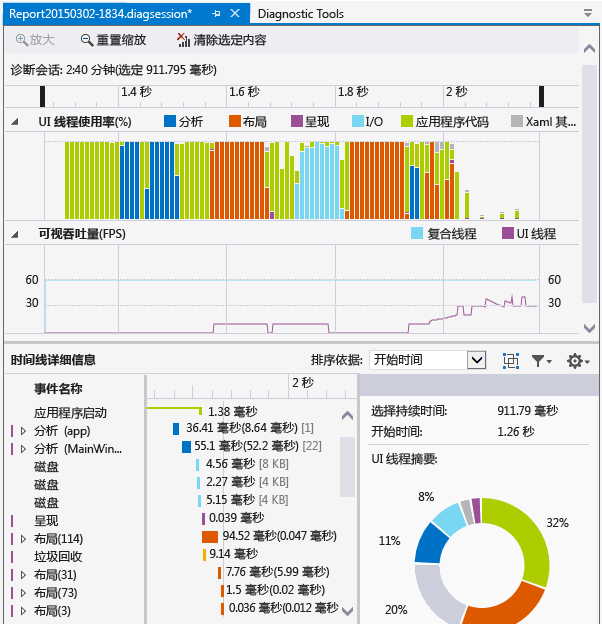

# 分析资源消耗情况和 UI 线程活动 (XAML)
使用 **“应用程序时间线”** 探查器查找并修正 XAML 应用程序中应用程序交互的相关性能问题。 此工具提供应用程序资源使用情况的详细视图，可帮助提高 XAML 应用程序的性能。 可以分析应用程序准备 UI 框架（布局和呈现）以及为网络和磁盘请求提供服务所花费的时间，以及在应用程序启动、页面加载以及调整窗口大小等应用场景中花费的时间。  
  
 应用程序时间线是可使用调试 > 性能探测器命令启动的工具之一。  
  
 此工具可替换属于 Visual Studio 2013 诊断工具集的一部分的 **“XAML UI 响应能力”** 工具。  
  
 可在以下平台上使用此工具：  
  
1.  通用 Windows 应用（在 Windows 10 上）  
  
2.  Windows 8.1  
  
4.  Windows Presentation Foundation（.Net 4.0 及以上版本）  
  
5.  Windows 7  
  
> [!NOTE]
>  你可以收集和分析 CPU 使用率数据和能耗数据以及 **“应用程序时间线”** 数据。 请参阅[运行带/不带调试程序的分析工具](../profiling/running-profiling-tools-with-or-without-the-debugger.md)。
  
## 收集应用程序时间线数据  
 可以在本地计算机、连接的设备、Visual Studio 模拟器或仿真程序或者远程设备上分析应用的响应能力。 请参阅[运行带/不带调试程序的分析工具](../profiling/running-profiling-tools-with-or-without-the-debugger.md)。
  
> [!TIP]
>  如果可能，请直接在设备上运行应用。 在模拟器上或通过远程桌面连接观察到的应用程序性能可能与设备上的实际性能不相同。 另一方面，通过使用 Visual Studio 远程工具收集数据并不影响性能数据。  
  
 下面是基本步骤：  
  
1.  打开 AML 应用。  
  
2.  单击“调试/性能探查器...”。 应在 .diagsession 窗口中看到分析工具列表。  
  
3.  选择 **“应用程序时间线”** ，然后单击窗口底部的 **“启动”** 。  
  
    > [!NOTE]
    >  可能会出现“用户帐户控制”窗口，请求你提供运行 VsEtwCollector.exe 的权限。 单击 **“是”**。  
  
4.  在应用中运行你想要对其进行分析的方案，以收集性能数据。  
  
5.  若要停止分析，请切换回 .diagsession 窗口，然后单击窗口顶部的 **“停止”** 。  
  
     Visual Studio 将分析收集的数据并显示结果。  
  
       
  
## 分析时间线分析数据  
 收集分析数据之后，可以按照以下步骤开始分析：  
  
1.  检查 **“UI 线程使用率”** 和 **“可视吞吐量(FPS)”** 图中的信息，然后使用时间线导航栏选择要分析的时间范围。  
  
2.  使用“UI 线程使用率”  或  “可视吞吐量 (FPS)”图中的信息，检查  “时间线详细信息”视图中的详细信息可以发现导致任何明显缺少响应能力情况的可能原因。  
  
###   报表方案、类别和事件  
 **“应用程序时间线”** 工具将显示方案、类别和与 XAML 性能相关的事件的计时数据。  
  
###  诊断会话时间线  
   
  
 页面顶部的标尺将显示已分析信息的时间线。 此时间线适用于 **“UI 线程使用率”** 图和 **“可视吞吐量”** 图。 你可以通过拖动时间线上的导航栏选择一段时间线，缩小报告的范围。  
  
 时间线还显示已插入的任何用户标记和应用程序的激活生命周期事件。  
  
###  UI 线程使用率图  
   
  
  “UI 线程使用率 (%)”图是一个条形图，它显示了一个集合段内某个类别中耗用的相对时间量。  
  
###  可视吞吐量 (FPS) 图  
   
  
 **“可视吞吐量(FPS)”** 折线图显示了应用程序的 UI 线程和复合线程上的每秒帧数 (FPS)。  
  
###   时间线详细信息  
 详细视图是你将在其中花费大部分时间分析报表的地方。 它显示了应用程序 CPU 使用率的详细视图，应用程序按 UI 框架子系统或使用 CPU 的系统组件分类。  
  
 支持以下事件：  
  
|||  
|-|-|  
|**分析**|分析 XAML 文件并创建对象所耗用的时间。   展开“时间线详细信息”  中的  “分析”节点将显示作为根事件分析结果的所有 XAML 文件的依赖关系链。 这将使你能够识别性能敏感方案中的不必要的文件分析和对象创建并对其进行优化。|  
|**布局**|在大型应用程序中，可能会同时在屏幕上显示数千个元素。 这可能会导致 UI 帧速率降低以及应用程序响应能力相应地变差。 布局事件可准确地确定对每个元素进行布局的成本（即 Arrange、Measure、ApplyTemplate、ArrangeOverride 和 ArrangeOverride 所用的时间），并生成参与了布局过程的可视化树。 可以使用此可视化效果来确定要删除的逻辑树，或评估其他延期机制，以优化布局过程。|  
|**呈现**|在屏幕上绘制 XAML 元素所耗用的时间。|  
|**I/0**|从本地磁盘或从通过 [Microsoft Windows Internet (WinINet) API](https://msdn.microsoft.com/en-us/library/windows/desktop/aa385331.aspx)访问的网络资源中检索数据所耗用的时间。|  
|**应用程序代码**|执行与分析或布局无关的应用程序（用户）代码所耗用的时间。|  
|**Xaml 其他**|执行 XAML 运行时代码所耗用的时间。|  
  
> [!TIP]
>  当开始分析时，选择 **“CPU 使用率”** 工具和 **“时间线”** 工具查看在 UI 线程上执行的应用方法。 将长时间运行的应用代码移动到后台线程可以提高 UI 响应能力。  
  
####   自定义时间线详细信息  
 使用  “时间线详细信息”工具栏排序、筛选和指定  “时间线详细信息”视图条目的批注。  
  
|||  
|-|-|  
|**排序依据**|按开始时间或事件的长度排序。|  
||添加或删除按框架对事件进行分组的顶级  “框架”类别。|  
||按所选类别和事件的长度筛选列表。|  
||允许你指定事件的批注。|  
  
## 请参阅  
 [WPF 团队博客：用于 WPF 应用程序的新 UI 性能分析工具](http://blogs.msdn.com/b/wpf/archive/2015/01/16/new-ui-performance-analysis-tool-for-wpf-applications.aspx)  
 [使用 C++、C# 和 Visual Basic 的 UWP 应用的性能最佳做法](http://msdn.microsoft.com/en-us/567bcefa-5da5-4e42-a4b8-1358c71adfa2)   
 [优化 WPF 应用程序性能](/dotnet/framework/wpf/advanced/optimizing-wpf-application-performance)  
 [使用 Visual Studio 分析](../profiling/index.md)  
 [分析功能导览](../profiling/profiling-feature-tour.md)
