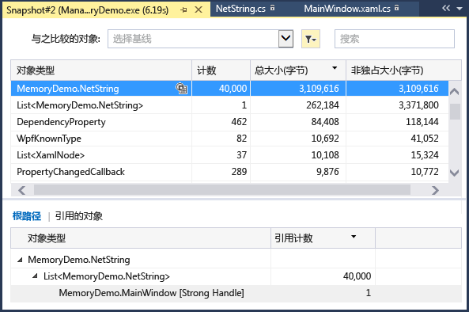
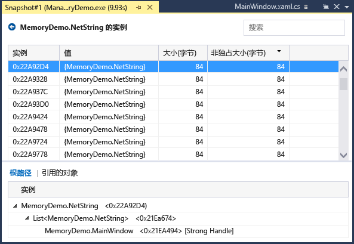
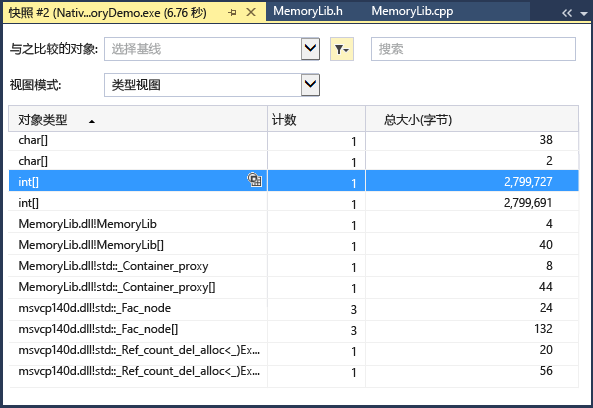
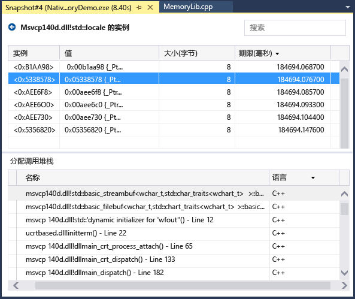

# Visual Studio 中的配置文件内存使用
使用集成了调试器的内存使用情况诊断工具在进行调试时查找内存泄漏和低效内存。 通过内存使用率工具可以拍摄托管和本机内存堆的一个或多个快照，帮助理解对象类型的内存使用率影响。 可以收集 .NET、本机或混合模式（.NET 和本机）应用的快照。  
  
 下图显示“诊断工具”窗口（Visual Studio 2015 Update 1 及更高版本中提供）：  
  
   
  
 虽然可以随时在 **内存使用率** 工具中收集内存快照，不过可以使用 Visual Studio 调试器在调查性能问题时控制应用程序的执行方式。 断点设置、步进、全部中断和其他调试器操作可以帮助将性能调查集中在最相关的代码路径上。 在应用运行期间执行这些操作可以消除无关紧要的代码带来的烦扰，并可以显著减少用于诊断问题所花费的时间。  
  
 还可以在调试器外部使用内存工具。 请参阅 [Memory Usage without Debugging](../profiling/memory-usage-without-debugging2.md)。  
  
> [!NOTE]
>  **自定义分配器支持** 本机内存探查器的工作原理是在运行时收集 [ETW](/windows-hardware/drivers/devtest/event-tracing-for-windows--etw-) 分配事件数据。  CRT 和 Windows SDK 中的分配器在源级别上注释，因此可以捕获其分配数据。  若要编写自己的分配器，对于返回的指针指向新分配的堆内存的任何函数，可使用 [__declspec](/cpp/cpp/declspec)(allocator) 进行修饰，如以下 myMalloc 示例所示：  
>   
>  `__declspec(allocator) void* myMalloc(size_t size)` 

在本教程中，你将：

> [!div class="checklist"]
> * 拍摄内存快照
> * 分析内存使用率数据

## 收集内存使用率数据

1.  打开要在 Visual Studio 中调试的项目，并在应用中开始检查内存使用率的位置设置断点。

    如果你怀疑某个区域存在内存问题，请在内存问题发生之前设置第一个断点。

    > [!TIP]
    >  因为在应用经常分配和取消分配内存时捕获感兴趣的操作的内存配置文件十分具有挑战性，所以请在操作的开始和结束位置设置断点（或逐步执行操作）以查找内存变化的确切点。 

2.  在函数末尾或想要分析的代码区域中（或在发生可疑的内存问题之后）设置第二个断点。
  
3.  将自动显示 **“诊断工具”** 窗口，除非你已将其关闭。 若要再次显示该窗口，请依次单击“调试”、“Windows”、“显示诊断工具”。

4.  使用工具栏上的“选择工具”设置选择“内存使用率”。

     

5.  依次单击“调试”、“启动调试”或单击工具栏上的“启动”或按 **F5**。

     当应用完成加载后，将显示诊断工具的“摘要”视图。

     

     > [!NOTE]
     >  因为收集内存数据可能会影响本机或混合模式应用的调试性能，所以内存快照在默认情况下处于禁用状态。 若要对本机或混合模式应用启用快照，请启动调试会话（快捷键：**F5**）。 当“诊断工具”窗口出现时，选择“内存使用率”选项卡，然后选择“堆分析”。  
     >   
     >    
     >   
     >  停止（快捷键： **Shift + F5**）并重新启动调试。  

6.  若要在调试会话开始时拍摄快照，请选择“内存使用率”摘要工具栏上的“拍摄快照”。 （在此处设置断点可能也会有所帮助。）

     
     
     > [!TIP]
     >  若要为进行内存比较而创建基线，请考虑在调试会话开始时拍摄快照。  

6.  运行会触发第一个断点的方案。

7.  当调试器在第一个断点处暂停时，选择“内存使用率”摘要工具栏上的“拍摄快照”。  

8.  按 F5 将应用运行到第二个断点。

9.  现在，拍摄另一个快照。

     现在可以开始分析数据。    
  
## 分析内存使用率数据
“内存使用率”摘要表中的行会列出在调试会话期间拍摄的快照，并提供指向更详细视图的链接。

 列的名称取决于在项目属性中选择的调试模式：.NET、本机或混合（.NET 和本机）。  
  
-   “对象(差异)”和“分配(差异)”列显示拍摄快照时 .NET 和本机内存中的对象数。  
  
-   “堆大小(差异)”列显示 .NET 和本机堆中的字节数 

拍摄多个快照时，摘要表的单元格包含行快照与前一个快照之间的值变化。  

若要分析内存使用率，请单击其中一个链接，打开内存使用率详细报表：  

-   若要查看当前快照与前一个快照之间的差异的详细信息，请选择箭头左侧的更改链接（）。 红色箭头表示内存使用率增加，绿色箭头表示减少。

    > [!TIP]
    >  为了帮助更快地识别内存问题，差异报告按照总体数量增加最多（单击“对象(差异)”列中的更改链接）的对象类型或整体堆大小增加最多（单击“堆大小(差异)”列中的更改链接）的对象类型进行排序。

-   若要仅查看所选快照的详细信息，请单击无更改链接。 
  
 报告会出现在单独的窗口中。   
  
### 托管类型报告  
 在内存使用率摘要表中选择“对象(差异)”或“分配(差异)”单元格的当前链接。  
  
   
  
 顶部窗格会显示快照中类型的计数和大小，包括由类型引用的所有对象的大小（**“非独占大小”**）。  
  
 底部窗格中的 **“根的路径”** 树显示引用上部窗格中选择的类型的对象。 仅当引用某个对象的最后一个类型已释放时，.NET Framework 垃圾回收器才清理该对象的内存。  
  
 **“引用的类型”** 树显示上部窗格中选择的类型所持有的引用。  
  
   
  
 若要显示上部窗格中所选类型的实例，请选择  图标。  
  
   
  
 **“实例”** 视图显示上部窗格的快照中所选对象的实例。 “根的路径”和“引用的类型”窗格显示引用选定实例的对象，以及选定实例引用的类型。 当调试器在拍摄快照的点停止时，可以将鼠标悬停在“值”单元格上方以在工具提示中显示对象的值。  
  
### 本机类型报告  
 在“诊断工具”窗口的内存使用率摘要表中选择“分配(差异)”或“堆大小(差异)”单元格的当前链接。  
  
   
  
 **“类型视图”** 显示快照中类型的数量和大小。  
  
-   选择所选类型的实例图标（）可显示有关快照中所选类型的对象信息。  
  
     **“实例”** 视图显示所选类型的每个实例。 选择实例可显示导致在 **“分配调用堆栈”** 窗格中创建实例的调用堆栈。  
  
       
  
-   在 **“视图模式”** 列表中选择 **“堆栈视图”** 可查看所选类型的分配堆栈。  
  
       
  
### 更改（差异）报告  
  
-   在 **“诊断工具”** 窗口上的 **“内存使用率”** 选项卡的摘要表单元格中选择更改链接。  
  
       
  
-   在托管或本机报告的 **“与之比较的对象”** 列表中选择快照。  
  
       
  
 更改报告会向基本报告添加一些列（使用 **“(差异)”**进行标记），这些列显示基本快照值与比较快照之间的差异。 下面是本机类型视图差异报告可能会采用的外观：  
  
   
  
## 博客和视频  

|         |         |
|---------|---------|
|    |    [观看介绍诊断工具用法的视频](https://mva.microsoft.com/en-US/training-courses-embed/getting-started-with-visual-studio-2017-17798/Profiling-with-Diagnostics-Tools-in-Visual-Studio-2017-daHnzMD6D_9211787171)，了解如何在 Visual Studio 2017 中分析内存使用率以及 CPU 使用率。 |

 [调试时分析 CPU 和内存](https://blogs.msdn.microsoft.com/visualstudio/2016/02/15/analyze-cpu-memory-while-debugging/)  
  
 [Visual C++ 博客：Visual C++ 2015 中的内存分析](https://blogs.msdn.microsoft.com/vcblog/2015/10/21/memory-profiling-in-visual-c-2015/)  

## 后续步骤

在本教程中，你了解了如何收集和分析内存使用率数据。 如果已完成[探查器教程](../profiling/profiling-feature-tour.md)，则可能想要快速了解如何分析应用中的 CPU 使用率。

> [!div class="nextstepaction"]
> [分析 CPU 使用情况](../profiling/beginners-guide-to-performance-profiling.md) 