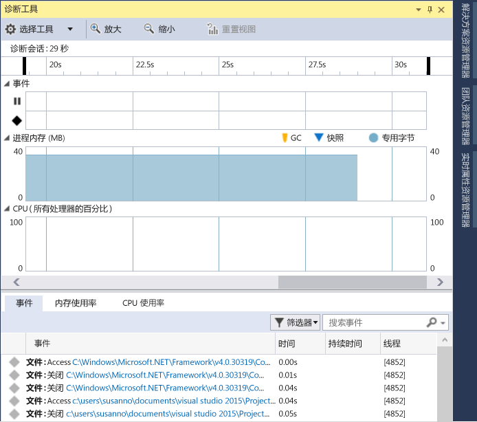

# 运行带或不带调试器的分析工具
Visual Studio 现提供一些性能工具的选择，其中一些（如“CPU 使用率”和“内存使用率”）可在使用/不使用调试器的情况下运行。 不带调试器的性能工具用于在发布配置上运行，而集成了调试器的工具用于在调试配置上运行。  
  
## 应在带还是不带调试器的情况下运行该工具？  
 集成了调试器的性能工具让你能够进行很多未集成调试器的工具不能执行的操作，例如设置断点和检查变量值。 而未集成调试器的工具提供的体验则更接近于用户将在发布的应用程序中获得的体验。  
  
 以下的这些问题可帮助你决定哪种类型的工具正适合你的需要：  
  
1.  应用程序开发过程中是否出现该问题，或已发布的版本中是否存在该问题？  
  
     如果在开发过程中出现了正在处理的问题，则可能无需在发布版本中运行性能工具。 如果在发布版本中出现该问题，应使用发布配置重新生成该问题，然后决定调试器是否帮助进行进一步调查。  
  
2.  该问题是由占用大量 CPU 的处理所引发的吗？  
  
     很多问题由外部性能问题（如文件 I/O 或网络响应能力）所致，因此无论是否使用调试器，都不会对运行性能工具造成很大影响。 如果问题源于大量占用 CPU 的调用，那么发布配置和调试配置间的差异可能会很大，应该在使用集成了调试器的工具之前应该进行检查以查看发布版本中是否存在该问题  
  
3.  是否需要精确地测量性能，或大致数值是否可以接受？  
  
     调试版本缺少发布版本提供的某些优化，例如内联函数调用和常量、修剪未使用的代码路径及以调试器不能使用的方式存储变量。 调试器自身会更改性能时间，因为它将执行调试所必需的某些操作（如截获异常和模块加载事件）。 因此，集成了调试器的工具中的性能数字只精确到数十毫秒内。 而运行未集成调试器的工具的发布配置的性能数字要精确得多。  
  
##   在调试期间收集分析数据  
 下面这一节对本地调试进行介绍。 后续章节介绍关于在设备上进行调试和远程调试的信息。  
  
1.  打开想要调试的项目，然后单击“调试”/“启动调试”  （或工具栏上的“启动”  或按 **F5**）。  
  
2.  将自动显示 **“诊断工具”** 窗口，除非你已将其关闭。 若要再次显示该窗口，请依次单击“调试”、“Windows”、“显示诊断工具”。  
  
3.  运行要为其收集数据的方案。  
  
     运行会话时，你可以看到有关事件、进程内存和 CPU 使用率的信息。  
  
     下图显示 Visual Studio 2015 Update 1 中的“诊断工具”  窗口：  
  
       
  
4.  可以使用工具栏上的“选择工具”设置选择是否查看“内存使用率”和/或“CPU 使用率”。 如果运行的是 Visual Studio Enterprise，则可以在“工具”/“选项”/“IntelliTrace”中启用或禁用 IntelliTrace。  
  
5.  当停止调试时，诊断会话结束。  
  
 在 Visual Studio 2015 Update 1 中，“诊断工具”  窗口可让你更容易地关注感兴趣的事件。   事件名现在显示时会带有类别前缀（“手势”、“程序输出”、“断点”、“文件”等），因此，你可以快速扫描给定类别的列表或跳过你不关心的类别。  
  
 窗口中现在有搜索框，因此你可以在事件列表中任何位置查找指定的字符串。 例如，下图显示搜索字符串“install”的结果，其匹配四个事件：  
  
   
  
 你也可以在该窗口中的视图内和视图外筛选事件。 在“筛选”  下拉列表中，你可以勾选或取消勾选指定事件类别： 类别名称与前缀名称相同。  
  
   
  
 有关详细信息，请参阅 [搜索和筛选“诊断工具”窗口中的“事件”选项卡](http://blogs.msdn.com/b/visualstudioalm/archive/2015/11/12/searching-and-filtering-the-events-tab-of-the-diagnostic-tools-window.aspx)。  
  
## 在不进行调试的情况下收集分析数据  
 一些分析工具需要管理员权限才能运行。 启动诊断会话时，你可以管理员身份启动 Visual Studio，也可以管理员身份运行工具。  
  
1.  在 Visual Studio 中打开项目。  
  
2.  在“调试”菜单上，选择“性能探查器...”（快捷键：Alt + F2）。  
  
3.  在诊断启动页上，选择要在会话中运行的一个或多个工具。 将仅显示适用于项目类型、操作系统和编程语言的工具。 选择诊断工具时，将禁用对不能在同一诊断会话中运行的工具的选择。 对于 C# Windows 通用应用，你的选择可能如下所示：  
  
       
  
4.  若要启动诊断会话，请单击“开始”。  
  
5.  运行要为其收集数据的方案。  
  
     在运行会话时，一些工具将在诊断工具启动页上显示实时数据图。  
  
       
  
6.  若要结束诊断会话，请单击“停止收集”。  
  
 停止在诊断会话中收集数据后，将分析数据，并在“诊断”页中显示报告。  
  
 还可从诊断工具启动页上的最近打开列表打开已保存的 .diagnosis 会话文件。  
  
   
  
## 分析报告  
   
  
|||  
|-|-|  
||时间线显示分析会话的长度、应用程序生命周期激活事件以及用户标记。|  
||你可以通过拖动蓝色条选择时间线的一个区域，将报告限制到这一部分时间线内。|  
||一个工具可显示一个或多个主关系图。 如果是使用多个工具创建的诊断会话，则将显示所有主关系图。|  
||可以折叠和展开各个关系图。|  
||当你的数据包含来自多个工具的信息时，则将在选项卡下收集工具的详细信息。|  
||一个工具可具有一个或多个详细信息视图。 视图将按时间线的选定区域进行筛选。|  
  
## 将分析目标设置为其他设备  
 除了从 Visual Studio 项目启动应用以外，还可以在备用目标上运行诊断会话。 例如，你可能需要诊断有关从 Windows 应用商店安装的应用的版本的性能问题。  
  
   
  
 可以启动已安装在设备上的应用，也可以将诊断工具附加到已在运行的一些应用上。 选择“运行应用”或“安装应用”后，从发现指定部署目标上的应用的列表选择应用。  
  
   
  
 如果你选择“Internet Explorer”，请指定 URL，并且你可以更改电话部署目标。  
  
   
  
## Remote Debugging  
 要在远程 PC 或平板电脑上运行诊断会话，需要在远程目标上安装和运行 Visual Studio 远程工具。 对于桌面应用，请参阅[远程调试](../debugger/remote-debugging.md)。  对于 Windows 通用应用，请参阅[在远程计算机上运行 Windows 应用商店应用](../debugger/run-windows-store-apps-on-a-remote-machine.md)。  
  
## 诊断开发团队的博客文章和 MSDN 文章  
 [MSDN 杂志：在 Visual Studio 2015 中调试时分析性能](https://msdn.microsoft.com/en-us/magazine/dn973013.aspx)  
  
 [MSDN 杂志：使用 IntelliTrace 更快地诊断问题](https://msdn.microsoft.com/en-us/magazine/dn973014.aspx)  
  
 [博客文章：使用 Visual Studio 2015 中的内存使用率工具诊断事件处理程序漏洞](http://blogs.msdn.com/b/visualstudioalm/archive/2015/04/29/diagnosing-event-handler-leaks-with-the-memory-usage-tool-in-visual-studio-2015.aspx)  
  
 [视频：使用 Microsoft Visual Studio Ultimate 2015 中的 IntelliTrace 进行历史调试](https://channel9.msdn.com/Events/Ignite/2015/BRK3716)  
  
 [视频：使用 Visual Studio 2015 调试性能问题](https://channel9.msdn.com/Events/Build/2015/3-731)  
  
 [性能提示：使用 Visual Studio 进行调试时的性能信息概览](http://blogs.msdn.com/b/visualstudioalm/archive/2014/08/18/perftips-performance-information-at-a-glance-while-debugging-with-visual-studio.aspx)  
  
 [Visual Studio 2015 中的“诊断工具”调试器窗口](http://blogs.msdn.com/b/visualstudioalm/archive/2015/01/16/diagnostic-tools-debugger-window-in-visual-studio-2015.aspx)  
  
 [Visual Studio Enterprise 2015 中的 IntelliTrace](http://blogs.msdn.com/b/visualstudioalm/archive/2015/01/16/intellitrace-in-visual-studio-ultimate-2015.aspx)
