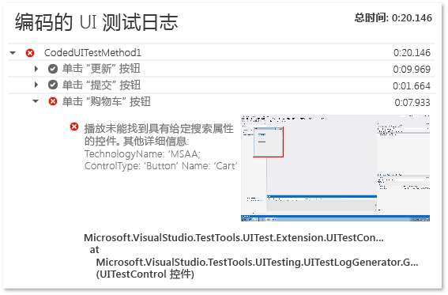

# <a name="analyzing-coded-ui-tests-using-coded-ui-test-logs"></a>使用编码的 UI 测试日志分析编码的 UI 测试

编码的 UI 测试日志筛选并录制关于编码的 UI 测试运行的重要信息。 这些日志以允许快速调试问题的形式呈现。

[!INCLUDE [coded-ui-test-deprecation](includes/coded-ui-test-deprecation.md)]

## <a name="step-1-enable-logging"></a>步骤 1：启用日志记录

根据方案使用以下方法之一启用日志：

- 在测试项目中不存在 App.config 文件的目标 .NET Framework 版本 4：

   1. 打开 *QTAgent32_40.exe.config* 文件。 默认情况下，此文件位于 %ProgramFiles(x86)%\Microsoft Visual Studio\2017\Enterprise\Common7\IDE 中。

   2. 将 EqtTraceLevel 的值修改为你想要的日志级别。

   3. 保存该文件。

- 在测试项目中不存在 App.config 文件的目标 .NET Framework 版本 4.5：

   1. 打开 *QTAgent32.exe.config* 文件。 默认情况下，此文件位于 %ProgramFiles(x86)%\Microsoft Visual Studio\2017\Enterprise\Common7\IDE 中。

   2. 将 EqtTraceLevel 的值修改为你想要的日志级别。

   3. 保存该文件。

- 存在于测试项目中的 App.config 文件：

    - 打开项目中 App.config 文件，并在配置节点下添加以下代码：

      ```xml
      <system.diagnostics>
        <switches>
          <add name="EqtTraceLevel" value="4" />
        </switches>
      </system.diagnostics>`
      ```

- 从测试代码本身启用日志记录：

   <xref:Microsoft.VisualStudio.TestTools.UITesting.PlaybackSettings.LoggerOverrideState%2A> = HtmlLoggerState.AllActionSnapshot；

## <a name="step-2-run-your-coded-ui-test-and-view-the-log"></a>步骤 2：运行编码的 UI 测试并查看日志

对 QTAgent32.exe.config 文件就地运行编码的 UI 测试并对其进行修改时，可在“测试资源管理器”结果中看到一条输出链接。 日志文件不仅在测试失败时生成，而且在跟踪级别设置为“详细”时也会对成功的测试生成。

1.  在“测试”菜单上，选择“窗口”，然后选择“测试资源管理器”。

2.  在 **“生成”** 菜单上，选择 **“生成解决方案”**。

3.  在测试资源管理器中，选择想要运行的编码的 UI 测试、打开其快捷菜单，然后选择“运行选定测试”。

     自动测试会运行并指示它们是否通过。

    > [!TIP]
    > 要查看测试资源管理器，请选择“测试” > “窗口”，然后选择“测试资源管理器”。

4.  在“测试资源管理器”结果中选择“输出”链接。

     

     随即显示测试的输出，其中包括指向操作日志的链接。

     

5.  选择 UITestActionLog.html 链接。

     该日志显示在你的 Web 浏览器中。

     

## <a name="see-also"></a>请参阅

- [使用 UI 自动化来测试代码](../test/use-ui-automation-to-test-your-code.md)
- [如何：通过 Microsoft Visual Studio 运行测试](https://msdn.microsoft.com/Library/1a1207a9-2a33-4a1e-a1e3-ddf0181b1046)