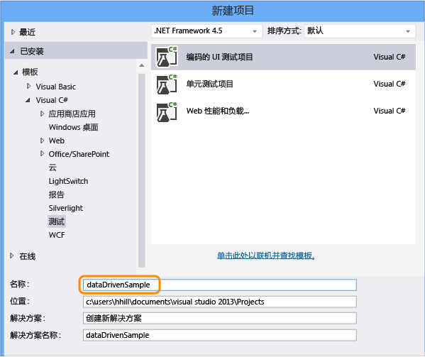
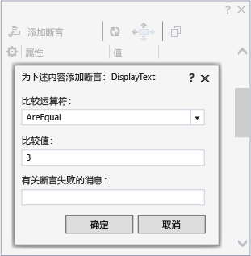
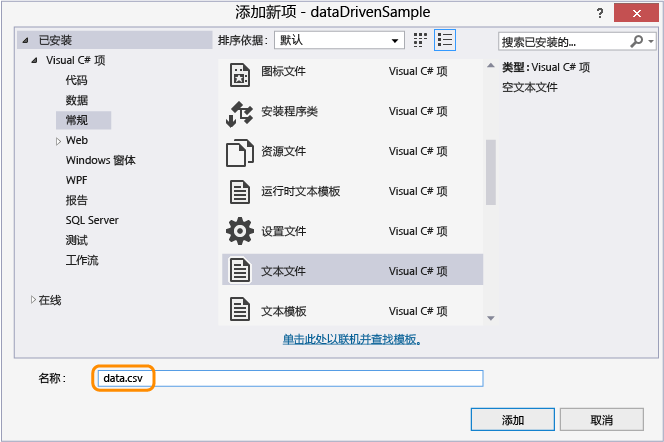
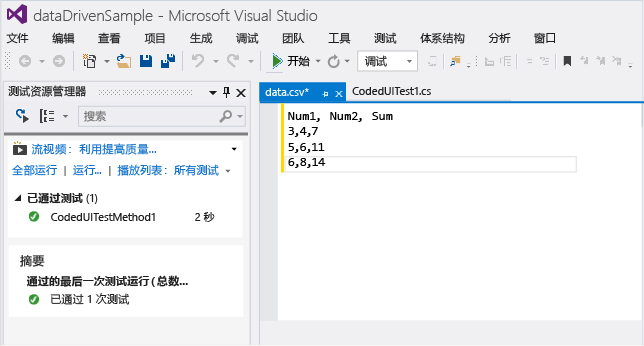
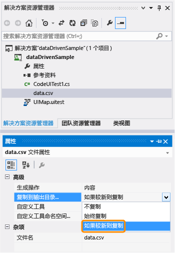
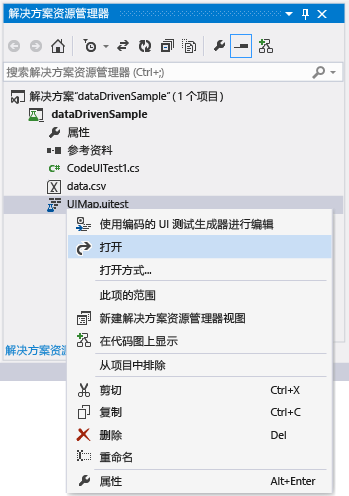

# <a name="creating-a-data-driven-coded-ui-test"></a>创建数据驱动的编码的 UI 测试

若要测试不同的情况，你可以使用不同的参数值多次运行测试。 数据驱动的编码的 UI 测试就是执行该操作的一个便捷方法。 对数据源中参数值进行定义后，数据源中的每一行都是编码的 UI 测试的一个迭代。 测试的总结果将取决于所有迭代的结果。 例如，如果一个测试迭代失败，则测试总结果是失败。

 **要求**

-   Visual Studio Enterprise

## <a name="create-a-data-driven-coded-ui-test"></a>创建数据驱动的编码的 UI 测试
 该示例创建了一个在 Windows 计算器应用程序上运行的编码的 UI 测试。 它将两个数字添加在一起并用断言来验证总和是正确的。 然后，这两个数的断言和参数值被编码变成了数据驱动的并且存储在逗号分隔值 (.csv) 文件中。

#### <a name="step-1---create-a-coded-ui-test"></a>步骤 1 - 创建编码的 UI 测试

1.  创建项目。

     

2.  选择记录操作。

     

3.  打开计算器应用程序并开始记录测试。

     

4.  添加 1 + 2，暂停记录器并生成测试方法。 以后我们将用数据文件中的值替换该用户输入的值。

     

     关闭测试生成器。 方法已添加到测试中：

    ```csharp
    [TestMethod]
    public void CodedUITestMethod1()
    {
        // To generate code for this test, select "Generate Code for Coded UI Test" from the shortcut menu and select one of the menu items.
        this.UIMap.AddNumbers();
    }
    ```

5.  使用 `AddNumbers()` 方法验证测试正常运行。 将游标放在上面所示的测试方法中，打开上下文菜单，然后选择“运行测试”。 （键盘快捷键：Ctrl + R、T)。

     表明测试通过还是失败的测试结果会显示在测试资源管理器窗口中。 若要打开测试资源管理器窗口，请从“测试”菜单中选择“窗口”，然后选择“测试资源管理器”。

6.  因为数据源还可以用于断言参数值（供测试用于验证预期的值），所以通过添加断言来验证这两个数的总和是正确的。 将游标放在上面所示的测试方法中，打开上下文菜单，然后依次选择“为编码的 UI 测试生成代码”、“使用编码的 UI 测试生成器”。

     映射显示总和的计算器中的文本控件。

     

7.  添加验证总和数值正确的断言。 选择具有值“3”的“DisplayText”属性，然后选择“添加断言”。 使用“AreEqual”比较运算符并确认比较值为“3”。

     

8.  配置断言之后，再次从生成器生成代码。 这就创建一个新的验证方法。

     

     因为 `ValidateSum` 方法验证了 `AddNumbers` 方法的结果，将其移至代码块的底部。

    ```csharp
    public void CodedUITestMethod1()
    {

        // To generate code for this test, select "Generate Code for Coded UI Test" from the shortcut menu and select one of the menu items.
        this.UIMap.AddNumbers();
        this.UIMap.ValidateSum();

    }
    ```

9. 通过 `ValidateSum()` 方法验证测试正常运行。 将游标放在上面所示的测试方法中，打开上下文菜单，然后选择“运行测试”。 （键盘快捷键：Ctrl + R、T)。

     在这一点上，所有参数值在方法中都定义为常量。 然后，创建数据集，让测试成为数据驱动的测试。

#### <a name="step-2---create-a-data-set"></a>步骤 2 - 创建数据集

1.  在名为 `data.csv` 的 dataDrivenSample 项目中添加文本文件。

     

2.  使用以下数据填充 .csv 文件:

    |Num1|Num2|Sum|
    |----------|----------|---------|
    |3|4|7|
    |5|6|11|
    |6|8|14|

     添加的数据之后，文件如下所示：

     

3.  务必使用正确的编码保存 .csv 文件。 在“文件”菜单上，选择“高级保存选项”，并选择“Unicode (无签名的 UTF-8) - 代码页 65001”作为编码。

4.  必须将 .csv 文件复制到输出目录，否则测试无法运行。 使用属性窗口进行复制。

     

     数据集已经创建，接下来将数据绑定到测试。

#### <a name="step-3---add-data-source-binding"></a>步骤 3 - 添加数据源绑定

1.  若要绑定数据源，请将 `DataSource` 属性添加在现有 `[TestMethod]` 属性（就在测试方法上面）中。

    ```csharp
    [DataSource("Microsoft.VisualStudio.TestTools.DataSource.CSV", "|DataDirectory|\\data.csv", "data#csv", DataAccessMethod.Sequential), DeploymentItem("data.csv"), TestMethod]
    public void CodedUITestMethod1()
    {

        // To generate code for this test, select "Generate Code for Coded UI Test" from the shortcut menu and select one of the menu items.
        this.UIMap.AddNumbers();
        this.UIMap.ValidateSum();

    }
    ```

     现在你可以将该数据源用于测试方法中了。

    > [!TIP]
    > 请参阅问答章节中的[数据源属性示例](#CreateDataDrivenCUIT_QA_DataSourceAttributes)，查找使用 XML、SQL Express 和 Excel 等其他数据源类型的示例。

2.  运行测试。

     注意，测试通过三种迭代运行。 这是因为绑定的数据源包含三行数据。 不过，你还要注意测试每次依然使用常数参数值并且添加 1 + 2，和为 3。

     接下来，将测试配置为使用数据源文件中的值。

#### <a name="step-4---use-the-data-in-the-coded-ui-test"></a>步骤 4 - 将数据用于编码的 UI 测试中

1.  将 `using Microsoft.VisualStudio.TestTools.UITesting.WinControls` 添加至 CodedUITest.cs 文件的顶部：

    ```csharp
    using System;
    using System.Collections.Generic;
    using System.Text.RegularExpressions;
    using System.Windows.Input;
    using System.Windows.Forms;
    using System.Drawing;
    using Microsoft.VisualStudio.TestTools.UITesting;
    using Microsoft.VisualStudio.TestTools.UnitTesting;
    using Microsoft.VisualStudio.TestTools.UITest.Extension;
    using Keyboard = Microsoft.VisualStudio.TestTools.UITesting.Keyboard;
    using Microsoft.VisualStudio.TestTools.UITesting.WinControls;
    ```

2.  将 `TestContext.DataRow[]` 添加至 `CodedUITestMethod1()` 方法（将使用数据源中的值）。 通过使用控件 `SearchProperties`，数据源值覆盖了分配给 UIMap 控件的常量：

    ```csharp
    public void CodedUITestMethod1()
    {

        // To generate code for this test, select "Generate Code for Coded UI Test" from the shortcut menu and select one of the menu items.
        this.UIMap.UICalculatorWindow.UIItemWindow.UIItem1Button.SearchProperties[WinButton.PropertyNames.Name] = TestContext.DataRow["Num1"].ToString();this.UIMap.UICalculatorWindow.UIItemWindow21.UIItem2Button.SearchProperties[WinButton.PropertyNames.Name] = TestContext.DataRow["Num2"].ToString();
        this.UIMap.AddNumbers();
        this.UIMap.ValidateSumExpectedValues.UIItem2TextDisplayText = TestContext.DataRow["Sum"].ToString();
        this.UIMap.ValidateSum();

    }
    ```

     使用编码的 UI 测试编辑器来区分将数据编码为何种搜索属性。

    -   打开 UIMap.uitest 文件。

         

    -   选择 UI 操作并观察相应的 UI 控件映射。 注意映射是如何响应代码的，例如，`this.UIMap.UICalculatorWindow.UIItemWindow.UIItem1Button`。

         

    -   在属性窗口中，打开“搜索属性”。 搜索属性“名称”值为使用数据源在代码中对其进行操作的值。 例如，`SearchProperties` 被分配给每个数据行第一列中的值：`UIItem1Button.SearchProperties[WinButton.PropertyNames.Name] = TestContext.DataRow["Num1"].ToString();`。 对于这三个迭代，测试会将搜索属性的“名称”值依次更改为 3、5、6。

         

3.  保存解决方案。

#### <a name="step-5---run-the-data-driven-test"></a>步骤 5 - 运行数据驱动的测试

1.  通过再次运行测试来验证现在测试是数据驱动的。

     使用 .csv 文件中的值你可以看到测试通过这三个迭代运行。 验证工作仍可进行，并且测试资源管理器中的测试应显示为通过。

 **指南**

 有关其他信息，请参阅[使用 Visual Studio 2012 测试连续交付 - 第 2 章：单元测试：测试内部](http://go.microsoft.com/fwlink/?LinkID=255188)和[使用 Visual Studio 2012 测试连续交付 - 第 5 章：自动化系统测试](http://go.microsoft.com/fwlink/?LinkID=255196)

## <a name="q--a"></a>问题解答

###  <a name="CreateDataDrivenCUIT_QA_DataSourceAttributes"></a>其他数据源类型（如 SQL Express 或 XML）具有哪些数据源属性？
 你可以将下表中的示例数据源字符串复制到你的代码中并进行必要的自定义，然后就可以使用了。

 **数据源类型和属性**

-   CSV

     `[DataSource("Microsoft.VisualStudio.TestTools.DataSource.CSV", "|DataDirectory|\\data.csv", "data#csv", DataAccessMethod.Sequential), DeploymentItem("data.csv"), TestMethod]`

-   Excel

     `DataSource("System.Data.Odbc", "Dsn=ExcelFiles;Driver={Microsoft Excel Driver (*.xls)};dbq=|DataDirectory|\\Data.xls;defaultdir=.;driverid=790;maxbuffersize=2048;pagetimeout=5;readonly=true", "Sheet1$", DataAccessMethod.Sequential), DeploymentItem("Sheet1.xls"), TestMethod]`

-   Team Foundation Server 中的测试用例

     `[DataSource("Microsoft.VisualStudio.TestTools.DataSource.TestCase", "http://vlm13261329:8080/tfs/DefaultCollection;Agile", "30", DataAccessMethod.Sequential), TestMethod]`

-   XML

     `[DataSource("Microsoft.VisualStudio.TestTools.DataSource.XML", "|DataDirectory|\\data.xml", "Iterations", DataAccessMethod.Sequential), DeploymentItem("data.xml"), TestMethod]`

-   SQL Express

     `[DataSource("System.Data.SqlClient", "Data Source=.\\sqlexpress;Initial Catalog=tempdb;Integrated Security=True", "Data", DataAccessMethod.Sequential), TestMethod]`

### <a name="q-can-i-use-data-driven-tests-on-my-windows-phone-app"></a>问：我可以在 Windows Phone 应用上使用数据驱动的测试吗？
 **答：** 可以。 适用于 Windows Phone 的数据驱动的编码 UI 测试使用测试方法中的 DataRow 特性定义。 在以下示例中，x 和 y 为测试的第一次迭代使用值 1 和 2，为第二次迭代使用值 -1 和 -2。

```csharp
[DataRow(1, 2, DisplayName = "Add positive numbers")]
[DataRow(-1, -2, DisplayName = "Add negative numbers")]
[TestMethod]
public void DataDrivingDemo_MyTestMethod(int x, int y)
```

有关详细信息，请参阅[对 Windows Phone 应用使用数据驱动的编码的 UI 测试](../test/test-windows-phone-8-1-apps-with-coded-ui-tests.md#TestingPhoneAppsCodedUI_DataDriven)。

### <a name="q-why-cant-i-modify-the-code-in-the-uimapdesigner-file"></a>问：为什么无法修改 UIMap.Designer 文件中的代码？
 **答：**每次使用“UIMap - 编码的 UI 测试生成器”生成代码时，都将覆盖在 UIMapDesigner.cs 文件中所做的任何代码更改。 在该示例中以及大多数情况下，为了让测试可以使用某项数据而需要更改代码，这时可以对该测试的源代码文件（即 CodedUITest1.cs）进行更改。

如果必须修改录制的方法，则必须将其复制到 UIMap.cs 文件并对其重命名。  UIMap.cs 文件可用于重写 UIMapDesigner.cs 文件中的方法和属性。 必须在 Coded UITest.cs 文件中删除对原始方法的引用，并将其替换为重命名的方法名称。

## <a name="see-also"></a>请参阅

- <xref:Microsoft.VisualStudio.TestTools.UITest.Common.UIMap.UIMap>
- <xref:Microsoft.VisualStudio.TestTools.UnitTesting.Assert>
- [使用 UI 自动化来测试代码](../test/use-ui-automation-to-test-your-code.md)
- [创建编码的 UI 测试](../test/use-ui-automation-to-test-your-code.md)
- [编码的 UI 测试的最佳做法](../test/best-practices-for-coded-ui-tests.md)
- [支持编码的 UI 测试和操作录制的配置和平台](../test/supported-configurations-and-platforms-for-coded-ui-tests-and-action-recordings.md)