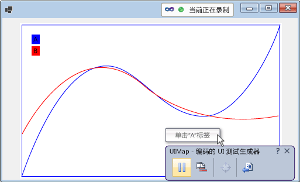

# <a name="enable-coded-ui-testing-of-your-controls"></a>启用控件的编码的 UI 测试

实现对编码的 UI 测试框架的支持，可使控件更易测试。 您能够以增量方式增加支持级别。 先从支持记录、播放和属性验证开始。 然后，在此基础上启用编码的 UI 测试生成器，以识别控件的自定义属性。 提供自定义类以便从生成的代码访问这些属性。 你还可以帮助编码的 UI 测试生成器，使之以一种与所录制操作的目的更为接近的方法来捕获操作。


## <a name="support-record-and-playback-and-property-validation-by-implementing-accessibility"></a>通过实现辅助功能来支持记录和播放以及属性验证

编码的 UI 测试生成器可捕获与它在录制期间所遇到的控件有关的信息，然后生成代码以重播该会话。 如果控件不支持辅助功能，则编码的 UI 测试生成器使用屏幕坐标来捕获操作（例如，鼠标单击）。 播放测试时，生成的代码在同一屏幕坐标释放这些操作。 在播放测试时，如果控件出现在屏幕上的其他位置，则生成的代码将无法执行该操作。 在不实现控件的辅助功能的情况下，如果在不同屏幕配置上、不同环境中播放测试或者 UI 布局更改时，测试可能失败。

 

 如果实现辅助功能，则编码的 UI 测试生成器在记录测试时，使用这一辅助功能来捕获有关控件的信息。 然后，当您运行测试时，生成的代码将针对您的控件重播这些事件，即使它位于用户界面中的其他位置。 测试作者还可以使用控件的基本属性创建断言。

 

### <a name="to-support-record-and-playback-property-validation-and-navigation-for-a-windows-forms-control"></a>支持记录和播放、属性验证以及 Windows 窗体控件的导航
 根据以下过程中的概述和 <xref:System.Windows.Forms.AccessibleObject> 中的详细介绍，为您的控件实现辅助功能。

 

1.  实现一个从 <xref:System.Windows.Forms.Control.ControlAccessibleObject> 派生的类，并重写 <xref:System.Windows.Forms.Control.AccessibilityObject%2A> 属性以便返回类的对象。

    ```csharp
    public partial class ChartControl : UserControl
    {
        // Overridden to return the custom AccessibleObject for the control.
        protected override AccessibleObject CreateAccessibilityInstance()
        {
            return new ChartControlAccessibleObject(this);
        }

        // Inner class ChartControlAccessibleObject represents accessible information
        // associated with the ChartControl and is used when recording tests.
        public class ChartControlAccessibleObject : ControlAccessibleObject
        {
            ChartControl myControl;
            public ChartControlAccessibleObject(ChartControl ctrl)
                : base(ctrl)
            {
                myControl = ctrl;
            }
        }
    }
    ```

2.  替代可访问对象的 <xref:System.Windows.Forms.AccessibleObject.Role%2A>、<xref:System.Windows.Forms.AccessibleObject.State%2A>、<xref:System.Windows.Forms.AccessibleObject.GetChild%2A> 和 <xref:System.Windows.Forms.AccessibleObject.GetChildCount%2A> 属性及方法。

3.  实现子控件的另一个辅助功能对象并替代子控件的 <xref:System.Windows.Forms.Control.AccessibilityObject%2A> 属性，以便返回该辅助功能对象。

4.  替代子控件辅助功能对象的 <xref:System.Windows.Forms.AccessibleObject.Bounds%2A>、<xref:System.Windows.Forms.AccessibleObject.Name%2A>、<xref:System.Windows.Forms.AccessibleObject.Parent%2A>、<xref:System.Windows.Forms.AccessibleObject.Role%2A>、<xref:System.Windows.Forms.AccessibleObject.State%2A>、<xref:System.Windows.Forms.AccessibleObject.Navigate%2A> 和 <xref:System.Windows.Forms.AccessibleObject.Select%2A> 属性及方法。

> [!NOTE]
> 本主题从 <xref:System.Windows.Forms.AccessibleObject> 辅助功能示例开始，然后在此示例上完成剩余过程。 如果要创建辅助功能示例的可行版本，请创建一个控制台应用程序，然后用示例代码替换 Program.cs 中的代码。 添加对辅助功能、System.Drawing 和 System.Windows.Forms 的引用。 若要消除生成警告，将辅助功能的“嵌入互操作类型”更改为“False”。 可以将项目的输出类型从“控制台应用程序”更改为“Windows 应用程序”，以便在运行应用程序时不显示控制台窗口。

## <a name="support-custom-property-validation-by-implementing-a-property-provider"></a>通过实现属性提供程序来支持自定义属性验证

在实现对记录、播放和属性验证的基本支持后，可以通过实现 <xref:Microsoft.VisualStudio.TestTools.UITesting.UITestPropertyProvider> 插件，使控件的自定义属性可供编码的 UI 测试使用。 例如，下面的过程将创建一个属性提供程序，该程序允许编码的 UI 测试访问图表控件的 CurveLegend 子控件的 State 属性：

 

### <a name="to-support-custom-property-validation"></a>支持自定义属性验证


1. 重写曲线图可访问对象的 <xref:System.Windows.Forms.AccessibleObject.Description%2A> 属性，以此在描述字符串中传递丰富的属性值。 用分号 (;) 分隔多个值。

    ```csharp
    public class CurveLegendAccessibleObject : AccessibleObject
    {
        // add the state property value to the description
        public override string Description
        {
            get
            {
                // Add ";" and the state value to the end
                // of the curve legend's description
                return "CurveLegend; " + State.ToString();
            }
        }
    }
    ```

1. 通过创建类库项目，为控件创建 UI 测试扩展包。 添加对辅助功能、Microsoft.VisualStudio.TestTools.UITesting、Microsoft.VisualStudio.TestTools.UITest.Common 和 Microsoft.VisualStudio.TestTools.Extension 的引用。 将可访问性的“嵌入互操作类型”更改为“False”。

1. 添加一个派生自 <xref:Microsoft.VisualStudio.TestTools.UITesting.UITestPropertyProvider> 的属性提供程序类：

    ```csharp
    using System;
    using System.Collections.Generic;
    using Accessibility;
    using Microsoft.VisualStudio.TestTools.UITesting;
    using Microsoft.VisualStudio.TestTools.UITest.Extension;
    using Microsoft.VisualStudio.TestTools.UITesting.WinControls;
    using Microsoft.VisualStudio.TestTools.UITest.Common;

    namespace ChartControlExtensionPackage
    {
        public class ChartControlPropertyProvider : UITestPropertyProvider
        {
        }
    }
    ```

1. 通过将属性名称和属性描述符放在 <xref:System.Collections.Generic.Dictionary%602> 中，实施此属性提供程序。

1. 重写 <xref:Microsoft.VisualStudio.TestTools.UITesting.UITestPropertyProvider.GetControlSupportLevel%2A?displayProperty=fullName>，指明您的程序集为控件及其子控件提供特定于控件的支持。

1. 重写 <xref:Microsoft.VisualStudio.TestTools.UITesting.UITestPropertyProvider?displayProperty=fullName> 的剩余抽象方法

1. 添加一个派生自 <xref:Microsoft.VisualStudio.TestTools.UITest.Extension.UITestExtensionPackage> 的扩展包类。

1. 定义程序集的 `UITestExtensionPackage` 特性。

1. 在扩展包类中，重写 <xref:Microsoft.VisualStudio.TestTools.UITest.Extension.UITestExtensionPackage.GetService%2A?displayProperty=fullName>，以便在请求属性提供程序时返回属性提供程序类。

1. 重写 <xref:Microsoft.VisualStudio.TestTools.UITest.Extension.UITestExtensionPackage> 的剩余抽象方法和属性。

1. 生成二进制文件，然后将其复制到 **%ProgramFiles%\Common\Microsoft Shared\VSTT\10.0\UITestExtensionPackages**。

> [!NOTE]
> 此扩展包应用于类型为“Text”的所有控件。 如果测试同一类型的多个控件，则分别进行测试，以便可以管理在记录测试时要部署的扩展包。

## <a name="support-code-generation-by-implementing-a-class-to-access-custom-properties"></a>通过实现用于访问自定义属性的类来支持代码生成

当编码的 UI 测试时生成器生成会话录制的代码时，它将使用 <xref:Microsoft.VisualStudio.TestTools.UITesting.UITestControl> 类来访问您的控件。

如果已实现一个属性提供程序来访问控件的自定义属性，则可以添加一个用于访问这些属性的专用类。 添加专用类可简化生成的代码。

### <a name="to-add-a-specialized-class-to-access-your-control"></a>添加专用类以访问您的控件


1. 实现派生自 <xref:Microsoft.VisualStudio.TestTools.UITesting.WinControls.WinControl> 类，并将控件的类型添加到构造函数中的搜索属性集合。

1. 实现控件的自定义属性，作为类的属性。

1. 替代属性提供程序的 <xref:Microsoft.VisualStudio.TestTools.UITesting.UITestPropertyProvider.GetSpecializedClass%2A?displayProperty=fullName> 方法，以便返回曲线图例子控件的新类的类型。

1. 替代属性提供程序的 <xref:Microsoft.VisualStudio.TestTools.UITesting.UITestPropertyProvider.GetPropertyNamesClassType%2A> 方法，以便返回新类的 PropertyNames 方法的类型。

## <a name="support-intent-aware-actions-by-implementing-an-action-filter"></a>通过实现操作筛选器来支持意向感知操作

 当 Visual Studio 录制测试时，它会捕获鼠标和键盘事件。 但是，在某些情况下，在一系列鼠标和键盘事件中可能会丢失操作的目的。 例如，如果控件支持自动完成，则在其他环境中播放测试时，同一组鼠标和键盘事件可能会产生不同的值。 您可以添加一个操作筛选器插件，将一系列键盘和鼠标事件替换为单一操作。 这样一来，可以将选择某个值的一系列鼠标和键盘事件替换为设置值的单一操作。 当从一个环境转到另一个环境时，这样可以保护编码的 UI 测试，使之不受自动完成差异的影响。

### <a name="to-support-intent-aware-actions"></a>支持目的感知操作


1. 实现派生自 <xref:Microsoft.VisualStudio.TestTools.UITest.Common.UITestActionFilter> 的操作筛选器类，并替代属性 <xref:Microsoft.VisualStudio.TestTools.UITest.Common.UITestActionFilter.ApplyTimeout%2A>、<xref:Microsoft.VisualStudio.TestTools.UITest.Common.UITestActionFilter.Category%2A>、<xref:Microsoft.VisualStudio.TestTools.UITest.Common.UITestActionFilter.Enabled%2A>、<xref:Microsoft.VisualStudio.TestTools.UITest.Common.UITestActionFilter.FilterType%2A>、<xref:Microsoft.VisualStudio.TestTools.UITest.Common.UITestActionFilter.Group%2A> 和 <xref:Microsoft.VisualStudio.TestTools.UITest.Common.UITestActionFilter.Name%2A>。

1. 重写 <xref:Microsoft.VisualStudio.TestTools.UITest.Common.UITestActionFilter.ProcessRule%2A>。 此示例将一个双击操作替换成了单击操作。

1. 将操作筛选器添加到扩展包的 <xref:Microsoft.VisualStudio.TestTools.UITest.Extension.UITestExtensionPackage.GetService%2A> 方法。

1. 生成二进制文件，然后将其复制到 %ProgramFiles%\Common Files\Microsoft Shared\VSTT\10.0\UITestExtensionPackages。

> [!NOTE]
> 操作筛选器不依赖于辅助功能实现或属性提供程序。

## <a name="debug-your-property-provider-or-action-filter"></a>调试属性提供程序或操作筛选器

在扩展包中实现属性提供程序和操作筛选器。 测试生成器从应用程序中的单独进程中运行扩展包。

### <a name="to-debug-your-property-provider-or-action-filter"></a>调试属性提供程序或操作筛选器

1.  生成扩展包的调试版本，然后将 .dll 和 .pdb 文件复制到 %ProgramFiles%\Common Files\Microsoft Shared\VSTT\10.0\UITestExtensionPackages。

2.  运行您的应用程序（不在调试器中）。

3.  运行编码的 UI 测试生成器。

     `codedUITestBuilder.exe  /standalone`

4.  将调试器附加到 codedUITestBuilder 进程。

5.  在代码中设置断点。

6.  在编码的 UI 测试生成器中，创建断言以执行您的属性提供程序，并录制操作以运用您的操作筛选器。

## <a name="see-also"></a>请参阅

- <xref:System.Windows.Forms.AccessibleObject>
- [使用 UI 自动化来测试代码](../test/use-ui-automation-to-test-your-code.md)