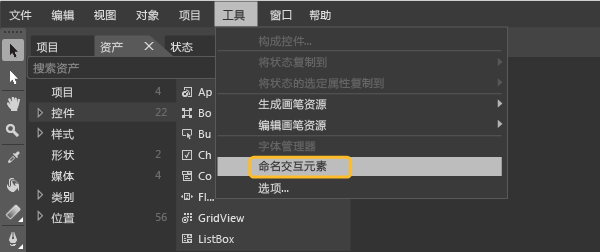

# <a name="set-a-unique-automation-property-for-uwp-controls-for-testing"></a>为 UWP 控件设置唯一的自动化属性以进行测试
若想针对基于 XAML 的 UWP 应用程序运行编码的 UI 测试，必须具有可标识每个控件的唯一的自动化属性。  
  
 可以根据应用中 XAML 控件的类型分配唯一自动化属性。 下面介绍了如何在以下情况分配此唯一自动化属性：  
  
-   [控件的静态 XAML 定义](#UniquePropertyWindowsStoreControlsStaticXAML)  
  
-   [使用 Visual Studio 或 Blend for Visual Studio 分配唯一自动化属性](#UniquePropertyWindowsStoreControlsExpressionBlend)  
  
-   [使用数据模板](#UniquePropertyWindowsStoreControlsDataTemplate)  
  
-   [使用控件模板](#UniquePropertyWindowsStoreControlsControlTemplate)  
  
-   [动态控件](#UniquePropertyWindowsStoreControlsDynamicControls)  
  
## <a name="use-methods-to-assign-a-unique-automation-property"></a>使用方法来分配唯一自动化属性  
  
###  <a name="UniquePropertyWindowsStoreControlsStaticXAML"></a>静态 XAML 定义  
 若要为 XAML 文件中定义的控件指定唯一自动化属性，可以隐式或显式设置 AutomationProperties.AutomationId 或 AutomationProperties.Name，如下面的示例所示。 设置这两个值中的任意一个都可以为控件指定唯一自动化属性，以在创建编码的 UI 测试或操作录制时标识控件。  
  
 **隐式设置属性**  
  
 使用控件 XAML 中的 Name 属性将 AutomationProperties.AutomationId 设为“ButtonX”。  
  
```xaml  
<Button Name="ButtonX" Height="31" HorizontalAlignment="Left" Margin="23,26,0,0"  VerticalAlignment="Top" Width="140" Click="ButtonX_Click" />  
  
```  
  
 使用控件 XAML 中的 Content 属性将 AutomationProperties.Name 设为“ButtonY”。  
  
```xaml  
<Button Content="ButtonY" Height="31" HorizontalAlignment="Left" Margin="23,76,0,0" VerticalAlignment="Top" Width="140" Click="ButtonY_Click" />  
  
```  
  
 **显式设置属性**  
  
 在控件 XAML 中将 AutomationProperties.AutomationId 显式设为“ButtonX”。  
  
```xaml  
<Button AutomationProperties.AutomationId="ButtonX" Height="31" HorizontalAlignment="Left" Margin="23,26,0,0"  VerticalAlignment="Top" Width="140" Click="ButtonX_Click" />  
  
```  
  
 在控件 XAML 中将 AutomationProperties.Name 显式设为“ButtonY”。  
  
```  
<Button AutomationProperties.Name="ButtonY" Height="31" HorizontalAlignment="Left" Margin="23,76,0,0" VerticalAlignment="Top" Width="140" Click="ButtonY_Click" />  
```  
  
###  <a name="UniquePropertyWindowsStoreControlsExpressionBlend"></a>使用 Visual Studio 或 Blend for Visual Studio 分配唯一自动化属性  
 可以使用 Visual Studio 或 Blend for Visual Studio 为按钮、列表框、组合框和文本框等交互元素分配唯一名称。 这会为控件指定 AutomationProperties.Name 唯一值。  
  
 **Visual Studio：**在“工具”菜单上，指向“选项”，然后依次选择“文本编辑器”、“XAML”和“其他”。  
  
 选中“在创建时自动命名交互元素”复选框，然后选择“确定”。  
  
   
  
 **Blend for Visual Studio：**在 Blend for Visual Studio 中采用以下任意一种方法来分配唯一自动化属性。  
  
> [!NOTE]
>  只能对使用 XAML 静态创建的控件使用此类方法。  
  
 **为现有控件指定唯一名称的具体步骤**  
  
 选择“工具”菜单上的“命名交互元素”，如下图所示：  
  
   
  
 **自动为创建的控件指定唯一名称的具体步骤**  
  
 在“工具”菜单上，指向“选项”，然后选择“项目”。 选中“在创建时自动命名交互元素”，然后选择“确定”，如下图所示：  
  
   
  
###  <a name="UniquePropertyWindowsStoreControlsDataTemplate"></a>使用数据模板  
 可以使用 ItemTemplate 定义简单模板，从而使用下面的 XAML 将列表框中的值与变量绑定在一起。  
  
```xaml  
  
<ListBox Name="listBox1" ItemsSource="{Binding Source={StaticResource employees}}">  
   <ListBox.ItemTemplate>  
      <DataTemplate>  
         <StackPanel Orientation="Horizontal">  
            <TextBlock Text="{Binding EmployeeName}" />  
            <TextBlock Text="{Binding EmployeeID}" />  
         </StackPanel>  
      </DataTemplate>  
   </ListBox.ItemTemplate>  
</ListBox>  
```  
  
 也可以使用 ItemContainerStyle 定义模板，从而使用下面的 XAML 将值与变量绑定在一起。  
  
```xaml  
  
      <ListBox Name="listBox1" ItemsSource="{Binding Source={StaticResource employees}}">  
            <ListBox.ItemContainerStyle>  
                <Style TargetType="ListBoxItem">  
                    <Setter Property="Template">  
                        <Setter.Value>  
                            <ControlTemplate TargetType="ListBoxItem">  
                                <Grid>  
                                    <Button Content="{Binding EmployeeName}" AutomationProperties.AutomationId="{Binding EmployeeID}"/>  
                                </Grid>  
                            </ControlTemplate>  
                        </Setter.Value>  
                    </Setter>  
                </Style>  
            </ListBox.ItemContainerStyle>           
        </ListBox>  
  
```  
  
 对于这两个示例，必须替代 ItemSource 的 ToString() 方法，如以下代码所示。 此代码可确保设置唯一的 AutomationProperties.Name 值，因为无法通过绑定为每个数据绑定列表项设置唯一自动化属性。 在这种情况下，设置唯一的 AutomationProperties.Name 值就足够了。  
  
> [!NOTE]
>  使用这种方法，还可以通过绑定将列表项的内部内容设为 Employee 类中的字符串。 如示例所示，可以为每个列表项中的按钮控件分配唯一自动化 ID（即员工 ID）。  
  
```  
  
Employee[] employees = new Employee[]   
{  
   new Employee("john", "4384"),  
   new Employee("margaret", "7556"),  
   new Employee("richard", "8688"),  
   new Employee("george", "1293")  
};  
  
listBox1.ItemsSource = employees;  
  
public override string ToString()  
{  
    return EmployeeName + EmployeeID; // Unique Identification to be set as the AutomationProperties.Name  
}  
  
```  
  
###  <a name="UniquePropertyWindowsStoreControlsControlTemplate"></a>使用控件模板  
 可以使用控件模板，让代码中定义的每个特定类型实例获得唯一自动化属性。 必须创建模板，将 AutomationProperty 与控件实例的唯一 ID 绑定在一起。 下面的 XAML 展示了一种使用控件模板创建此类绑定的方法。  
  
```xaml  
  
<Style x:Key="MyButton" TargetType="Button">  
<Setter Property="Template">  
   <Setter.Value>  
<ControlTemplate TargetType="Button">  
   <Grid>  
      <CheckBox HorizontalAlignment="Left" AutomationProperties.AutomationId="{TemplateBinding Content}"></CheckBox>  
      <Button Width="90" HorizontalAlignment="Right" Content="{TemplateBinding Content}" AutomationProperties.AutomationId="{TemplateBinding Content}"></Button>  
   </Grid>  
</ControlTemplate>  
   </Setter.Value>  
</Setter>  
</Style>  
  
```  
  
 使用此控件模板定义一个按钮的两个实例时，自动化 ID 在模板中设为控件的唯一内容字符串，如下面的 XAML 所示。  
  
```xaml  
  
<Button Content="Button1" Style="{StaticResource MyButton}" Width="140"/>  
<Button Content="Button2" Style="{StaticResource MyButton}" Width="140"/>  
```  
  
###  <a name="UniquePropertyWindowsStoreControlsDynamicControls"></a>动态控件  
 如果控件是通过代码动态创建，而不是静态创建或通过 XAML 文件中的模板创建而成，必须为控件设置 Content 或 Name 属性。 这样可以确保每个动态控件都拥有唯一自动化属性。 例如，如果必须在用户选择列表项时显示复选框，可以设置这些属性，如下所示：  
  
```csharp  
  
private void CreateCheckBox(string txt, StackPanel panel)  
   {  
      CheckBox cb = new CheckBox();  
      cb.Content = txt; // Sets the AutomationProperties.Name  
      cb.Height = 50;  
      cb.Width = 100;  
      cb.Name = "DynamicCheckBoxAid"+ txt; // Sets the AutomationProperties.AutomationId  
      panel.Children.Add(cb);  
    }  
  
```  
  
## <a name="see-also"></a>请参阅  
 [使用编码的 UI 测试来测试 Windows UWP 应用](../test/test-windows-store-8-1-apps-with-coded-ui-tests.md)
