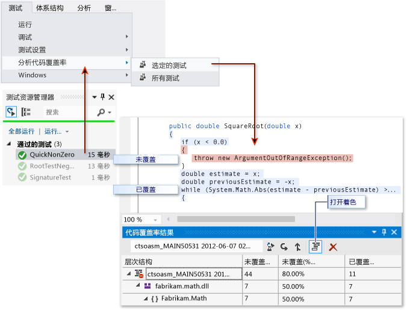

# 代码覆盖率疑难解答

Visual Studio 中的代码覆盖率分析工具可收集本机和托管程序集（.dll 或 .exe 文件）的数据。 但是，在某些情况下，“代码覆盖率结果”窗口显示类似于“生成了空结果集:...”的错误获得空结果的原因有多种。 本文可帮助解决这些问题。

## 你应该看到的结果

如果选择了“测试”菜单上“分析代码覆盖率”命令，并且生成和测试成功运行，则应该在“代码覆盖率”窗口中看到结果的列表。 你可能必须展开项目以查看详细信息。

有关详细信息，请参阅[使用代码覆盖率确定正在测试的代码数量](../test/using-code-coverage-to-determine-how-much-code-is-being-tested.md)。

## 看不到结果或看到旧结果的可能原因

### 你是否有正确版本的 Visual Studio？
 需要 Visual Studio Enterprise。

### 未执行测试

分析 &mdash; 检查输出窗口。 在“显示输出来源”下拉列表中，选择“测试”。 查看是否记录了任何警告或错误。

说明 &mdash; 代码覆盖率分析在测试运行过程中完成。 它只包含测试运行时加载到内存中的程序集。 如果未执行任何测试，则没有任何关于代码覆盖率的信息可供报告。

解决方法 &mdash; 在测试资源管理器中，选择“全部运行”，验证测试是否成功运行。 在使用“分析代码覆盖率”前修复所有错误。

### 现在出现的是前一个结果

在修改并重新运行测试时，前一个代码覆盖率结果可能仍是可见的，包括来自上次运行的代码着色。

1.  运行“分析代码覆盖率”。

2.  确保选择了“代码覆盖率结果”窗口中的最新结果集。

### .pdb（符号）文件不可用

分析 &mdash; 打开编译目标文件夹（通常是 bin\debug），验证是否对于每个程序集，.dll 或 .exe 文件所在的同一目录中是否都有一个 .pdb 文件。

说明 &mdash; 代码覆盖率引擎要求每个程序集让其关联的 .pdb 文件在测试运行期间可访问。 如果某个特定程序集没有 .pdb 文件，则不会分析该程序集。

.pdb 文件必须从与 .dll 或 .exe 文件同一个生成中产生。

解决方法 &mdash; 确保生成设置生成了 .pdb 文件。 如果 .pdb 文件在项目生成时未更新，则打开项目属性，选择“生成”页，选择“高级”，然后查看“调试信息”。

如果 .pdb 与 .dll 或 .exe 文件在不同的位置，请将 .pdb 文件复制到相同的目录。 也可以配置代码覆盖率引擎以在另一个位置搜索 .pdb 文件。 有关详细信息，请参阅[自定义代码覆盖率分析](../test/customizing-code-coverage-analysis.md)。

### 使用已检测或已优化的二进制文件

分析 &mdash; 确定二进制文件是否已接受任何形式的高级优化（如配置优化），或者是否已由分析工具（如 vsinstr.exe 或 vsperfmon.exe）检测过。

说明 &mdash; 如果某个程序集已由另一个分析工具检测或优化过，则在代码覆盖率分析中省略该程序集。 无法对此类程序集执行代码覆盖率分析。

解决方法 &mdash; 关闭优化并使用新生成。

### 代码不是托管 (.NET) 代码或本机 (C++) 代码

分析 &mdash; 验证是否正在对托管代码或 C++ 代码运行某些测试。

说明 &mdash; Visual Studio 中的代码覆盖率分析仅对托管代码和本机 (C++) 代码可用。 如果使用的是第三方工具，则一部分或所有代码可能在其他平台上执行。

解决方法 &mdash; 无解决方法。

### 程序集已由 NGen 安装

分析 &mdash; 验证程序集不是从本机映像缓存加载的。

说明 &mdash; 出于性能原因，不分析本机映像程序集。 有关详细信息，请参阅 [Ngen.exe（本机映像生成器）](/dotnet/framework/tools/ngen-exe-native-image-generator)。

解决方法 &mdash; 使用 MSIL 版本的程序集。 不使用 NGen 处理它。

### 自定义 .runsettings 文件存在语法错误

分析 &mdash; 如果使用的是自定义 .runsettings 文件，它可能包含语法错误。 未运行代码覆盖率，且“代码覆盖率”窗口在测试运行结束时未打开，或者显示了旧结果。

说明 &mdash; 可以使用自定义 .runsettings 文件运行单元测试以配置代码覆盖率选项。 这些选项使你可以包含或排除文件。 有关详细信息，请参阅[自定义代码覆盖率分析](../test/customizing-code-coverage-analysis.md)。

解决方法 &mdash; 有两种可能的错误类型：

-   **XML 错误**

     在 Visual Studio XML 编辑器中打开 .runsettings 文件。 查找错误提示。

-   **正则表达式错误**

     文件中的每个字符串都是正则表达式。 检查每个字符串中是否存在错误，尤其是查找：

    -   不匹配的括号 (...) 或非转义括号 \\(...\\)。 如果要在搜索字符串中匹配某个括号，则必须对其进行转义。 例如，若要匹配某个函数，请使用：`.*MyFunction\(double\)`

    -   表达式开头有星号或加号。 若要匹配任意字符串，请使用句点后跟星号：`.*`

### 使用了错误排除的自定义 .runsettings 文件

分析 &mdash; 如果使用的是自定义 .runsettings 文件，请确保它包含程序集。

说明 &mdash; 可以使用自定义 .runsettings 文件运行单元测试以配置代码覆盖率选项。 这些选项使你可以包含或排除文件。 有关详细信息，请参阅[自定义代码覆盖率分析](../test/customizing-code-coverage-analysis.md)。

解决方法 &mdash; 从 .runsettings 文件中删除所有 `Include` 节点，然后删除所有 `Exclude` 节点。 如果这样做修复了问题，请将这些节点分阶段放回去。

确定 DataCollectors 节点指定了代码覆盖率。 将它与[自定义代码覆盖率分析](../test/customizing-code-coverage-analysis.md)中的示例进行比较。

## 某些代码始终显示为未覆盖

### 本机 DLL 的初始化代码在检测前执行

分析 &mdash; 在静态链接的本机代码中，即使代码已执行，部分初始化函数 DllMain 和它调用的代码有时也会显示为未覆盖。

说明 &mdash; 代码覆盖率工具的工作方式是在应用程序刚要开始运行前在程序集中插入检测。 在预先加载的任何程序集中，DllMain 中的初始化代码将在程序集加载之后和应用程序运行之前的这段时间执行。 该代码将显示为未覆盖。 通常，这适用于静态加载的程序集。

解决方法 &mdash; 无。

## 请参阅

- [使用代码覆盖率确定所测试的代码量](../test/using-code-coverage-to-determine-how-much-code-is-being-tested.md)