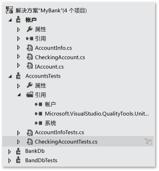
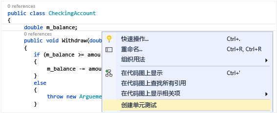
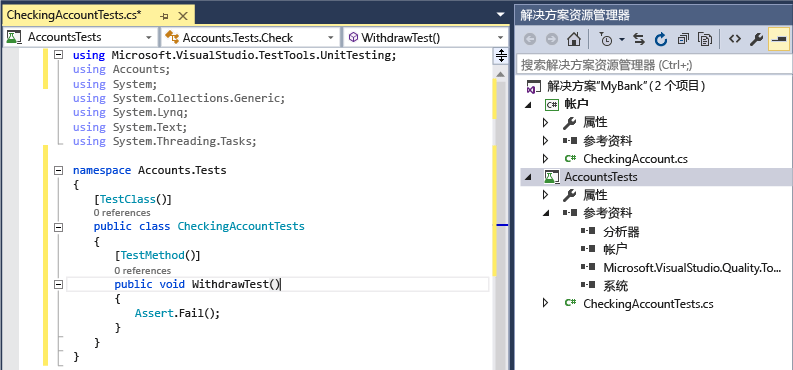

# <a name="unit-test-basics"></a>单元测试基础知识

通过创建和运行单元测试，检查你的代码是否按预期工作。 因为可将程序的功能分为可作为单个单元测试的独立可测试行为，所以它叫做单元测试。 Visual Studio 测试资源管理器提供了一种灵活而高效的方法运行你的单元测试并在 Visual Studio 中查看其结果。 Visual Studio 为托管和本机代码安装了 Microsoft 单元测试框架。 使用 *单元测试框架* 创建单元测试，运行测试，并报告这些测试的结果。 进行更改后重新运行单元测试，以测试代码仍能正常工作。 Visual Studio Enterprise 可以使用 [Live Unit Testing](live-unit-testing-intro.md) 自动执行此操作，后者会检测受代码更改影响的测试，并在你输入时在后台运行它们。

作为软件开发工作流的组成部分时，单元测试对代码质量的影响最大。 只要你编写了一个函数或其他应用程序代码块，就可以创建单元测试用于验证对应于输入数据的标准、边界和不正确情况的代码的行为，而且用于检查代码所做的任何显式或隐式假设。 通过 *测试驱动开发*，你需要在编写代码前创建单元测试，这样你可以将单元测试用作设计文档和功能规范。

你可以从代码快速生成测试项目和测试方法，或者根据你的需要手动创建测试。 当使用 IntelliTest 浏览你的 .NET 代码时，可以生成测试数据和单元测试套件。 对于代码中的每个语句，将生成执行该语句的测试输入。 了解如何 [为你的代码生成单元测试](generate-unit-tests-for-your-code-with-intellitest.md)。

测试资源管理器还可以运行第三方和开放源代码单元测试框架，它们实现了测试资源管理器外接程序接口。 你可以通过 Visual Studio Extension Manager 和 Visual Studio 库添加其中许多框架。 有关详细信息，请参阅[安装第三方单元测试框架](../test/install-third-party-unit-test-frameworks.md)。

## <a name="get-started"></a>入门

关于直接进入编码的单元测试的简介，请参阅以下主题之一：

- [演练：创建并运行托管代码的单元测试](../test/walkthrough-creating-and-running-unit-tests-for-managed-code.md)

- [快速入门：通过测试资源管理器进行测试驱动开发](../test/quick-start-test-driven-development-with-test-explorer.md)

- [在 Visual Studio 中编写 C/C++ 单元测试](../test/writing-unit-tests-for-c-cpp.md)

## <a name="the-mybank-solution-example"></a>MyBank 解决方案示例

在本文中，我们使用称为 `MyBank` 的虚构应用程序的开发作为示例。 无需使用实际代码按照本主题中的说明操作。 测试方法用 C# 编写，并通过用于托管代码的 Microsoft 单元测试框架进行呈现。 但是，这些概念很容易转移到其他语言和框架。



我们第一次尝试设计的 `MyBank` 应用程序包含表示个人帐户及其与银行交易的帐户组件，以及表示集合和管理单独帐户的功能的数据库组件。

我们创建包含两个项目的 `MyBank` 解决方案：

- `Accounts`

- `BankDb`

我们首次尝试设计 `Accounts` 的项目包含一个类来保存有关帐户的基本信息，以及指定任何类型的帐户的通用功能的接口的基本信息（如从该帐户存储和取出资产），以及从表示存款帐户的接口派生的类的基本信息。 首先，我们通过创建以下源文件开始帐户项目：

- AccountInfo.cs 定义帐户的基本信息。

- IAccount.cs 为帐户定义一个标准 `IAccount` 接口，包括从一个帐户存款和收回资产和检索帐户余额的方法。

- CheckingAccount.cs 包含 `CheckingAccount` 类，该类实现支票帐户的 `IAccount` 接口。

我们根据经验可知，从支票帐户中取款必须要确保提取的金额小于帐户余额。 因此我们用检查这种情况的一种方法来重写 `IAccount.Withdraw` 中的 `CheckingAccount` 方法。 该方法可能如下所示：

```csharp
public void Withdraw(double amount)
{
    if(m_balance >= amount)
    {
        m_balance -= amount;
    }
    else
    {
        throw new ArgumentException(amount, "Withdrawal exceeds balance!")
    }
}
```

有了代码，现在就可以开始测试了。

## <a name="create-unit-test-projects-and-test-methods"></a>创建单元测试项目和测试方法

通常从你的代码生成单元测试项目和单元测试存根速度更快。 或者，你可以选择创建单元测试项目和根据你的要求进行手动测试。

### <a name="generate-unit-test-project-and-unit-test-stubs"></a>生成单元测试项目和单元测试存根

1. 在代码编辑器窗口中，右键单击并从右键单击菜单中选择“创建单元测试”。

    

2. 单击“确定”接受默认值以创建单元测试，或更改用于创建并命名单元测试项目和单元测试的值。 你可以选择默认添加到单元测试方法的代码。

    

3. 在类的所有方法的新单元测试项目中创建单元测试存根。

    

4. 现在向前跳转，了解如何 [将代码添加到单元测试方法](#write-your-tests) ，以使你的单元测试有意义，并使你想要添加的额外单元测试彻底地测试代码。

### <a name="create-the-unit-test-project-and-unit-tests-manually"></a>手动创建单元测试项目和单元测试

单元测试项目通常会镜像单个代码项目的结构。 在 MyBank 示例中，你将把名为 `AccountsTests` 和 `BankDbTests` 的两个单元测试项目添加到 `MyBanks` 解决方案中。 测试项目名称是任意的，但采用标准命名约定是一个好主意。

**若要向解决方案中添加单元测试项目：**

1. 在“解决方案资源管理器”中，右键单击解决方案，然后依次选择“添加” > “新建项目”。

::: moniker range="vs-2017"

2. 在“新建项目”对话框中，展开“已安装”节点，选择要用于测试项目的语言，然后选择“测试”。

3. 若要使用 Microsoft 单元测试框架之一，请从项目模板的列表中选择“单元测试项目”  。 否则，请选择你想要使用的单元测试框架的项目模板。 若要测试我们的示例中的 `Accounts` 项目，你需要将该项目命名为 `AccountsTests`。

   > [!NOTE]
   > 并非所有第三方和开放源代码单元测试框架都提供 Visual Studio 项目模板。 有关创建项目的信息，请参阅框架文档。

::: moniker-end

::: moniker range=">=vs-2019"

2. 使用项目模板搜索框查找要使用的测试框架的单元测试项目模板。

3. 在下一页上，为项目命名。 若要测试示例中的 `Accounts` 项目，则需要将该项目命名为 `AccountsTests`。

::: moniker-end

4. 在你的单元测试项目中，将引用添加到所测试项目的代码中，在我们的示例中应添加到帐户项目中。

   若要创建代码项目的引用：

   1.  在解决方案资源管理器中，选择项目。

   2.  在“项目”菜单上，选择“添加引用” 。

   3.  在“引用管理器”对话框中，打开“解决方案”节点，然后选择“项目”。 选择代码项目名称并关闭对话框。

每个单元测试项目包含类，用于镜像代码项目中类的名称。 在我们的示例中， `AccountsTests` 项目将包含以下类：

-   `AccountInfoTests` 类包含用于 `AccountInfo` 项目中 `Accounts` 类的单元测试方法

-   `CheckingAccountTests` 类包含用于 `CheckingAccount` 类的单元测试方法。

## <a name="write-your-tests"></a>编写测试

你使用的单元测试框架和 Visual Studio IntelliSense 将指导你完成为代码项目的单元测试编写代码。 若要在“测试资源管理器”中运行，大多数框架要求你添加特定的属性来识别单元测试方法。 框架还提供了一种方法，通常通过断言语句或方法属性，来指示测试方法是否已通过或失败。 其他属性标识可选的安装方法，即在类初始化时和每个测试方法和每个拆卸方法之前的安装方法，这些拆卸方法在每个测试方法之后和类被销毁之前运行。

AAA（准备、执行、断言）模式是编写待测试方法的单元测试的常用方法。

- 单元测试方法的 **准备** 部分初始化对象并设置传递给待测试方法的数据的值。

- **执行** 部分调用具有准备参数的待测试方法。

- **断言** 部分验证待测试方法的执行行为与预期相同。

若要测试我们的示例中的 `CheckingAccount.Withdraw` 方法，我们可以编写两个测试：一个验证方法的标准行为，另一个验证多于余额的取款将失败。 在 `CheckingAccountTests` 类中，我们将添加以下方法：

```csharp
[TestMethod]
public void Withdraw_ValidAmount_ChangesBalance()
{
    // arrange
    double currentBalance = 10.0;
    double withdrawal = 1.0;
    double expected = 9.0;
    var account = new CheckingAccount("JohnDoe", currentBalance);
    // act
    account.Withdraw(withdrawal);
    double actual = account.Balance;
    // assert
    Assert.AreEqual(expected, actual);
}

[TestMethod]
[ExpectedException(typeof(ArgumentException))]
public void Withdraw_AmountMoreThanBalance_Throws()
{
    // arrange
    var account = new CheckingAccount("John Doe", 10.0);
    // act
    account.Withdraw(20.0);
    // assert is handled by the ExpectedException
}
```

请注意， `Withdraw_ValidAmount_ChangesBalance` 使用显式 `Assert` 语句确定测试方法是通过还是失败，而 `Withdraw_AmountMoreThanBalance_Throws` 使用 `ExpectedException` 属性确定测试方法的成功。 在底层，单元测试框架使用 try/catch 语句包装测试方法。 在大多数情况下，只要捕获了一个异常，则测试方法就会失败，并且该异常将被忽略。 如果指定的异常被抛弃， `ExpectedException` 属性将导致该测试方法通过。

有关 Microsoft 单元测试框架的详细信息，请参阅以下主题之一：

-   [单元测试代码](unit-test-your-code.md)

-   [编写 C/C++ 单元测试](writing-unit-tests-for-c-cpp.md)

-   [在单元测试中使用 MSTest 框架](using-microsoft-visualstudio-testtools-unittesting-members-in-unit-tests.md)

## <a name="set-timeouts-for-unit-tests"></a>为单元测试设置超时值

若要在单个测试方法上设置超时：

```csharp
[TestMethod]
[Timeout(2000)]  // Milliseconds
public void My_Test()
{ ...
}
```

若要将超时设置为允许的最大值：

```csharp
[TestMethod]
[Timeout(TestTimeout.Infinite)]  // Milliseconds
public void My_Test ()
{ ...
}
```

## <a name="run-tests-in-test-explorer"></a>在测试资源管理器中运行测试

在生成测试项目时，测试将出现在“测试资源管理器”中。 如果“测试资源管理器”不可见，请选择 Visual Studio 菜单上的“测试”，然后依次选择“Windows”、“测试资源管理器”。


运行、编写并重新运行测试时，“测试资源管理器”的默认视图将显示“失败的测试”、“通过的测试”、“跳过的测试”和“未运行的测试”组中的结果。 可以选择组标题以打开显示该组中的所有测试的视图。

通过在全局级别的搜索框中的匹配文本或选择其中一个预定义的筛选器，你还可以在任何视图中筛选测试。 你可以在任何时间运行任何选定的测试。 测试运行的结果立即显示在资源管理器窗口顶部的通过/失败栏中。 在你选择测试时，会显示测试方法结果的详细信息。

### <a name="run-and-view-tests"></a>运行和查看测试

“测试资源管理器”工具栏可帮助你发现、组织和运行你感兴趣的测试。


你可以选择“运行全部”  来运行所有测试，或选择“运行”  来选择要运行的测试的子集。 运行一组测试后，测试运行的摘要将出现在“测试资源管理器”窗口的底部。 选择一个测试以在底部窗格中查看该测试的详细信息。 选择右键单击菜单中的“打开测试”（快捷键：“F12”），显示所选测试的源代码。

如果各个测试没有防止其以任何顺序运行的依赖项，则可使用工具栏上的  切换按钮来打开并行测试执行。 这可以显著降低运行所有测试所需的时间。

### <a name="run-tests-after-every-build"></a>每次生成后运行测试

> [!WARNING]
> 仅在 Visual Studio Enterprise 中支持每次生成后运行单元测试。

|Button|说明|
|-|-|
||若要在每个本地生成后运行单元测试，请在标准菜单上选择“测试”，然后在“测试资源管理器”工具栏上选择“生成后运行测试”。|

### <a name="filter-and-group-the-test-list"></a>筛选和分组测试列表

有大量测试时，可以在“测试资源管理器”搜索框中键入，以按指定的字符串筛选列表。 你可以通过从筛选器列表中选择以更多地限制筛选器事件。


|Button|说明|
|-|-|
||若要按类别分组测试，请选择“分组依据”  按钮。|

有关详细信息，请参阅[使用测试资源管理器运行单元测试](../test/run-unit-tests-with-test-explorer.md)

## <a name="qa"></a>问题解答

**问：如何调试单元测试？**

**答：** 使用“测试资源管理器”为测试启动调试会话。 使用 Visual Studio 调试程序无缝地逐句通过代码将使你在单元测试和所测试项目之间来回反复。 若要开始调试：

1.  在 Visual Studio 编辑器中，在想要调试的一个或多个测试方法中设置断点。

    > [!NOTE]
    > 因为测试方法可以按任何顺序运行，请在你想要调试的所有测试方法中设置断点。

2.  在“测试资源管理器”中，选择测试方法，然后从快捷菜单选择“调试选定的测试”。

了解有关 [调试单元测试](../debugger/debugger-feature-tour.md)的更多详细信息。

**问：如果使用的是 TDD，该如何从我的测试生成代码？**

**答：** 使用 IntelliSense 在你的项目代码中生成类和方法。 编写调用你想要生成的类或方法的测试方法中的语句，然后打开调用下面的 IntelliSense 菜单。 如果调用新类的构造函数，请从菜单选择“生成新类型”  并按照向导在你的代码项目中插入此类。 如果调用方法，请从 IntelliSense 菜单选择“生成新方法”  。


**问：我是否可以创建将多个数据集作为输入来运行测试的单元测试？**

**答：** 可以。 *数据驱动的测试方法* 使你可以用单个单元测试方法测试一系列值。 对指定包含你想要测试的变量值的数据源和表的测试方法使用 `DataSource` 属性。  在方法体中，你可以使用 `TestContext.DataRow[`*ColumnName*`]` 索引器将行值分配给变量。

> [!NOTE]
> 这些过程仅适用于你使用 Microsoft 单元测试框架为托管代码编写的测试方法。 如果使用的是不同的框架，请查阅框架文档，获取等效功能。

例如，假定我们将不必要的方法添加到名为 `CheckingAccount` 的 `AddIntegerHelper`类中。 `AddIntegerHelper` 添加两个整数。

若要为 `AddIntegerHelper` 方法创建数据驱动的测试，我们首先创建名为 AccountsTest.accdb 的 Access 数据库和名为 `AddIntegerHelperData` 的表。 `AddIntegerHelperData` 表定义了指定要添加的第一个和第二个操作数的列和指定预期结果的列。 我们使用适当的值填充行数。

```csharp
[DataSource(
    @"Provider=Microsoft.ACE.OLEDB.12.0;Data Source=C:\Projects\MyBank\TestData\AccountsTest.accdb",
    "AddIntegerHelperData"
)]
[TestMethod()]
public void AddIntegerHelper_DataDrivenValues_AllShouldPass()
{
    var target = new CheckingAccount();
    int x = Convert.ToInt32(TestContext.DataRow["FirstNumber"]);
    int y = Convert.ToInt32(TestContext.DataRow["SecondNumber"]);
    int expected = Convert.ToInt32(TestContext.DataRow["Sum"]);
    int actual = target.AddIntegerHelper(x, y);
    Assert.AreEqual(expected, actual);
}
```

特性化的方法将为表中的每一行运行一次。 如果任何迭代失败，“测试资源管理器”将报告方法的测试失败。 该方法的测试结果详细信息窗格显示每行数据的通过/失败状态方法。

了解有关 [数据驱动的单元测试](../test/how-to-create-a-data-driven-unit-test.md)的详细信息。

**问：是否能查看我的单元测试测试了多少代码？**

**答：** 可以。 你可以使用 Visual Studio 代码覆盖率工具确定你的单元测试实际测试的代码量。 支持本机和托管语言以及可由单元测试框架运行的所有单元测试框架。

你可以在选定的测试上或解决方案中的所有测试上运行代码覆盖率。 “代码覆盖率结果”窗口显示行、函数、类、命名空间和模块执行的产品代码块的百分比。

若要在解决方案中运行测试方法的代码覆盖率，请在 Visual Studio 菜单上选择“测试”  ，然后选择“分析代码覆盖率” 。

覆盖率结果将显示在“代码覆盖率结果”窗口中。


了解有关 [代码覆盖率](../test/using-code-coverage-to-determine-how-much-code-is-being-tested.md) 的详细信息。

**问：能否在具有外部依赖项的代码中测试方法？**

**答：** 可以。 如果安装了 Visual Studio Enterprise，则可以通过使用托管代码的单元测试框架将 Microsoft Fakes 用于你编写的测试方法。

Microsoft Fakes 使用两种方法为外部依赖项创建替代类：

1.  *存根 (stub)* 生成派生自目标依赖关系类的父接口的替代类。 可以将存根 (stub) 方法替换为目标类的公共虚拟方法。

2.  *填充码* 使用运行时检测将对目标方法的调用转移到非虚拟方法的替代填充码方法。

通过这两种方法，你可以使用对依赖关系方法的调用所生成的委托，指定测试方法中所需的行为。

了解有关 [使用 Microsoft Fakes 隔离单元测试方法](../test/isolating-code-under-test-with-microsoft-fakes.md)的详细信息。

**问：是否可以使用其他单元测试框架创建单元测试？**

**答：** 可以，请按照下列步骤[查找和安装其他框架](../test/install-third-party-unit-test-frameworks.md)。 在重新启动 Visual Studio 后，重新打开解决方案以创建单元测试，然后在此处选择你已安装的框架：


将使用选定的框架创建单元测试存根。
