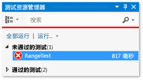
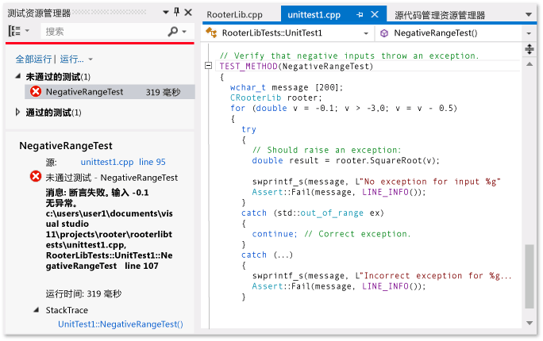

# <a name="unit-test-c-code"></a>单元测试 C# 代码

本文介绍一种在 UWP 应用中创建面向 C# 类的单元测试的方法。 Rooter 类通过实现计算给定数的平方根的估计的函数来演示限制计算理论的模糊内存。 Maths 应用程序之后可使用此函数为用户演示可通过 math 完成的有趣操作。

本文演示如何使用单元测试作为开发的第一步。 在此方法中，首先编写验证要测试的系统的特定行为的测试方法，然后编写通过测试的代码。 通过按照以下过程的顺序进行更改，您可调转此策略的顺序，即先编写要测试的代码，然后编写单元测试。

本文还为单元测试和要测试的 DLL 创建一个 Visual Studio 解决方案和单独的项目。 您还可在 DLL 项目中直接包含单元测试，也可以为单元测试和 DLL 创建不同的解决方案。

## <a name="create-the-solution-and-the-unit-test-project"></a>创建解决方案和单元测试项目

1. 在“文件”菜单上，选择“新建” > “项目”。

2. 搜索并选择“空白应用(通用 Windows)”项目模板。

3. 将项目命名为 `Maths`。

4. 在解决方案资源管理器中，选择解决方案名称，然后从快捷菜单中依次选择“添加”和“新建项目”。

5. 搜索并选择“单元测试应用(通用 Windows)”项目模板。

6. 在 Visual Studio 编辑器中打开 UnitTest1.cs。

   ```csharp
   using System;
   using System.Collections.Generic;
   using System.Linq;
   using System.Text;
   using Microsoft.VisualStudio.TestTools.UnitTesting;
   using Maths;

   namespace RooterTests
   {
       [TestClass]
       public class UnitTest1

           [TestMethod]
           public void TestMethod1()
           {

           }
   ```

   请注意：

   - 每个测试都是使用 <xref:Microsoft.VisualStudio.TestTools.UnitTesting.TestMethodAttribute> 属性定义的。 测试方法必须返回 void，并且不能具有任何参数。

   - 测试方法必须位于使用 <xref:Microsoft.VisualStudio.TestTools.UnitTesting.TestClassAttribute> 特性修饰的类中。

        运行测试时，将为每个测试类创建一个实例。 测试方法以未指定的顺序进行调用。

   - 可以定义在每个模块、类或方法之前和之后调用的特殊方法。 有关详细信息，请参阅[在单元测试中使用 MSTest 框架](../test/using-microsoft-visualstudio-testtools-unittesting-members-in-unit-tests.md)。

## <a name="verify-that-the-tests-run-in-test-explorer"></a>验证测试是否在测试资源管理器中运行

1. 在 UnitTest1.cs 文件的 TestMethod1 中插入一些测试代码：

   ```csharp
   [TestMethod]
   public void TestMethod1()
   {
       Assert.AreEqual(0, 0);
   }
   ```

   请注意， <xref:Microsoft.VisualStudio.TestTools.UnitTesting.Assert> 类提供了几个可以用来验证测试方法结果的静态方法。

2. 在“测试”菜单上，选择“运行”，然后选择“全部运行”。

   将生成并运行测试项目。 随即显示测试资源管理器窗口，并且测试在“通过的测试”下列出。 窗口底部的“摘要”窗格将提供有关所选测试的其他详细信息。

   

## <a name="add-the-rooter-class-to-the-maths-project"></a>向 Maths 项目添加 Rooter 类

1. 在解决方案资源管理器中，选择“Maths”项目名称。 从快捷菜单中依次选择“添加”和“类”。

2. 将类文件命名为 Rooter.cs。

3. 将以下代码添加到 Rooter 类 *Rooter.cs* 文件中：

   ```csharp
   public Rooter()
   {
   }

   // estimate the square root of a number
   public double SquareRoot(double x)
   {
       return 0.0;
   }
   ```

   `Rooter` 类声明一个构造函数和 `SquareRoot` estimator 方法。

4. `SquareRoot` 方法只是一个最小实现，足以为测试设置测试基本结构。

## <a name="couple-the-test-project-to-the-app-project"></a>将测试项目合并为应用程序项目

1. 将对 Maths 应用程序的引用添加到 RooterTests 项目。

    1. 在解决方案资源管理器中，选择“RooterTests”项目，然后在快捷菜单中选择“添加引用”。

    2. 在“添加引用 - RooterTests”对话框中，展开“解决方案”，然后选择“项目”。 然后，选择“Maths”项。

        

2. 向 UnitTest1.cs 文件添加 using 语句：

    1. 打开“UnitTest1.cs”。

    2. 在 `using Microsoft.VisualStudio.TestTools.UnitTesting;` 行下添加以下代码：

       ```csharp
       using Maths;
       ```

3. 添加使用 Rooter 函数的测试。 将以下代码添加到 UnitTest1.cs：

   ```csharp
   [TestMethod]
   public void BasicTest()
   {
       Maths.Rooter rooter = new Rooter();
       double expected = 0.0;
       double actual = rooter.SquareRoot(expected * expected);
       double tolerance = .001;
       Assert.AreEqual(expected, actual, tolerance);
   }
   ```

4. 生成解决方案。

   新测试将显示在测试资源管理器的“未运行的测试”节点中。

5. 在“测试资源管理器”中，选择“全部运行”。

   

你已设置测试和代码项目，并已验证可运行测试（运行测试项目中的函数）。 现在可以开始编写实际测试和代码。

## <a name="iteratively-augment-the-tests-and-make-them-pass"></a>以迭代方式增加测试并使它们通过

1. 添加新测试：

   ```csharp
   [TestMethod]
   public void RangeTest()
   {
       Rooter rooter = new Rooter();
       for (double v = 1e-6; v < 1e6; v = v * 3.2)
       {
           double expected = v;
           double actual = rooter.SquareRoot(v*v);
           double tolerance = ToleranceHelper(expected);
           Assert.AreEqual(expected, actual, tolerance);
       }
   }
   ```

   > [!TIP]
   > 建议你不更改已通过的测试。 相反，请添加新测试，更新代码，使测试通过，然后添加其他测试，依此类推。
   >
   > 当用户更改其要求时，请禁用不再正确的测试。 编写新测试，并以相同的增量方式使他们每次运行一个。

2. 在“测试资源管理器”中，选择“全部运行”。

3. 测试将不会通过。

   

   > [!TIP]
   > 编写测试后，立即验证每个测试是否都将失败。 这有助于避免编写从不失败的测试这一易犯错误。

4. 增强受测代码，以便新测试通过。 将 *Rooter.cs* 中的 `SquareRoot` 函数更改为：

   ```csharp
   public double SquareRoot(double x)
   {
       double estimate = x;
       double diff = x;
       while (diff > estimate / 1000)
       {
           double previousEstimate = estimate;
           estimate = estimate - (estimate * estimate - x) / (2 * estimate);
           diff = Math.Abs(previousEstimate - estimate);
       }
       return estimate;
   }
   ```

5. 生成解决方案，然后在“测试资源管理器”中选择“全部运行”。

   现在所有三个测试都将通过。

> [!TIP]
> 通过一次添加一个测试来开发代码。 确保每次迭代后所有的测试都会通过。

## <a name="debug-a-failing-test"></a>调试失败测试

1. 将另一个测试添加到 *UnitTest1.cs* 中：

    ```csharp
    // Verify that negative inputs throw an exception.
    [TestMethod]
    public void NegativeRangeTest()
    {
        string message;
        Rooter rooter = new Rooter();
        for (double v = -0.1; v > -3.0; v = v - 0.5)
        {
            try
            {
                // Should raise an exception:
                double actual = rooter.SquareRoot(v);

                message = String.Format("No exception for input {0}", v);
                Assert.Fail(message);
            }
            catch (ArgumentOutOfRangeException ex)
            {
                continue; // Correct exception.
            }
            catch (Exception e)
            {
                message = String.Format("Incorrect exception for {0}", v);
                Assert.Fail(message);
            }
        }
    }
    ```

2. 在“测试资源管理器”中，选择“全部运行”。

   测试将不会通过。 在“测试资源管理器”中选择测试名称。 失败的断言会突出显示。 失败消息会显示在“测试资源管理器”的“详细信息”窗格中。

   

3. 若要查看未通过测试的原因，请单步调试函数：

    1. 在 `SquareRoot` 函数的开头设置断点。

    2. 在失败测试的快捷菜单上，选择“调试所选测试” 。

        当在断点处停止运行时，请单步调试代码。

    3. 向 Rooter 方法添加代码以捕获异常：

        ```csharp
        public double SquareRoot(double x)
        {
            if (x < 0.0)
            {
                throw new ArgumentOutOfRangeException();
        }
        ```

4. 在测试资源管理器中，选择“全部运行”以测试已更正的方法，并确保未引入回归。

现在所有测试均通过。


## <a name="refactor-the-code"></a>重构代码

**简化 SquareRoot 函数的核心计算。**

1. 更改结果实现

    ```csharp
    // old code
    //result = result - (result*result - v)/(2*result);
    // new code
    result = (result + v/result) / 2.0;
    ```

2. 选择“全部运行”以测试已重构的方法，并确保你未引入回归。

> [!TIP]
> 一组稳定的优良单元测试可保证你在更改代码时不会引入 Bug。

**重构测试代码以消除重复代码。**

请注意，`RangeTest` 方法对传递给 <xref:Microsoft.VisualStudio.TestTools.UnitTesting.Assert> 方法的 `tolerance` 变量的分母进行硬编码。 如果您计划添加其他使用同一公差计算的测试，则在多个位置使用硬编码的值可能导致错误。

1. 向 Unit1Test 类添加一个私有方法以计算公差值，然后改调用该方法。

    ```csharp
    private double ToleranceHelper(double expected)
    {
        return expected / 1000;
    }

    ...

    [TestMethod]
    public void RangeTest()
    {
        ...
        // old code
        // double tolerance = expected/1000;
        // new code
        double tolerance = ToleranceHelper(expected);
        Assert.AreEqual(expected, actual, tolerance);
    }
    ...
    ```

2. 选择“全部运行”，测试重构后的方法，并确保未引入任何错误。

> [!NOTE]
> 如果将一个 helper 方法添加到不想在“测试资源管理器”中出现的测试类中，那么不要向该方法添加 <xref:Microsoft.VisualStudio.TestTools.UnitTesting.TestMethodAttribute> 属性。